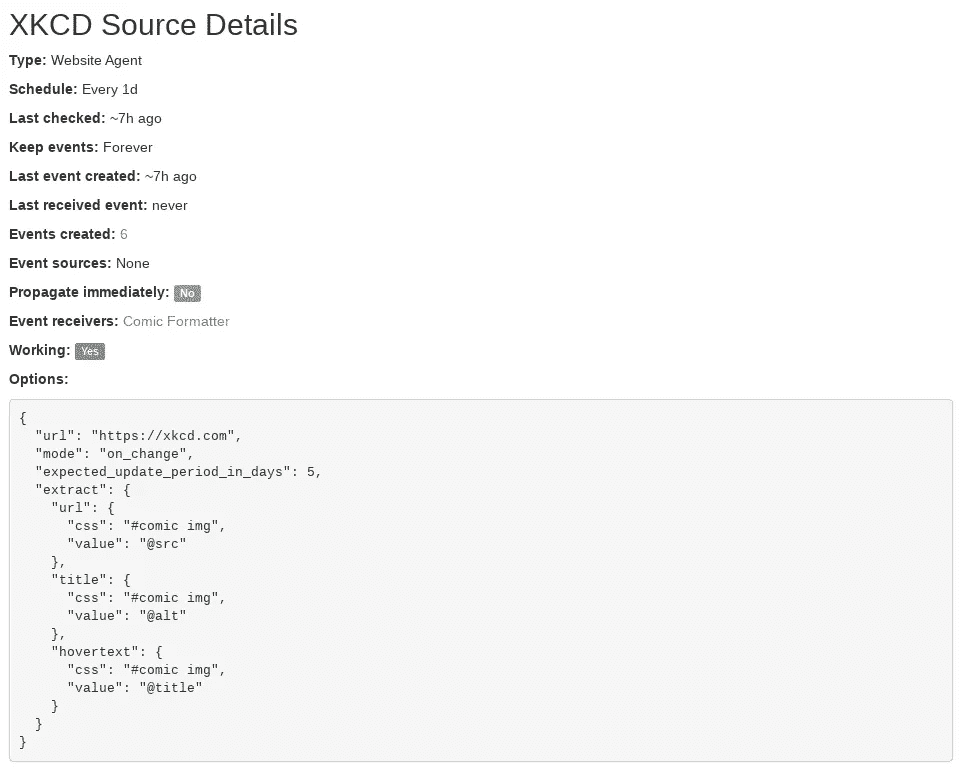
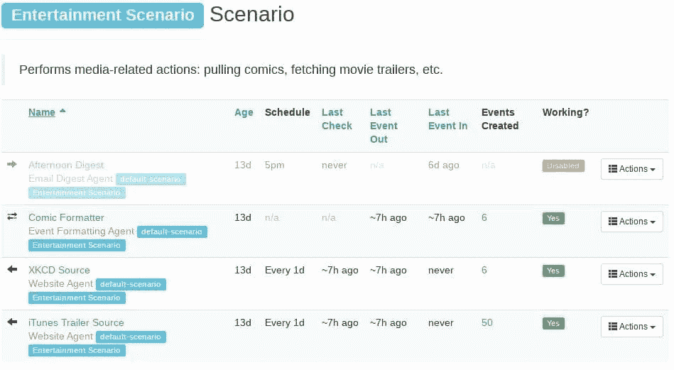
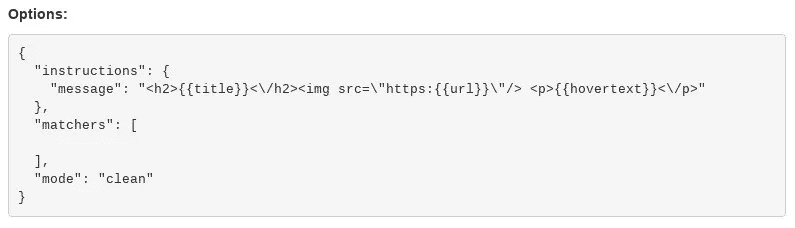
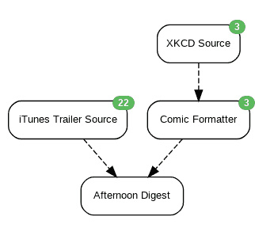

# Huginn:一个开源的、自托管的 IFTTT

> 原文：<https://betterprogramming.pub/huginn-an-open-source-self-hosted-ifttt-b8327fb2732a>

## 自动化一切

作为开发人员，我们没有时间或耐心处理日常任务。我们喜欢把事情做好，任何能帮助我们实现自动化的工具都在我们的关注范围之内。

进入 [Huginn](https://github.com/huginn/huginn) ，一个类似于 [Zapier](https://zapier.com/) 或 [IFTTT](https://ifttt.com/) 的工作流自动化服务器——但是开源的。有了 Huginn，你可以自动完成任务，比如关注航空旅行交易，持续关注 Twitter 上的某些话题，或者扫描代码中的敏感数据。

最近[一篇关于 Huginn 的帖子登上了黑客新闻的榜首。这激起了我的兴趣。我想知道为什么它如此受欢迎，它是关于什么的，它被用来做什么。](https://news.ycombinator.com/item?id=21772610)

# Huginn 是如何开始的

我找到了 Huginn 的创造者，Andrew Cantino，问他为什么要创建它。

> “我在 2013 年开始这个项目是为了挠自己的痒——我想挠一些网站，以了解它们何时发生了变化(网络漫画、电影预告片、当地天气预报、Craigslist 销售、易贝等)。)，我希望能够自动对这些变化做出简单的反应。我对个人自动化感兴趣已经有一段时间了，Huginn 最初是我在那年圣诞节假期期间建立的一个快速项目。”

然而，这个简单的圣诞假期项目迅速发展起来。

今天，Huginn 是一个社区驱动的项目，有数百名贡献者和数千名用户。Andrew 仍然使用 Huginn 作为其原始用例:

> “我仍然主要出于这个目的使用 Huginn:它告诉我即将到来的庭院销售，如果因为天气预报有雨，我今天应该带一把伞，当很少更新的博客发生变化时，当 Twitter 上的某些词出现峰值时，等等。我还发现它对我写的关于太空工业的每周时事通讯的信息来源非常有用，叫做“[轨道指数](https://orbitalindex.com)”"

然而，社区发现了更广泛的用途。因此，让我们来看看 Huginn 到底是什么，如何设置它，以及如何使用它来自动化您的日常生活。

# Huginn 是如何工作的

Huginn 是一个基于网络的调度服务，它运行名为 [*的工人、*](https://github.com/huginn/huginn/wiki/Agent-Types-&-Descriptions) *的代理。*每个代理执行特定的功能，例如发送电子邮件或请求访问网站。代理生成并使用名为 *events* 的 JSON 有效负载，它可以用来将代理链接在一起。可以计划或手动执行代理。

# 入门指南

只需点击 [Deploy to Heroku](https://elements.heroku.com/buttons/huginn/huginn) 按钮，即可轻松部署 Huginn。Huginn 还支持 [Docker](https://registry.hub.docker.com/r/huginn/huginn/) 和 Docker Compose、[Linux 上的手动安装](https://github.com/huginn/huginn/blob/master/doc/manual/installation.md)等多种[部署方式](https://github.com/huginn/huginn/wiki#deploying-huginn)。安装后，您可以使用众多可用的[代理 gem](https://huginnio.herokuapp.com/agent_gems)或[创建自己的](https://github.com/huginn/huginn_agent)来扩展 Huginn。

一旦您部署了 Huginn 并登录(查看您的具体设置以获得 URL)，创建一个新的代理就很简单了——如这个截图所示。这个代理实时跟踪 Twitter 流。

这是一个现有的代理，从 xkcd.com 拉最新的漫画。您可以看到代理的基本统计信息(上次检查、上次创建等)。Options 字段显示了如何配置代理，包括用于从页面提取数据的 CSS 选择器。

# 情节

您还可以将代理组织到*场景*中，这允许您将相似的代理分组，并将代理配置作为 JSON 文件导入和导出。您还可以使用称为*控制器*的特殊代理来微调代理调度和配置。这里我们看到一个围绕娱乐主题构建的场景。

# 动态内容

最后，Huginn 使用了 [Liquid](https://github.com/huginn/huginn/wiki/Formatting-Events-using-Liquid) 模板引擎，它允许你将动态内容加载到代理中。这通常用于将配置数据(如[凭证](https://github.com/huginn/huginn/wiki/Formatting-Events-using-Liquid#tags-added-by-huginn))与代理分开存储。

这里，它用于将 XKCD 源代理的 URL、标题和悬停文本格式化为 HTML:

# 我为什么要用 Huginn？

除了网页抓取之外，Huginn 还支持各种各样的操作，这些操作可以支持一些真正复杂的工作流。免责声明:许多网站不允许自动抓取网页。请务必查看您打算使用 Huginn 访问的任何网站的服务条款。

来自 [GitHub 页面](https://elements.heroku.com/buttons/philmorinca/huginn)的一些例子包括:

> 留意航空旅行或购物优惠
> 
> 在 Twitter 上关注您的项目名称，并在人们提到它们时获得更新
> 
> 连接到 Adioso、HipChat、Basecamp、Growl、FTP、IMAP、Jabber、JIRA、MQTT、nextbus、Pushbullet、Pushover、RSS、Bash、Slack、StubHub、translation APIs、Twilio、Twitter、Wunderground 和 Weibo 等等。
> 
> 在一天中的特定时间发送包含你关心的事情的摘要电子邮件
> 
> 跟踪高频率事件的计数，并在它们达到峰值的瞬间发送短信
> 
> 发送和接收网页挂钩
> 
> 运行自定义 JavaScript 或 CoffeeScript 函数
> 
> 随着时间的推移跟踪您的位置
> 
> 创建 Amazon Mechanical Turk 工作流作为代理的输入或输出(Amazon Turk 代理被称为“HumanTaskAgent”)。比如:“每天一次，向 5 个人要一张搞笑的猫照；将结果发送给另外 5 个人进行评分；将评价最高的照片发送给 5 个人，并附上有趣的说明；发送给最后 5 个人，以评定最有趣的标题；最后，在我的博客上贴上最好的标题照片。”

让我们详细看看其中的一些用例。

## **策划供稿**

使用网站代理，您可以获取多个网页的最新内容，过滤和汇总结果，并将最终内容作为电子邮件发送给自己。

默认场景通过获取最新的 [XKCD](https://xkcd.com/) 漫画来演示这一点。这将创建一个包含漫画标题、URL 和悬停文本的事件，这些内容通过事件格式化代理呈现为 HTML。另一个网站代理同时从 iTunes 获取最新的电影预告片，然后这两个事件被合并到一个电子邮件摘要代理中，该代理每天下午启动:

## **监控社交网络**

Huginn 支持包括 Twitter 和 Tumblr 在内的多个社交网络。这些代理可以关注新帖子、热门话题和其他用户的更新。

假设您住在飓风多发区，想要跟踪风暴的影响。使用 Twitter 流代理，您可以观察包含“飓风”、“风暴”等的推文，并将结果传递给峰值检测器代理。它计算一段时间内的 Tweets 数，测量标准差，如果检测到异常值，就会触发一个事件。您可以让此事件触发一个电子邮件代理立即通知您。Andrew Cantino 在他的博客中更详细地解释了这个用例。

## **价格购物**

Huginn 是一个优秀的网上购物工具。当你想买最划算的东西时，创建网站代理，在折扣和交易网站上运行每日搜索。使用事件格式化代理来提取价格，然后使用[变化检测代理](https://huginnio.herokuapp.com/agents#ChangeDetectorAgent)来比较最近检索到的价格和当前价格。如果它更低，你可以提取该项目的网址，并直接发送到您的收件箱。

## **安全警报**

掌握安全更新是一个持续的过程。您可以使用 Huginn 来查看[国家漏洞数据库](https://nvd.nist.gov/)中影响您系统的 CVE，并立即通知您。如果您想要过滤结果(例如，只显示高优先级警报)，您可以使用[触发代理](https://huginnio.herokuapp.com/agents#TriggerAgent)只允许严重性高于某个值的结果。

# 高级用例

Huginn 附带了一些强大的代理，大大扩展了它的功能，超越了网络抓取。

## **数据处理和验证**

Huginn 可以读取存储在主机上的文件，这使它成为一个有用的数据处理工具。假设您正在测试对代码库的更改，在提交之前，您想要扫描测试期间可能留下的任何敏感数据。您可以创建本地文件代理来扫描项目目录，将内容传递给事件格式化代理，并使用正则表达式来检测凭据、密码和类似的字符串。

或者，您可以使用 Shell 命令代理来调用类似于 [repo-supervisor](https://github.com/auth0/repo-supervisor#command-line-mode) 的实用程序，并在检测到匹配时触发桌面通知。

## **编辑部自动化**

Huginn 最初的巨大成功之一是被《纽约时报》采用来实现编辑部任务的自动化。

在 2014 年冬季奥运会期间，Huginn 监控他们的数据管道可用性，并在颁发奖牌时发送通知。

Huginn 还会在新故事发布时通知记者，并在 nytimes.com 的内容发生变化时更新 Slack 频道。你可以在[Huginn for news room](https://albertsun.github.io/huginn-newsroom-scenarios/)了解更多关于它们的用例。

# 结论

Huginn 是一个看似简单却非常灵活的工具。要想知道它能做什么，最好的方法就是亲自尝试。