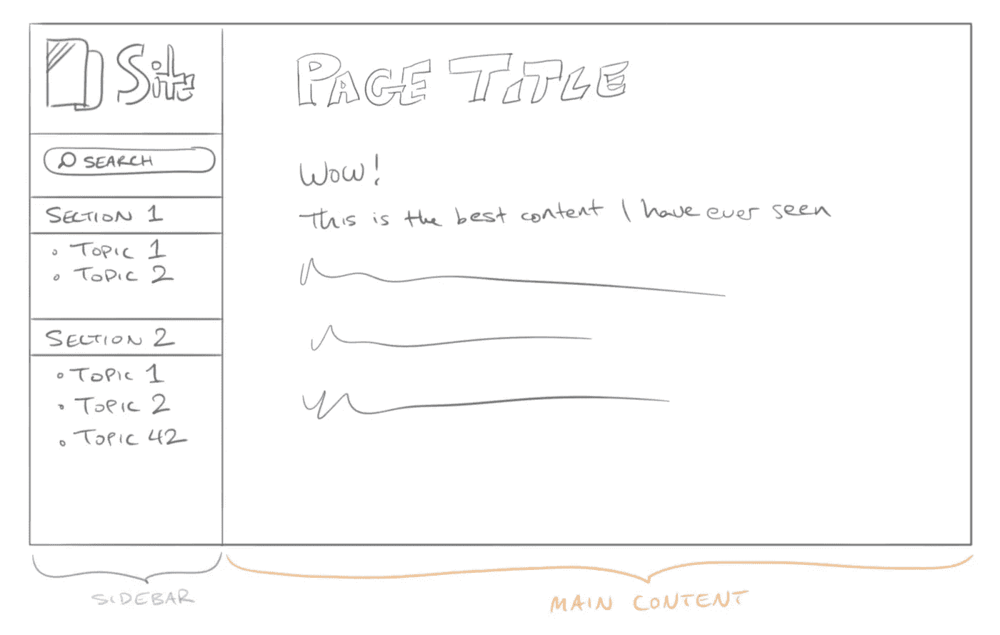
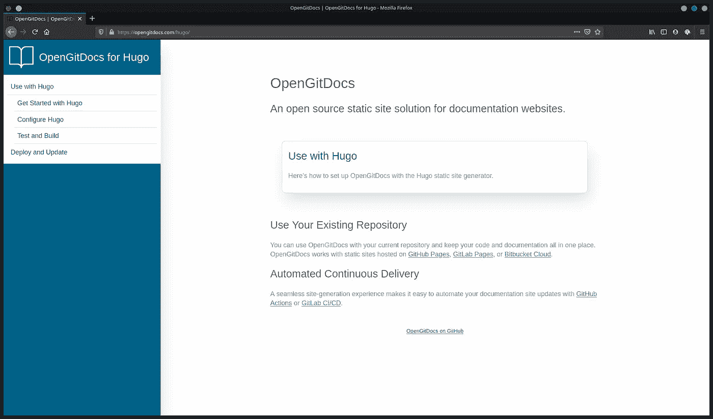
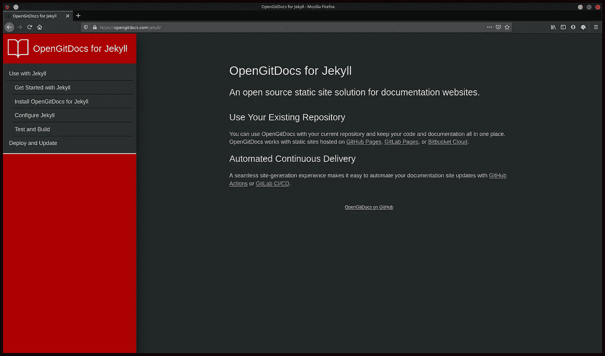

# Hugo vs. Jekyll:静态站点生成器主题的史诗之战

> 原文：<https://betterprogramming.pub/hugo-vs-jekyll-an-epic-battle-of-static-site-generator-themes-390f5692682c>

## JAMstack 前两个静态站点生成器主题细微差别的比较


我最近承担了为两个项目创建文档站点主题的任务。两个项目需要相同的基本功能，但一个使用 Jekyll，而另一个使用 Hugo。

在典型的开发者理性中，显然只有一个选择。亲爱的读者，我决定在两个框架中创建相同的主题，并给你一个并排的比较。

这篇文章不是一个全面的主题构建指南，但是旨在让你熟悉在任一生成器中构建主题的过程。以下是我们将要介绍的内容:

```
1\. [How theme files are organized](#how-theme-files-are-organized)
2\. [Create a stylesheet](#create-a-stylesheet)
3\. [Sass and CSS in Jekyll](#sass-and-css-in-jekyll)
4\. [Sass and Hugo Pipes in Hugo](#sass-and-hugo-pipes-in-hugo)
5\. [Configure and deploy to GitHub Pages](#configure-and-deploy-to-github-pages)
6\. [Configure Jekyll](#configure-jekyll)
7\. [Deploy to GitHub Pages](#deploy-to-github-pages)
```

这是我要创建的主题的蹩脚线框。



如果您计划单独构建，那么在构建时在本地服务主题可能会有所帮助；两个生成器都提供了这种功能。对于 Jekyll，运行`jekyll serve`，对于 Hugo，运行`hugo serve`。

有两个主要元素:主要内容区域和非常重要的侧边栏菜单。要创建它们，您需要模板文件来告诉站点生成器如何生成 HTML 页面。为了以合理的方式组织主题模板文件，您首先需要知道站点生成器期望什么目录结构。

# 主题文件的组织方式

Jekyll 支持基于 gem 的主题，用户可以像安装其他 Ruby gems 一样安装这些主题。这种方法在 gem 中隐藏了主题文件，所以为了比较的目的，我们没有使用基于 gem 的主题。

当你运行`jekyll new-theme <name>`的时候，哲基尔会为你搭建一个新的主题。这些文件如下所示:

```
.
├── assets
├── Gemfile
├── _includes
├── _layouts
│   ├── default.html
│   ├── page.html
│   └── post.html
├── LICENSE.txt
├── README.md
├── _sass
└── <name>.gemspec
```

目录名具有适当的描述性。`_includes`目录是存放你在不同地方重用的小代码的，就像你在所有东西上涂黄油一样。(就我？)T4 目录包含了你网站上不同类型页面的模板。`_sass`文件夹是用来存放 [Sass](https://sass-lang.com/documentation/syntax) 文件的，这些文件用来构建你站点的样式表。

你可以通过运行`hugo new theme <name>`来搭建一个新的 Hugo 主题。它有这些文件:

```
.
├── archetypes
│   └── default.md
├── layouts
│   ├── 404.html
│   ├── _default
│   │   ├── baseof.html
│   │   ├── list.html
│   │   └── single.html
│   ├── index.html
│   └── partials
│       ├── footer.html
│       ├── header.html
│       └── head.html
├── LICENSE
├── static
│   ├── css
│   └── js
└── theme.toml
```

你可以看到一些相似之处。Hugo 的页面模板文件被塞进`layouts/`。注意，`_default`页面类型有一个`list.html`和一个`single.html`的文件。与 Jekyll 不同，Hugo 使用这些特定的文件名来区分[列表页面](https://gohugo.io/templates/lists/)(就像一个链接到你所有博客文章的页面)和[单个页面](https://gohugo.io/templates/single-page-templates/)(就像你的一篇博客文章)。`layouts/partials/`目录包含了可重用的部分，样式表文件在`static/css/`中有一个位置。

这些目录结构不是一成不变的，因为两个站点生成器都允许一定程度的定制。例如，Jekyll 让你定义[集合](https://jekyllrb.com/docs/collections/)，Hugo 使用[页面包](https://gohugo.io/content-management/page-bundles/)。这些特性允许您以多种方式组织您的内容，但是现在，让我们看看在哪里放置一些简单的页面。

# 将内容放在哪里

要创建如下所示的站点菜单:

```
Introduction
    Getting Started
    Configuration
    Deploying
Advanced Usage
    All Configuration Settings
    Customizing
    Help and Support
```

您将需要包含各自子部分的两个部分(“简介”和“高级用法”)。

Jekyll 对其内容位置并不严格。它希望网页在你的网站的根目录下，并会在那里建立任何东西。以下是您在 Jekyll 站点根目录下组织这些页面的方式:

```
.
├── 404.html
├── assets
├── Gemfile
├── _includes
├── index.markdown
├── intro
│   ├── config.md
│   ├── deploy.md
│   ├── index.md
│   └── quickstart.md
├── _layouts
│   ├── default.html
│   ├── page.html
│   └── post.html
├── LICENSE.txt
├── README.md
├── _sass
├── <name>.gemspec
└── usage
    ├── customizing.md
    ├── index.md
    ├── settings.md
    └── support.md
```

您可以在您的 [Jekyll 配置](https://jekyllrb.com/docs/configuration/default/)中更改站点源的位置。

在 Hugo 中，所有渲染的内容都在`content/`文件夹中。这可以防止 Hugo 试图将您不想要的页面(如`404.html`)呈现为站点内容。以下是你如何在 Hugo 中组织你的`content/`目录:

```
.
├── _index.md
├── intro
│   ├── config.md
│   ├── deploy.md
│   ├── _index.md
│   └── quickstart.md
└── usage
    ├── customizing.md
    ├── _index.md
    ├── settings.md
    └── support.md
```

对雨果来说，`_index.md`和`index.md`的意思是不一样的。了解每个部分需要哪种类型的[页面包](https://gohugo.io/content-management/page-bundles/)会很有帮助:叶*、无子节点的*或*分支。*

现在，您已经对放置内容有了一些概念，让我们来看看如何构建页面模板。

# 模板的工作原理

Jekyll 页面模板是用[液体模板语言](https://jekyllrb.com/docs/liquid/)构建的。它使用大括号将可变内容输出到页面，比如页面的标题:`{{ page.title }}`。

Hugo 的模板也使用大括号，但它们是用 [Go 模板](https://gohugo.io/templates/introduction/)构建的。语法相似，但不同:`{{ .Title }}`。

Liquid 和 Go 模板都可以处理逻辑。Liquid 使用标记语法来表示逻辑操作:

```

  Hello {{ user.name }}!

```

和 Go 模板将其函数和参数放在大括号语法中:

```
Hello !
```

模板语言允许你构建一个框架 HTML 页面，然后告诉站点生成器在你定义的区域放置可变内容。让我们比较一下杰基尔和雨果的两个可能的`default`页面模板。

Jekyll 的脚手架主题是光秃秃的，所以我们将看看他们的起始主题 [Minima](https://github.com/jekyll/minima) 。这里是`_layouts/default.html`中的哲基尔(液体):

```
<!DOCTYPE html>
<html lang="{{ page.lang | default: site.lang | default: "en" }}">

  

  <body>

    

    <main class="page-content" aria-label="Content">
      <div class="wrapper">
        {{ content }}
      </div>
    </main>

    

  </body>

</html>
```

下面是雨果的脚手架主题`layouts/_default/baseof.html` (Go 模板):

```
<!DOCTYPE html>
<html>

    <body>

        <div id="content">
        {{- block "main" . }}{{- end }}
        </div>

    </body>
</html>
```

不同的语法，相同的想法。两个模板都为`head.html`、`header.html`和`footer.html`引入了可重用的位。这些会出现在很多页面上，所以不重复是有意义的。两个模板都有主要内容的位置，尽管 Jekyll 模板使用变量(`{{ content }}`)而 Hugo 使用块(`{{- block "main" . }}{{- end }}`)。[块](https://gohugo.io/templates/base/#readout)只是 Hugo 让你定义可重用位的另一种方式。

现在您已经知道了模板是如何工作的，您可以为主题构建侧栏菜单了。

# 用`Pages`对象创建顶级菜单

您可以通过编程从您的页面创建顶级菜单。它看起来会像这样:

```
Introduction
Advanced Usage
```

先说哲基尔吧。通过遍历 Jekyll 提供的`site.pages`对象并构建一个列表，您可以在 Liquid template 中显示指向站点页面的链接:

```
<ul>
    
    <li><a href="{{ page.url | absolute_url }}">{{ page.title }}</a></li>
    
</ul>
```

这将返回站点的所有页面，包括所有您可能不想要的页面，比如`404.html`。您可以使用更多的标签来过滤您真正想要的页面，例如有条件地包含页面，如果它们有一个`section: true`参数集:

```
<ul>
    
    
    <li><a href="{{ page.url | absolute_url }}">{{ page.title }}</a></li>
    
    
</ul>
```

在 Hugo 中用稍微少一点的代码就可以达到同样的效果。使用 go 模板的`[range](https://golang.org/pkg/text/template/#hdr-Actions)` [动作](https://golang.org/pkg/text/template/#hdr-Actions)遍历 Hugo 的`.Pages`对象:

```
<ul>
{{ range .Pages }}
    <li>
        <a href=""></a>
    </li>
{{ end }}
</ul>
```

这个模板使用`.Pages`对象返回 Hugo 站点的`content/`目录中的所有顶级页面。由于 Hugo 为您想要呈现的站点内容使用了一个特定的文件夹，因此构建一个简单的站点页面菜单不需要额外的过滤。

# 从数据列表创建带有嵌套链接的菜单

两个站点生成器都可以使用单独定义的链接数据列表在模板中呈现菜单。这更适合创建嵌套链接，如下所示:

```
Introduction
    Getting Started
    Configuration
    Deploying
Advanced Usage
    All Configuration Settings
    Customizing
    Help and Support
```

Jekyll 支持几种格式的[数据文件](https://jekyllrb.com/docs/datafiles/)，包括 YAML。下面是上面`_data/menu.yml`中菜单的定义:

```
section:
  - page: Introduction
    url: /intro
    subsection:
      - page: Getting Started
        url: /intro/quickstart
      - page: Configuration
        url: /intro/config
      - page: Deploying
        url: /intro/deploy
  - page: Advanced Usage
    url: /usage
    subsection:
      - page: Customizing
        url: /usage/customizing
      - page: All Configuration Settings
        url: /usage/settings
      - page: Help and Support
        url: /usage/support
```

下面是如何在侧栏模板中呈现数据:

```

<a href="{{ a.url }}">{{ a.page }}</a>
<ul>
    
    <li><a href="{{ b.url }}">{{ b.page }}</a></li>
    
</ul>

```

此方法允许您构建两层嵌套深度的自定义菜单。嵌套层次受到模板中`for`循环的限制。对于处理进一步嵌套层次的递归版本，参见“[递归嵌套树导航](https://jekyllrb.com/tutorials/navigation/#scenario-9-nested-tree-navigation-with-recursion)”

Hugo 用它的[菜单模板](https://gohugo.io/templates/menu-templates/#section-menu-for-lazy-bloggers)做了一些类似的事情。你可以在 Hugo 站点配置中定义菜单链接，甚至添加 Hugo 理解的有用属性，比如权重。下面是上面`config.yaml`中菜单的定义:

```
sectionPagesMenu: main

menu:  
  main:
    - identifier: intro
      name: Introduction
      url: /intro/
      weight: 1
    - name: Getting Started
      parent: intro
      url: /intro/quickstart/
      weight: 1
    - name: Configuration
      parent: intro
      url: /intro/config/
      weight: 2
    - name: Deploying
      parent: intro
      url: /intro/deploy/
      weight: 3
    - identifier: usage
      name: Advanced Usage
      url: /usage/
    - name: Customizing
      parent: usage
      url: /usage/customizing/
      weight: 2
    - name: All Configuration Settings
      parent: usage
      url: /usage/settings/
      weight: 1
    - name: Help and Support
      parent: usage
      url: /usage/support/
      weight: 3
```

Hugo 使用`identifier`和`parent`变量来处理嵌套，T7 必须与节名匹配。下面是如何在侧边栏模板中呈现菜单:

```
<ul>
    {{ range .Site.Menus.main }}
    {{ if .HasChildren }}
    <li>
        <a href="{{ .URL }}">{{ .Name }}</a>
    </li>
    <ul class="sub-menu">
        {{ range .Children }}
        <li>
            <a href="{{ .URL }}">{{ .Name }}</a>
        </li>
        {{ end }}
    </ul>
    {{ else }}
    <li>
        <a href="{{ .URL }}">{{ .Name }}</a>
    </li>
    {{ end }}
    {{ end }}
</ul>
```

`range`函数迭代菜单数据，Hugo 的`.Children`变量为您处理嵌套页面。

# 将模板放在一起

将菜单放在可重用的工具条中(Jekyll 用`_includes/sidebar.html`，Hugo 用`partials/sidebar.html`，你可以将它添加到`default.html`模板中。

在《化身博士》中:

```
<!DOCTYPE html>
<html lang="{{ page.lang | default: site.lang | default: "en" }}">



<body>
    

    

    <div id="content" class="page-content" aria-label="Content">
        {{ content }}
    </div>

    

</body>

</html>
```

在雨果:

```
<!DOCTYPE html>
<html>

<body>

    <div id="content" class="page-content" aria-label="Content">
        {{- block "main" . }}{{- end }}
    </div>

</body>

</html>
```

当网站生成时，每个页面将包含来自您的`sidebar.html`的所有代码。

# 创建样式表

两个站点生成器都接受 Sass 来创建 CSS 样式表。Jekyll [内置了 Sass 处理](https://jekyllrb.com/docs/assets/)，Hugo 使用 [Hugo Pipes](https://gohugo.io/hugo-pipes/scss-sass/) 。这两种选择都有一些怪癖。

## 《哲基尔》中的萨斯和 CSS

要在 Jekyll 中处理 Sass 文件，在`_sass`目录中创建您的样式定义——例如，在`_sass/style-definitions.scss`的一个文件中:

```
$background-color: #eef !default;
$text-color: #111 !default;

body {
  background-color: $background-color;
  color: $text-color;
}
```

Jekyll 不会直接生成这个文件，因为它只处理前端的文件。要为站点的样式表创建最终结果文件路径，请在您希望出现`.css`文件的地方使用一个前面为空的占位符，例如`assets/css/style.scss`。在这个文件中，只需导入您的样式:

```
---
---

@import "style-definitions";
```

这种相当粗糙的配置有一个好处:您可以在占位符文件中使用液体模板标签和变量。例如，这是允许用户从站点`_config.yml`设置变量的好方法。

生成的站点中的 CSS 样式表的路径是`/assets/css/style.css`。您可以在您网站的`head.html`中使用以下链接:

```
<link rel="stylesheet" href="{{ "/assets/css/style.css" | relative_url }}" media="screen">
```

## 雨果中的萨斯和雨果烟斗

Hugo 使用 [Hugo Pipes](https://gohugo.io/hugo-pipes/scss-sass/) 处理 Sass 到 CSS。您可以通过使用 Hugo 的资产处理函数`resources.ToCSS`来实现这一点，该函数期望在`assets/`目录中找到一个源。它以 SCSS 文件为论据。有了在`assets/sass/style.scss`的 Sass 文件中的样式定义，下面是如何在主题的`head.html`中获取、处理和链接 Sass:

```
{{ $style := resources.Get "/sass/style.scss" | resources.ToCSS }}
<link rel="stylesheet" href="{{ $style.RelPermalink }}" media="screen">
```

Hugo 资产处理[需要扩展的 Hugo](https://gohugo.io/troubleshooting/faq/#i-get-tocss--this-feature-is-not-available-in-your-current-hugo-version) ，默认情况下您可能没有。你可以从[发布页面](https://github.com/gohugoio/hugo/releases)获得扩展 Hugo。

# 配置并部署到 GitHub 页面

在您的站点生成器可以构建您的站点之前，它需要一个配置文件来设置一些必要的参数。配置文件位于站点根目录中。在其他设置中，您可以声明构建站点时要使用的主题的名称。

## 配置 Jekyll

这是哲基尔的一个小插曲:

```
title: Your awesome title
description: >- # this means to ignore newlines until "baseurl:"
  Write an awesome description for your new site here. You can edit this
  line in _config.yml. It will appear in your document head meta (for
  Google search results) and in your feed.xml site description.
baseurl: "" # the subpath of your site, e.g. /blog
url: "" # the base hostname & protocol for your site, e.g. http://example.com
theme: # for gem-based themes
remote_theme: # for themes hosted on GitHub, when used with GitHub Pages
```

有了`remote_theme`，GitHub 上托管的任何 [Jekyll 主题都可以与 GitHub 页面上托管的站点一起使用](https://help.github.com/en/github/working-with-github-pages/adding-a-theme-to-your-github-pages-site-using-jekyll#adding-a-jekyll-theme-in-your-sites-_configyml-file)。

Jekyll 有一个[默认配置](https://jekyllrb.com/docs/configuration/default/)，所以添加到配置文件中的任何参数都将覆盖默认值。这里是[附加配置设置](https://jekyllrb.com/docs/configuration/options/)。

## 配置 Hugo

这里有一个雨果的`config.yml`的小例子:

```
baseURL: https://example.com/ # The full domain your site will live at
languageCode: en-us
title: Hugo Docs Site
theme: # theme name
```

Hugo 不做任何假设，所以如果缺少一个必要的参数，在构建或服务您的站点时，您会看到一个警告。这里是 Hugo 的所有配置设置。

## 部署到 GitHub 页面

两个生成器都用一个命令来构建您的站点。

对于 Jekyll，使用`jekyll build`。参见[此处的进一步构建选项](https://jekyllrb.com/docs/configuration/options/#build-command-options)。

对于雨果，使用`hugo`。你可以运行`hugo help`或者点击查看[更多构建选项。](https://gohugo.io/getting-started/usage/#test-installation)

您必须为您的 GitHub Pages 站点选择来源；一旦完成，你的站点将会在你每次推一个新版本时更新。当然，您也可以使用 GitHub 动作自动构建 GitHub 页面。这里有一个[和雨果](https://github.com/victoriadrake/hugo-latest-cd)一起建造和部署，一个[建造和部署哲基尔](https://github.com/victoriadrake/jekyll-cd)。

# 表演时间

这两个发生器之间的所有实质性差异都隐藏在引擎盖下；同样，让我们来看看完成的主题，有两种颜色。

## 雨果



Hugo 的 OpenGitDocs 主题

## 吉基尔博士



Jekyll 的 OpenGitDocs 主题

漂亮！

# 等等，谁赢了？

雨果和哲基尔都有他们的怪癖和便利之处。

从这个开发者的角度来看，Jekyll 对于没有复杂组织需求的简单站点来说是一个可行的选择。如果你想在一个可用主题中呈现一些单页文章，并使用 GitHub 页面，Jekyll 会让你很快上手。

我个人用雨果。我喜欢它的页面包的组织能力，它由一个专注而认真的团队支持，这个团队似乎真的在努力为他们的用户提供便利。这一点在 Hugo 的许多功能和类似 i [法师处理](https://gohugo.io/content-management/image-processing/)和[短码](https://gohugo.io/content-management/shortcodes/)的便捷小技巧中显而易见。他们发布新的补丁和版本的频率似乎和我泡一杯新咖啡的频率差不多——这取决于你的用例，可能很棒，也可能很烦人。

如果你还是决定不了，不要着急。我创建的 OpenGitDocs 文档主题对 Hugo 和 Jekyll 都可用。从一个开始，如果你想的话，以后再换。这就是拥有选择权的好处。