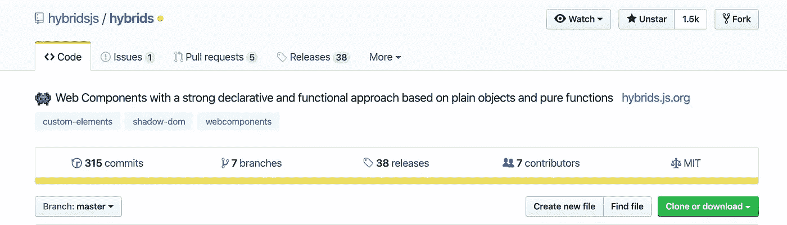
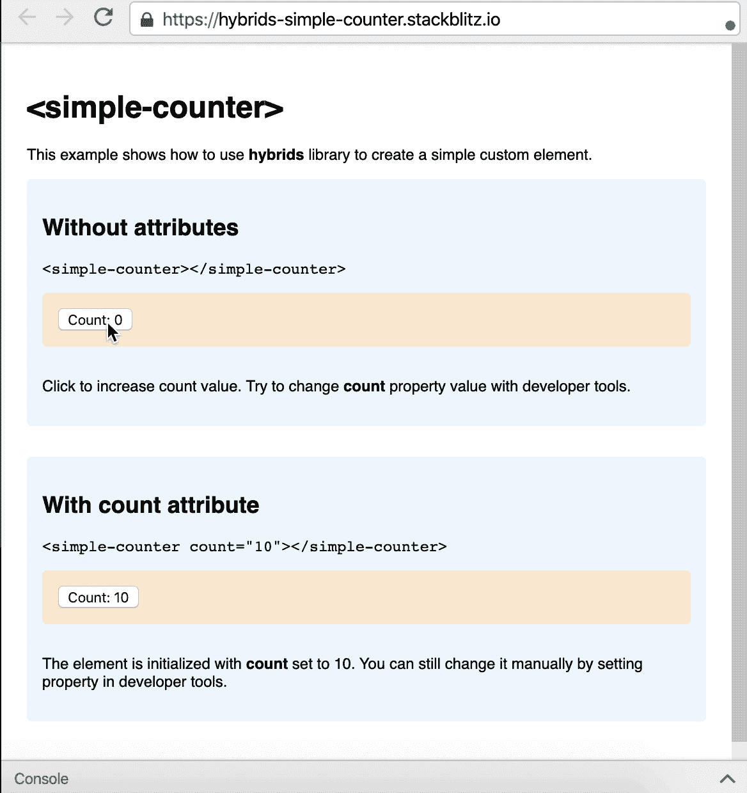
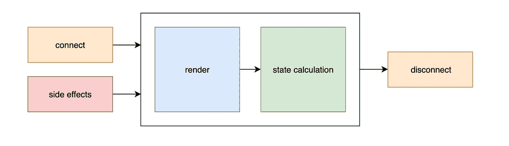
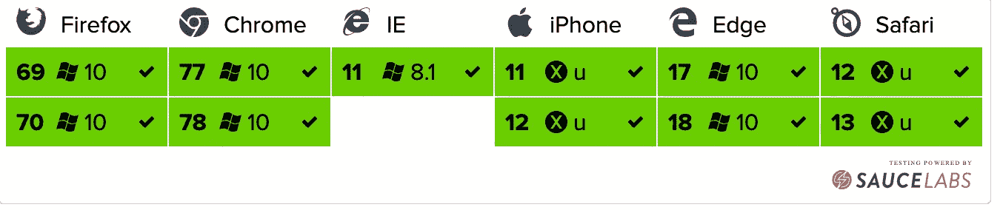

# hybrids.js —声明性和功能性 Web 组件

> 原文：<https://betterprogramming.pub/hybrids-js-declarative-and-functional-web-components-c0f1c3fbf1c8>

## Hybrids 是一个 UI 库，用于创建基于简单对象和纯函数的强大的声明性和功能性方法的 Web 组件


照片由[克莱门特 H](https://unsplash.com/@clemhlrdt?utm_source=medium&utm_medium=referral) 在 [Unsplash](https://unsplash.com?utm_source=medium&utm_medium=referral) 上拍摄

Web Components 是一套不同的技术，允许您创建可重用的自定义元素(将它们的功能封装在代码的其余部分之外)，并在您的 Web 应用程序中使用它们。

如果你是 web 组件的新手，可以看看我以前的文章“Web 组件 API 概述”

**混合套件包括以下内容:**

*   最简单的定义——只有简单的对象和纯函数——没有`class`和`this`语法。
*   没有全局生命周期—独立的属性有自己简化的生命周期方法。
*   继承之上的组合——易于重用、合并或拆分属性定义。
*   超快速重新计算—内置智能缓存和更改检测机制。
*   没有外部工具的模板——基于标记模板文字的模板引擎。
*   包括开发人员工具—热模块更换支持，实现快速愉快的开发。



[混血儿 Github 页面](https://github.com/hybridsjs/hybrids)

# 入门指南

用 npm 或纱线安装 NPM 组件。

## NPM

```
npm i hybrids
```

## 故事

```
yarn add hybrids
```

然后，导入所需的特征并定义一个定制元素。这里有一个计数器的简单例子。



在 [StackBlitz](https://stackblitz.com/edit/hybrids-simple-counter?file=simple-counter.js) 上运行演示。

最后，在 HTML 中使用您的自定义元素:

```
<simple-counter count="10"></simple-counter>
```

hybrids 库为创建定制元素提供了一种简单的声明式方法。它的名字来源于这样一个想法，即它是功能性和面向对象的体系结构的混合，具有定义定制元素的独特方法，就像这样:

尽管上面的代码看起来很简单，但是应用了一些独特的概念，使得它成为可能。这个例子依赖于一起使用的三个与属性相关的概念:[描述符](/core-concepts/descriptors)、[工厂](/core-concepts/factories)和[翻译](/core-concepts/translation)。

此外，该库使用变更检测和缓存机制来简化组件的生命周期。

## 简化的组件生命周期

与普通解决方案相比，组件的生命周期是相反的。通常状态计算的结果在这里是该计算的原因。每一个单独的属性(包括`render`)都是独立的。如果它需要组件的其他属性，它会调用它们。只有这样，才计算这些属性的值。我们可以用下图来说明这一点:



具有缓存和变更检测的生命周期

render 属性(一个操作 DOM 的更新函数)需要从其他属性获取当前状态，而不是相反。不需要在某个生命周期回调中设置状态(即使是异步获取的数据)。变化检测机制允许仅当组件属性之一变化时触发更新功能。

因此，我们可以轻松地创建一个组件结构，作为属性(输入)和纯呈现函数(输出)的列表，将组件的当前状态反映给 DOM。

在这个概念中，副作用超出了组件的范围。它们是用户输入或附加到组件内部结构的其他 DOM 事件的结果。库中使用的呈现模式允许我们将它们实现为普通函数，接受自定义元素实例并更改属性值(输入)。这些变化最终会使属性更新，但只是在需要的时候。

## ES 模块

如果你的目标是现代浏览器，并且不想使用外部工具(像 [webpack](https://webpack.js.org/) 或[package](https://parceljs.org/)，你可以使用 ES 模块:

```
<script type="module">// We can use "/src" here - browsers, which support modules also support ES2015import { html, define } from 'https://unpkg.com/hybrids@[PUT_VERSION_HERE:x.x.x]/src';...</script>
```

请考虑这样一个事实，即它不提供代码精简，并且在单独的请求中加载所有需要的文件。

## 热模块更换

HMR 开箱即用，但您的 bundler 设置可能需要您的入口点支持它的指示。对于`[webpack](https://webpack.js.org/)`和`[parcel](https://parceljs.org/)`，将以下代码添加到您的入口点:

```
// Enable HMR for developmentif (process.env.NODE_ENV !== 'production') module.hot.accept();
```

如果您的入口点导入不支持 HMR 的文件，您可以将上面的代码片段放在一个定义自定义元素的模块中。(此处使用`define`方法)。

## 证明文件

混合动力文档可在[hybrids.js.org](https://hybrids.js.org/)或存储库的[文档](https://github.com/hybridsjs/hybrids/tree/16dbbac62905347d9e05deac4e6f86c8232b5ab9/docs/README.md)路径中获得:

*   [核心概念](https://github.com/hybridsjs/hybrids/tree/16dbbac62905347d9e05deac4e6f86c8232b5ab9/docs/core-concepts/README.md)
*   [内置工厂](https://github.com/hybridsjs/hybrids/tree/16dbbac62905347d9e05deac4e6f86c8232b5ab9/docs/built-in-factories/README.md)
*   [模板引擎](https://github.com/hybridsjs/hybrids/tree/16dbbac62905347d9e05deac4e6f86c8232b5ab9/docs/template-engine/README.md)
*   [杂项](https://github.com/hybridsjs/hybrids/tree/16dbbac62905347d9e05deac4e6f86c8232b5ab9/docs/misc/README.md)

# 活生生的例子

这里有几个用 hybrids web 组件构建的项目的例子。

*   [<简单计数器>](https://stackblitz.com/edit/hybrids-simple-counter?file=simple-counter.js) —计数器受自身状态控制的按钮
*   [<-redux-counter>](https://stackblitz.com/edit/hybrids-redux-counter?file=redux-counter.js)-状态管理的 Redux 库
*   [<React-counter>](https://stackblitz.com/edit/hybrids-react-counter?file=react-counter.js)—渲染工厂和 [React](https://reactjs.org/) 库在阴影 DOM 中进行渲染
*   [<lit-counter>](https://stackblitz.com/edit/hybrids-lit-html-counter?file=lit-counter.js)—渲染工厂和 [lit-html](https://lit-html.polymer-project.org/) 用于阴影 DOM 中的渲染
*   [< app-todos >](https://stackblitz.com/edit/hybrids-parent-factory?file=index.js) —利用母厂进行状态管理的待办事项
*   [<标签组>](https://stackblitz.com/edit/hybrids-children-factory?file=index.js) —使用子工厂切换标签
*   [<异步用户>](https://stackblitz.com/edit/hybrids-async-user?file=async-user.js) —模板中的异步数据

# 浏览器支持

混合库被大多数浏览器广泛支持。



混合浏览器支持

# 结论

感谢阅读，我希望你发现了一些新的有用的东西。保持好奇，快乐编码！