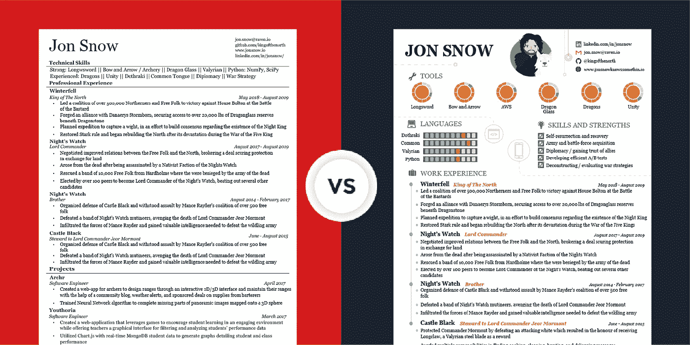
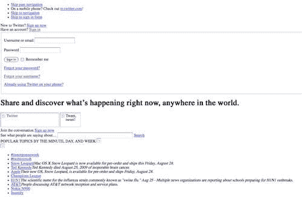
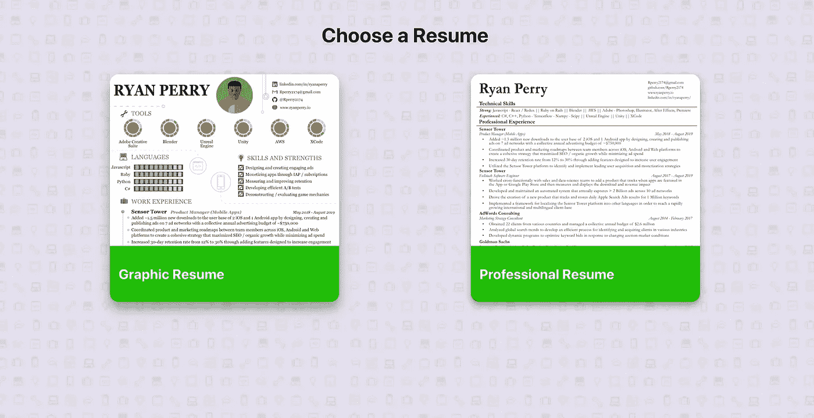
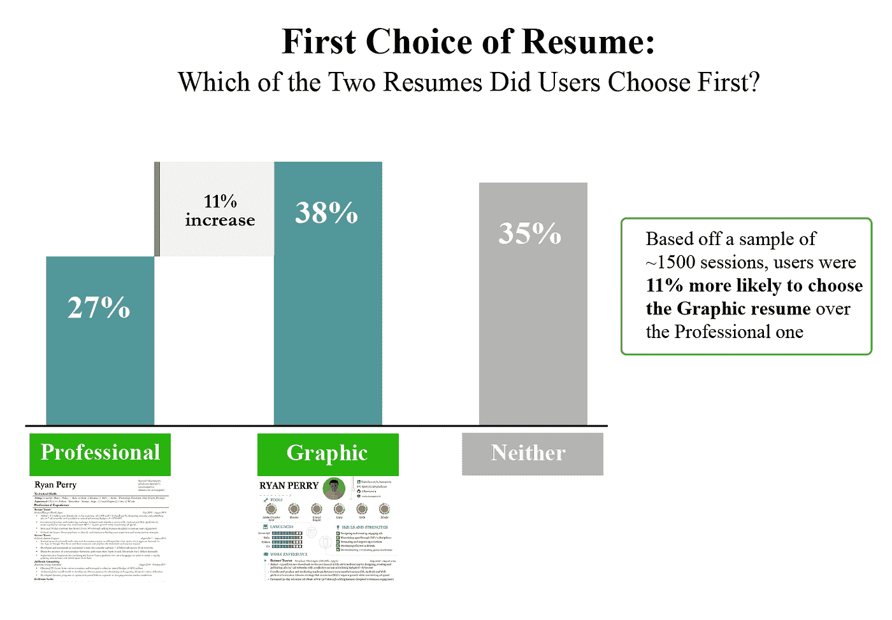
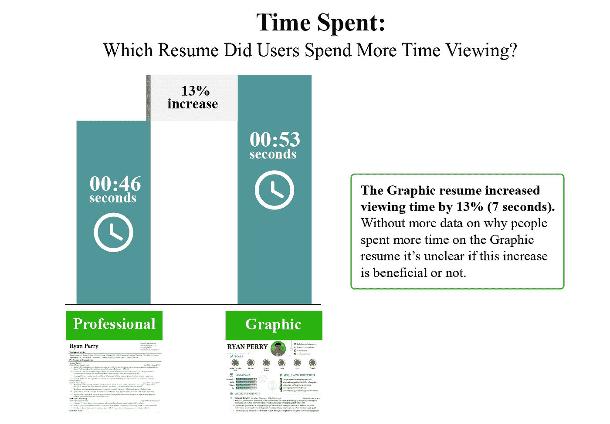
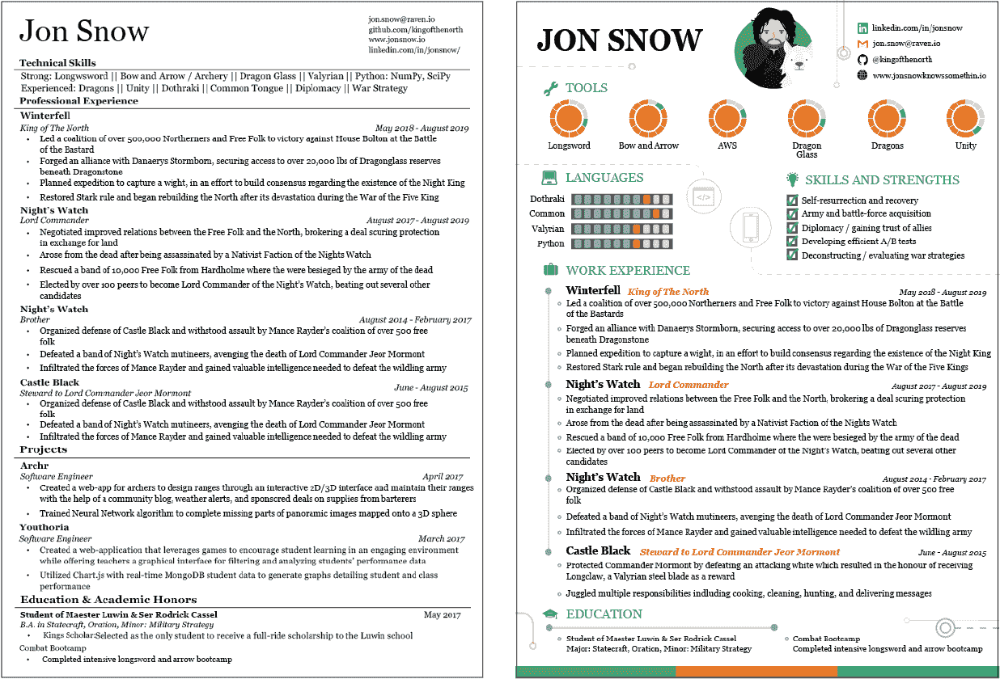

# 通过 A/B 测试的简历格式:哪个琼恩·雪诺被录用了？

> 原文：<https://betterprogramming.pub/i-a-b-tested-resume-formats-which-jon-snow-gets-hired-cd206f62d15a>

## 彩色和图形是否打败了素色和专业？

对大多数人来说，写简历是这个星球上最无聊的活动之一。当我最近重写我的作品时，我不知道是对冗长乏味的过程更不满意还是对平淡无奇的最终结果更不满意(或者两者都不满意？).作为一名前软件工程师，用标准的专业格式制作一份简历就像是不用 CSS 样式来构建一个网站的登陆页面。

例如，让我们使用 Twitter 的登录页面，该页面旨在快速向用户提供直接的信息片段，与简历的设计方式类似。想象一下，如果 Twitter 看起来像这样，会有多不吸引人:

毫不奇怪，对于传统格式的简历，招聘人员只会在你的简历上花[八秒](https://www.prnewswire.com/news-releases/ladders-updates-popular-recruiter-eye-tracking-study-with-new-key-insights-on-how-job-seekers-can-improve-their-resumes-300744217.html)；这只是你职业生涯的平淡表现(他们可能已经看过了)。

# 挑战传统智慧

我理解传统观点，你应该努力让招聘人员在这么短的时间内最大限度地了解你。但是，就像 Twitter 的无风格版本一样，我觉得传统的职业简历客观上看起来没那么有趣。然而，图形风格化的版本使用各种 UI/UX 技术吸引观众。

在我更新完职业简历后，我决定尝试建立一个图形版本(内容相同)。这是我想到的两个版本。因为这篇文章旨在关注简历的格式而不是内容，所以我把原文内容换成了虚构的内容。

为了制作图形简历，我从 Adobe Illustrator 中的一个空白页开始(而不是我过去七年一直使用的那个 Microsoft Word 模板),并将这个过程视为我在设计一个游戏或网站。

当我完成时，我对图形格式的简历比专业的简历更满意。多彩的图形风格更真实地再现了我的，无论是作为一个人还是作为一名专业人士。

此外，传统的简历只能直接声明或描述陈词滥调的特点，如“创造力”或“跳出框框思考”，但图形简历可以展示这些特点，而专业简历则因其武断的规则而难以做到。

# **这两种格式表现如何？**

接下来，我做了一个实验，看看这两份简历在职场中的受欢迎程度如何。我建立了一个网站和登陆页面来存放这两份简历。使用产品分析软件 [Heap](https://heap.io/) ，用一行代码我就能记录用户首先点击了哪些简历，并收集每份简历所花时间的数据。

注意:为了消除位置偏差，50%的时间“图形简历”显示在左侧，50%的时间“专业简历”显示在左侧。

我在我的页面上添加了 Heaps tracker，我收到了足够的流量，产生了关于用户行为的统计结果。这些是实验的结果:

# 哪种格式更好？

超过 1500 个会话被用作该实验的数据点，这些数据足以得出一些定量的结论。如果目标是让人们花更多的时间看简历，那么使用图片简历可能是最成功的。人们不仅会多花 13%的时间看这份简历，而且会多 11%的人选择图片简历而不是专业简历。

然而，没有从访问网站的人的故事中添加定性数据，从这两个统计数据中推断获得面试机会的可能性也更高是不公平的。

例如，如果我做同样的实验来确定我的 LinkedIn 个人资料照片应该是我去年万圣节的照片还是职业头像，人们可能会多看 11%和 13%的时间，但这并不意味着它应该是我的 LinkedIn 个人资料照片。

# 迄今为止，定性数据喜忧参半

值得一提的是，我也直接和六个朋友/同事谈过(三个招聘人员、一个工程经理和两个产品经理)。当我问他们更喜欢哪种简历时，三位招聘人员一致选择了专业简历。

然而，与我交谈过的其他三个人，他们都不是招聘人员，但都参与了招聘过程，他们声称他们更喜欢看到图形简历。

# 哪个琼恩·雪诺被录用了？

目前，最终的裁决是 TBD。我目前正在从人们那里收集更多关于他们更喜欢哪种简历以及为什么喜欢的故事，这样我就可以做出更合理的结论。

如果你的网络中有人有审查简历的经验，并且可能愿意就他们更喜欢哪一个提供反馈，那么请与他们分享这篇文章。此外，如果您自己有任何反馈，请留下评论，解释您更喜欢哪种格式！

