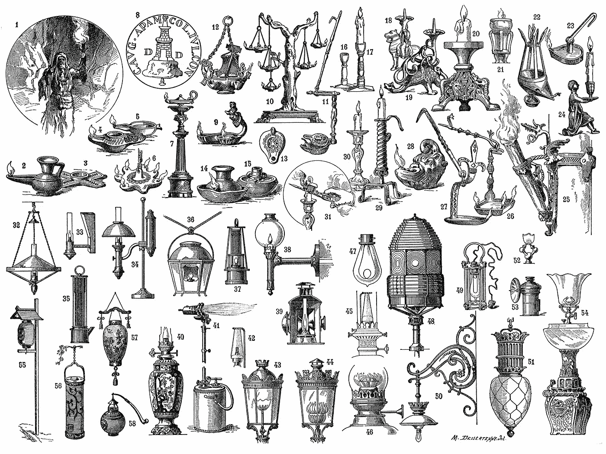

# 我不是我的代码

> 原文：<https://betterprogramming.pub/i-am-not-my-code-e08915354be5>

## 乐于接受反馈是优秀工程师的标志

莫里斯·德瑟滕通过[维基百科](https://en.wikipedia.org/wiki/Maurice_Dessertenne#/media/File:Eclairage.jpg)创作的《穿越时代的光》插图

# 我不是我的代码

我不是比特和字节，逗号和括号，也不是空格和制表符。我不盲目崇拜我的劳动产品。任何改变我的代码的企图都不是对我名誉的个人的、致命的、有针对性的攻击。这是事物规律的一部分。代码*会*改变，它会变成一些我从未想过的东西。在我离开很久以后，那些试图弄清楚我到底在想什么的工程师们会对它破口大骂。我的代码将被崇敬、嘲笑、重构和回收，直到它被恭敬地交给天空中的垃圾收集器。我不是我的代码。

# 为什么这是一个重要的信息？

我们经常谈论*心理安全*。著名的出版物，如《2019 年发展状况报告》，都有专门的章节来介绍它。他们的描述摘自谷歌的亚里士多德项目，如下所示:

> “团队成员觉得冒险很安全，在彼此面前很脆弱”——2019 年 DevOps 报告状态

团队成员觉得冒险是安全的。有一个关键词——*安全*。在这种特殊的情况下，人们如何定义安全的？当讨论某人的代码时，安全的环境是什么样的？

*安全*的字典定义有助于进一步聚焦镜头:

> “免受或不太可能导致危险、风险或伤害的状态”——Lexico(牛津在线词典)

因此，安全的环境是指我们不会遇到或导致危险、风险或伤害的环境。那么，当你对你的代码赋予如此多的个人价值，以至于任何改动、任何指责，甚至是一个问题都变成了人身攻击时，这种文化会发生什么呢？嗯，这可不好看。

# 你在把安全武器化

从表面上看，一个人如何将安全武器化？这似乎是一个矛盾。怎么可以用避免伤害的状态去造成伤害？嗯，没你想象的那么难。考虑下面的对话。

工程师一:“我在那个函数里看到了递归。我只是担心大型数据集会发生什么？”

工程师二:“听着，我已经尽了最大努力，我被告知不会有任何大型数据集。”

一号工程师是个好人。他们想创造一种安全的文化，而不是一种咄咄逼人的个人指责文化。由于二号工程师的反应，他们被置于一个可怕的境地。他们要么坚持下去，冒着加深错误的风险，要么放弃它，留下一些潜在的危险代码。

简而言之，二号工程师对完全合理的批评判犯规，并停止讨论。一号工程师已经不安全了。让他们相信他们无意中给他们的同事带来了危险、风险或伤害。这简直就是公司的煤气灯。有了足够多的这些回应，工程师二得到了他们想要的。无可辩驳的代码。

# 你是谁并不重要

我们的保护显影剂可能是个专家。他们可能是各个领域的专家，用他们闪亮的知识鸡尾酒让工程团队眼花缭乱。他们出席会议可以使会议更有效率，而且他们可以定期从边缘恢复遗留应用程序。

我不在乎。如果你不愿意让人们讨论和辩论你的代码，你就是一个蹩脚的工程师，而且很可能是一个蹩脚的人。乐于接受反馈是一个优秀工程师和一个成熟、真正自信的人的标志。

# 不要让自负影响你的代码库

再一次，从顶部，带着感觉:我不是我的代码*。*