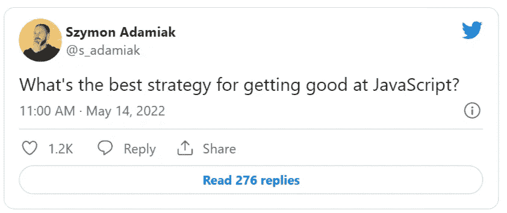

# 我在 Twitter 上问如何掌握 JavaScript，得到了 250+的答案

> 原文：<https://betterprogramming.pub/i-asked-twitter-how-to-master-javascript-and-got-250-answers-d70b7909aa2b>

## 来自 Twitter 技术社区的教训

埃文·丹尼斯在 [Unsplash](https://unsplash.com/s/photos/question?utm_source=unsplash&utm_medium=referral&utm_content=creditCopyText) 上的照片

Twitter 是程序员的伟大社区之一。如果你知道去哪里找，你可以在那里获得如此多的免费知识。几天前，我问 Twitter，精通 JavaScript 的最佳策略是什么。令我惊讶的是，我得到了超过 250 个答案。

以下是来自 Twitter 的最常见和最好的答案，以及我的评论，以帮助您了解大部分学习过程。

# 实践

你知道这个老笑话吗？一个男人去纽约听音乐会，但是迷路了。他看到一个老人，问道。"先生，你能告诉我怎么去卡内基音乐厅吗？"老家伙笑着说，“练习，练习，练习。”

实践是对我的问题最常见的回答。这是正确的。如果没有大量的练习，你就无法取得任何有意义的成就。但这也不是完整的答案——如果不是高质量的练习，练习几乎是无用的。

你如何以一种有意义的、深思熟虑的方式练习？第一，你要专注于做事，而不是学习理论。你可以阅读世界上所有的书籍，观看所有可用的教程，但如果不使用你的知识，你不会有效地学习任何东西。

所以建立项目，或大或小，取决于你的水平。不一定要复杂。从简单的应用程序开始。但是要习惯依靠自己，寻求答案，探索什么是可能的，什么是不可能的。

越进步越应该鞭策自己。添加测试，检查架构模式，并尝试添加一个新特性来检查您的代码是否易于扩展。建立更伟大、更强大的东西，直到你能够熟练使用你所拥有的工具。

构建项目是一种非常好的学习方式，因为它很有挑战性。你可能相信你理解了一些东西，但是直到你使用它，你才能确定。而奋斗一段时间后你会记得更清楚。

还有一个额外的好处——建造东西很有趣！尤其是如果你能向全世界展示的话。建造东西，并以此为荣。

[摄粘土堤](https://unsplash.com/@claybanks?utm_source=unsplash&utm_medium=referral&utm_content=creditCopyText)上[的 Unsplash](http://localhost:3000/s/photos/community?utm_source=unsplash&utm_medium=referral&utm_content=creditCopyText)

# 找一个导师或社区

寻找导师是第二受欢迎的答案，这是有充分理由的。合适的导师可以评估你的技能水平，并告诉你如何尽快进步。他们会帮助你避免常见的陷阱，在你需要的时候激励你，给你挑战，这样你就不会停滞不前。

另一个快速学习的好方法是加入志趣相投的社区。成为拥有相似目标和挑战的一群人中的一员是你能拥有的最好的动力之一。学习编码是一项孤独的努力，所以每个支持都很重要。你的新朋友不仅是动力的来源，还可以帮助你解决编程问题。

最大的障碍是找到一个好的导师或社区。许多人主动提出为你提供指导，但这通常是一项相当昂贵的投资，因为软件开发人员一小时的工作可以赚很多钱，所以让他们廉价指导没有多大意义。尽管如此，一些用户还是就如何找到更便宜的选择提供了实用的建议。

寻找导师的一个突出的地方是 Twitter。如果跟随一些优秀的开发者，也可以向他们请教。不太可能变成全职指导，但你可以很容易地从他们那里得到一些有用的提示。

另一个想法是加入当地的软件开发者聚会，与人们交谈。如果他们见到你本人，他们会更加平易近人，乐于助人。我还得到了一些优秀开发者在线社区的推荐，有免费的也有付费的。其中最引人注目的是——[肯特·多兹的不和](https://kentcdodds.com/discord)、[丹尼·汤普森的不和](https://discord.com/invite/y8CgXAA)、[自由代码营的不和](https://discord.com/invite/KVUmVXA)以及[斯克林巴社区](https://scrimba.com/pricing)。

# 阅读好代码

你知道伟大的作家和伟大的开发者有什么共同点吗？他们是熟练的读者。如果你花时间阅读高质量的代码，成为一名伟大的程序员会容易得多。

开源是开始寻找例子的好地方。您可以从已经在使用的库开始。根据您的技能水平，可能像切换标签的库、管理应用程序状态的库，甚至像 Node 这样复杂的运行时环境一样简单。

不管是什么，钻研代码，试着理解它。阅读别人的代码就像进入他们的大脑。如果他们很优秀，你肯定想了解他们的想法。而且免费！

你会惊讶于你能学到多少新的解决问题的模式和方法。在你之前有很多行业巨头。从他们知识的源泉中啜饮一口。剖析你欣赏的代码，模仿更优秀的程序员。一切都在等着你。

不用担心遇到烂代码。你也可以从中学习。分析草率代码中的错误和边缘案例中的微小 bug。阅读代码将让你开发和理解复杂的应用程序。学会区分优秀的和有害的代码，并努力让你的代码更好一点。

杰森·布里斯科在 [Unsplash](http://localhost:3000/s/photos/kata?utm_source=unsplash&utm_medium=referral&utm_content=creditCopyText) 上的照片

# 做代码形

代码形是小型编码练习。许多人提到它们是提高开发技能和编程语言知识的好方法。形的一个显著优点是它们是按照难度排序的。这意味着你可以通过解决几个问题来快速评估你的技能水平。这也使解决形像游戏一样的经验，因为你想继续前进到下一个水平。

关于形的另一个伟大的事情是它们的受欢迎程度。成千上万的开发人员解决了所有的问题，所以每当你完成一个，你就可以看到其他开发人员的解决方案。这是学习解决这些相同问题的不同方法并深入了解该语言语法的好方法。你应该试试；我见过的一些解决方案令人难以置信。

你可以在很多网站上做代码卡塔；最受欢迎的可能是 [Codewars](https://www.codewars.com/) 和 [HackerRank](https://www.hackerrank.com/dashboard) 。

# 沉思

有些人开玩笑地评论说，你可以通过冥想或什么都不做来掌握 JavaScript。虽然这不是一个可行的学习方法，但它有一定的道理。

学习编码是一个迷人的旅程。就像每一件有价值的事情一样，它有好的一面，也有不好的一面。一些不利因素会让你焦虑几个月。

最好的治疗方法是注意你的心理健康。所以，请记住，要保持敏锐，你有时必须休息。去健身房，和朋友聚会，冥想，或者散步。做任何让你感觉更好的事情，帮助你找到生活的平衡。并非所有的事情都与编码有关。