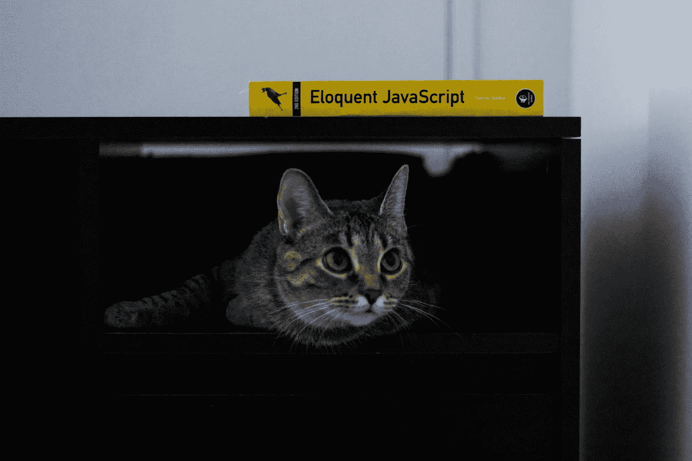
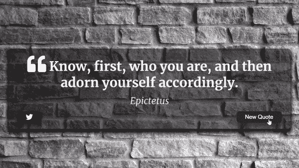
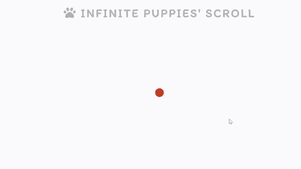
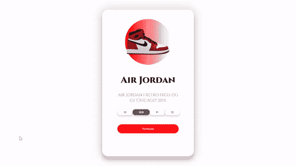
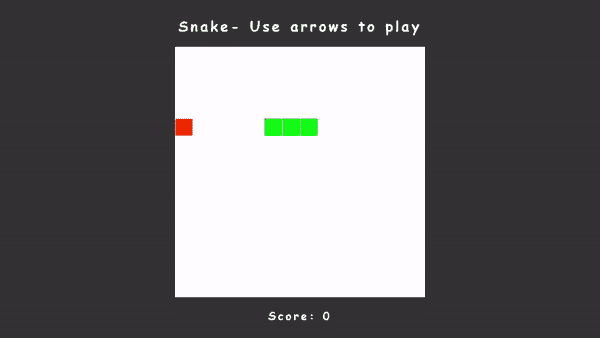
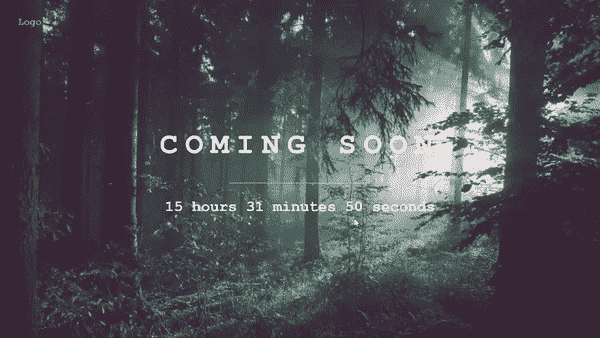
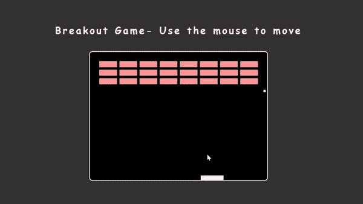
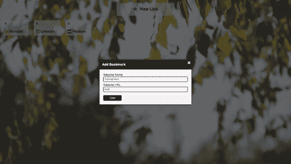
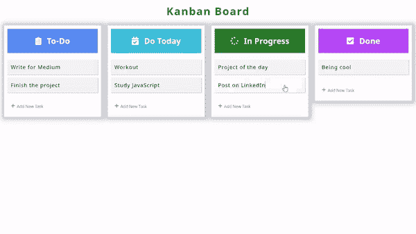
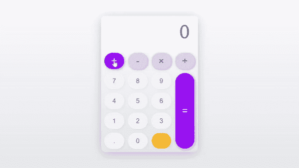

# 我在 20 天内用普通的 JavaScript 构建了 20 个 Web 项目

> 原文：<https://betterprogramming.pub/i-built-20-web-projects-with-vanilla-javascript-in-20-days-4a1cd91a3760>

## 这是一个演示，展示了你只用 HTML5、CSS 和 JavaScript 就能构建的东西

迈克尔在 [Unsplash](https://unsplash.com/s/photos/javascript?utm_source=unsplash&utm_medium=referral&utm_content=creditCopyText) 上的照片

# 在学习任何框架或库之前，先学习普通的 JavaScript

术语 *vanilla JavaScript* 基本上是指没有任何额外框架或库的 JavaScript。

JS 框架无疑是现代前端 web 开发的重要组成部分，也是提高开发速度的基础。然而，在进入任何这些框架或库之前，必须对 JavaScript 有很好的了解。

这就是为什么我决定用普通 JavaScript 获得更多信心的原因。为了提高我的技能，我在 20 天内只用 HTML5、CSS 和 JavaScript 构建了 20 个项目。

这不是一个教程，而只是一个简单的演示，你可以用 web 开发的基础知识来构建什么。无论如何，对于每个项目，我都会为您提供代码！

## **第一天**

**报价生成器:** Fetch，Async/Await，报价 API**链接:**[https://5ebs.github.io/quote-generator/](https://5ebs.github.io/quote-generator/) **GitHub:**[https://github.com/5ebs/quote-generator](https://github.com/5ebs/quote-generator)

## 第二天

**无限滚动:** Fetch、Async/Await、Unsplash API、DOM、滚动事件监听器**链接:**[https://5ebs.github.io/infinite-scroll/](https://5ebs.github.io/infinite-scroll/) **GitHub:**[https://github.com/5ebs/infinite-scroll](https://github.com/5ebs/infinite-scroll)

## 第三天

**3D 动画:** DOM，鼠标事件**链接:【https://5ebs.github.io/-3d-animation-air-Jordan-1/】 **GitHub:**[https://github.com/5ebs/-3d-animation-air-Jordan-1](https://github.com/5ebs/-3d-animation-air-Jordan-1)**

## 第四天

**笑话柜员:** Fetch，Async/Await，笑话 API，文本转语音**链接:**[https://5ebs.github.io/Joke-Teller/](https://5ebs.github.io/Joke-Teller/) **GitHub:**[https://github.com/5ebs/Joke-Teller](https://github.com/5ebs/Joke-Teller)

## 第五天

**亮/暗模式:** DOM，local storage**链接:**【https://5ebs.github.io/light-dark-mode/】 **GitHub:**[https://github.com/5ebs/light-dark-mode](https://github.com/5ebs/light-dark-mode)

## 第六天

**画布游戏:**高级 HTML 画布**链接:**[https://5ebs.github.io/HTLM5-Canvas/](https://5ebs.github.io/HTLM5-Canvas/) **GitHub:**[https://github.com/5ebs/HTLM5-Canvas](https://github.com/5ebs/HTLM5-Canvas)

## 第七天

**蛇:**高级 HTML 画布**链接:**[https://5ebs.github.io/snake-game/](https://5ebs.github.io/snake-game/) **GitHub:**[https://github.com/5ebs/snake-game](https://github.com/5ebs/snake-game)

## 第八天

**画中画:**画中画 API，截屏 API**链接:**[https://5ebs.github.io/picture-in-picture/](https://5ebs.github.io/picture-in-picture/) **GitHub:**[https://github.com/5ebs/picture-in-picture](https://github.com/5ebs/picture-in-picture)

## 第九天

**音乐播放器:** HTML 5 音频 API**链接:**[https://5ebs.github.io/Music-Player/](https://5ebs.github.io/Music-Player/) **GitHub:**[https://github.com/5ebs/Music-Player](https://github.com/5ebs/Music-Player)

## 第 10 天

**动画导航:** CSS 动画*T3*链接:https://5ebs.github.io/animated-navigation/GitHub:https://github.com/5ebs/animated-navigation

## 第 11 天

**打字机效果:** DOM、切片方法**链接:**【https://5ebs.github.io/typewriter-effect/】 **GitHub:**[https://github.com/5ebs/typewriter-effect](https://github.com/5ebs/typewriter-effect)

## 第 12 天

**倒计时 App:** 日期，本地存储**链接:**[https://5ebs.github.io/Custom-countdown/](https://5ebs.github.io/Custom-countdown/) **GitHub:**[https://github.com/5ebs/Custom-countdown](https://github.com/5ebs/Custom-countdown)

## 第 13 天

【即将发布】页面:日期，DOM**链接:**[https://5ebs.github.io/coming-soon/](https://5ebs.github.io/coming-soon/) **GitHub:**[https://github.com/5ebs/coming-soon](https://github.com/5ebs/coming-soon)

## 第 14 天

**突围赛:**高级 HTML 画布**链接:**[https://5ebs.github.io/breakout-game/](https://5ebs.github.io/breakout-game/) **GitHub:**[https://github.com/5ebs/breakout-game](https://github.com/5ebs/breakout-game)

## 第 15 天

**书签 App:** DOM，local storage**链接:**[https://5ebs.github.io/book-keeper/](https://5ebs.github.io/book-keeper/) **GitHub:**[https://github.com/5ebs/book-keeper](https://github.com/5ebs/book-keeper)

## 第 16 天

**表单验证:** *DOM，表单*
链接:[https://5ebs.github.io/form-validator/](https://5ebs.github.io/form-validator/) **GitHub:**[https://github.com/5ebs/form-validator](https://github.com/5ebs/form-validator)

## 第 17 天

**虚拟看板板:**拖拽 API，local storage**链接:**【https://5ebs.github.io/Kanban-Board/】 **GitHub:**[https://github.com/5ebs/Kanban-Board](https://github.com/5ebs/Kanban-Board)

## 第 18 天

**计算器:**数学方法**链接:**[https://5ebs.github.io/calculator/](https://5ebs.github.io/calculator/) **GitHub:**[https://github.com/5ebs/calculator](https://github.com/5ebs/calculator)

## 第 19 天

【街机游戏 Pong: 高级 HTML 画布**链接:**[https://5ebs.github.io/pong-game/](https://5ebs.github.io/pong-game/) **GitHub:**[https://github.com/5ebs/pong-game](https://github.com/5ebs/pong-game)

## 第 20 天

**画图 2.0:** 高级 HTML 画布，local storage**链接:**[https://5ebs.github.io/paint-2.0/](https://5ebs.github.io/paint-2.0/) **GitHub:**[https://github.com/5ebs/paint-2.0](https://github.com/5ebs/paint-2.0)

*考虑* [***成为一个中等成员***](https://ebelinggianmarco.medium.com/membership)**如果你欣赏阅读这样的故事，想帮助我这个作家。每月 5 美元，你可以无限制地访问媒体内容。如果你通过* [***我的链接注册，我会得到一点佣金。*T88**](https://ebelinggianmarco.medium.com/membership)*