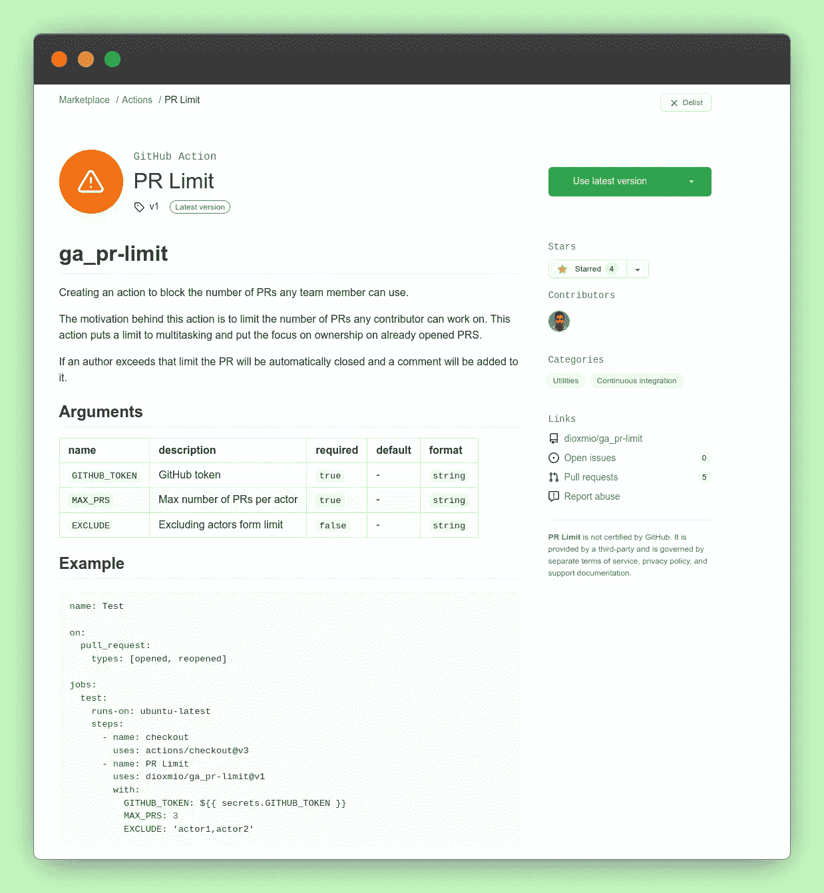

# 我构建了一个 GitHub 动作来对抗多任务习惯

> 原文：<https://betterprogramming.pub/i-built-a-github-action-to-fight-the-multitasking-habit-563bd22dab54>

## 以及如何创造你自己的生活


标题基于 [pch.vector](http://www.freepik.com) 的设计

对我来说，一心多用就像盐一样。适量可以改善你的膳食，但过量会使它不可食用和不健康。这就是为什么很难做对。

> "多任务处理——一种做两倍于你应该做的事，而只做你能做的一半的艺术."

滥用多任务处理是非常诱人的。很多开发者都是这样。我不怪他们。它给人一种你在同时做几件事情时进步很快的错觉。这可能会产生相反的效果。突然，你有更多的评论和拉请求要处理。您可以独占工作堆栈，使其进展缓慢。

已经证明，从一个任务切换到另一个任务需要一些时间。这是生产率的损失。当恢复先前暂停的任务时，您可能会完全改变上下文。当你热身的时候，你可能需要对另一个拉取请求提出一些意见。

有许多方法和技术可以解决这个问题。然而，我错过了 GitHub CI 空间中的任何工具。这就是为什么我决定创建一个 GitHub 动作。

# PR 限制 Github 动作

我有一个非常简单的想法。如果我们可以限制任何开发者可以打开的 PRs 的数量，我们将会阻止繁重的多任务处理。我在 GitHub 上找不到任何工具。你唯一能做的就是按作者过滤 PRs，并被动地监控它。

我们人类非常不擅长监控和做重复性的工作。我创建了一个简单的 Github 动作来为我们做这件事。由于两个项目或团队不同，我添加了一些配置参数。

它是如何工作的？它检查 PRs 的作者是否已达到其`active` PRs 的限制。如果是这样，它会自动关闭公关，并留下评论。

## 参数

*   **MAX_PRS** —每个 GitHub Actor 允许的最大 pr 数
*   **排除** —我们可能想要跳过检查的任何作者。一个明显的例子是 Dependabot。
*   **GITHUB _ TOKEN**—GITHUB 令牌

该动作在 GitHub 的市场中列出



# 未来的增强

这一行动仍处于早期阶段。未来的版本中可能会有许多新特性。

*   **DISABLE_COMMENTS** —选择退出对公关行为的评论的选项。
*   **INCLUDE _ DRAFT**——在`MAX_PRS`的限制范围内计算草稿 PRs 的选项。
*   **消息** —用户达到最大 PRs 数量时显示的自定义消息。

如果你有任何其他的想法或者未来你对这个建筑感兴趣，请在这里留下你对知识库[的评论。我也愿意为改善应用程序的任何贡献。](https://github.com/dioxmio/ga_pr-limit)

# 如何轻松构建您的

构建 GitHub 动作非常简单。要开始，你只需要一个 GitHub 动作。

您需要遵循哪些步骤:

*   选择一个独特的`app name`
*   创建公共回购
*   一个描述你的 GitHub 动作的`action.yml`

有效 Action.yml 文件的示例

*   执行操作的 JavaScript 文件
*   消耗 GitHub 的`rest`或`graphql`端点
*   `@actions/core`和`actions/github`套餐

一旦你满足了所有这些条件，你就可以将应用程序发布到 GitHub 市场了。你会看到一个`Public this Action to GitHub Marketplace`检查你的释放。


发布我的 Github 动作的标题

注意如何在`action.yml`上执行一些检查。该文件充当您的操作的描述符。如果有任何错误(可能操作名称已被采用)，您可能会在此阶段看到这些错误。

# 有用的工具

您可以在您的 JavaScript 文件中使用`npm`模块的力量。但是，您需要将它们捆绑在一起。为此，您可以使用 Vercel 的`ncc`工具。

它是一个更简单的包，支持 JavaScript 和 TypeScript。

您可以使用以下命令简单地安装它:

```
yarn add --dev **@vercel/ncc**
```

并在您的`package.json`中创建一个`dist`脚本:

```
...
"scripts": {
  "dist": "**ncc build src/index.ts -o dist**"
}
...
```

# 测试

我们如何测试我们的动作是否按预期运行？为此，我们可以在本地运行它。

我们可以在我们的存储库中创建一个`.github/workflows/test.yml`文件。然后，您可以像在配置项上一样调用它。

# 包裹

我希望你喜欢我的第一个 GitHub 行动工具，并且你渴望使用它作为你的 CI 工作流程的一部分。您可以从设定一个较高的`MAX_NUMBER`数字开始，然后逐步调整它以适应您团队的需求。

我希望这能有助于任何团队的健康，并提高其生产力。