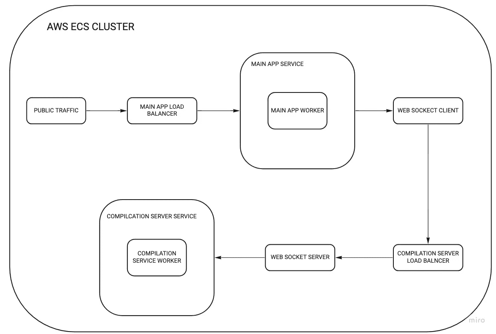

# 我混合了 YouTube 和 Visual Studio 代码。以下是方法

> 原文：<https://betterprogramming.pub/i-built-a-mix-between-youtube-and-visual-studio-code-heres-the-story-cf7e41484033>

## 完成一个看似不可能的激情项目


[Eyestetix 工作室](https://unsplash.com/@eyestetix?utm_source=medium&utm_medium=referral)在 [Unsplash](https://unsplash.com?utm_source=medium&utm_medium=referral) 拍摄的照片

# 介绍

在过去的几个月里，我挑战自己去解决许多软件内容创作者遇到的一个问题——想要创建没有视频编辑麻烦的视频教程。

我发布并部署了这个项目，你可以在这里找到(尝试在桌面上获得最佳用户体验)。

# 灵感

软件工程师经常做两件事——学习新的编程概念和向他人解释他们的代码。

Stack Overflow 是开发人员最好的朋友，因为它很方便——您可以查看代码片段并将其应用到您的工作中。然而，当问题相当复杂或深奥时，需要更多的细节而不是几行代码。

中等是下一个最好的选择，因为它提供了比堆栈溢出更多的上下文，并且通常非常详细。但有时，帖子感觉像散文，很难解析相关信息(希望这篇帖子是个例外)。

像 YouTube 这样的视频内容网站稍微好一点——它们比媒体提供了更多的内容，而且它们很吸引人。但对于创作者来说，制作短内容并不节省时间，因为编辑视频需要太长时间。因此，他们制作关于更广泛主题的更长视频，以吸引更广泛的观众——这对更有经验的开发人员来说是一场噩梦。

# 灯泡力矩

这个想法产生了，需要有一个工具来为一个概念提供恰到好处的上下文，像一篇中型文章一样详细，像一个视频一样吸引人，但对创作者来说不是一个巨大的时间成本。

感觉充满活力，我给自己安排了一个任务来构建这样一个东西——一个基于浏览器的 IDE，用户可以像在 VSCode 和 Atom 等编辑器中一样简单地编写代码。在后台，它跟踪并存储用户执行的每一个操作——写入文件、运行命令和做笔记。

只需点击一个按钮，编辑器就会生成用户操作的回放，用户可以在平台上分享这些回放，供其他人查看和交互。

# 体系结构



该应用程序由两个微服务构成:主应用程序和语言编译服务器。

对于主应用程序，我使用了经典的 MERN ( [MongoDB](https://www.mongodb.com/) 、 [Express](https://expressjs.com/) 、 [React](https://reactjs.org/) 、 [Node](https://nodejs.org/en/) )堆栈。像 MongoDB 这样的非关系数据库是完美的，因为存储的数据类型会根据 IDE 的布局和用户编写的代码而有很大的不同。React 是我的面包和黄油，我是 [Material UI 的](https://mui.com/)组件的超级粉丝。

代码编辑器使用 [Ace 编辑器](https://ace.c9.io/)来突出丰富的语法。它还具有一个 notes 部分，带有用 [Quill](https://quilljs.com/) 制作的多媒体支持和用 [Xterm.js](https://xtermjs.org/) 制作的终端 UI。

语言编译服务器包含一个运行节点服务器的 [Docker](https://www.docker.com/) 容器，该节点服务器使用 [Node-pty](https://github.com/microsoft/node-pty) 公开一个伪终端接口。服务器配备了一个 [NixOS](https://nixos.org/) 环境，该环境预装了编译各种语言和框架所需的包。IDE 目前支持 14 种最流行的编程语言。

这两个微服务作为单独的节点部署在 [AWS ECS](https://aws.amazon.com/ecs/) 集群中，并通过 [WebSockets](https://socket.io/) 进行通信。

## 魔力

该应用程序的核心功能是能够监控用户的动作，并创建一个交互式视频回放。这是使用 [Redux](https://redux.js.org/introduction/getting-started) 、 [setTimeout()](https://developer.mozilla.org/en-US/docs/Web/API/setTimeout) 和 [MediaRecorder](https://developer.mozilla.org/en-US/docs/Web/API/MediaRecorder) 完成的。

Redux 允许我在 React 元素之间传递信息时保持应用程序状态。主应用程序由两个[减速器](https://redux.js.org/tutorials/fundamentals/part-3-state-actions-reducers)组成:canvas 和 playback。

canvas reducer 负责存储两组数据。首先是名为`windowGrid`的 IDE 的布局。这是一个 2D 对象数组，其中每个对象都可以是文件编辑器、记事本或终端类型。通过映射到`windowGrid`并将对象显示为相应的 React 元素，这些对象被呈现在`UI`中。

canvas reducer 存储的第二组数据是用户输入。我向`windowGrid`中的每个对象注册了自定义输入事件监听器，这样当用户与 IDE 交互时，就会调度一个动作来更新 redux 存储。

回放缩减器还跟踪两组数据。第一个数据集存储在回放期间呈现的文本的速度和位置中。文本在键入时按顺序显示。这是通过保存一个带有时间戳的文本输入记录并更新一个`setTimeout()`调用中 React 组件的状态来实现的。

回放缩减器存储的第二组信息是音频元数据。在 MediaRecorder 的帮助下，用户可以将音频叠加到帖子上。音频数据被保存为块，缝合到一个 [Blob](https://developer.mozilla.org/en-US/docs/Web/API/Blob) 对象中，并在 IDE 组件挂载时转换为音频元素。我使用 S3 的 AWS 来存储音频文件。

# 结束语


兰迪·雅各布在 [Unsplash](https://unsplash.com/s/photos/reflection?utm_source=unsplash&utm_medium=referral&utm_content=creditCopyText) 上拍摄的照片

我们已经习惯于被告知概念是什么，然后期望使用这些知识并将其应用到我们的工作中。然而，将初学者放在一个有经验的程序员的角度有助于一种自下而上的教学方法，在这种方法中，观众学习一个概念如何以及为什么以这种方式工作。

为什么这种方法没有被完全采用，最可能的原因是惰性和没有实现潜力。“记忆并适应”的教学风格长期以来一直占主导地位，主要是因为其逻辑简单。由于它的功能刚刚够输出一些有知识的学习者，因此没有重大的市场推动来从根本上改变现状。

然而，近年来，像汗学院这样的公司和该领域越来越多的研究表明，自下而上的教学方法更加有效，并在教育中获得更大的长期收益。

```
**Want to Connect?**Join the discord community [here](https://discord.com/invite/4Yw4sVcgdA) to provide feedback on the project and tag along the development process.
```