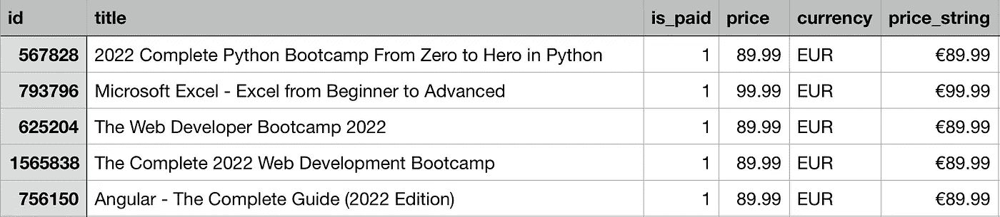
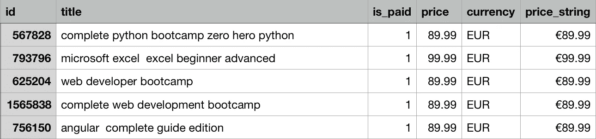

# 我构建了一个 Python 工具来帮助优化你的 Udemy 课程的价格

> 原文：<https://betterprogramming.pub/i-built-a-python-tool-to-help-optimise-the-price-of-your-udemy-courses-b9c6509de21e>

## 在 10K Udemy 课程数据集上接受培训


照片由[模仿者](https://mockuper.net/)拍摄

假设您想在 Udemy 或类似平台上上传一门课程，但您不知道应该为课程定价多少才能优化课程注册。

假设课程是关于“Python 初学者”的。如果我们向人工智能工具输入你的课程标题中的潜在关键词，在这种情况下是`python`和`beginners`，该工具将返回最上面的相似关键词以及估计价格。

```
Example Output:Top **5** key words with the highest similarity: ['bootcamp', 'programming', 'handson', 'introduction', 'learn']Estimated price: **73 Euro**
```

为了测试这个 AI 工具，请查看 Github 库 中的完整文档。所有关键字必须用小写字母*书写。*

# 动机

作为一个伪学生，我对我的大学课程感到非常沮丧。我们已经经历了许多广泛而模糊的机器学习概念，从来没有用它们来解决现实生活中的问题。

出于这个原因，我发现做兼职项目是加强我的学习和提高我的编程技能的最好方法。

在这篇文章中，我将解释我所采取的步骤来创建一个人工智能工具，该工具根据一系列关键词(可能在课程标题中使用的单词)来估计 Udemy 课程的价格。

# **收集和准备数据集**

数据收集和准备是任何机器学习项目的第一步，也可以说是最困难的一步。很多时候，互联网上没有所需的数据集，您必须从头开始制作！

这确实发生在我身上！

我花了几个小时的工作编写 Python 脚本，使用`[Udemy affiliate API](https://www.udemy.com/developers/affiliate/)`和`[Selenium](https://selenium-python.readthedocs.io/)` Python 库从 **10，000** Udemy 课程中提取数据。原始数据库文件如下所示:



原始数据库

既然获得了数据集，我就可以开始构建机器学习模型了吧？不对。

在此之前，我需要清理数据。为什么？因为数据清理消除了可能导致错误决策的不准确和重复的信息。由于我要构建的 AI 工具旨在接收课程标题关键字作为输入，并输出估计价格，因此只需要清理“ *title* 和“ *price* 列的数据:

*   删除“价格”列中的值不相关或未知的行。
*   从“标题”栏中删除*停用词*。通过删除停用词，我们可以从文本中删除低级信息，以便将更多的注意力放在重要信息上。停用词的例子有“a”、“the”、“is”、“are”等。

下面的屏幕截图展示了清理后的数据集:



已清理的数据库

# 训练 Word2Vec 模型

一旦数据处于可用状态，就该进入你渴望的步骤了:通过应用一系列技术和算法，训练模型从高质量的数据中学习。

根据您要处理的数据，可以使用各种模型。在我的项目中，我应该选择一个文本处理模型。

原因是我要建立一个模型，学习标题关键字之间有意义的关系，并检测相似类型的关键字。如果你不确定为什么会这样，不要担心！下一节你就明白了。建立这个模型后，我可以将它集成到我的项目中，以便估算价格。

好了，我们确定了模型的类型，但是有数百种自然语言处理模型。我应该用哪一个？

我给你介绍一下`Word2Vec`型号。Word2Vec 背后的基本思想是，一个单词的含义可以从它的邻居中推断出来。

它围绕一个假设，即共享相似上下文的两个单词也共享相似的含义，因此从模型中得到相似的向量表示。

例如:“python”、“编程”和“脚本”经常在类似的情况下使用，周围有类似的词，如“安装”、“制作”或“学习”，根据 Word2Vec，它们因此将共享类似的向量表示。

从这个假设出发，Word2Vec 可以用来找出我们的数据集中单词之间的关系，计算它们之间的相似性，或者使用这些单词的向量表示作为其他应用程序的输入；这是我们在下一节要做的。

# **估价**

这是实际价格估算发生的地方！该模型本身并不估计任何价格。它所做的就是在课程标题中找到最相似的关键词。参见下面的例子

```
**Input**:model.most_similar(‘python’, topn=5)**Output:** (‘learning’, 0.9997335076332092) 
(‘deep’, 0.9996577501296997) 
(‘r’, 0.9996521472930908) 
(‘bootcamp’, 0.9995537996292114) 
(‘programming’, 0.9994513988494873)# The second argument is the similarity score out of 1
```

为了进行价格估算，我创建了一个函数，在其主体中集成了 Word2vec 模型。它通过两个简单的步骤运行:

1.  根据输入的关键字，使用模型查找最相似的单词列表。
2.  对于列表中的每个`similiar_word`,查找标题中包含`similiar_word`子字符串的课程，计算它们的平均价格，并返回预测价格

```
**def** predictPrice(keyWords, topn**=**6):
  similarKeyWords_list **=** []
  mean_list **=** []

  model **=** Word2Vec**.**load(MODEL_PATH)
  similarKeyWords **=** model**.**wv**.**most_similar(keyWords, topn**=**topn)    **for** keyword **in** similarKeyWords:
    **if** **not** keyword[0]**.**isdigit() **and** keyword[0]**!=**'':
      similarKeyWords_list**.**append(keyword[0])

  **for** item **in** similarKeyWords_list:
    myDataframe **=** findTitle(dataframe, str(item))
    mean **=** myDataframe['price']**.**mean()
    mean_list**.**append(mean)

  print(f"Top {topn} key words with the highest similarity:  {similarKeyWords_list}" )
  print(f"Predicted price:  {round(Average(mean_list))} Euro")
```

上面代码片段中的第一个 for 循环描述了查找最相似单词列表的第一步。类似地，第二个 for 循环查找标题中包含`similiar_word`子字符串的 Udemy 课程，并计算平均价格。

# **模型评估**

每个机器学习项目的最后一个阶段是评估模型。

尽管我的模型精度很高，但我还是想在这一部分指出如何改进这个模型:

*   数据集不够大。虽然一万个课程数据看起来很庞大，但是相信我，一点都不大！增加数据集的大小可以降低估计方差，从而提高模型的预测性能。
*   功能数量不足。我的模型接受训练的唯一数据特征是课程“标题”。如果我添加更多的特性，比如“注册人数**”、**评分**、**和“评论”的数量，会怎么样呢？这会导致更高的准确性吗？事实上，随着我们不断添加越来越多的功能，预测的准确性将会提高。