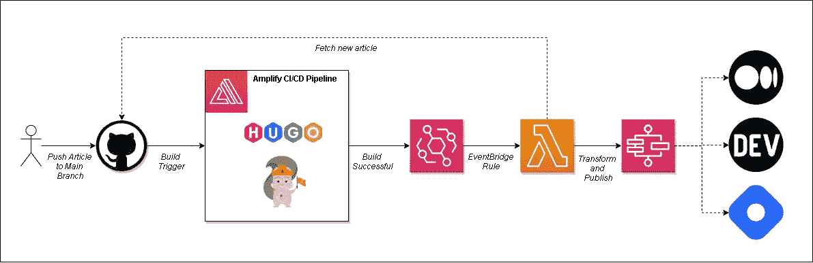
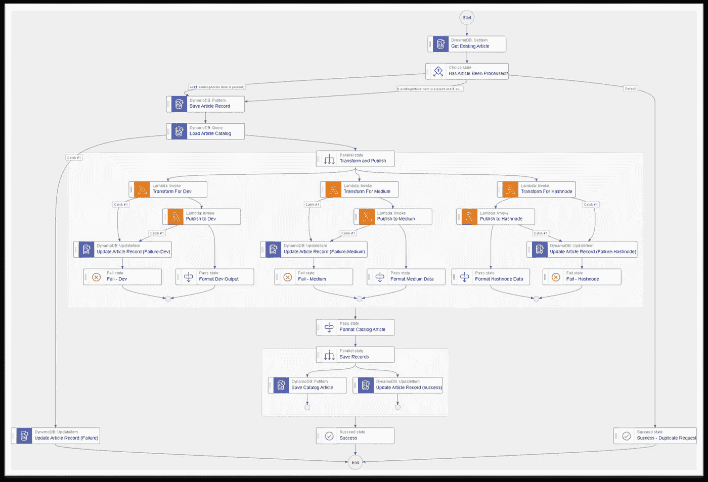
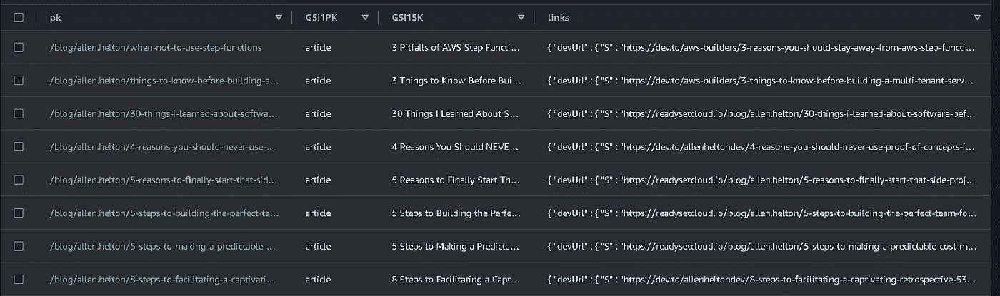

# 我建立了一个无服务器的应用程序来交叉发布我的博客

> 原文：<https://betterprogramming.pub/i-built-a-serverless-app-to-cross-post-my-blogs-aa4c6979ff9b>

## 在几个平台上发布我的博客，每周都要占用很多时间。一定有更好的方法


*图像由* [*宏向量*](https://www.freepik.com/author/macrovector) *放在 Freepik* 上

我写了很多东西。

在过去的 50 周里，我每周都写并发表一篇博客文章。这是我做的事情，因为我热爱写作和与他人分享我学到的东西。

写作不仅为我提供了一个帮助他人的好方法，而且通过确保我对一个主题了如指掌，它还帮助我学习。它极大地提高了我的写作能力、理解力和自我意识。我可以继续说下去，但我们在这里谈论别的东西。

写博客最难的部分是交叉发布。交叉发布是我从我的文章中提取内容，并通过链接到我的博客发布到其他网站上。我在[媒体](https://allenheltondev.medium.com/)、[开发到](https://dev.to/allenheltondev)、[哈希节点](https://allenheltondev.hashnode.dev/)上重新发布我的内容。

通过在这些不同的平台上交叉发布，我能够接触到比我只在博客上发布内容更广泛的受众。

不幸的是，在这些平台上不仅仅是简单的复制/粘贴。我必须对内容做一些修改，这些修改根据我发布的网站而有所不同。

*   更新链接——我的文章经常引用我写的其他文章。我在每个平台上更新这些链接，指向交叉发布的版本。因此，我所有的媒体文章链接到我的其他媒体文章，所有的开发文章指向其他开发文章，等等。这为我的读者提供了一个很好的、统一的体验。
*   更新嵌入——我经常在我的帖子中嵌入代码或推文。每个平台使用不同的机制将内容嵌入到帖子中。
*   设置规范的 URL——每篇文章都需要指向我的博客上的第[篇文章。如果他们不这样做，](https://readysetcloud.io)[搜索引擎优化爬虫](https://www.seoclarity.net/resources/knowledgebase/what-is-a-site-crawler)将检测重复内容，降低搜索引擎排名。

可以想象，这每周都要花很多时间。解析链接并用正确的引用更新它们，替换嵌入的内容，并为三个不同的站点设置规范的 URL，这些工作加起来很快。

所以我决定解决这个问题。我建立了一个无服务器的应用程序，它会在我每次发布新内容时更新和交叉发布我的内容。

让我们来看看。

# 它是如何工作的

我的博客是用[静态站点生成器雨果](https://gohugo.io/)构建的，托管在 [AWS Amplify](https://aws.amazon.com/amplify/) 中。如果你对我如何建造它感兴趣，[我写了一篇关于它的博文](https://allenheltondev.medium.com/take-the-leap-10-steps-to-building-your-personal-blog-with-aws-hugo-ready-set-cloud-ccc466443123)。

我在 markdown 中写文章，并将它们推送到我的存储库中的主分支。触发了一个 Amplify build，它运行 Hugo 将 markdown 编译成 HTML，然后将内容发布到 CloudFront 负责的 S3。

对于我的应用程序，我想在构建成功完成时触发一个异步进程运行。这个过程将从 GitHub 获取文件，将 markdown 转换成适当的格式，并将其发布到所有不同的平台。



*成功构建的自动化流程*

在成功的 Amplify 构建之后触发一个过程是我在文档中寻找但没有找到的东西。当我打算直接从我的构建中触发一个 Lambda 函数时，我决定问问 [Michael Liendo](https://twitter.com/focusotter) 他是否知道什么窍门。

幸运的是，我激起了他的兴趣。他深入挖掘，发现了一个整洁的未记录的特征。

所以我能够在一次成功的构建中用一个`EventBridge`规则触发一个 Lambda 函数！

这个 Lambda 函数调用 GitHub，并在提交消息中寻找最后五分钟`[new post]`内的提交。然后，它从提交中获取我的博客目录中的所有新文件，并启动一个状态机执行，将内容转换并发布到各种平台。

如果消息中没有使用`[new post]`的提交，或者我的存储库的博客目录中没有新文件，Lambda 函数的执行会停止，而不会触发状态机。

状态机工作流如下所示:



*转换并发布状态机*

为了防止文章被意外发布超过一次，它从一个[等幂检查](/serverless-api-essentials-idempotency-e753b7b49680)开始，切断文件名，并提交`sha`。如果使用相同的文件名/提交组合触发了多个执行，并且原始执行正在进行或已经成功，则执行会中止。如果最初的执行失败，它会安全地重试处理该项目。

在幂等性检查之后，它使用对 DynamoDB 的直接集成来加载所有现有的文章及其映射(稍后将详细介绍)。一旦文章被加载，它就将它们并行地转换并发布到所有三个平台上。

成功时，它保存交叉发布的 URL 并更新幂等记录。那就是直播了！

让我们仔细看看转换和发布组件。

# 更新链接

当我手动更新链接指向我的交叉发布版本时，我必须在我交叉发布的平台上滚动我的故事列表页面。我找到我引用的文章的链接，然后相应地更新内容。

但是我不能用后端程序来做。我不能“点击滚动”找到正确的文章。

所以，我在 DynamoDB 上建立了一个我所有文章的目录。



*dynamo db 中的文章目录*

每篇文章在 DynamoDB 中都有一条记录，通过 [post slug](https://redclaycreative.com/glossary/what-is-post-slug/) 唯一地标识它。该记录包含一个`links`对象，该对象包含指向 Medium、Dev 和 Hashnode 上交叉发布版本的 URL。

```
{
 "pk": "/blog/allen.helton/infrastructure-from-code-benchmark",
 "sk": "article",
 "GSI1PK": "article",
 "GSI1SK": "The Current State of Infrastructure From Code",
 "links": {
  "devUrl": "https://dev.to/aws-heroes/the-current-state-of-infrastructure-from-code-1fjc",
  "mediumUrl": "https://betterprogramming.pub/the-current-state-of-infrastructure-from-code-cbd3469ecdc5",
  "url": "/blog/allen.helton/infrastructure-from-code-benchmark",
  "hashnodeUrl": "https://allenheltondev.hashnode.dev/the-current-state-of-infrastructure-from-code"
 },
 "title": "The Current State of Infrastructure From Code"
}
```

为了识别帖子中的链接，我使用了一个正则表达式来匹配 markdown 链接格式。所有的内部链接(指我写过的其他帖子的参考)都以`/blog/allen.helton/`开头，所以我把它包括进来，以识别需要快速更新的链接。

一旦我能够获取所有内部链接，我必须遍历它们，用文章记录的`links`对象中的映射值替换我的 URL 值。

# 更新嵌入

当你在帖子中看到丰富的内容时，这通常是嵌入的结果。这是一种特殊的内容，以一种对读者来说更自然的方式呈现。

我在帖子中最常用的嵌入方式是 Twitter。它将一条推文直接放入内容中，因此读者可以准确地获得视图，就像他们在网站上一样。但是嵌入的格式在我发布的所有平台上都不一样。例如，下面是嵌入 tweet 的不同结构。

```
My Blog: {<tweet user="<username>" id="<tweet id>">}
Dev: 
Medium: <url to tweet>
Hashnode: %[<url to tweet>]
```

正如您所看到的，结构非常不同，所以我不得不使用另一个正则表达式来匹配我博客中的 tweet 格式，组成完整的 Twitter URL，然后将其转换到特定的平台。

总的来说，这并不是项目中非常困难的部分，但是这种不一致性简直要了我的命！

# 发表文章

数据经过适当的转换后，我使用各自平台的 API 进行发布。这部分出乎意料的难。这也是谈论 [API 优先开发](/are-you-really-api-first-or-do-you-just-think-it-24ffc47ec7ea)的合适时机。

如果你希望人们集成你的软件，拥有一套强大、直观的 API 文档是至关重要的。如果你不这样做，只有坚持不懈的集成者会坚持下去，让他们的自动化继续下去。如果不是这篇文章，我可能会放弃这个项目。

在我集成的三个平台中，只有 Dev 有像样的文档——即使是这个也不确定。文档表明他们的原始 API 版本已经过时，但是新版本只实现了两个端点。我很担心用一个废弃的版本来构建一个集成，但还是决定用它。幸运的是，他们的 API 工作得非常好，我只用了几分钟就完成了。

Medium 和 Hashnode 是完全不同的故事。

Medium 的文档看起来像是长格式的，并在 GitHub 的 README 中托管。我需要的所有信息都在那里，但我必须去寻找。

Hashnode 使用 GraphQL 作为其 API，并提供了一个带有对象定义且没有解释的测试工具。我不得不依靠博客帖子来弄清楚那里发生了什么。

但是经过反复试验，我成功地找到了正确的终点，并请求相关机构发布我的内容。

对于 Medium 和 Dev，我确实稍微偏离了常规。当我在 Dev 上发帖时，我总是将我的内容链接到 [AWS 英雄合集](https://dev.to/aws-heroes)。类似地，在 Medium 上，我将我的内容添加到了[更好的编程出版物](https://betterprogramming.pub/)。所以我必须想办法把内容直接提交给他们来优化流量。

最终，我能够让它们都正常工作，内容链接正确，并以正确的格式呈现。

发布文章的最后一部分是为每个平台获取新文章的 post slug，并为故事创建 DynamoDB 条目，以便在未来的文章中引用。

幸运的是，每个帖子的成功响应消息中都返回了完整的 URL，所以我可以获取它们并将数据保存回 DynamoDB。

# 最后的想法

这是一个有趣的小应用程序，比我最初预期的要复杂得多。现在已经完成了，我将花一些时间来润色和参数化 IaC，这样它就可以开源了。

*更新——源代码现为* [*在 GitHub*](https://github.com/aws-community-projects/blog-crossposting-automation) 上开源！

这将需要大量的时间。不仅如此，它还应该使我的帖子不容易出错。人类总是会犯错。有很多次，我错过了一个链接或忘记更新一个嵌入。有了自动化，永远不会错过。

> 抓住一切机会消除流程中的人为因素。

如果你是在 Dev、Medium 或 Hashnode 上阅读这篇文章，希望所有的链接都对你有用。这篇文章是我的第一次生产测试。

我希望这篇文章能激励你去建立一些东西，让你的生活更轻松。你做了哪些可以自动化的重复性工作？如今，几乎所有我们交互的东西都有一个 API 几乎没有什么是不可用的。

如果你做了什么，告诉我！我很想看看你做了什么！

编码快乐！