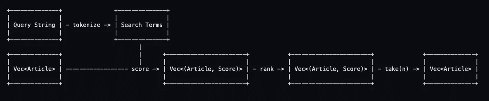
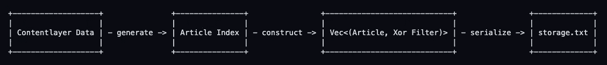
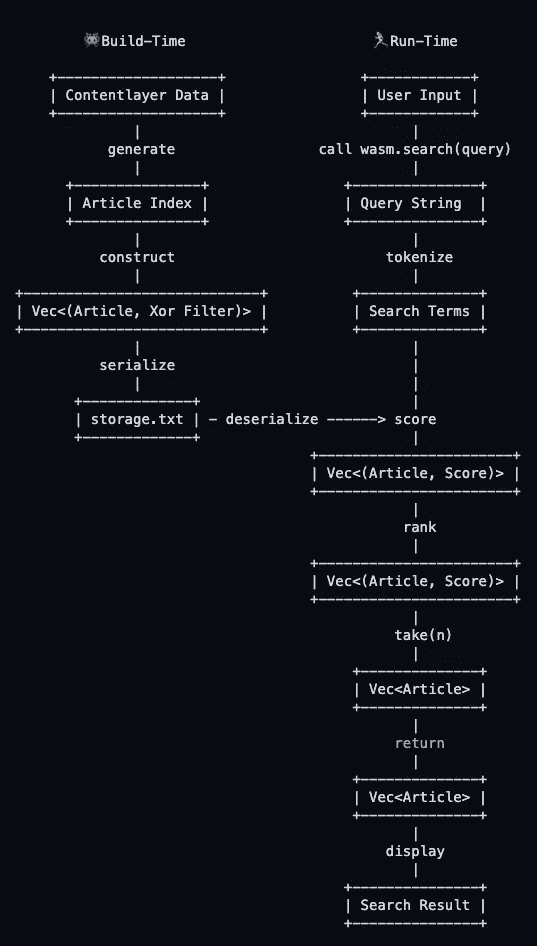
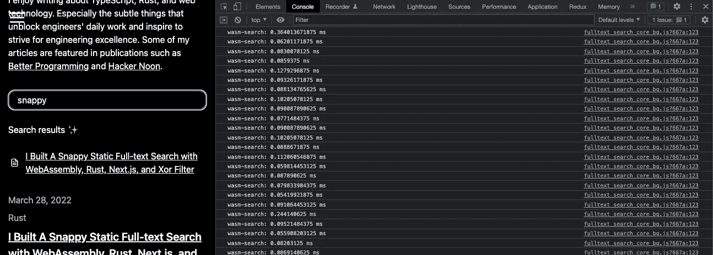

# 我用 WebAssembly、Rust、Next.js 和 Xor 过滤器构建了一个简洁的静态全文搜索

> 原文：<https://betterprogramming.pub/i-built-a-snappy-static-full-text-search-with-webassembly-rust-next-js-and-xor-filters-a21a4824832e>

## 快速，轻巧，并在建设的乐趣吨！


# TL；速度三角形定位法(dead reckoning)

*   🦀使用 Rust 开发 WebAssembly 有一个丰富的工具包。很好玩！
*   🤝WebAssembly 和 Next.js 配合得相当好，但是要注意已知的问题。
*   🧑‍🔬Xor 过滤器是一种数据结构，它提供了很高的内存效率和快速查找值的能力。
*   🧑‍🍳WebAssembly 的性能和代码大小没有保证。确保进行测量和基准测试。

我一直知道我想要一个针对我的[作品集](https://dawchihliou.github.io/)中的文章的全文搜索功能，为访问者提供他们感兴趣的内容的快速访问。[迁移到 Contentlayer](https://dawchihliou.github.io/articles/build-better-nextjs-static-sites-with-mdx-and-contentlayer) 之后，似乎就不再那么牵强了。所以我开始探索。

# 受`tinysearch`启发:一个 WebAssembly 全文搜索引擎

经过一番研究，我找到了一个名为`[tinysearch](https://github.com/tinysearch/tinysearch)`的搜索引擎。是用 [Rust](https://www.rust-lang.org/) 和 [WebAssembly](https://webassembly.org/) (Wasm)搭建的静态搜索引擎。作家马蒂亚斯·恩德勒写了一篇令人惊叹的博文，讲述了 T2 是如何诞生的。

我喜欢在构建时构建一个极简搜索引擎，并以优化的低级代码的形式发布给浏览器的想法。于是我决定以`tinysearch`为蓝本，自己编写搜索引擎，与我的 [Next.js 静态站点](https://nextjs.org/)整合。

*我强烈推荐阅读* `[*tinysearch*](https://github.com/tinysearch/tinysearch)` [*的 codebase*](https://github.com/tinysearch/tinysearch) *。写得非常好。我的搜索引擎的实现是它的简化版本。核心逻辑是一样的。*

# 搜索功能是什么样的？


非常简单:

*   用户可以在搜索输入中输入任何内容。
*   搜索引擎在所有内容中搜索关键词，找到最相关的文章。
*   UI 显示排序的搜索结果列表。

你可以在[文章页面](https://dawchihliou.github.io/articles)试试搜索功能！

# 一点统计数据

在撰写本文时，有:

*   7 篇文章(更多内容即将发布)
*   13925 字
*   682KB 的数据文件(由内容层生成)

> *为了让静态网站的全文搜索能够加快速度，代码必须很小。*

# WebAssembly 全文搜索功能是如何工作的？

大多数[现代浏览器现在都支持 WebAssembly](https://caniuse.com/?search=webassembly) 。他们能够在运行 JavaScript 的同时运行本地 WebAssembly 代码和二进制代码。

搜索功能的概念很简单。它接受一个查询字符串作为参数。在函数中，我们将查询标记为搜索词。然后，我们会根据每篇文章包含的搜索词数量给每篇文章打分。最后，我们根据相关性对文章进行排名。分数越高，相关性越强。

流程如下所示:



给文章打分是最需要计算的地方。一种简单的方法是将每篇文章转换成包含文章中所有独特单词的散列集。我们可以通过简单地计算哈希集中有多少搜索项来计算分数。

您可以想象这不是使用散列集的最有效的内存方法。有更好的数据结构来代替:**异或滤波器**。

# 什么是 Xor 滤波器？

[Xor 过滤器](https://arxiv.org/abs/1912.08258)是相对较新的数据结构，允许我们估计一个值是否存在。它速度快，内存效率高，非常适合全文搜索。

xor 过滤器以特定的方式存储输入值[的指纹(L 位散列序列)，而不是像散列集一样存储实际的输入值。在查找过滤器中是否存在某个值时，它会检查该值的指纹是否存在。](https://web.stanford.edu/class/archive/cs/cs166/cs166.1216/lectures/13/Slides13.pdf#page=49)

然而，Xor 滤波器有几个缺点:

*   Xor 过滤器是概率性的，有可能发生假阳性。
*   Xor 滤波器不能估计部分值的存在。所以在我的用例中，全文搜索只能搜索完整的单词。

# 我如何用 Rust 构建 Xor 过滤器？

因为我有 Contentlayer 生成的文章数据，所以在构建 WebAssembly 之前，我通过向它们提供数据来构建 xor 过滤器。然后，我序列化了 xor 过滤器，并将它们存储在一个文件中。为了在 WebAssembly 中使用过滤器，我需要做的就是从存储文件中读取并反序列化过滤器。

过滤器生成流程如下所示:



`[xorf](https://github.com/ayazhafiz/xorf)` crate 是 xor 滤波器实现的一个很好的选择，因为它提供了序列化/反序列化以及一些提高内存效率和误报率的功能。它还为我的用例提供了一个非常方便的`[HashProxy](https://docs.rs/xorf/latest/xorf/struct.HashProxy.html)`结构，用一片字符串构造一个 xor 过滤器。用 Rust 编写结构大致如下:

如果你对实际的实现感兴趣，你可以在库中[阅读更多。](https://github.com/DawChihLiou/dawchihliou.github.io/blob/main/scripts/fulltext-search/src/storage.rs)

# 把所有的放在一起



# 在 Next.js 中集成 WebAssembly

下面是我如何在 Next.js 中集成 xor 过滤器生成脚本和 WebAssembly 的。

文件结构如下所示:

```
my-portfolio
├── next.config.js
├── pages
├── scripts
│   └── fulltext-search
├── components
│   └── Search.tsx
└── wasm
    └── fulltext-search
```

为了支持 WebAssembly，我更新了我的 Webpack 配置，将 WebAssembly 模块作为异步模块加载。为了让它适用于静态站点生成，我需要[一个变通方法](https://github.com/vercel/next.js/issues/25852)来在`.next/server`目录中生成 WebAssembly 模块，以便静态页面可以在运行`next build`脚本时成功预渲染。

`next.config.js`的代码如下:

```
webpack: function (config, { isServer }) {
  // it makes a WebAssembly modules async modules
  config.experiments = { asyncWebAssembly: true } // generate wasm module in ".next/server" for ssr & ssg
  if (isServer) {
    config.output.webassemblyModuleFilename =
      './../static/wasm/[modulehash].wasm'
  } else {
    config.output.webassemblyModuleFilename = 'static/wasm/[modulehash].wasm'
  } return config
},
```

这就是 integration✨的全部

# 在 React 组件中使用 WebAssembly

为了从 Rust 代码构建 WebAssembly 模块，我使用了`[wasm-pack](https://github.com/rustwasm/wasm-pack)`。

生成的`.wasm`文件和 JavaScript 的粘合代码位于`wasm/fulltext-search/pkg`中。我需要做的就是使用`[next/dynamic](https://nextjs.org/docs/advanced-features/dynamic-import)`来动态导入它们。像这样:

# 优化 WebAssembly 代码大小

没有任何优化，原来 Wasm 文件大小是`114.56KB`。我用[崔姬](https://github.com/rustwasm/twiggy)找出代码大小。

```
Shallow Bytes  │ Shallow % │ Item
───────────────┼───────────┼─────────────────────
        117314 ┊   100.00% ┊ Σ [1670 Total Rows]
```

与原始数据文件的`628KB`相比，它比我预期的要小得多。我很高兴已经将它发布到产品中，但是我很好奇使用 Rust 和 WebAssembly 工作组的优化建议，我能削减多少代码。

第一个实验是切换 LTO 并尝试不同的`opt-level`。以下配置产生最小的`.wasm`代码大小:

```
# Cargo.toml[profile.release]
+ opt-level = 's'
+ lto = trueShallow Bytes  │ Shallow % │ Item
───────────────┼───────────┼─────────────────────
        111319 ┊   100.00% ┊ Σ [1604 Total Rows]
```

接下来，我用`[wee_alloc](https://github.com/rustwasm/wee_alloc)`替换了默认的分配器。

```
// wasm/fulltext-search/src/lib.rs+ #[global_allocator]
+ static ALLOC: wee_alloc::WeeAlloc = wee_alloc::WeeAlloc::INIT;Shallow Bytes  │ Shallow % │ Item
───────────────┼───────────┼─────────────────────
        100483 ┊   100.00% ┊ Σ [1625 Total Rows]
```

然后我试了试 [Binaryen](https://github.com/WebAssembly/binaryen) 中的`wasm-opt`工具。

```
wasm-opt -Oz -o wasm/fulltext-search/pkg/fulltext_search_core_bg.wasm wasm/fulltext-search/pkg/fulltext_search_core_bg.wasmShallow Bytes  │ Shallow % │ Item
───────────────┼───────────┼─────────────────────
        100390 ┊   100.00% ┊ Σ [1625 Total Rows]
```

这与原始代码大小相差`14.4%`。

最后，我能够提供一个全文搜索引擎:

*   98.04 KB 原始数据
*   45.92 KB gzipped

还不错。

# 真的很爽快吗？



我用`[web-sys](https://github.com/rustwasm/wasm-bindgen/tree/main/crates/web-sys)`分析了性能并收集了一些数据:

*   搜索次数:208 次
*   最小值:0.046 毫秒
*   最大值:0.814 毫秒
*   平均值:0.0994✨女士
*   标准偏差:0.0678

平均而言，执行一次全文搜索需要不到 0.1 毫秒的时间。

挺爽快的。

# 最后的想法

经过一些实验，我能够用 WebAssembly、Rust 和 xor 过滤器构建一个快速、轻量级的全文搜索。它与 Next.js 和静态站点生成集成得很好。

速度和大小有一些折衷，但它们对用户体验没有太大影响。如果你正在寻找一个更全面的搜索功能，这里有一些很酷的产品可供选择:

**SaaS 搜索引擎**

*   [阿尔戈利亚](https://www.algolia.com/)

**静态搜索引擎**

*   [tinysearch](https://github.com/tinysearch/tinysearch)

**基于服务器的搜索引擎**

*   [Meilisearch](https://www.meilisearch.com/)
*   [类型感](https://typesense.org/)

**浏览器内搜索引擎**

*   [FlexSearch](https://github.com/nextapps-de/flexsearch)
*   [迷你搜索](https://github.com/lucaong/minisearch)
*   [Elasticlunr.js](http://elasticlunr.com/)

# 参考

*   文章:[使用 Rust 和 WebAssembly 的小型静态全文搜索引擎——马蒂亚斯·恩德勒](https://endler.dev/2019/tinysearch)
*   文章:[使用 Bloom filters 编写全文搜索引擎— Stavros Korokithakis](https://www.stavros.io/posts/bloom-filter-search-engine/)
*   文章: [Xor 过滤器:比 Bloom 过滤器更快更小——丹尼尔·勒米尔](https://lemire.me/blog/2019/12/19/xor-filters-faster-and-smaller-than-bloom-filters/)
*   文章:[缩水。wasm 代码大小 Rust 和 WebAssembly 工作组](https://rustwasm.github.io/docs/book/reference/code-size.html)
*   文章:[用 MDX 和 Contentlayer 构建更好的 Next.js 静态站点——刘道智](https://dawchihliou.github.io/articles/build-better-nextjs-static-sites-with-mdx-and-contentlayer)
*   文章: [Next.js —动态导入](https://nextjs.org/docs/advanced-features/dynamic-import)
*   网站: [Xor 滤波器:比 Bloom 和 Cuckoo 滤波器更快更小](https://arxiv.org/abs/1912.08258)
*   网址:[刘道智作品集](https://dawchihliou.github.io/)
*   网址:[美利搜索](https://www.meilisearch.com/)
*   网址:[类型感](https://typesense.org/)
*   网址:[阿尔戈利亚](https://www.algolia.com/)
*   网址:[elastic clunr . js](http://elasticlunr.com/)
*   网址:[铁锈](https://www.rust-lang.org/)
*   网址: [WebAssembly](https://webassembly.org/)
*   网址: [MDN WebAssembly](https://developer.mozilla.org/en-US/docs/WebAssembly)
*   网址: [Next.js](https://nextjs.org/)
*   网址:[可以用 WebAssembly 吗？](https://caniuse.com/?search=webassembly)
*   讲座:[近似会员查询—斯坦福](https://web.stanford.edu/class/archive/cs/cs166/cs166.1216/lectures/13/Slides13.pdf#page=49)
*   维基:[全文搜索](https://en.wikipedia.org/wiki/Full-text_search)
*   GitHub:[next . js&web assembly 示例](https://github.com/vercel/next.js/tree/canary/examples/with-webassembly)
*   GitHub: [最小化 Rust 二进制大小](https://github.com/johnthagen/min-sized-rust)
*   GitHub:[dawchihliou . GitHub . io](https://github.com/DawChihLiou/dawchihliou.github.io/blob/main/scripts/fulltext-search/src/storage.rs)
*   GitHub: [Webpack 5 中断 SSR 的动态 wasm 导入](https://github.com/vercel/next.js/issues/25852)
*   Github: [tinysearch](https://github.com/tinysearch/tinysearch)
*   GitHub: [Meilisearch](https://github.com/meilisearch/meilisearch)
*   GitHub: [xorf](https://github.com/ayazhafiz/xorf)
*   GitHub: [wasm-pack](https://github.com/rustwasm/wasm-pack)
*   GitHub: [Binaryen](https://github.com/WebAssembly/binaryen)
*   GitHub:[崔姬 T23](https://github.com/rustwasm/twiggy)
*   GitHub: [Clippy](https://github.com/rust-lang/rust-clippy)
*   GitHub: [web-sys](https://github.com/rustwasm/wasm-bindgen/tree/main/crates/web-sys)
*   GitHub: [once_cell](https://github.com/matklad/once_cell)
*   GitHub: [Bincode](https://github.com/bincode-org/bincode)
*   GitHub: [wee_alloc](https://github.com/rustwasm/wee_alloc)
*   GitHub: [Serde](https://github.com/serde-rs/serde)
*   GitHub: [总之](https://github.com/dtolnay/anyhow)
*   GitHub: [内容层](https://github.com/contentlayerdev/contentlayer)
*   GitHub: [FlexSearch](https://github.com/nextapps-de/flexsearch)
*   GitHub: [迷你搜索](https://github.com/lucaong/minisearch)

```
**Want to Connect?**This article was originally posted on [Daw-Chih’s website](https://dawchihliou.github.io/articles/i-built-a-snappy-full-text-search-with-webassembly-rust-nextjs-and-xor-filters).
```