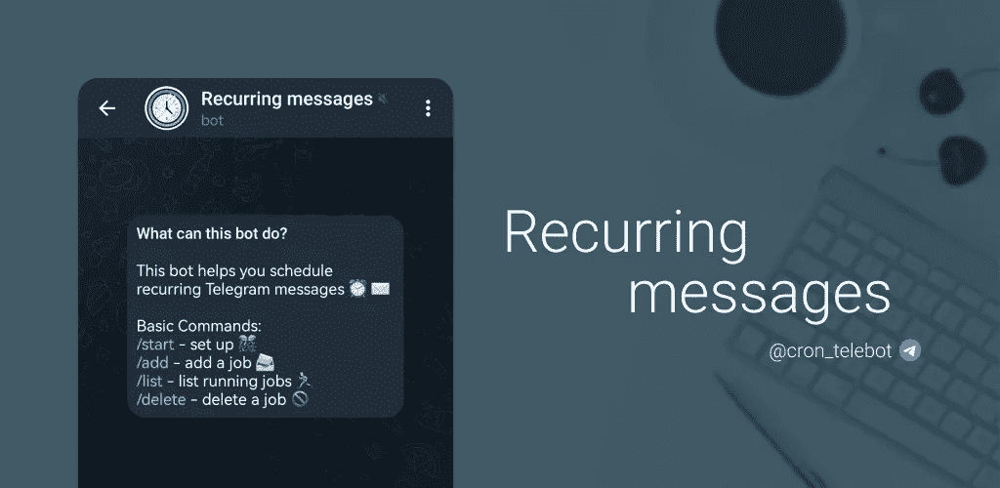
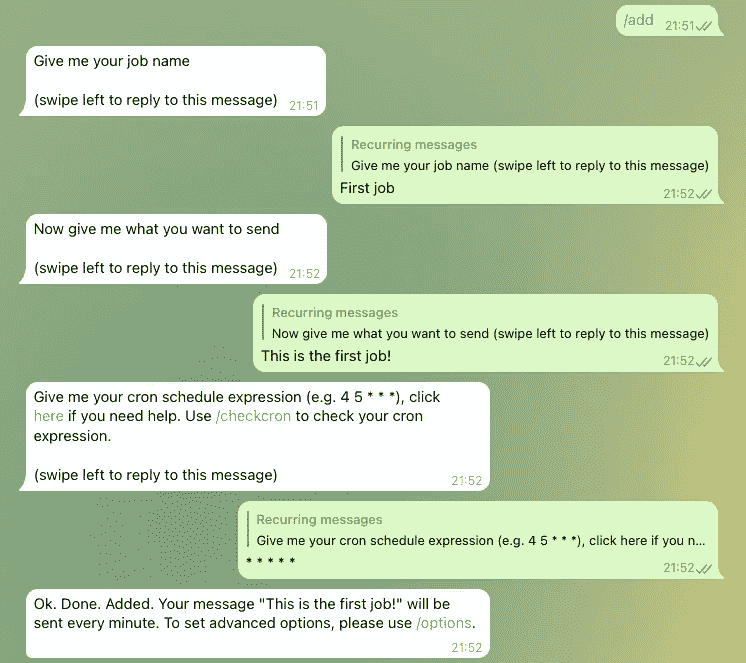
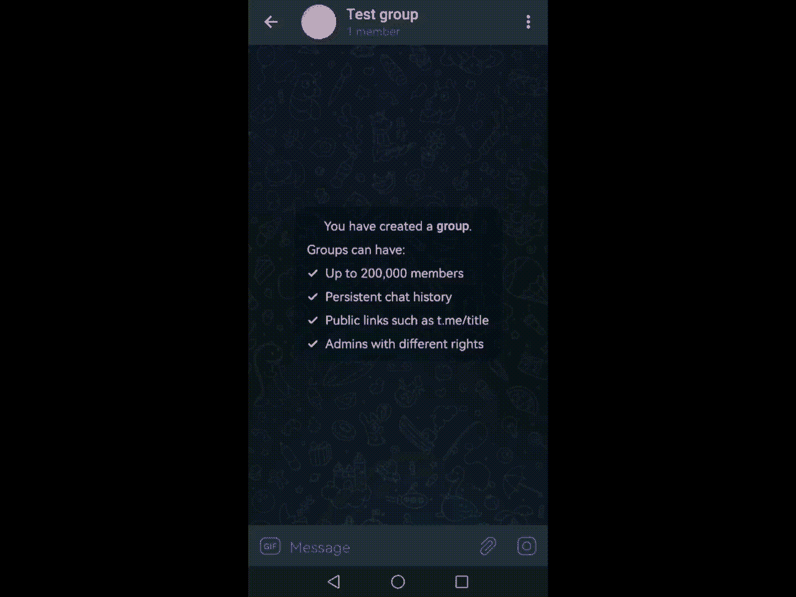
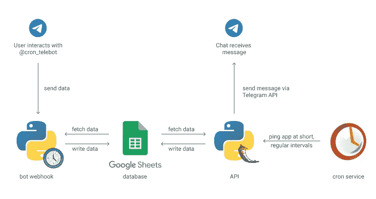

# 我建立了一个电报机器人来安排电报上重复出现的信息

> 原文：<https://betterprogramming.pub/i-built-a-telegram-bot-to-schedule-recurring-messages-on-telegram-f2559195ccd4>

## 这里有一个简单的指南，让你可以很容易地安排你的信息

*循环消息* ( [@cron_telebot](https://t.me/cron_telebot) )

在我以前的文章中，[如何在电报上安排重复出现的信息(没有代码！)](https://huishun.medium.com/how-to-schedule-recurring-messages-on-telegram-no-code-72d22dbaf2e4)，我分享了我们如何使用 [Cron](https://play.google.com/store/apps/details?id=com.huishun.cronjobs) 在 Telegram 上安排重复出现的消息。

虽然这很酷，但我想通过自动化所有我可以自动化的过程并将整个过程保留在应用程序中，让用户的过程更简单。用户现在可以在 Telegram 应用程序中安排重复出现的信息。不再有第三方应用！

recurring messages([@ cron _ tele bot](https://t.me/cron_telebot))是我专门为了在 Telegram 上安排循环消息而打造的电报机器人。

以下是如何使用 bot 创建重复出现的邮件:

添加新作业

您可以添加/删除/查看多个重复作业的详细信息，并为它们设置高级选项。您也可以通过在此打开问题[来请求新功能或报告错误。](https://github.com/hsdevelops/rm-bot/issues)

# 如何将机器人添加到您的群组

重复信息可以设置为个人使用——在这里与机器人[开始对话——和群组使用。这是您将定期邮件添加到您的群的方式:](https://t.me/cron_telebot)

如何将电报机器人添加到群组

要将机器人添加到群组，您必须使用 Telegram 移动应用程序或 Telegram 桌面；Telegram web 不支持此功能。

文章的其余部分将是关于这个机器人是如何设计的，所以如果你对技术细节不感兴趣，可以跳过它。尽管如此，请务必在此链接查看机器人[！](https://t.me/cron_telebot)

# 机器人是如何工作的

在我寻求为最终用户简化流程的过程中，随着更多组件的参与，机器人设计变得更加复杂。

Bot 设计

当用户与机器人交互时，机器人 webhook 会拾取消息，整理出有用的信息，并将相关数据写入数据库。每分钟都会有一个 app 在数据库里翻找需要发送的消息，发送到各自的聊天里。

我知道 Google Sheets 不是作为数据库工作的，不能适当地伸缩，特别是因为它不允许数据查询，所以每次我需要通过某个键获得特定的文档/行时，我必须读取整个表(lol)。然而，作为概念验证，它是免费且易于实现的，所以我在这个项目中使用了它。在达到 1000 个用户的情况下，我可能会考虑将数据库更改为更具可伸缩性的数据库。

这个项目是开源的，所以请随意投稿！点击了解更多关于如何做出贡献的信息[。](https://github.com/hsdevelops/rm-bot/blob/main/CONTRIBUTING.md)

*感谢阅读。我感谢你的时间和支持。*