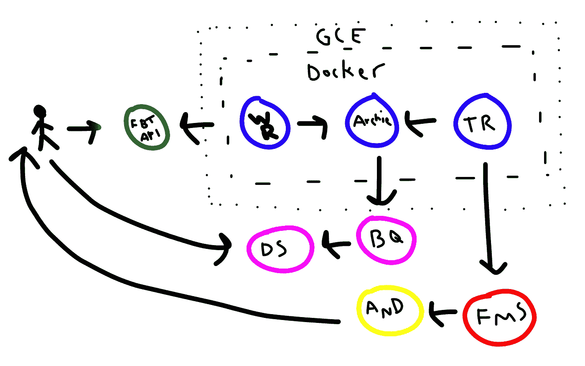
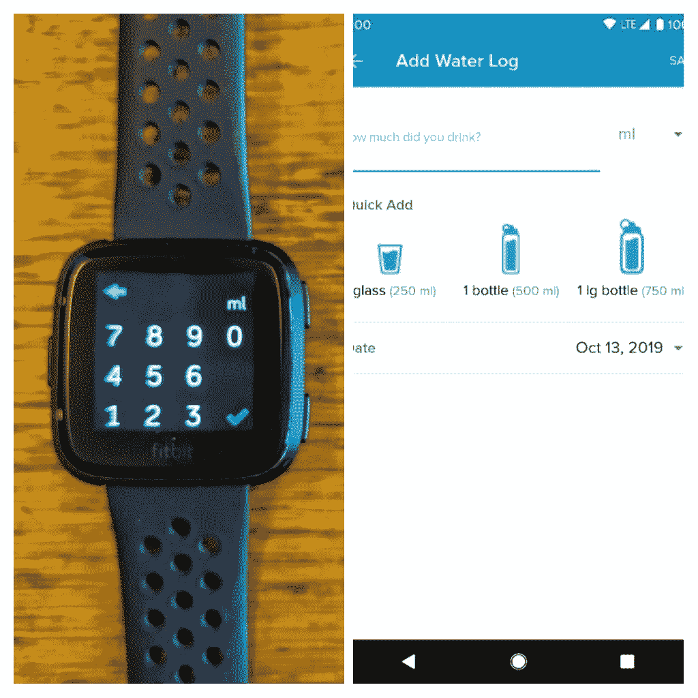
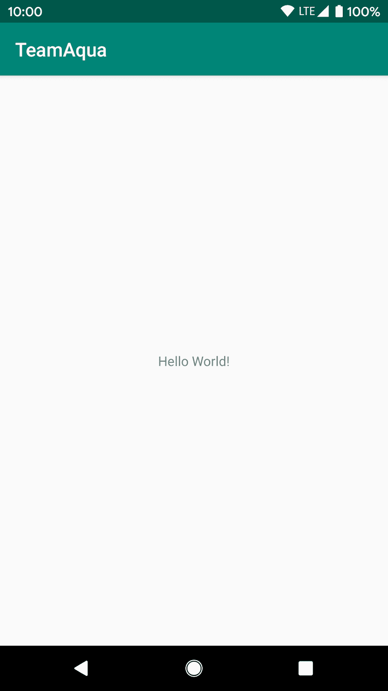
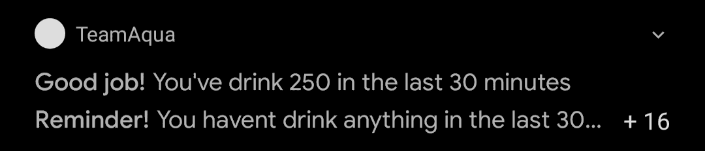
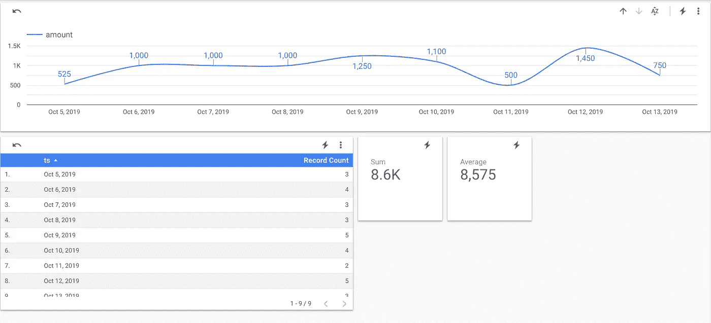
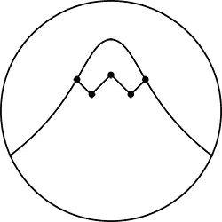

# 我建立了一个过于复杂的数据驱动系统来提醒我喝水

> 原文：<https://betterprogramming.pub/i-built-an-over-complicated-data-driven-system-to-remind-me-to-drink-water-59dc4c24044a>

## Data，Golang，Python，Android，Docker，gRPC，Firebase，Cloud，BigQuery，oh my！


Jana Sabeth 在 [Unsplash](https://unsplash.com/s/photos/glass-of-water?utm_source=unsplash&utm_medium=referral&utm_content=creditCopyText) 上的照片

水。阿瓜。H2O。长生不老药。其他星球羡慕的对象。

然而，这种神圣的液体对我们人类来说是必不可少的，我们，我的意思是我，通常会忘记饮用它。在写这篇文章的时候，我正在亚洲背包旅行。在我的新生活的兴奋、享受和冒险中，我几乎没有想到喝水。当它发生时，我通常会忽略它，告诉自己，“不，我会没事的。只是水而已。反正我也不渴。”但是，夜晚来了，在又一个成功的一天接近尾声的时候，头痛和疲劳来了，提醒我应该重新装满我的瓶子。显然，我必须找到一个解决办法。

当然，作为数据从业者，解决方案必须涉及数据。但是我想要的不止这些——我想要一些*夸张的东西。我的问题本可以通过设置一个定时器或者下载一个与喝水相关的应用程序来轻松解决。但是没有——再说一次，我想要更多的*。突然之间，问题变得更像是我能在多大程度上实现我的解决方案，而不仅仅是提醒我稍微刷新一下我的生活。但是我做这个的一个更现实的原因是因为我真的很怀念和这样一个系统一起工作。当我被雇佣时，我每天都要处理数据、Golang、云和生产系统。现在我不想了。所以，我想建立一个系统，在那里我可以使用所有这些工具(我也不想变得生疏，因为我知道一旦我决定告别我的户外冒险并把它们换成办公椅，我就必须给招聘人员留下深刻印象)。**

**

*水(但不可饮用)。我拍的([https://www.instagram.com/juandesr](https://www.instagram.com/juandesr))*

*我的过于复杂的平台，我以著名的口袋妖怪邪恶团队命名为 Team Aqua，该团队希望扩展海洋，摧毁所有人类文明，并将世界恢复到原始状态(口袋妖怪可以非常非常暴力)，使用以下平台/服务/组件:*

*   *Fitbit 设备*
*   *Fitbit 的 API*
*   *一个 Python 服务*
*   *两个 Golang 服务*
*   *gRPC(以及 Protobufs)*
*   *Firebase(信息服务)*
*   *一款安卓应用*
*   *码头工人*
*   *谷歌云的容器注册表*
*   *谷歌云的计算引擎*
*   *BigQuery*
*   *谷歌的数据工作室*

*在这篇文章中，我将描述我是如何构建这个系统的，它是如何工作的，当然还有它背后的源代码。然而，出于简单的原因，为了让这篇文章尽可能简短和集中，我不会解释该平台的每个角落——例如，Gradle 是什么，为什么在 Android 上使用它。尽管如此，在文章的最后，你会发现一个系统回购的链接。*

*现在来解释一下。*

**

*更多的水。由我挑选。*

# *概观*

*在我开始解释每个组件之前，我想给你一个简短的回顾，展示系统的架构，所有的移动部件，以及它们的作用。这个可爱的故事发生在我的 Fitbit 手表(或应用程序)上。在这里，我将进入每个水会话(姑且称之为水会话)，在这个过程中生成平台需要的数据(这就是为什么我称之为数据驱动的解决方案)。在记录水会话之后，这些数据将被发送到 Fitbit 并存储在那里。*

*为了检索这些数据，我有一个 Python 服务(称为 Water Retriever ),它每隔 X 分钟与 Fitbit 的 API 对话，并获取我今天记录的所有水会话。然后，Python 客户端将通过 gRPC 与后端(用 Golang 编写)进行通信，我将后端命名为 Archie，以团队 Aqua 的领导者命名。Archie 的作用是将水会话保存在内存中，并将它们写入 BigQuery。*

*除了阿奇，还有第二个 Golang 组件，称为提醒。这个小家伙每隔 X 分钟就会问阿奇，我在这段时间里喝了多少水。如果我在这段时间没有喝一滴水，它会向我作为平台的一部分编写的 Android 应用程序发送通知，提醒我在过去的 X 分钟内没有喝水。否则，如果我自己补水了，通知会祝贺我，说我喝了 Y ml。在过去的 X 分钟内。推送通知由 Firebase 云消息处理。*

*这三个服务包含在同一个 Docker 映像中，该映像托管在 Google Cloud 的容器注册表中。所述映像在“普通”计算引擎机器上执行(不是 Kubernetes 集群、云运行或任何花哨的东西)。最后，为了分析数据，因为它已经驻留在 BigQuery 中，我只运行几个查询，并使用 Google 的 Data Studio 可视化它们。*

*下图是完整架构的图表。*

**

*我应该买个绘图板*

*首先，我在 Fitbit 中记录水资源数据，并将其发送到他们的服务器。然后，水检索器(WR)收集这些数据并将其发送给阿奇，阿奇保存这些数据并在 BigQuery 中写入一份副本。在它的旁边，有一个提示，谁从 Archie 那里得到数据并发送一个通知，最终由我阅读。*

*在 Archie 下面的路线里，有 BigQuery，他给 Data Studio 提供数据让我分析。*

*现在，事不宜迟，让我们看看具体情况。*

# *Fitbit 设备*

*系统的入口点和产生数据的地方就是我的 Fitbit。在这里，每次我喝水，我都会输入它的量。我如何真正知道准确的数量？我不知道。除非我从一个写有容量的瓶子里喝水，否则我通常只是估计一下。*

**

*我的 Fitbit(有点脏)，还有 Fitbit 的 app。*

# *Python 服务(水检索器)*

*我要介绍的第一个服务是 **Water Retriever** ，这是一个 Python 程序，它每 X 分钟查询 Fitbit 的 API，以检索我当天消耗了多少水。为了开发它，我使用了现象库 [**python-fitbit**](https://python-fitbit.readthedocs.io/en/latest/) 来与 API 接口。这是代码:*

```
*import grpc
import fitbit
import os
import sys
import time
import logging
import app.api.v1.endpoint_pb2 as endpoint_pb2
import app.api.v1.endpoint_pb2_grpc as endpoint_pb2_grpc

from google.protobuf.timestamp_pb2 import Timestamp

waiting_time = 60 * 30

def run():
    starttime = time.time()
    # keep track of the last water consumption id
    last_log_id = 0

    client = fitbit.Fitbit(os.environ['FITBIT_KEY'], os.environ['FITBIT_SECRET'],
                           access_token=os.environ['ACCESS_TOKEN'],
                           refresh_token=os.environ['REFRESH_TOKEN'],
                           system='en_DE')

    with grpc.insecure_channel('localhost:50051') as channel:
        while True:
            print('iterating...')
            # result looks like this: {'summary': {'water': 500}, 'water': [{'amount': 500, 'logId': 6630477481}]}
            result = client.foods_log_water(date='today').get('water', None)

            print(result)
            # if no water has been consumed...
            if result is None or len(result) == 0 or result[-1]['logId'] == last_log_id:
                time.sleep(waiting_time -
                           ((time.time() - starttime) % waiting_time))
                continue

            stub = endpoint_pb2_grpc.DrinkWaterStub(channel)
            try:
                timestamp = Timestamp()
                timestamp.GetCurrentTime()
                response = stub.LogSplash(endpoint_pb2.Splash(
                    amount=result[-1]['amount'],
                    ts=timestamp
                ))
                print("Splash logged. Response: {}".format(response))
            except Exception as e:
                print(e)

            time.sleep(waiting_time -
                       ((time.time() - starttime) % waiting_time))
            print('end')
            last_log_id = result[-1]['logId']

if __name__ == '__main__':
    logging.basicConfig()
    run()*
```

*我的程序的主要功能在于一个只有 40 行的函数。*

*开始时，我们用当前时间初始化一个变量，用最后一个“`logId`”(名为`last_log_id`)或 Fitbit 的用水会话 ID 初始化另一个变量。*

*然后，我们创建 Fitbit 客户端，它需要 Fitbit 密钥、秘密、访问令牌和刷新令牌。要获得这些，您必须创建一个 [Fitbit 开发帐户](https://dev.fitbit.com/getting-started/)并注册一个应用程序。在创建客户机时，您还可以指定语言(一些 API 响应包括可能适合显示的文本)，以及地区(或国家；不过，这个列表非常有限)。该参数的作用是包括在各种 API 响应中的一些文本字段的语言，以及单位系统。在我的例子中，我使用了“`en_DE`”，因为我希望字段是英文的，并且我的单位是公制。*

*一旦创建了客户机，接下来的步骤是连接到 gRPC 后端服务(我将在下一节中描述)。然后陷入无限循环。在每次迭代中，系统调用“Get Water Logs”端点来检索给定一天(今天)的水条目的摘要和列表。典型的响应如下所示:*

*`{‘summary’: {‘water’: 500}, ‘water’: [{‘amount’: 500, ‘logId’: 1234567890}]}`*

*首先，我检查是否有任何日志，或者来自响应的最新日志是否与系统在过去的迭代中接收到的日志相同(日志 id 保存在`last_log_id`)。如果这些条件中的任何一个为真，我们什么都不做，系统将休眠 30 分钟。另一方面，如果“if”为假，我们创建一个我定义为 Splash 对象的东西的实例(相信我，我很快就会解释它)——一个由两个字段组成的类:amount 和 timestamp。*

*在这种情况下，我们将在最新的日志和当前时间戳中存储耗水量(以毫升为单位)。然后，我们将调用 gRPC 方法`LogSplash`，使用刚刚创建的`Splash`对象作为参数，将此时消耗的水发送到后端。一旦完成，我们将用刚刚发布的`logId`更新`last_log_id`，然后休眠 30 分钟。*

*你可能已经注意到这里有一个严重的缺陷。如果我在 30 分钟内记录了一个以上的水会话会怎样？在这种情况下，不幸的是，除了最后一个会话之外，我们将错过所有会话，因为系统只查看最近的一个会话。这是我将在下一次迭代中解决的问题。然而，说实话，我很确定在这段时间内我不会喝超过一次！*

*水之寻回犬到此为止。现在，让我们看看一旦后端接收到 Splash 会发生什么。*

# *Archie 和 gRPC API*

*Archie 是用 Go 编写的系统后端服务之一，负责跟踪(内存中)水的会话，此后被称为*水花*。但是在我到达那里之前，我想描述一下我的项目的 API 服务，它是基于 gRPC 的。*

*为了提醒您，我将快速说明 gRPC 是一个 RPC(远程过程调用)框架。简单地说，它是一个从一个系统到另一个系统执行过程(在这种情况下是函数)的通信协议。我真正喜欢 gRPC 的地方是，它是使用协议缓冲区(也称为 Protobuf)定义的，这是一种" [*语言中立、平台中立、可扩展的机制，用于序列化结构化数据*](https://developers.google.com/protocol-buffers) *。*“我这里的意思是，一旦在 Protobuf 中定义了服务和对象，就可以使用众多代码生成器中的一个将其转换成它所支持的众多语言中的一种。*

*整个事情有点难以理解，但是希望代码能够澄清一些事情:*

```
*syntax = "proto3";

package api;

import "google/protobuf/timestamp.proto";

service DrinkWater {
  rpc LogSplash(Splash) returns (LogSplashResponse);
  rpc WaterConsumed(Since) returns (WaterConsumedSince);
}

message LogSplashResponse {
	bool ok = 1;
	string error = 2;
}

message Splash {
	google.protobuf.Timestamp ts = 1;
	int32 amount = 2;
}

message Since {
	google.protobuf.Timestamp ts = 1;
}

message WaterConsumedSince {
	int32 amount = 1;
}*
```

*这是项目的 Protobuf 文件。在前三行中，我只是设置语法、包名，并导入一个我喜欢使用的外部时间相关库。然后，我定义 gRPC 服务，命名为`DrinkWater`。如您所见，该服务由两个方法组成:`LogSplash`和`WaterConsumed`。前者`LogSplash`，我们之前看到的，以一个`Splash`为参数，返回一个`LogSplashResponse`，后者`WaterConsumed`，以一个自对象为参数，返回一个`WaterConsumedSince`(稍后我会详细介绍)。但是这些水和水花是什么？*

*仪式结束后，你会找到这些信息的定义。其中第一个，Splash，包含两个字段:一个时间戳对象(我导入的那个东西)和一个整数(水以 ml 为单位。).然后是`LogSplashResponse`，它由一个布尔值和一个解释错误的字符串(如果有的话)组成，如果在`LogSplash`期间发生错误，这个布尔值将为假。接下来是`Since`消息，它封装了一个时间戳。最后，是由单个整数组成的`WaterConsumedSince`。*

*虽然这五个结构定义了我的完整服务，但它们并不是我可以使用的实际源代码。所以，我的下一步是生成 Golang 和 Python 代码。*

*在我的实验和我的观点中，生成 Go 代码比 Python 简单得多。只需一个命令`$ go generate protoc -I=. — go_out=plugins=grpc:. endpoint.proto`(从 Proto 文件所在的目录执行)就可以生成代码。尽管如此，我使用 Python 的体验并不是最好的，因为一些[问题](https://github.com/protocolbuffers/protobuf/issues/1491)与生成代码所在的路径有关。对于那些对我如何创建 Python 代码感兴趣的人，这是我运行的命令(从水检索器的根目录)*

```
*$ python3 -m grpc_tools.protoc -I.:${PROJ}api/v1/ \
— python_out=app/api/v1/ \ 
— grpc_python_out=app/api/v1/ ${PROJ}api/v1/endpoint.proto*
```

*但是故事并没有就此结束。如果您照原样运行 Water Retriever，它不会找到生成的代码。所以，我不得不进入众多`__init__.py`文件中的一个，并将当前目录附加到`PYTHONPATH`(我讨厌这一部分)。*

*好吧！现在我们有了生成的代码。但是我不会在这里展示，不会——那太无聊了！*

*相反，我将展示*实际上在做什么*。您可能已经注意到，Protobuf 定义就是这样，*定义—* 或函数的框架。在里面，没有任何功能。功能必须由你来描述。以下代码片段说明了这一点:*

```
*package endpoint

import (
	"context"
	"log"

	"cloud.google.com/go/bigquery"
	"github.com/golang/protobuf/ptypes"
	pb "github.com/juandes/teamaqua/api/v1"
)

// Service implement the gRPC endpoints
type Service struct {
	splashes []*pb.Splash
	uploader *bigquery.Uploader
}

// NewService creates a new Service
func NewService(u *bigquery.Uploader) *Service {
	return &Service{
		splashes: []*pb.Splash{},
		uploader: u,
	}
}

func (s *Service) LogSplash(ctx context.Context, in *pb.Splash) (*pb.LogSplashResponse, error) {
	log.Println(in)

	s.splashes = append(s.splashes, in)
	err := s.uploader.Put(ctx, in)
	if err != nil {
		// TODO: Handle error better and don't just exit :/
		log.Fatalf("Error uploading to BQ: %v", err)
	}

	return &pb.LogSplashResponse{
		Ok: true,
	}, nil
}

func (s *Service) WaterConsumed(ctx context.Context, in *pb.Since) (*pb.WaterConsumedSince, error) {
	var waterConsumed int32
	since, err := ptypes.Timestamp(in.Ts)
	if err != nil {
		log.Fatalf("Error converting ptypes.Timestamp to time: %v", err)
	}

	for _, splash := range s.splashes {
		splashTime, err := ptypes.Timestamp(splash.Ts)
		if err != nil {
			log.Fatalf("Error converting ptypes.Timestamp to time: %v", err)
		}

		if splashTime.After(since) {
			waterConsumed += splash.Amount
		}
	}

	return &pb.WaterConsumedSince{
		Amount: waterConsumed,
	}, nil
}*
```

*这段代码是我的服务结构，它实现了我们之前定义的 gRPC 方法。但是，除了实现函数，我的服务结构还负责保存`Splash`的列表。此外，这个结构还包含了`BigQuery`上传器，这个对象的功能是在`BigQuery`中写入行。为了简单起见，我不会展示服务的主要功能，在这里我初始化服务和上传者。如果你想看，在这里检查文件[。](https://github.com/juandes/team-aqua/blob/master/cmd/startserver/main.go)*

*第一个函数`NewService`只是创建新的服务对象。然后，还有`LogSplash`，一种服务方式。正如我们之前看到的，`LogSplash`带一个 Splash(和一个上下文我就不解释了)，返回一个`LogSplashResponse`，和一个 error(这是 Golang 特有的东西，可以随意忽略)。*

*该函数的内容非常简单。首先，它打印 Splash，然后将它附加到列表中并写入`BigQuery`。最后，它返回一个`LogSplashResponse`，其中“ok”为真。struct 的第二个方法是`WaterConsumed`，它的作用是对给定时间戳后消耗的所有水量求和。阿奇的末日到了。*

**

*水之队的阿奇。任天堂([来源](https://bulbapedia.bulbagarden.net/wiki/File:Omega_Ruby_Alpha_Sapphire_Archie.png))*

# *提醒*

*第二个 Golang 服务是提醒，它的目的是提醒我喝水，或者在我喝水时祝贺我。这些提醒和祝贺将作为推送通知发送到我为这个唯一的项目编写的 Android 应用程序。下面的代码是完整的服务。与 Archie 不同，这个完全是在 main 函数中编写的(对此我并不感到自豪)。*

```
*package main

import (
	"context"
	"fmt"
	"log"
	"net/http"
	"os"
	"time"

	"firebase.google.com/go/messaging"

	firebase "firebase.google.com/go"
	"github.com/golang/protobuf/ptypes"
	pb "github.com/juandes/teamaqua/api/v1"
	"github.com/spf13/pflag"
	"google.golang.org/api/option"
	"google.golang.org/grpc"
)

const (
	address         = "localhost:50051"
	minutesInterval = 30
)

var (
	token             *string = pflag.String("token", "", "Firebase Token")
	projectID         *string = pflag.String("project-id", "", "Firebase Project ID")
	googleCredentials *string = pflag.String("google-credentials", "", "Google Service Account")
)

func init() {
	pflag.Parse()
}

func main() {
	log.Println("Starting Reminder service...")
	conn, err := grpc.Dial(address, grpc.WithInsecure())
	if err != nil {
		log.Fatalf("did not connect: %v", err)
	}

	ctx := context.Background()
	c := pb.NewDrinkWaterClient(conn)
	opt := option.WithCredentialsFile(*googleCredentials)

	fb, err := firebase.NewApp(ctx, &firebase.Config{
		ProjectID: *projectID,
	}, opt)

	if err != nil {
		log.Panicf("error initializing app: %v", err)
	}

	fbMessaging, err := fb.Messaging(ctx)
	if err != nil {
		log.Panicf("error initializing Firebase Messaging client app: %v", err)
	}

	response, err := fbMessaging.Send(ctx, &messaging.Message{
		Token: *token,
		Notification: &messaging.Notification{
			Title: "Hello!",
			Body:  "Reminder service running ...",
		},
		Data: map[string]string{},
	})

	if err != nil {
		log.Printf("Error sending Firebase notification: %v", err)
	}
	log.Println(response)

	go func() {
		interval := time.NewTicker(minutesInterval * time.Minute)

		for {
			select {
			case <-interval.C:
				var title string
				var body string

				log.Println("Executing...")
				// current time minus minutes interval
				t := time.Now().Add(time.Duration(-minutesInterval) * time.Minute)

				timestampProto, err := ptypes.TimestampProto(t)
				if err != nil {
					log.Fatalf("Error converting time to proto Timestamp: %v", err)
					continue
				}

				waterConsumed, err := c.WaterConsumed(ctx, &pb.Since{
					Ts: timestampProto,
				})
				if err != nil {
					log.Printf("Error calling WaterConsumed: %v", err)
					continue
				}

				if waterConsumed.Amount == 0 {
					title = "Reminder!"
					body = fmt.Sprintf("You havent drink anything in the last %d minutes", minutesInterval)
				} else {
					title = "Good job!"
					body = fmt.Sprintf("You had drunk %d in the last %d minutes", waterConsumed.Amount, minutesInterval)
				}

				response, err := fbMessaging.Send(ctx, &messaging.Message{
					Token: *token,
					Notification: &messaging.Notification{
						Title: title,
						Body:  body,
					},
					Data: map[string]string{},
				})

				if err != nil {
					log.Printf("Error sending Firebase notification: %v", err)
				}
				log.Println(response)

			}

		}

	}()

	http.HandleFunc("/", handler)

	port := os.Getenv("PORT")
	if port == "" {
		port = "8080"
	}

	log.Fatal(http.ListenAndServe(fmt.Sprintf(":%s", port), nil))
}

func handler(w http.ResponseWriter, r *http.Request) {
	fmt.Fprintf(w, "Hi!")
}*
```

*该服务要做的第一件事是创建一个到 gRPC 后端的连接。接下来，它创建一个 Firebase 消息服务(FMS)客户端。我将向我的应用程序发送推送通知，这样我就知道什么时候一切正常。*

*另一个注意:要向特定设备发布消息，你需要知道手机的 Firebase 令牌，可以直接从应用程序获得[(我稍后会展示更多)。一旦完成，我们将产生一个新的`Goroutine`(把它想象成一个后台线程)，它有一个无限的“for”循环，每 X 分钟触发一次。](https://firebase.google.com/docs/cloud-messaging/android/client#retrieve-the-current-registration-token)*

*在每次循环迭代中，我们将计算当前时间减去 X 分钟。然后，使用这个新时间，系统将调用`WaterConsumed` gRPC 方法来获取从那时起我记录的水量——该调用返回一个 since 对象。如果从时间 t 开始，水的消耗量等于零，它会给我发送一个通知，告诉我“你什么都没喝。”否则，信息会说，“你在过去的 X 分钟内喝了 XXX 毫升水。”除此之外，该服务还监听给定的端口。目前，这不做任何事情(除了返回“嗨！”)，但我计划让它执行健康检查。*

# *安卓应用*

*这个平台的最后一个重要组件是一个 Android 应用程序，它的唯一目的是接收来自 FMS 的消息并将它们转发给我。老实说，就这些。在下一个截图中，你会看到这个应用程序只是一个空屏幕，上面有一个“Hello World”*

**

*应用程序。*

**

*通知。抱歉，我的英语不好。我还没有部署新的更改:)。*

*至于代码，就像 app 看起来那么简单。它只包含一个活动(screen)，其目的是打印设备的 Firebase 令牌，这是指定通知的目标所需要的。在这样做之前，我们需要首先在应用程序上安装 Firebase SDK(这是另一个故事，我不会涉及)。*

*这是活动的代码。*

```
*package com.example.teamaqua

import androidx.appcompat.app.AppCompatActivity
import android.os.Bundle
import android.util.Log
import android.widget.Toast
import com.google.android.gms.tasks.OnCompleteListener
import com.google.firebase.iid.FirebaseInstanceId

class MainActivity : AppCompatActivity() {

    override fun onCreate(savedInstanceState: Bundle?) {
        super.onCreate(savedInstanceState)
        setContentView(R.layout.activity_main)

        FirebaseInstanceId.getInstance().instanceId
            .addOnCompleteListener(OnCompleteListener { task ->
                if (!task.isSuccessful) {
                    Log.w("MyFirebaseMsgService", "getInstanceId failed", task.exception)
                    return@OnCompleteListener
                }

                // Get new Instance ID token
                val token = task.result?.token

                Log.d("This is token!", token)
                Toast.makeText(baseContext, token, Toast.LENGTH_SHORT).show()
            })
    }
}*
```

# *BigQuery 和数据工作室*

*阿奇的*存在理由之一*是将生成的数据写入`BigQuery`，这样我可以稍后回去分析它。现在，你可能会想，为什么？如果数据已经在 Fitbit 的服务器上，为什么我还要再存储一次？嗯，我想把这个弄得越复杂越好！但真正的原因是因为 Data Studio，这是一个与 BigQuery 无缝集成的交互式仪表板，只需几次点击就可以可视化数据。*

*在 Data Studio 中，我创建了一个仪表板，其中显示了一个显示每天用水量的折线图，一个显示溅水次数的表格，以及两个显示总用水量和日平均用水量的记分卡。下面的截图就是一个例子。*

**

*是的，我还是需要多喝水…*

# *部署和对接*

*我们就要到达终点了。我们还需要做最后一件事:部署和运行系统。*

*正如所料，这并不像我希望的那样直接。我在这里遇到的大多数问题(它们不是实际问题，只是小问题)都是由于系统的微服务和架构设计，因为我想让所有东西都保持在同一个 Docker 映像中。最重要的是，由于我使用了几个秘密和密钥，我不得不考虑它们的管理。我们来看一下整个(短)过程。*

*第一步是创建 Docker 映像。它是基于官方的 [Golang](https://hub.docker.com/_/golang/) one。然后，对于第一个指令，我们将复制整个项目(是的，所有的东西！)到图像。接下来，我们运行一些测试(非常重要！)并在容器中构建 Go 二进制文件——以避免可能的交叉编译问题。之后，我们需要安装 Python 3(现在是 2019 年，人)，一些工具，以及 Water Retriever 需要的库。最后一步，我们将执行启动服务的`run(.)sh`脚本。下面的两个脚本都是 Dockerfile 和`run.sh`*

```
*FROM golang:1.12

WORKDIR /go/src/github.com/juandes/teamaqua
COPY . .

RUN echo $GOPATH
RUN make test
RUN make go-build

RUN apt-get update
RUN DEBIAN_FRONTEND='noninteractive' apt-get install -y --no-install-recommends python3.6  python3-pip python3-setuptools screen

RUN pip3 install -r water_retriever/requirements.txt

CMD [ "./run.sh"]#!/usr/bin/env bash

echo "Starting Server"
screen -d -m build/startserver --gcp-project=$GCP_PROJECT --bq-dataset=$BQ_DATASET --bq-table=$BQ_TABLE

echo "Starting Reminder"
screen -d -m build/reminder --project-id=$GCP_PROJECT --token=$FB_TOKEN --google-credentials=path/to/credentials.json 

screen -list

echo "Starting Water Retriever"
python3 water_retriever/client.py*
```

*`run.sh`脚本将首先使用 [GNU Screen](https://en.wikipedia.org/wiki/GNU_Screen) 在后台执行两个 Go 服务(如果有人知道更好的方法，请告诉我)。然后，在前景中，我们将启动水检索器。请记住组件需要的不同参数(Google Cloud project、Firebase token 等等)——这些参数来自环境变量。此外，Water Retriever 还需要 Fitbit 键，这些键也来自运行 Docker 映像时必须声明的 env 变量。下一行是我正在使用的命令的例子。*

```
*docker run -d -e FITBIT_KEY=ABCDEF \
 -e FITBIT_SECRET=abcdef1234567 \
 -e ACCESS_TOKEN=12345678 \
 -e REFRESH_TOKEN=12345678 \
 -e GOOGLE_APPLICATION_CREDENTIALS=path/to/credentials.json \
 -e GCP_PROJECT=xxx \
 -e BQ_DATASET=xxx \
 -e BQ_TABLE=xxx \
 -e FB_TOKEN=xxx \
 gcr.io/xxx/xxx:tag*
```

*说到运行 Docker，我想提一下，我没有在公共回购中推送图像(抱歉，它包含了太多秘密)，而是在 Google 容器注册表中推送。事后看来，这是一个正确的决定，因为从注册表的 GUI 中，您可以快速生成一个新的计算引擎实例，其中已经加载了映像。默认情况下，机器将执行图像，但是在我的例子中，它崩溃了，因为它缺少凭证、密钥等等。因此，您必须 SSH 并手动运行它。*

*哇，我想就这些吧！*

# *总结和结论*

*最后 3000 字介绍了一个平台，目标是提醒我喝水。同样，我意识到我可以使用我的许多应用程序中的一个来实现这个目的。然而，我想建立自己的，看看我能走多远。项目不会就此结束(好吧，也许会)。我想实施一系列功能，例如我提到的运行状况检查、自定义控制面板、指标和警报。但与此同时，我会享受一杯水(并记录下来)。*

*感谢阅读。*

*该代码可在 https://github.com/juandes/team-aqua 获得*

**

*漫游数据*