# 我用 React、Redux 和 Bootstrap 4 创建了一个松露盒

> 原文：<https://betterprogramming.pub/i-created-a-truffle-box-with-react-redux-and-bootstrap-4-7f382f75483d>

## 如何自动化繁琐的设置任务，以便专注于功能

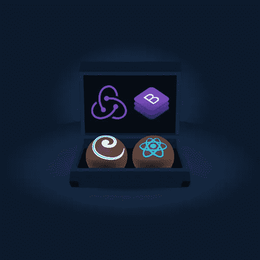

# 什么是松露套房？

[松露](https://www.trufflesuite.com/)是世界上最受欢迎的区块链开发套件。用他们自己的话说:

> 使用以太坊虚拟机(EVM)为区块链提供世界一流的开发环境、测试框架和资产管道，旨在使开发人员的生活更加轻松

如果你不知道如何开始编写全栈以太坊去中心化应用(DApps)，考虑使用 Truffle Suite 的[。](https://medium.com/swlh/develop-test-and-deploy-your-first-ethereum-smart-contract-with-truffle-14e8956d69fc)

# 块菌盒

Truffle Boxes 是样板工程，预先打包了一堆为您安装的依赖项。这省去了从头开始一个空白 Truffle 项目的麻烦，也省去了安装和配置自己的项目的麻烦。

例如，如果你喜欢 Vue.js 并想在你的项目中使用它，你可以打开 [Vue.js Truffle Box](https://www.trufflesuite.com/boxes/drizzle-vue-box) 。

我最喜欢的是[反应盒](https://www.trufflesuite.com/boxes/react)。几乎我开始的每个项目都是从打开这个特殊的盒子开始的。

我的问题是，我几乎总是使用 Redux 和 Bootstrap，它们并没有附带。我安装这些，每次都执行相同的文件夹结构管理。

过了一段时间，这种骗人的把戏变得单调乏味，就像任何称职的开发人员一样，我看到了实现自动化的机会。所以，我创造了一个松露盒！以下是方法。

# 创建盒子

松露有关于如何创建松露盒子的很好的文档。每个盒子本质上都围绕着一个`truffle-box.json`配置文件。这个文件规定了在拆箱时应该运行什么命令，这样它就可以运行了。

因为我习惯于从 React Truffle 盒子开始，所以我认为这是一个很好的起点。代码可以在 GitHub 上获得，所以我分叉了这个项目，并开始执行我每次开始新项目时所做的相同的家务。

## 扩展反应盒

首先我来解释一下 React 框自带的文件夹结构。

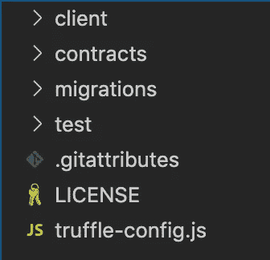

图 1: React box 文件夹结构

从上到下:

*   `client/` —前端代码所在。我们所有编译的契约和 React 组件都放在这里。
*   `contracts**/**` —智能合约的代码住在这里。
*   `migrations/` —将您的智能合同迁移到区块链 live 的部署脚本。
*   `test/` —用于测试您的智能合约的文件位于此处。
*   `.gitattributes` —为 Git 提供一些配置(不要担心这个)。
*   `LICENSE` —盒子许可(还是那句话，不用担心这个)。
*   `truffle-config.js` —项目的配置。像[可靠性](https://solidity.readthedocs.io/en/v0.6.6/)编译器版本和网络细节之类的东西都存在这里。

我从不改变根文件夹的结构，所以这个结构和新的盒子是一致的。在`client/`文件夹里面是我修改的地方。

## 添加依赖关系

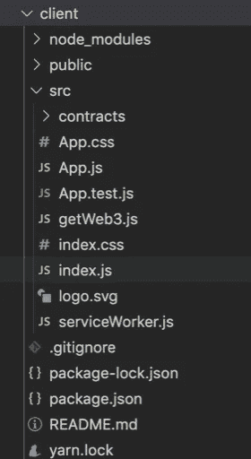

图 2:客户端/文件夹

图 2 显示了合同编译完成后，`client/`文件夹在 React 框中的样子。(我们的`truffle-config.js`文件声明编译后的智能合约将存储在`client/src/contracts/`中。)

这个盒子已经存在的依赖项有`react`、`react-dom`、`react-scripts`和`web3`。它是最基本的，这使得盒子很灵活。

正如我前面提到的，我总是添加 Redux 和 Bootstrap，所以在添加它们和其他一些之后，图 3 显示了`package.json`的样子。

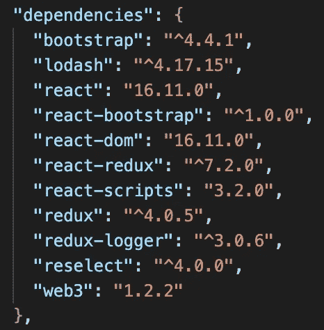

图 3:添加新依赖项后的 package.json 代码片段

新的依赖项有:`bootstrap`和`react-bootstrap`用于前端样式；`redux`、`redux-logger`、`react-redux`用于集成 Redux 以及选择器的`lodash`和`reselect`(稍后将详细介绍)。

## Redux 文件夹

我总是把我的 Redux 代码放在一个文件夹中，使它与组件文件分开。

在对任何 DApp 的 Redux 端进行编码时，我都遵循[IARS 范式来构建 Redux 代码](https://medium.com/blockcentric/how-to-structure-react-redux-applications-53906565a61b)，它由四个文件组成:`interactions.js`、`actions.js`、`reducers.js`和`selectors.js`。

添加这些内容后，文件夹结构如下所示:

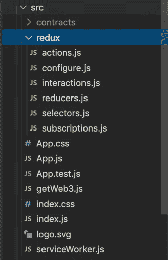

图 4:添加 redux 文件夹

您会注意到有两个文件我还没有提到:`configure.js`包含一些让 Redux 工作的样板配置，以及`subscriptions.js`我们很快会回来。

## 装载区块链

一个好的松露盒子应该包含足够的代码来运行开箱即用的*(原谅这个双关语)。这允许开发人员修改代码并检查 DApp 中的变化。*

例如，React Box 在加载页面时加载区块链，然后从`SimpleStorage`合同中检索数据，并显示在页面上。

这个工作流的问题是，除非[元掩码](https://chrome.google.com/webstore/detail/metamask/nkbihfbeogaeaoehlefnkodbefgpgknn?hl=en)为 DApp 做好准备(用户登录到正确的网络)，否则它将导致一个错误，这可能会吓到新开发人员。

相反，我希望 DApp 在页面上单击“连接”按钮时加载区块链数据。这个按钮将调用一个*交互*来加载 [web3](https://web3js.readthedocs.io/en/v1.2.6/) 和区块链数据。

然后它会发送一个*动作*，该动作被一个*缩减器*捕获，该缩减器将数据保存在 Redux 存储中。然后，组件可以使用*选择器*从存储中检索数据。

`getWeb3.js`文件包含一个监听器，它在检索 web3 之前一直等到窗口被加载。我删除了它，这样它可以被交互调用，而不是被窗口事件调用。

接下来，我删除了`App.js`组件文件中的所有内容，并开始重写我自己的文件。我所需要的只是一个按钮和一些标签，以便在加载后显示 web3 和区块链的信息。

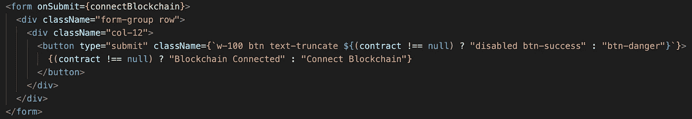

图 5:按钮代码。

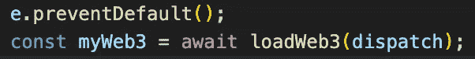

图 connectBlockchain()函数的内容。

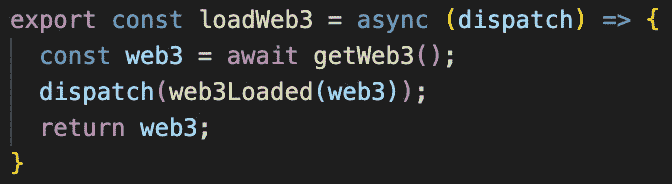

图 interactions.js 中的 loadWeb3()函数。

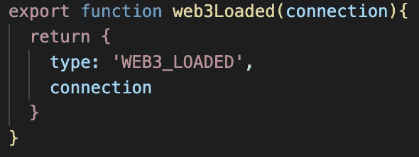

图 8: web3Loaded()动作。

图 5、6、7 和 8 显示了单击 connect 按钮时执行的代码序列。根据图 8 中的操作，reducer 将 web3 实例存储在 Redux 存储中，如图 9 所示。

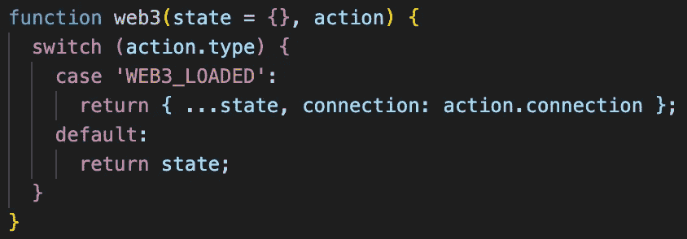

图 9: Web3 缩减器

## 装载合同

因为我想尽可能多地利用 React Box 提供的现有代码，所以我保留了`SimpleStorage`智能契约。

DApp 需要像加载区块链一样加载已部署的智能合约，以显示其中的数据。在`connectBlockchain()`函数中，我添加了以下几行:

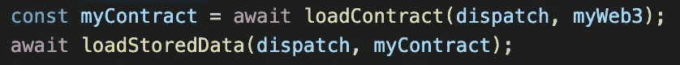

图 10:加载智能合同数据

然后我添加了后续的*交互*、*动作、*和*减速器*。加载 MetaMask 用来与 DApp 交互的当前帐户也是如此。

## 使用选择器

只要一切都连接正确，组件将使用选择器从 Redux 存储中检索数据并显示在页面上。

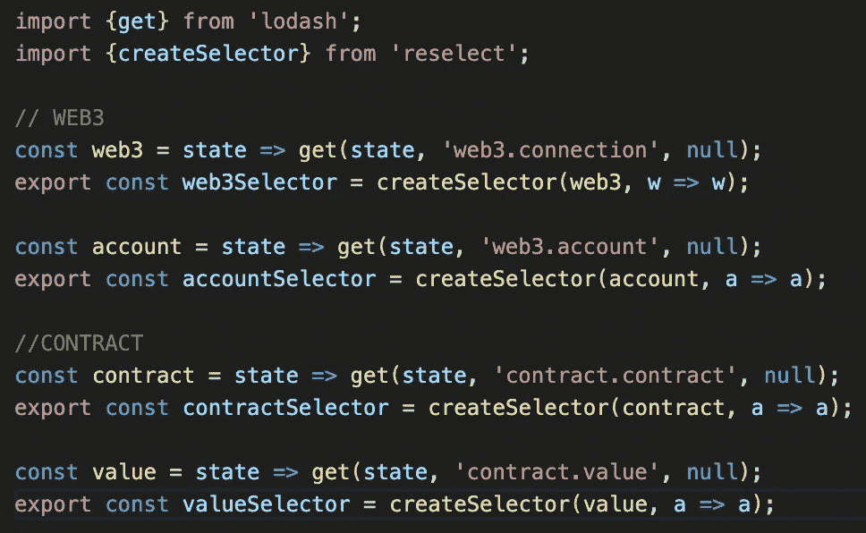

图 11:选择器. js

`Selectors.js`是使用`lodash`和`reselect`依赖项的地方。

## 订阅帐户更改

在结束之前，我还想在盒子里放最后一件东西。MetaMask 不再支持在帐户改变时重新加载帐户，这意味着 DApps 必须在用户改变时侦听它。

默认情况下，这从来没有真正实现过，并且可能需要很长时间来挖掘文档(尤其是对于新开发人员)以找到解决方法。

我前面提到的`subscriptions.js`文件是事件监听所在的位置。

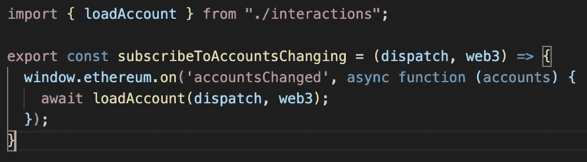

图 12: subscriptions.js

通过添加这个小功能，Redux 商店的数据将在用户更改其活动帐户时重新加载。

# 最终块菌盒

添加了这些特性后，这就是页面在初始拆箱、运行迁移和启动客户端时的样子。

图 13:前端

在图 13 所示的视频中，当单击按钮时，DApp 连接到区块链，并从合同中加载帐户信息和值。

当 MetaMask 中的帐户发生变化时，屏幕上显示的帐户会通过`subscribers.js`文件和 IARS 模式中的订阅进行更新。最后几秒钟显示存储在 Redux 存储中的数据。

我认为这个盒子在配置帮助开发人员使用 React、Redux 和 Bootstrap 4 快速编码新功能所需的脚手架方面做得很好。

如果您想亲自尝试，请遵循下面的安装说明。

## 安装说明

首先(假设您已经安装了 Truffle)，确保您在一个新的空目录中，然后运行`unbox`命令:

```
truffle unbox alexroan/react-redux-bootstrap-box
```

设置您的`truffle-config.js`文件以连接到您的本地开发网络，然后运行以下命令:

```
truffle migrate
```

要启动前端应用程序，请将`cd`放入`client/`文件夹，并开始使用以下命令:

```
cd client/
npm run start
```

# 被卖方收回的汽车

GitHub 上的[提供了完整的 repo，其中包含启动和运行的详细说明。](https://github.com/alexroan/react-redux-bootstrap-box)

如果您有任何改进或建议，请在 GitHub 上提交问题或请求。

感谢阅读！

# 进一步阅读

如果你对区块链开发感兴趣，我会写一些关于入门和建立投资组合的教程、演练、提示和技巧。查看以下资源:

[](https://medium.com/blockcentric/blockchain-development-resources-b44b752f3248) [## 区块链开发资源马上跟进

### 学习区块链、以太坊和 DApp 开发的资源列表

medium.com](https://medium.com/blockcentric/blockchain-development-resources-b44b752f3248)