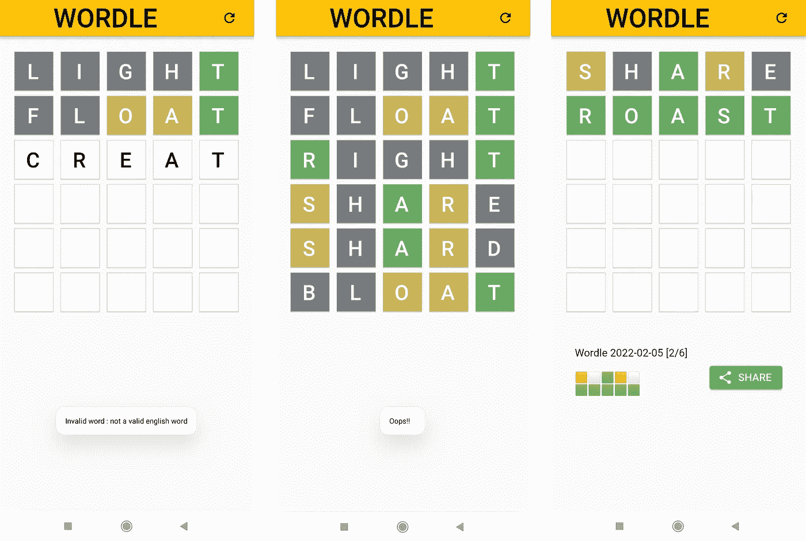
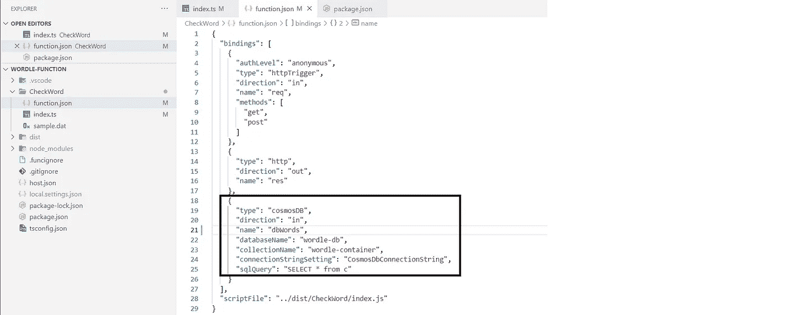
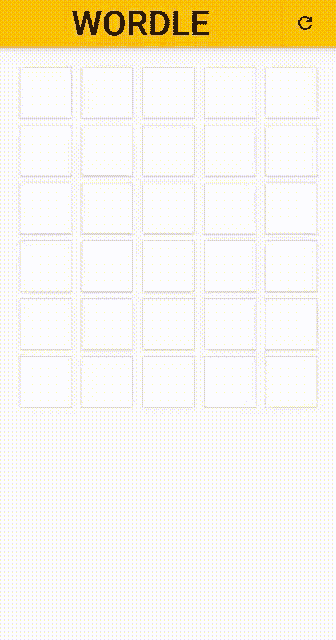

# 我用 Azure 函数、Azure Cosmos DB 和 Flutter 创建了自己的 Wordle

> 原文：<https://betterprogramming.pub/i-created-my-own-wordle-heres-how-289c361421e3>

## 通过解谜来提高你的编码技能

我的世界

这个词已经存在了一段时间，但我是上周才听说的。我是在我们朋友的 WhatsApp 群里看到的。然后我们开始分享我们每天午夜过后一个小时的分数。太棒了。

虽然这是一个非常有趣的游戏，但它似乎也是一个非常容易实现的软件。那么为什么不试一试呢？是的，就这样我决定创造我自己的世界。以下是方法。

# 有什么不同？

*   而当页面被加载时，Wordle 会带来整个单词列表(是的！)，我已经创建了一个 API 来验证单词。该 API 根据每日单词(存储在数据库中)获取并验证一个单词。
*   Wordle 有一个合法单词的列表，它只允许你从列表中输入一个单词。相反，我查询一个[免费字典 API](https://dictionaryapi.dev/) 并验证输入的单词是否是合法的英语单词。
*   虽然 Wordle 是一个网站，但我创建了一个 flutter 应用程序。我只在 android 上测试过，但是我没有理由相信它不能在 iOS 上运行:)。

# 数据库

我一直在寻找一个便宜的数据库解决方案，因为它只需要存储一对日期(yyyyMMdd)和单词的键值。我为它选择了 Azure Cosmos DB。我创建了一个 Cosmos DB，在其中创建了一个容器，并添加了一些日期、单词对。

Azure Cosmos DB 数据浏览器

# API

我也想为我的 API 找一个更便宜的解决方案，所以选择了无服务器(Azure Functions ),因为:

*   我的 API 不是资源密集型的。
*   它将按请求计费。

在[这个](https://docs.microsoft.com/en-us/azure/azure-functions/create-first-function-vs-code-typescript)文档之后，我创建了一个新的功能项目。
Azure 函数向 Cosmos DB 注册一个输入绑定，并在这个 doc 之后的每个请求中获取一个存储单词的列表。

Cosmos DB 输入绑定

函数 API 现在被设置为验证输入的单词。让我把它分成三个部分:

*   验证输入单词(不为空，与每日单词长度相同)，从 DB 中提取每日单词并转换为大写。

*   检查两个单词是否相同(提前返回)，验证它是否是合法的英语单词并创建响应。我对每个字母都使用了颜色代码；g '如果字母位置匹配，y '如果找到字母但位置不正确，b '如果没有找到字母。

输入单词中每个字母的状态由***getLetterStatus***函数决定。

部署的 API:[https://wordle-api.azurewebsites.net/api/CheckWord?word=](https://wordle-api.azurewebsites.net/api/CheckWord?word=)

> 代码库:[https://github.com/sharmavikashkr/wordle-function](https://github.com/sharmavikashkr/wordle-function)

# 该应用程序

为什么颤动？好吧，我想创造我的世界，但却在颤动中创造了它。

## word_field 组件

该组件创建一个输入小部件，它在 5 个框中接受一个 5 个字母的单词(每个字母一个框)。这类似于创建 OTP 字段。下面每个字母的方框要点:

## 家用部件

该组件构建了一个支架，并放在一起的网页接受 6 个单词的尝试。

## 各州

我在 home 组件中维护 5 个状态变量:

*   `_attempts`:保存到目前为止执行的尝试次数。
*   `_wordColors`:保存 6 个颜色代码的列表(如“*bggyb*”)；从 API 返回)。每个颜色代码被传递给各自的`word_field`组件，以填充相应的字母背景。
*   `_wordsEnabled`:保存 6 个布尔值列表，以识别哪个`word_field`正在接受输入。其他`word_fields`为禁用。
*   `gameover`:游戏结束后保存一个 bool。
*   `shareMessage`:猜对每日一词，游戏结束。

## _checkWord 处理程序

这个处理程序调用`wordle-api`，获取颜色代码，并相应地更新组件。

## *共享消息*生成器

如果游戏成功获胜，这个部分负责创建共享消息。

> 代码库:[https://github.com/sharmavikashkr/wordle_app](https://github.com/sharmavikashkr/wordle_app)

# 超出范围

*   `shareMessage` 的实际分享给社会处理。
*   字母/单词部件的翻转/摇动动画(很想尽快添加)。