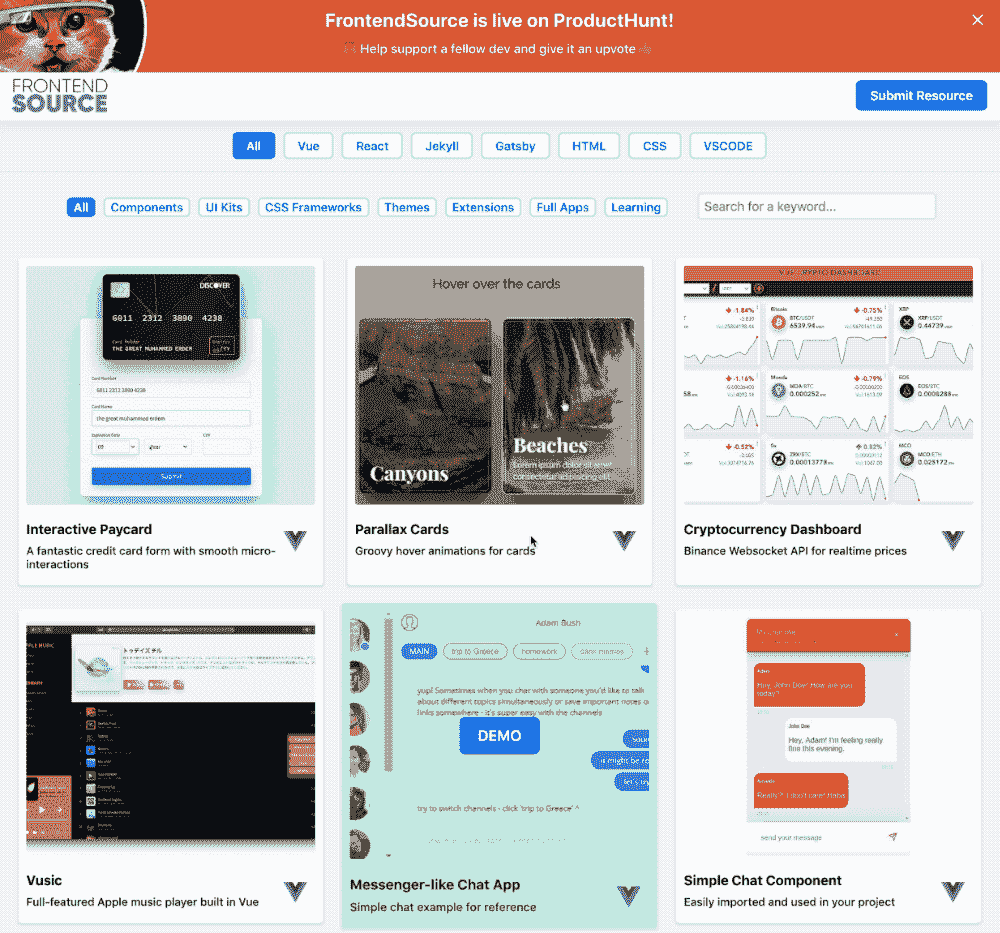
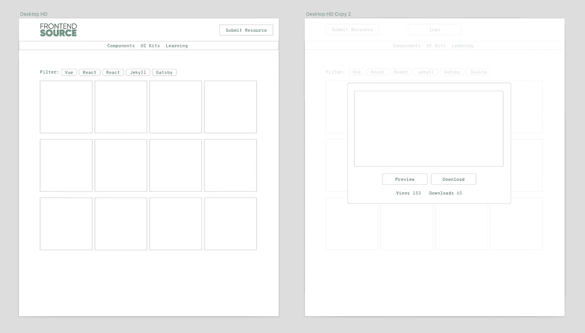
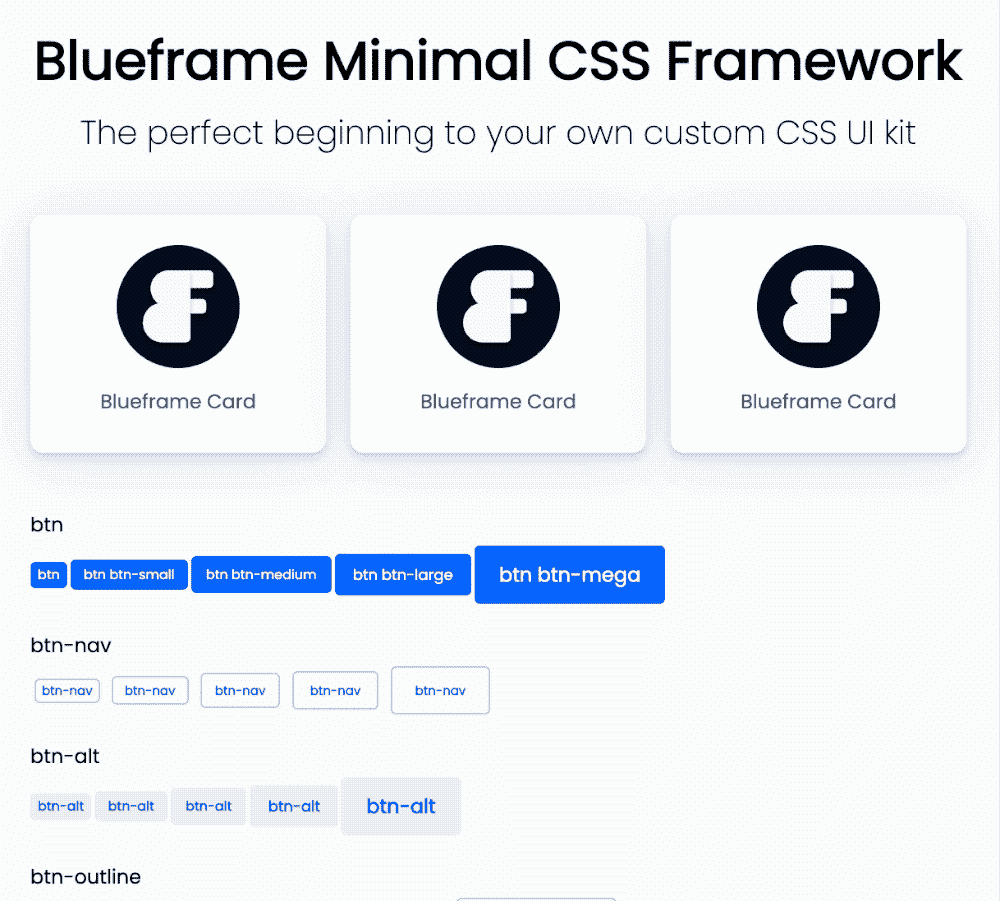
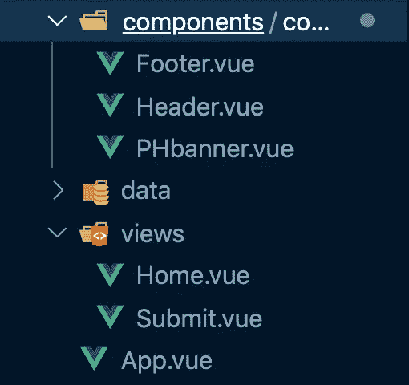
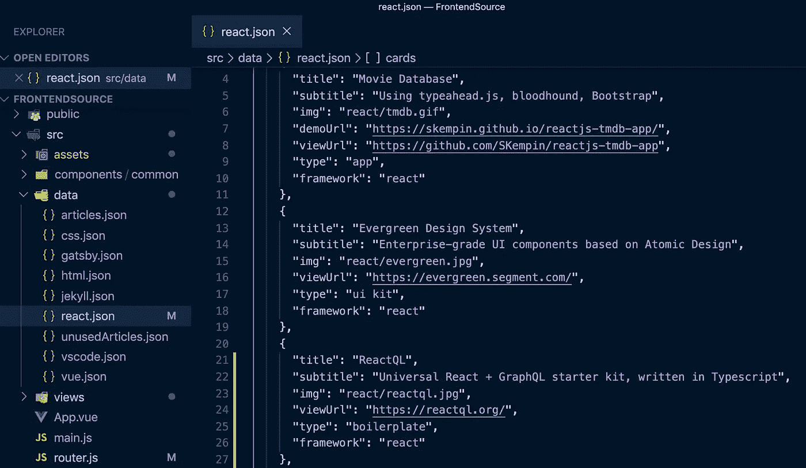
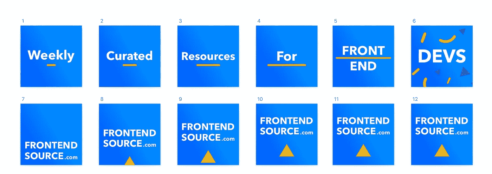
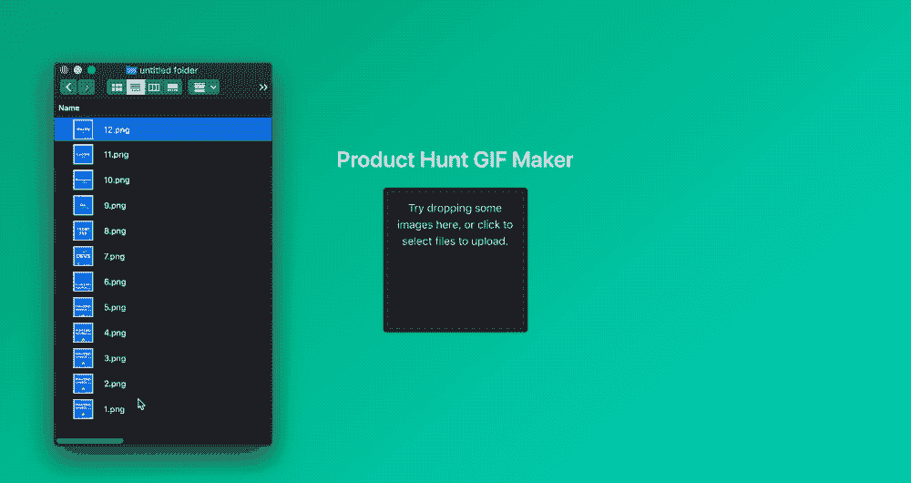

# 我在 5 天内设计、制造并发布了一个 MVP 产品

> 原文：<https://betterprogramming.pub/i-designed-built-and-launched-an-mvp-platform-in-5-days-c06fa629adb9>

## 关于如何更快启动的重要认识

在过去的一年里，我推出了几个产品，每个产品从构思到推出都需要 3 到 6 个月的时间。当时，我认为这是快速移动和快速启动。但在投入了这么多时间后，所有这些项目的总利润徘徊在 500 美元以下。

虽然我投入的时间增长了我的编码经验和知识，但我希望我以不同的方式做事，失败得更快。

这一次，我采取了不同的方法。

# 我首先建立了一个社区

我知道我想要制造什么样的产品，但是在我的目标受众说他们真的需要它之前，我不想承诺一个单一的概念。在这个早期阶段，我的目标只是建立一个观众群，开始一场对话。对我来说，我的目标受众是像我这样的前端开发者。

我不是试图从一开始就建立一些具体的愿景，而是首先削减想法，直到我有一个基本的价值元素。这将是一个最小的产品，允许我向我指定的目标用户群提供价值，并让他们定期与网站互动。

这有时被称为*最小可爱产品。*

我知道，如果我从一个对我免费提供的东西感兴趣的社区开始，我就可以进行持续的对话，然后专门围绕他们的需求开发产品。最好是围绕你的长期产品目标来创造你的最小产品。然而，它不一定是你最终想法的缩小版。它只需要向你的最终目标客户群传递价值。

这里有一个例子，说明我是如何从一个基本的价值元素开始，设定一个长期的产品目标的。

## 我的长期目标

我知道许多开发人员有完整的项目和 UI 组件，他们花了几个星期，然后从来没有做任何事情。我认为其中许多都是可以销售的，但是没有一个真正的市场专注于市场的这个特定方面。所以，我的长期目标是允许开发者买卖他们创造的资源。

我有一个初步的想法，但它可能会随时改变或改变，我不会冒险花时间开发一个功能齐全的平台。我仍然不知道我在这个细分市场的最终产品会是什么，我也不需要知道。我的社区将帮助我决定我下一步要做什么，这将基于数据和来自市场的直接反馈来决定。

## 我的短期基本价值传递

我能做的是从项目的基本价值元素开始:一个开发者为他们的下一个项目寻找策划资源的地方。本质上，这个概念和我最初的想法是一样的，只是减少了沉重的功能。虽然平台本身不会发生买卖，但我至少应该能够衡量人们对这类产品(即精选资源)的兴趣，并了解人们对哪种资源最感兴趣。

# 我对需要更多时间编码的特性说不

*   没有数据库
*   没有登录系统
*   没有用户配置文件
*   没有付款集成
*   没有文档(条款和条件或指南)
*   没有任何功能会使项目需要超过一周的时间来开发

# 我专注于我能给市场带来的独特价值

我想我有管理的诀窍，尤其是在设计和开发资源方面。正是带着这样的想法，我决定创建一个策展的前端资源平台。虽然存在类似的存储库，但我想要一些特定的东西。我想要一系列的框架，并注重质量而不是数量。每一个资源都会在发布前经过精心挑选和考虑。我决定只张贴我自己能想象使用的东西。

我已经保存了很多书签，并在媒体上写了一些我管理的资源，所以我认为这是一个很好的开始。我首先决定我将为哪些框架管理资源，最后，我只选择那些我有直接经验的框架。

# 启动过程

## 1.简化 UX

我花了半天时间在 Sketch 中创建了一个 UI 线框。我参考了其他类似的网站，把最好的想法整理成了一个两页的网站。我倾向于在设计阶段添加额外的细节，但我强迫自己删除任何和所有我不准备在接下来的几天内构建的元素。还有，第一次作为设计师，我不在乎把东西做得好看。对于这个阶段来说，黑色和白色就足够了，任何颜色或元素的设计都会在后面出现。

## 2.决定风格

虽然我可以选择现成的 CSS 框架，如 Bootstrap 或 UI kit，但我最近为一个不同的项目构建了自己的最小 CSS 框架，并决定使用它。它超级小，只包括浏览器重置、按钮、表单、导航条和卡片等基本元素，所以非常适合用于我的 MVP 项目。我更喜欢没有网格的框架，因为现在我倾向于使用 CSS 网格做任何事情。如果你自己正在构建一个基于卡片的网站，学习网格的基础知识(这对于流畅的卡片布局来说是不可思议的)。总的来说，定制我的 CSS 框架来适应这个项目花了不到一天的时间。

我的最小无网格 CSS 框架。

## 3.创建组件

这些天来，我用 Vue 开发了很多网络应用，这个网站也不例外。我首先概述了各个组件(基于我的草图线框)、路线和一个详细的 card 元素，我将对数据中的每个资源进行循环。你可能会注意到，与我的线框相比，我发现了一些进一步简化 UI 的方法。我没有使用模态组件来显示每个资源的下载/查看按钮，我发现如果我让人们通过卡片上的悬停覆盖来访问这些按钮，UI 会更好。同样，这也是坚持使用线框的一个好理由，因为我最终甚至没有使用这个设计(节省了更多的时间)。这种悬停覆盖也可以通过点击卡片在手机上使用。

最终，这只是一个更好的 UX，允许更快地访问资源。如果以后我需要像模态这样的扩展功能，我可以很容易地添加它们。完成所有页面、组件和应用程序逻辑花了整整两天时间。

这是整个应用程序。简单吧？

## 4.决定数据结构和来源

我通过框架将`.json`数据文件分开，以便于以后添加，并决定将它们保存在项目文件中，而不是使用外部数据库。这样，如果我改变了使用什么数据库的想法，我就不必更改一堆代码来适应它(正如您将在步骤 5 中看到的，这是一个明智的决定)。收集资源确实是这项工作中最耗时的部分，尤其是当我手动优化每张图片的时候。总之，这花了整整两天多一点的时间。

## 5.部署到主机

一旦网站准备好了，我决定在 Netlify 上推出它，因为我听到了关于它的好消息。虽然部署很容易，但我在图像加载方面遇到了大问题。即使手动优化了每张图片(缩小宽度，通过 Ezgif 等多种图片优化工具运行。)Netlify 用了一分多钟来处理大约 300kb 的文件。经过一整天的故障排除，我决定将网站完全转移到 Firebase，看看是否会改善加载时间。两个小时后，网站被移动了，DNS 记录已经传播了，我的网站突然变得像 T2 一样快。如果我承诺使用单个数据库，这可能会导致重大的发布延迟。通过保持事情简单，只构建我需要的东西，我为自己节省了时间和精力，但最终还是得到了最好的结果。我本可以更快地启动，但处理这些问题至少浪费了我一天时间。

## 6.准备发布和上线

在这一点上，我已经做好了启动的准备。我添加了一些更多的资源和一些便利的特性(比如一个清除搜索栏中文本的按钮)，但是没有添加什么重要的东西。为了准备在 Product Hunt 上发布，我在 Sketch 中创建了 12 个单独的帧，然后将它们上传到 [ProductHuntGif](https://producthuntgif.com/) ，它立即将它们转换成大小完美的 Gif，用于我的产品页面。准备发射花了不到半天的时间。然而，我不需要找一个猎人，因为我已经是一个博士了。在你联系人们为你寻找你的产品后，期待几天的回应(我也很乐意帮助)。

为我的 GIF 绘制画板。

提示:为了让图片正确播放，你可能需要在上传前颠倒图片的顺序。

对于其他图像(包括本文顶部的 GIF ),我使用 GIF Brewery 3 快速捕捉和调整产品预览的大小。到目前为止，这是我发现的最好的即时快速创建 GIF 的工具。

# 结论

我不确定 [**这个产品**](https://www.producthunt.com/posts/frontendsource) 会有什么结果，但我知道这一次，我已经沿着产品开发的道路迈出了最好的第一步。至少，我已经建立了一个社区，我可以利用它来获得对我下一步工作的反馈。

现在，我没有推出一个全新的平台，而是有了一个交叉推广和聚集早期用户的基础。

无论是管理资产、简单的工具，还是电子邮件模板，我们都可以制作许多免费产品，只需花费很少的时间和金钱就可以启动并运行。作为企业家，我们必须首先给市场带来价值，然后，我们才能弄清楚我们的社区到底需要什么样的产品。

我希望你能使用这个指南来考虑你未来项目的最佳发展路径，并发现最快的市场路线，同时也避免你自己以后因为没有提前正确审查你的市场而后悔。