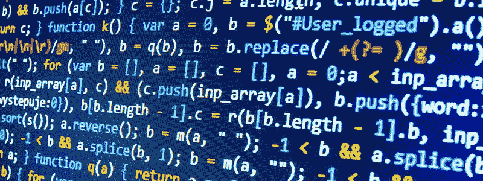

# 当我不开发的时候，我做我最好的软件开发

> 原文：<https://betterprogramming.pub/i-do-my-best-software-development-when-im-not-developing-dd8f18c7b378>

## 健康的思维，更好的代码

成为一名熟练的软件工程师需要时间。在这条职业道路上有许多季节——从理想主义的初级开发人员，到整天喝咖啡发牢骚的高级开发人员，以及中间的阶段，在那里我找到了自己。

> 在我迄今为止的职业生涯中，一个突出的事实是:当我不实际编码时，我做得最好。

## 我什么意思？

我们都可以学习语言句法。这一点，连同解决问题的技巧，是第一步。一本书，一堂课，甚至一个在线视频都是学习基础知识的好途径。但是一旦你有了这些，你如何从那里成长？都是应用概念。

> 我什么时候用 X？
> 
> X 的最佳用途是什么？
> 
> 远离 X

不胜枚举！通常，解决一个问题有多种方法。这一切都是为了找到最佳解决方案。这是我做得最好的地方。

## 盯着屏幕不会有最好的解决方案

更多的代码行或更多的工作时间并不总是等于优雅的解决方案。事实上，你可能会在第二天删除你的代码。把那些棘手的问题放一放——第二天早上你可能会找到更好的解决方案。

## 去钓鱼

字面上。如果你为一家允许你灵活工作的公司工作，为了你和公司的利益，好好利用它。在办公桌前浪费时间的开发人员通常不会完成高质量的工作。希望你的老板也意识到这一点！

## 花时间和家人在一起

有时候，我最好的想法来自于我在家和别人相处的时候。我会想到一个解决办法，我会打开手机记下它。然后第二天早上，或者我有空的时候，我就会看着纸条开始工作。也许这对你有用！

## 有些事情似乎太复杂了

如果某件事看起来太复杂，它很可能就是。如果你已经在一个问题上坐了几天，仍然没有找到解决方案，你可能需要后退一步，重新思考你的方法。也许应用程序的架构并没有使你的方法可行。也许你需要向更有经验的同事请教。

## 结论

你周围的世界充满了解决方案。我的一些最好的代码来自于我在键盘之外发现的想法。所以，告诉你的老板，“我只是离开一段时间——但我会回来的，带着更好的解决方案和更健康的头脑。”

祝你好运！