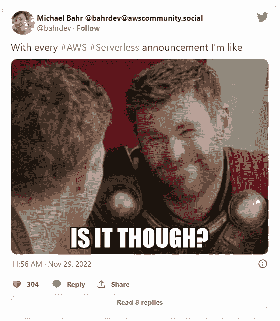
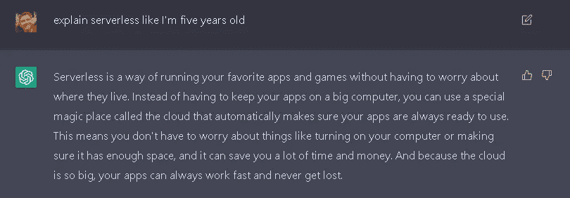

# 我不知道什么是无服务器了

> 原文：<https://betterprogramming.pub/i-dont-know-what-serverless-is-anymore-4266b81abb08>

## 无服务器的定义正在改变，似乎没有人同意它到底是什么

图片由 Freepik 上的 [pch.vector](https://www.freepik.com/free-vector/tired-man-sitting-floor-with-paper-document-piles-around-flat-illustration_11235962.htm#query=frustrated&position=46&from_view=search&track=sph) 提供

你可能不会想到 AWS 无服务器英雄会说，“*我不知道什么是无服务器。”*

我并不为这句话感到自豪。事实上，我对此有些不安。我过去对无服务器有很强的把握，但最近似乎已经动摇了。

越来越多的人把“无服务器”这个词贴在他们的项目、服务和回购上，削弱了我们过去的定义。

无服务器已经够难的了。与许多开发人员所习惯的相比，入门需要一个重大的思维转变。再加上几十个教你如何在 AWS 控制台中构建的教程，你就有了一个糟糕时刻的食谱。

我们需要就无服务器的实际含义达成一致。更进一步，我们需要就什么是无服务器开发达成一致——这是一个完全不同的故事。

# 什么是无服务器？

当我说无服务器时，我通常指的是开发人员用来构建应用程序的服务。例如 AWS Lambda、EventBridge、DynamoDB 和 Step 函数。但是，与亚马逊 Aurora 或 ECS 这样的服务相比，是什么让这些服务没有服务器呢？

[Momento](https://gomomento.com) 有一个[伟大的石蕊测试](https://www.gomomento.com/blog/fighting-off-fake-serverless-bandits-with-the-true-definition-of-serverless)，我认为它一针见血地定义了什么是真正的无服务器服务。

*来源:Momento 博客*

开发者应该能够获得并使用无服务器服务。简单地说，这些服务*只是工作*。想想你最后一次创建 Lambda 函数的时候。您对`CreateFunction`端点进行了一次调用(或者最好在 IaC 中声明它)，然后就可以立即开始调用它。

与 Neptune Serverless 相比，我需要配置一个 VPC，选择容量单位，并选择多 AZ 部署设置。感觉真的不像*就是管用*。

除了无服务器服务的开发者体验之外，您还会影响一个组织。该服务的弹性伸缩能力如何？如果您有突发流量，基础架构会自动扩展以处理它，而不需要内部 SRE 团队吗？

应用程序不使用时怎么办？它能缩放到零吗？没有人愿意为过度配置的闲置资源买单。没有最低付款额的“按使用付费”模式是你在消费无服务器服务的一个巨大标志。

> 无服务器是一种模式，消费者只为他们使用的东西付费。服务由可靠、可扩展的基础设施提供支持，这些基础设施可根据传入流量自动扩展和收缩，从而完全减轻消费者的负担。这些服务易于使用，只需很少甚至不需要配置即可开始使用。

考虑到这一点，让我们谈一谈成为一名无服务器开发者意味着什么。

# 什么是无服务器开发？

那些使用无服务器服务来构建应用程序的人正在进行无服务器开发。但这并不像听起来那么简单。

无服务器开发者以[无服务器第一的心态](https://aws.amazon.com/resources/analyst-reports/451-serverless-first-enterprises-on-aws/)构建。这意味着他们在开发中寻求利用无服务器服务的优势，比如基础设施管理、可用性和可伸缩性(等等)。这并不意味着他们必须为每个工作负载使用 Lambda 或 Step 函数。

它不是关于组成应用程序的特定服务；它是关于当你作为一个组织利用[共担责任模式](https://docs.aws.amazon.com/whitepapers/latest/security-overview-aws-lambda/the-shared-responsibility-model.html)时所获得的利益。

我们中的许多人陷入了无服务器开发的细节中。是的，在构建应用程序时，知道如何[构建直接集成](/why-serverless-direct-integrations-arent-as-scary-as-they-sound-7358102e967)或[通过使用 Lambda](/lambda-vs-step-functions-the-battle-of-cost-and-performance-5f008045e2ab) 上的阶跃函数来优化性能是一个重要的细节，但这不是无服务器开发的核心。

它是关于专注于完全有效地解决一个商业问题。它是关于在创纪录的时间内将稳定的软件推向市场。这是关于在不倾家荡产的情况下找到合适的产品和市场的契合度。

# 这真的重要吗？

希望你们中的一些人点头同意。我知道其他人会认为我疯了，并对什么是或不是无服务器有不同的看法。但是到了最后，这真的重要吗？

不会太久的。

无服务器是软件未来更快、更可持续、更健壮的垫脚石。正如 [Sheen Brisals](https://twitter.com/sheenbrisals) 在[最近的 AWS re:Invent 2022](https://sbrisals.medium.com/aws-re-invent-2022-my-seasonal-highlights-e70d8efd219d) 摘要中提到的，无服务器开发的核心概念已经存在很长时间了。像 AWS 这样的云供应商正在让利用它们变得更加容易。但是需要一个世界舞台来让人们明白这是现代应用程序需要的构建方式。

【ChatGPT 的 ELI5 无服务器

我们现在需要推动的不仅是采用云，还有云最佳实践。使用事件驱动的架构，设计 NoSQL 数据模型，并尽可能实现异步。

随着[代码基础设施(IfC)](/the-current-state-of-infrastructure-from-code-cbd3469ecdc5) 大举进军云市场，无服务器服务被完全从开发者手中抽象出来。您不是在构建 Lambda 函数、SQS 队列或 DynamoDB 表。相反，您正在使用您的分布式系统架构模式知识来构建应用程序。

IfC 是无服务器的吗？*也许是*。

如果我们认为这是完全不同的东西呢？所有这些关于什么是或不是无服务器的来回争论最终可能变得没有实际意义，我们将整个范例称为[原生云开发](https://www.jeremydaly.com/cloud-native-versus-native-cloud-apps/)。

# 最后的想法

几年前，我们在 Twitter 上有过关于 Kubernetes vs serverless 的轻松激烈的争论。今天，我们就什么是或不是无服务器展开了激烈的辩论。

随着 [Aurora 无服务器](https://aws.amazon.com/rds/aurora/serverless/)、 [Neptune 无服务器](https://aws.amazon.com/neptune/serverless/)和 [OpenSearch 无服务器](https://aws.amazon.com/opensearch-service/features/serverless/)的发布，AWS 已经开始模糊其无服务器定义的界限。

但这可能是我们正在进行的云之旅的一部分。可能“无服务器”已经不是以前的样子了。

无服务器开发人员将转变为“原生云”开发人员。我们将设计依赖于已建立的架构模式的软件，而不是严重依赖于特定的托管服务。

我们的行业现在有很多活动。很多观点，很多软件，很多想法。这一切变化得如此之快；我们争先恐后地重新定义无服务器，这并不奇怪。

每当我们最终降落在某个东西上，它再次发生变化只是时间问题。

编码快乐！