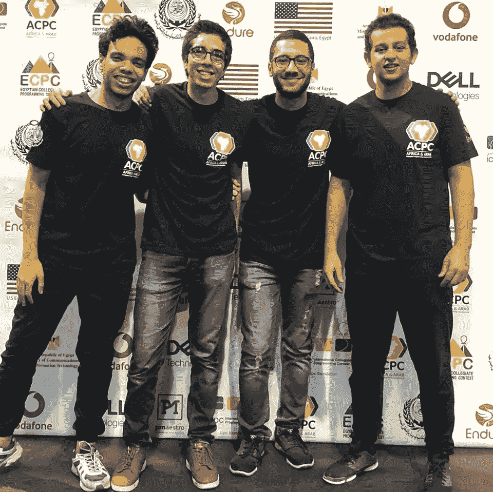
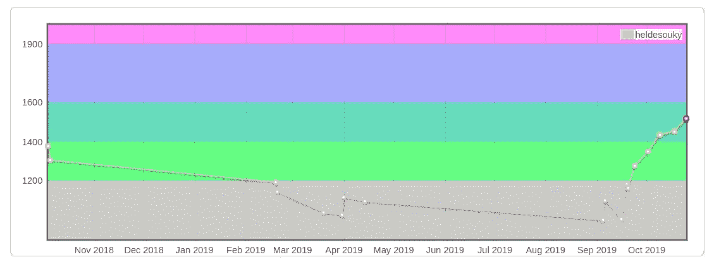

# 我又失败了！因此，我要重新开始我的旅程

> 原文：<https://betterprogramming.pub/i-failed-again-therefore-im-restarting-my-journey-58de2f7a86f3>

## 是时候重回正轨了

[奥莱威特](https://unsplash.com/@rawcurve?utm_source=medium&utm_medium=referral)在 [Unsplash](https://unsplash.com?utm_source=medium&utm_medium=referral) 上的照片

> "不要因为失败而尴尬，要从中吸取教训，重新开始."—理查德·布兰森

# 背景

我叫哈桑。我是埃及一所大学的计算机科学学生。一年多来，我一直试图找到一份 iOS 开发人员的工作，或者在苹果、谷歌或亚马逊这样的大型科技公司实习。但是，可悲的是，我总是面试失败。

为了最大限度地增加我在这些大型科技公司获得理想工作的机会，我决定开始做竞争性编程。这对我来说很有趣，我正在学习通过面试所需的所有算法和数据结构。所以是双赢。

## 现状

我上个月去谷歌面试，被拒绝了。我还参加了 Google Code Jam，只通过了资格赛一轮，之后再也过不了其他任何一轮。

上个月，我获得了埃及大学生编程竞赛(ECPC)的参赛资格，但不幸的是，我没有获得阿拉伯和非洲大学生编程竞赛(ACPC)的参赛资格。

我和我的团队在 ECPC 2019

## 我做错了什么

为了提高我自己——在我看来——我应该承认我做了一些愚蠢和错误的事情，并从中吸取教训。

比如，我拖延了很多时间，没有解决很多问题，只是浪费了很多时间。我在比赛前一个月也非常努力，这是不对的。我应该一整年都在学习——而不仅仅是在比赛之前……这不是期末考试！

我对 Codeforces.com 的比赛评分

你可以从我在 [Codeforces 上的比赛评分中看到，](https://codeforces.com/)我很长时间没有练习比赛，然后就在 ECPC 2019 资格赛之前，我开始参加 [Codeforces](https://codeforces.com/) 轮比赛。

# 下一步是什么

> “我正在重新开始我的旅程。真的是一样的旅程，但是是时候回到正道上了。我会这么做的！”

## **TL；博士**

我会研究解决问题，再解决一些问题，再试一次。

## 我的策略

下面的所有内容都是在考虑竞争性编程的情况下编写的，但是为编码面试而练习也是类似的。

你的目标应该是在算法和数据结构上变得更好。

## 解决问题

解决略高于你水平的问题——那些对你来说不容易，但你通常能解决的问题。如果你被**困住**20-30 分钟(如果是更难的问题，一个小时)，读一篇社论，确保你理解它。实现一个解决方案——如果你很纠结，那就去看看别人的代码。看看他们是如何更容易做到的。

注意粗体字“卡住”。如果你没有想法，那么你就不会被卡住。只有在一段时间没有任何进展的情况下，你才能放弃。

## 尽可能多的参与在线讨论

你应该参加所有 Codeforces 的在线回合，如果你的评级下降，不要害怕。因为即使它上涨了，它最终也会再次上涨。

## 向上解决竞赛问题

首先， *upsolve* 的意思是解决你在直播比赛中解决不了的问题。所以你会解决你在比赛中没有解决的问题。不是全部，只是一两个。

不要非常努力地尝试某件事，因为你可能无法解决它。总有一天你会解决那些更难的问题。

## 实践特定的数据结构或算法

使用谷歌找到一些教程，并阅读它们。解决那个话题的问题。过一段时间，再回去解决随机问题。现在，您应该能够识别类似的问题，并应用您所学的新算法/技术。

对于较小的算法/技术，解决几个问题就足够理解它了。在大主题的情况下，像动态编程，你应该解决几十个问题。但是不要在这上面花费几个月的时间，因为你知道在一个问题中你应该使用什么，这是一个小小的欺骗。当你在竞赛中阅读一个问题时，你不知道它的标签/主题。有时困难的部分是想出你应该使用什么。

识别模式是一项有价值的技能，这就是为什么你需要主要解决随机问题。

## 解决“竞争性编程 3”中的所有问题

我知道这本书有很多问题——大约 1700 个问题——但是老实说，这些问题真的很好，这本书组织得很好。

 [## 竞争性编程书籍

### 这是一本书的配套网站:“竞争性编程 3:编程竞赛的新下限”和…

cpbook.net](https://cpbook.net/#CP3details) 

## ICPC 2021 培训

我会专注于解决比赛中的老问题，最好是和团队一起。不过，不要太担心。还是只是擅长算法的问题。你不会因为解决来自随机平台的问题而浪费时间。

# 结论

我会解决越来越多的问题，希望明年我有资格参加 ICPC，也许会成为 Codeforces 上的红人或黄人。

## 资源和参考资料

*   [ICPC 战略维基](https://lukipuki.github.io/contest-wiki/team-strategy.html)
*   [ICPC 的终极指南](https://medium.com/better-programming/the-ultimate-guide-for-the-icpc-407b7f6409dd)
*   [练习竞争性编程的方法:从评分 1000 到 2400+](https://codeforces.com/blog/entry/66909)
*   [竞争性编程培训的“科学”](https://codeforces.com/blog/entry/17842)
*   [如何练习竞争性编程由 Errichto](https://github.com/Errichto/youtube/wiki/How-to-practice%3F?fbclid=IwAR3i4-RUmoN3VM2oY-tP3WC60maN3V7hd2R5vTeS7Xs7I1LXNdb5_VjTnUA)

一些 YouTube 教程频道:

*   [Errichto](https://www.youtube.com/channel/UCBr_Fu6q9iHYQCh13jmpbrg)
*   [算法直播](https://www.youtube.com/channel/UCBLr7ISa_YDy5qeATupf26w)
*   威廉菲斯