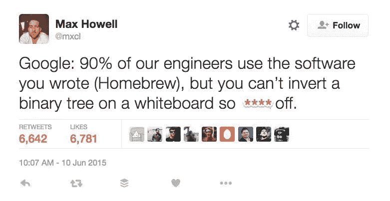
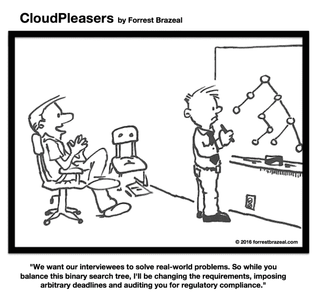
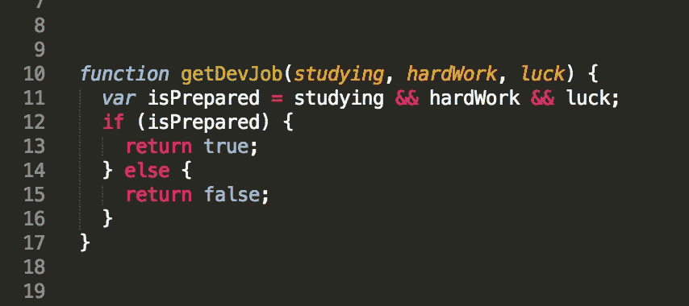

# 我没有通过编码面试

> 原文：<https://betterprogramming.pub/i-failed-my-effing-coding-interview-648ffd355c30>

## 为什么编码面试令人恼火和不公平

Clem Onojeghuo 在 [Unsplash](https://unsplash.com/s/photos/job-interview?utm_source=unsplash&utm_medium=referral&utm_content=creditCopyText) 拍摄的照片

对于大多数软件工程师来说，编码面试是一种又爱又恨的关系。对于如何正确面试一个即将入职的软件工程师来获得一个特定的或一般的职位，有一些激进的观点。这些访谈可以是高级概念对话、屏幕共享访谈(即 Collabedit)、白板、配对编码或各种其他形式。科技行业没有统一的面试模式或风格。

那是什么意思？这意味着工程师和开发人员不知道如何为每一次面试做好准备。这些面试在主题和难度上因公司而异。

在过去的客户中很常见，这些面试集中在白板上写代码，同时让被面试者“大声思考”并解释他们自己的每一步。这是一个奇怪的有点过时的过程，但这些采访不是为了优化现代实施而以这种方式组织的。

# 为什么编码面试是标准的

如果你在一次编码面试中问一个工程师他们的经历，每个工程师的答案都会因为他们的背景而有很大的不同。这是一个非常敏感和有争议的话题。你不希望我重复这些年来我听到的一些评论和故事。(你可能会笑得耳朵流血或者肚子痛。)大多数工程师认为，技术面试与实际职位无关，也不能显示个人的真实技术能力。

这些人有一个观点——这些采访并不代表真实的工作。开发人员在日常工作中从来不需要在白板上写深入的代码。此外，编码访谈中涉及的大部分主题在访谈之外是看不到的。例如，一个专门从事 React 的前端开发人员需要以特定的算法方式遍历 B 树的频率有多高？永远不会，除非他们做了什么大错特错的事。

当一个候选人真的遇到一个代表真实世界问题的面试，而这些问题需要在实际职位的日常工作中解决时，这是令人兴奋的。我曾经遇到过这样的情况:面试结束时，应聘者会带着一项编码任务离开，他们实际上很兴奋能完成这项任务，因为他们觉得自己能理解公司的问题，并增加真正的价值。

更糟糕的是。编码面试往往完全不公平。就连 Brew 的创始人——拥有数千万的安装量——也被邀请到谷歌面试，然后因为无法解决一个 B 树问题而被拒。

软件工程师喜欢欺骗受访者，提出极具挑战性的问题。如果你得到了最初的问题，那么面试官通常会在你的解决方案中加入扳手，让问题变得更难，制造不必要的压力。

那么为什么给他们呢？

尽管有缺点，编码面试证明了三件事:

*   候选人真的很想得到这份工作，并为准备工作付出了巨大的努力。如果一个被采访者没有花时间去熟悉这个过程，这是很明显的。公司希望雇佣付出努力的人。
*   软件工程师可以解决问题并实际编码。不得不复制/粘贴他人编写的脚本或者没有足够语言经验的工程师在解决问题和编写解决方案时经常会犯大错误。
*   软件工程师可以有效地阐明他们解决问题的方法。工程师经常会解决不了问题，却发现他们实际上通过了面试。怎么会？面试官认为他们的思考过程足够好。

# 不同公司的面试编码有何不同

一家公司如何面试员工与他们吸引的人才的质量直接相关。最好的公司优化他们的招聘流程以减少误报。与拒绝一个潜在的好员工相比，一个通过面试的糟糕员工对公司的伤害更大。最好的公司往往有最艰难的面试过程。

因此，当你发现招聘过程特别容易时，很可能这家公司的工程技术比较薄弱。当然，这并不总是正确的，但这肯定是要记住的事情。

因为猜测面试中会涉及哪些话题非常困难，所以最敏锐的准备策略就是为一切做好准备。也就是说，如果你真的想要一份好工作。否则，在面试前向招聘人员或招聘经理要一些学习/准备的东西。如果你需要时间来准备，直接和诚实。

# 定量就是一切！但是怎么做呢？

精通面试是需要时间的。它们是你身体中一块全新的肌肉，需要锻炼和训练。如果你不不断地触及基本原则，你最终会成为一只再也不能蹒跚着去洗手间的肥猫。你不想那样的！去面试的时候不要尿在自己身上！当人们开始准备过程时，感觉就像你在五年零有氧运动后又跑了一英里。

你必须对研究、学习和实践有信心。偶尔跑几圈练习。

如果你想在顶级科技公司工作，比如谷歌或脸书，我们建议你练习:

*   经验丰富的工程师:四至六周，每天两小时
*   **新工程师:**六到八周，每天三小时

对于更多的中档公司，如 A/B 轮创业公司，你通常可以做更少的准备:

*   **经验丰富的工程师:**两到四周，每天两个小时
*   训练营毕业生:四到六周，每天两到三个小时

是的，这需要很多时间，你可能会想，“我真的需要准备那么多吗？”

我们的答案是回头看看那个 10%的数字。如果你真的想要工作机会，你需要准备这么多。即使有这样的准备，你仍然应该预料到一半的面试会失败。(抱歉，但没准备就不抱歉了。)

## 一些共同的话题

*   树
*   哈希表
*   OOP，系统
*   大 O
*   递归
*   堆栈/队列
*   数组
*   链接列表
*   算法:BFS，DFS，二分搜索法，合并排序，快速排序
*   比特操作(很少有面试官给出这些，但无论如何都会涉及到)

期待与你的经验相关的问题:技术、语言、框架等等。SQL 挑战和问题非常普遍。

# 方法 **ods 准备**

一些在线培训系统非常棒。互联网上有付费和免费的培训系统。

其中一些网站包括:

*   [极客的极客](https://www.geeksforgeeks.org/)——免费——一站式获得大多数技术面试的高水平概述，从基础到专家级任务。此外，许多顶级品牌都在这里发布了他们的面试准备要求。
*   免费——做一个快速的在线编码测试，而不是提供一份简历。该公司将开始为你自动匹配符合基本编码要求的公司。快速面试！
*   免费——告诉他们你想练习的时间和内容，他们会给你找一个最佳搭档。他们提供了面试问题(和答案),你们双方都可以用它们来面试对方。编码访谈是与协作代码编辑器的实时视频会议。你和你的同伴每人面试 30 分钟。面试结束后，你们双方对对方的表现进行评价。从同行的反馈中学习，获得自信，掌握面试的艺术。坚持练习，直到面试像摇滚明星一样。给招聘人员留下深刻印象，获得好工作机会。
*   与来自谷歌、脸书等公司的工程师进行免费、匿名的技术面试练习。获得可行的反馈，在面试中表现出色，在顶级公司获得快速通道。
*   免费——有一个街机可以在互动环境中解决问题和提升你的技能，比如视频游戏、面试练习、与同行或陌生人的面对面编码比赛、锦标赛和公司机器人。
*   [我的代码学校](https://www.youtube.com/user/mycodeschool?reload=9)——研究一个主题，确保你全面理解它。
*   [getboost . io](https://www.getboost.io/posts/leetcode.com)——攻克~三个易练题和两个难练题，复习解答，直到完全理解为止。

当你完成每个主题时，要意识到你会想每周重温两到三次，以保持记忆犹新。这些东西很容易忘记，当你在面试中遇到问题时，你希望问题的类型能够立即被识别出来。

随着你训练的越来越多，你会对新问题有一定程度的直觉。最难的部分是开始准备，所以克服困难。

# 我想知道你什么时候准备好了

你不能确定。即使是准备最充分的人也可能会在面试中表现不佳，所以在某些时候，你不得不收工，跳进深水区。

不过，你什么时候跳？

如果你能得到一个顶级公司的人的模拟面试，即使你要为此付出代价，也是值得的。他们都有很高的门槛，并且能够给你具体的反馈(只要你不在他们公司的面试过程中)。也许你有个朋友会帮你。

最后，值得一提的是，你也可以把第一次面试当作最初的基础工作。简单地申请你不太感兴趣的公司，把面试当作练习。(我敢肯定，一些正在阅读这篇文章的招聘经理正在给我竖起中指。)人们经常会参加他们并不真正关心的面试，以便在公司面前得到现场练习。

祝狩猎愉快，好运！

# 其他资源

*   [Interviewbit.com](http://interviewbit.com/)
*   [Themuse.com](http://themuse.com/)
*   [冒险家](https://www.ventureradar.com/similar/Triplebyte/5240fd34-c770-4154-9adb-e1f21b3948bf?#)