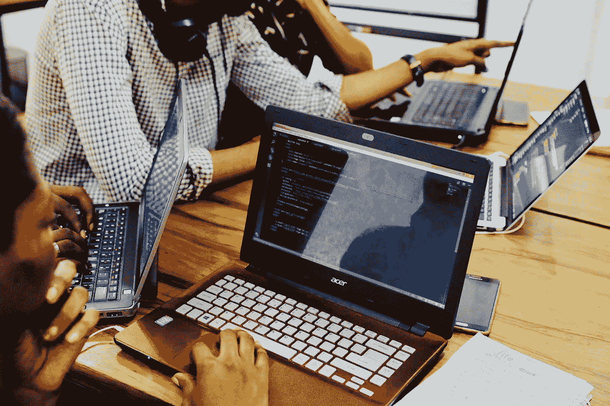
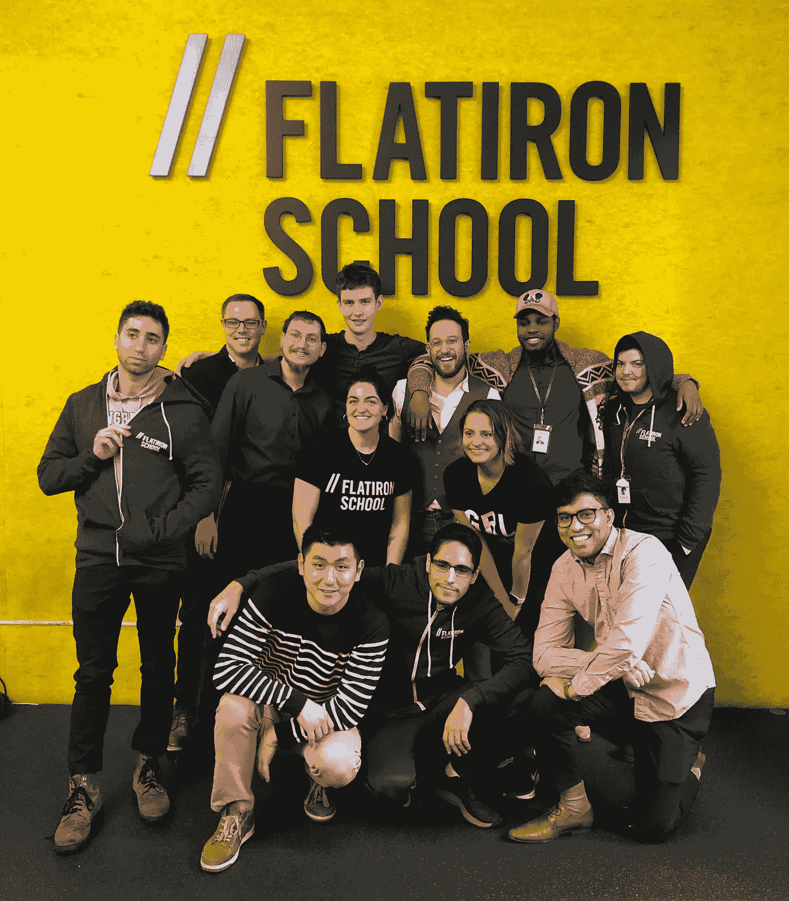
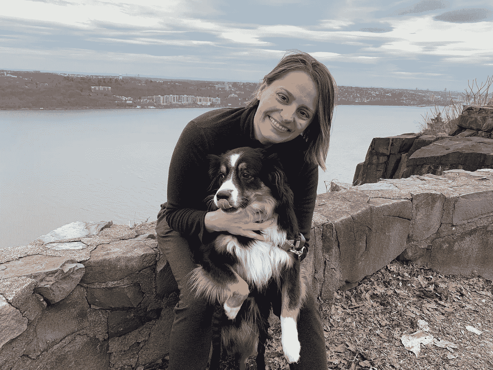

# 你完成了你的编码训练营，现在做什么？

> 原文：<https://betterprogramming.pub/i-finished-the-coding-bootcamp-now-what-65908686db99>

## 接下来是什么——训练营另一边的生活

制造者在 [Unsplash](https://unsplash.com/s/photos/bootcamp?utm_source=unsplash&utm_medium=referral&utm_content=creditCopyText) 上 [NESA 的照片](https://unsplash.com/@nesabymakers?utm_source=unsplash&utm_medium=referral&utm_content=creditCopyText)

当你在做一个编码训练营时，它占据了你生活中的太多时间，以至于你不会去想当你完成后会发生什么。

我的意思是，你知道你将会找一份工作，但是它看起来是如此遥远以至于它看起来不真实。你专注于你的日常生活，努力活下去。

离毕业只有几个星期的时候，结束的感觉来了。你开始回顾过去，思考你学到了多少，你将会错过多少。

我在熨斗学校的 SE-111819 同学

这是一次难忘的经历，充满了成长和自我发现。

我学了 Ruby，Ruby on Rails，SQL，JavaScript，React，React Native。我现在可以创建全功能的网站和应用程序。我明白了，我可以比我想象的更努力地学习，只要我下定决心，没有什么是我做不到的。

最重要的是，我学会了如何学习(并在这个过程中认识了一群很棒的朋友)。

# 那么，现在怎么办？

在训练营之前，我的职业是主持开发者活动，最著名的是[droid con NYC](https://www.nyc.droidcon.com/)&[droid con SF](https://www.sf.droidcon.com/)Android 开发者大会。

活动前的几周是紧张的，但一旦活动开始，就有一个时间点，你已经尽了一切努力，事情进展顺利，你可以放松一下——毕竟，这是几个月辛苦工作的结束。

我原以为编程训练营的结束会是相似的，但是我越来越意识到完成一个训练营仅仅是开始。这是你新事业的开始，还有很多东西要学。

训练营结束后休息一下是可以的——我是在纽约的索格蒂斯写这篇文章的，我们在那里休息了几天。我们本该去游轮，但随着冠状病毒的爆发，游轮是你现在最不想去的地方。

纽约市外的州界了望台——景色令人惊叹！

那么，我现在的目标是什么？归结起来就是两个:

1.  继续学习编程。
2.  找一份软件工程的工作。

经历了 15 周的严格管理的环境后，放松一点很有诱惑力，但是我知道当有组织的时候我会更有效率。

我需要努力工作来实现这些目标，所以我想出了这个每日时间表来让我集中注意力:

*   早上 7 点——起床遛狗。
*   早上 8 点——锻炼。
*   上午 9 点——淋浴和早餐。
*   上午 9:30—工作*。
*   中午 12:30—午餐。
*   下午 1 点——工作。
*   下午 5:30——做晚饭。
*   下午 6 点——晚餐。
*   晚上 7 点——工作。
*   晚上 9 点——收拾干净，准备睡觉。
*   晚上 10 点——睡觉时间。

(*我所说的工作是指任何与学习和求职相关的活动。)

我非常感谢熨斗学校为我们提供职业指导。我的教练露西很棒，我很期待和她一起找工作。

我知道这不容易，所以有人一路为你加油是件好事。

我的计划是参加很多社交活动和聚会，但随着冠状病毒的爆发，世界已经发生了变化。各种活动都被取消了，所以我想我们会在家工作一段时间。

我正在寻找在这种环境下对社交有建议的人，以及愿意参加(虚拟)咖啡聚会的人。

当我们在那里的时候——让我知道你是否准备好创建或主办虚拟活动——我有很多活动组织经验，做一个在线活动会很有趣。

我们可以举办一个在线会议，包括演讲者提交、项目委员会、演讲者会议、问答和网络。

此外，如果你是一名科技界的女性，对提交科技会议提案有疑问，请告诉我，我在这个世界已经有一段时间了。

向前向上！