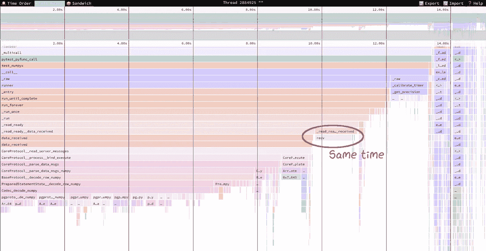

# 我使用了“Asyncpg”——它将数据库记录解析为 Numpy 的速度提高了 20 倍

> 原文：<https://betterprogramming.pub/i-forked-asyncpg-and-it-parses-database-records-to-numpy-20x-faster-e71024a84bff>

## 基于 NumPy 结构化数组展示 asyncpg 的分支 Python 的异步 PostgreSQL 客户端


照片由 [SpaceX](https://unsplash.com/@spacex?utm_source=medium&utm_medium=referral) 在 [Unsplash](https://unsplash.com?utm_source=medium&utm_medium=referral) 上拍摄

# 简单地

我入侵了 asyncio PostgreSQL 客户端库`asyncpg`,将来自底层 PostgreSQL 协议的`SELECT`ed 记录直接解析到 [NumPy 结构化数组](https://numpy.org/doc/stable/user/basics.rec.html),无需具体化 Python 对象，避免了大部分开销。

它的工作速度比墙壁快 3 倍，CPU 快 20 倍；它不施法加速数据库服务器。star 的存储库是[athensco/asyncpg-rkt](https://github.com/athenianco/asyncpg-rkt)。

# 为什么我做了一把叉子

[越来越多的新兴数据库选择使用 PostgreSQL wire 协议，](https://datastation.multiprocess.io/blog/2022-02-08-the-world-of-postgresql-wire-compatibility.html)比如蟑螂或者板条箱。假设这很简单，Python 中的 [PoC facade 服务器不到 200 行。如此庞大的兼容数据库家族暗示了一个高效的 Python 客户端库。分析优先的客户端库。](https://gist.github.com/eatonphil/079f8654174b9b9c1953b76008d024ae)

在我之前的一篇博客文章中，我注意到从 PostgreSQL 响应到 pandas DataFrame 的转换是多么的低效。让我提醒你代码:

```
pd.DataFrame.from_records(await connection.fetch("SELECT ..."))
```

我们在下面做了许多多余的动作:

1.  解析 PostgreSQL 网络协议并创建 Python 对象。
2.  将这些 Python 对象插入到创建的`asyncpg.Record`中
3.  迭代行并将 Python 对象插入到`object` dtype 的 NumPy 数组中。
4.  推断更好的数据类型，如 int64、datetime64 等。，并转换 Python 对象。
5.  构建数据框架。

但是，我们事先知道返回列的数据类型，可以做得更好:

1.  将 PostgreSQL 网络协议解析为类型化的 NumPy 数组。
2.  构建数据框架。

分析表明，在具体化数百万个 Python 对象时存在明显的瓶颈，只是为了将它们转换回与 PostgreSQL 服务器发送的完全相同的内存中表示形式，而忽略了字节序。在 Pandas 中，每当我们复制一个对象数组时，我们都会增加和减少每个对象的引用计数器，这就为性能棺材钉上了最后一颗钉子。

不幸的是，asyncpg 中负责构建返回的`asyncpg.Record` -s 数组的部分是用 Cython 编写的，不容易定制。我不得不叉。

我考虑了以下要求:

*   肯定是顺路替换。不要破坏现有的用户代码。
*   适度降级:当列类型是对象(例如 JSON)时，回退到 Python 对象。
*   处理好空值。并非所有内置的 NumPy dtypes 都支持类似 null 的值，比如 NaN 或 NaT，所以我们必须返回 null 的位置。
*   除了 NumPy 没有额外的依赖。
*   我能安排的最好的演出。

## 如何利用新的超级大国

照常安装 asyncpg:`python -m pip install asyncpg-rkt`

我们调用`set_query_dtype()`来用结果数据类型描述增加查询字符串。数据类型必须是[结构化的](https://numpy.org/doc/stable/user/basics.rec.html)。返回的数组的用法和原来的`asyncpg.Record` -s 的列表没有太大的区别:

`nulls`是`arr`中的平面索引，我们在这里获取空值:

获取常规查询的工作方式与在原始库中相同:

此外，asyncpg-提供了一种专为熊猫定制的替代“块”输出模式:

返回的数组是一个类似 1D 对象数组的数组，其中每个元素是一个包含值的列:

项目的预期使用案例和限制:

*   用户应该关心性能。在大多数情况下，潜在的加速并不是翻天覆地的，所以这可能不值得争论。
*   `SELECT`至少十排。否则，好处微乎其微。
*   用户预先知道返回字段的类型。任何数据建模都会派上用场，例如 SQLAlchemy。
*   那些类型主要是原语，映射到 NumPy:整数，浮点，时间戳，`bytea`，`text`，`uuid`，固定大小的几何。
*   用户知道返回字节和字符串的最大长度，以指定足够的`[S#](https://numpy.org/doc/stable/reference/arrays.scalars.html#numpy.bytes_)` [和](https://numpy.org/doc/stable/reference/arrays.scalars.html#numpy.bytes_) `[U#](https://numpy.org/doc/stable/reference/arrays.scalars.html#numpy.bytes_)` [类型](https://numpy.org/doc/stable/reference/arrays.scalars.html#numpy.bytes_)。否则，有可能回退到对象，但性能会下降。
*   要么直接使用 asyncpg，要么通过像 [morcilla](https://github.com/athenianco/morcilla) 这样的薄包装器。Async SQLAlchemy 1.4 和 encode/databases 将会崩溃，因为我们返回一个带有 NumPy 数组和空索引的元组，而不是一个单个的`Record`列表；即使这些库幸存下来，它们也会将结果重新打包到类似记录的 Python 对象中，并且会忽略这一点。
*   结果转换为熊猫数据帧应该会飞。
*   不要期待魔法！这种分叉不会加速数据库服务器。

# 基准

我比较了四种不同执行模式的性能:

1.  `min` —正在执行`SELECT 1`。该模式设置绝对最小查询执行时间。
2.  `dummy` —我们从 PostgreSQL 中读取数据，然后立即删除它。客户端不做任何实际工作，`fetch()`总是返回`None`。这种模式近似于服务器处理时间以及客户端-服务器通信时间。它是理想的，不可及的目标。
3.  `record` —遗留查询执行，我们照常返回`asyncpg.Record`对象的列表。
4.  `numpy` —模式。我们返回结构化的 NumPy 数组和空索引列表。

我的 Postgres 服务器在本地运行，我连接到了`localhost:5432`。该查询是:

```
SELECT ... FROM generate_series(1, {length})
```

*   其中`length`是要返回的相同行数
*   `...`是硬编码的两个布尔值(五个 bigints，一个 float4，四个时间戳，两个 times，两个长度为 16 的 bytea-s，两个长度为 5 和 10 的 texts)

我测了从 100 到 50000 的各种`length`。基准测试大量使用了优秀的[py test-benchmark](https://pytest-benchmark.readthedocs.io/en/latest/)py test 插件。我确保了一些预热迭代来正确引导准备好的语句。

选择基准的 Tukey 直方图，越小越好。“dummy”是丢弃的服务器响应，“record”是返回原始 asyncpg 中的记录，“numpy”是在 async pg-rkt 中动态转换为 NumPy 结构化数组。底部的数字是提取的行数。图片作者。

选择基准的 Tukey 直方图，越小越好。“dummy”是丢弃的服务器响应，“record”是返回原始 asyncpg 中的记录，“numpy”是在 async pg-rkt 中动态转换为 NumPy 结构化数组。底部的数字是提取的行数。图片作者。

“numpy”模式下的端到端查询执行速度比“record”模式快 3 倍如果我们减去不可变的“虚拟”时间，纯 CPU 时间加速达到 22 倍。“numpy”执行时间的标准差与“dummy”相同，而“record”跳得高得多。我们在 50k 行上赢了大约 120ms，波动最剧烈的时候赢了 250ms。

当然，实际的加速比不到 3 倍，因为任何实际的查询都要在 PostgreSQL 服务器上花费更多的时间。我不卖蛇油。不过，绝对增量应该保持不变。

下面是用于比较的`[py-spy --native](https://www.benfrederickson.com/profiling-native-python-extensions-with-py-spy/)`配置文件。第一个是“记录”，第二个是“数字”。概要文件显示，将 pgproto 解析为 Python 的`datetime`是一个严重的瓶颈。


10k 行的“记录”模式配置文件。我们可以看到日期时间操作中的一个主要瓶颈。其他领域也很慢。“相同时间”指向在每种模式下经过恒定时间的网络入口。图片作者。



10k 行的“numpy”模式配置文件。轮廓是统一的，就像它应该的那样。“相同时间”现在更广了:CPU 时间减少了很多。图片作者。

基准测试的源代码在 [GitHub](https://github.com/athenianco/asyncpg-rkt/blob/master/tests/test_numpy_benchmark.py) 上。

# 血淋淋的实现细节

“查询增强”的工作方式是在 pickled dtype 前面加上前缀。原生 asyncpg 中的后端代码会取消回拨。这不如直接传递引用有效，但我不想改变任何公共接口，即使是向后兼容的。如果 asyncpg 通过包装器库被调用，没有人会急于转发经过那里的引用。

代价是一些反序列化开销。给定预期的平均提取行数，它应该可以忽略不计。

原来的 Cython 代码已经相当快了。它教会了我一些使用扩展类的聪明技巧，比如预分配— `[@cython.freelist](https://cython.readthedocs.io/en/latest/src/userguide/extension_types.html#fast-instantiation)`或禁用垃圾收集— `[@cython.no_gc](https://cython.readthedocs.io/en/latest/src/userguide/extension_types.html#disabling-cycle-breaking-tp-clear)`。我发现只有一个地方需要改进:应该直接内联`frb_check()`缓冲区溢出检查，而不是希望 Cython 做“正确的事情”

速度变慢是 Cython 的异常转发诡计的结果。纯 Python 版本在某些地方有些扭曲。每次我不得不在 asyncpg 中跟踪查询流时，我都会笑。连接并通过:

*   `execute()`
*   `_execute()`
*   `__execute()`
*   `_do_execute()`
*   `executor()`

async pg——依赖 NumPy 的[结构化数组](https://numpy.org/doc/stable/user/basics.rec.html)。它们是具有可选排列的固定形状的 C 结构。NumPy 通过索引和名称公开结构字段。在内部，NumPy 保存了到嵌套的 dtypes 和 offsets 的普通列表和字典映射。

PostgreSQL 将行流式传输到客户端，在获取所有行之前，我们不知道将获取多少行。动态调整 NumPy 数组的大小是不可能的，类似于将`Record` -s 追加到一个列表中，因此我们必须分配页面对齐的大小相等的块，并在最后将它们连接起来。

不幸的是，这些额外的分配导致了内存消耗的双峰和从块到最终目的地的大量`memcpy()`。

PostgreSQL 以微秒级精度的 64 位整数形式发送时间戳和时间增量。NumPy 允许 datetime64 和 timedelta64 中的各种单位，例如，天、秒、纳秒。

因此，我们必须通过整数乘法或除法进行单位转换。分析表明整数除法太慢。当然，这不是什么新鲜事。幸运的是，有一个从 Doom 的快速反平方根系列和 C 头专用 [libdivide](https://github.com/ridiculousfish/libdivide) 捆绑在一起的技巧是 numpy≥1.21。

我把`numpy/libdivide/libdivide.h`包在 Cython 里，它就像一个“神奇”的符咒。另一个关键步骤是调整零点，也就是纪元。PostgreSQL 的零是 2000–01–01，NumPy 的零是 1970–01–01，所以我们必须给每个值加上 30 年。

PostgreSQL 在 UTF-8 中发送字符串。另一方面，我想 NumPy 希望 UCS-4 更容易矢量化。我们必须重新编码。CPython 导出相关函数，但它们都需要 Python 字符串或字节对象，这会降低性能。

我改编了 MIT 授权的 [fontconfig](https://github.com/freedesktop/fontconfig/blob/6f27f42e6140030715075aa3bd3e5cc9e2fdc6f1/src/fcstr.c#L626) 的实现:FcUtf8ToUcs4。它工作得相当快；算法很简单。fork 有一个选项可以将字符串直接复制到`S#`dtype——非常适合 ASCII 限制的文本。

我不得不用 nulls 来解决这个问题。我们必须在不牺牲性能的情况下支持他们。每次遇到空值时，我们将平面索引追加到一个列表中，并向数组块中写入一个 NaN 代理。

*   对于 float32 和 float64，这是一个真正的 NaN。
*   对于 datetime64 和 timedelta64，这是一个行为类似的 NaT。
*   对于物体，我们写`None`。
*   对于整数，我们写出给定位数的最小值。
*   对于`S#`，我们用`0xFF`来填充。
*   对于`U#`，我们用`0x00`填充。

显然，提到的任何值都可能是合法的，因此唯一有保证的 null 检查是扫描返回的 null 索引。

如果用户设置了错误的数据类型，会发生什么？他们应该捕捉一个有用的异常:

> asyncpg . pg proto . pg proto . dtype error:dtype[10]=

Staying on the type topic, I am using an [未记录的`np.dtype`的](https://numpy.org/doc/stable/reference/arrays.dtypes.html#specifying-and-constructing-data-types)构造函数参数，用于指定列输出模式:

每个 dtype 都带有一个元数据属性，该属性是在构造时设置的`None`或只读(`mappingproxy`)字典。

关于列输出，asyncpg 将相同数据类型的列组合在一起，并以块为单位分配内存，这让人想起 Pandas 的做法(以前是这样做的？)它。面向用户的阵列是数据块[视图](https://numpy.org/doc/stable/user/basics.copies.html#view)。块原点被列数组的`[base](https://numpy.org/doc/stable/reference/generated/numpy.ndarray.base.html)` [属性](https://numpy.org/doc/stable/reference/generated/numpy.ndarray.base.html)引用。

# 你考虑过合并回 asyncpg 吗？

这需要相当多的额外努力。没有 NumPy，Cython 代码编译当前中断。有可能使 NumPy 成为一个可选的依赖项。如果社区要求合并，并且 asyncpg 的维护者是仁慈的，那么好吧，让我们开始吧。

# 摘要

我描述了 async pg-——async pg 的向后兼容分支，这是 PostgreSQL 的 Python asyncio 客户端。

asyncpg——将从低级 PostgreSQL 协议中选择的记录直接解析到 [NumPy 结构化数组](https://numpy.org/doc/stable/user/basics.rec.html)中，无需具体化 Python 对象，从而避免了大量开销。它比墙壁快 3 倍，CPU 快 20 倍。存储库是[雅典人/asyncpg-rkt](https://github.com/athenianco/asyncpg-rkt) 。

*感谢阅读！敬请关注更多内容。*