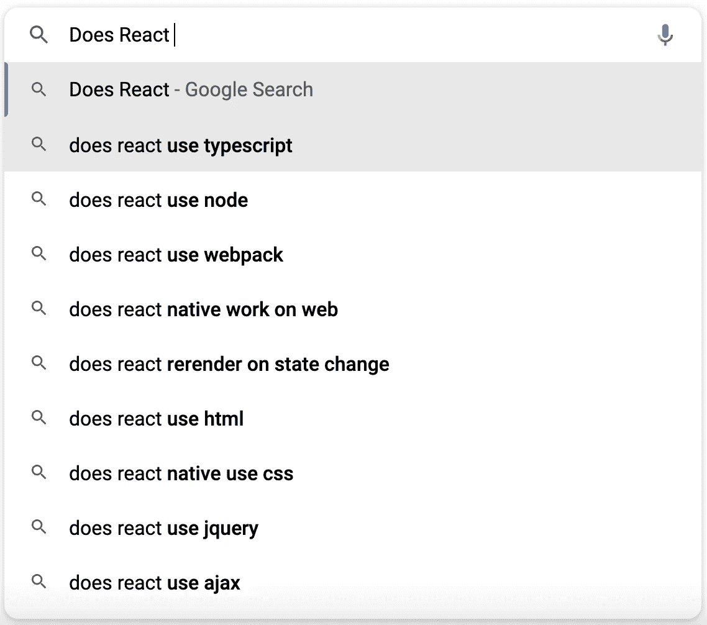
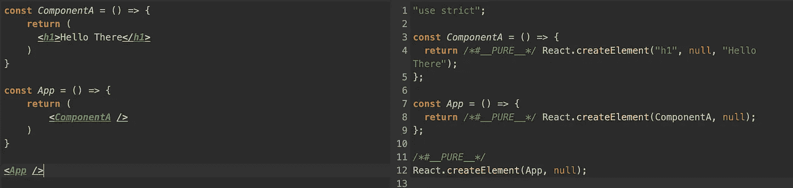

# 我用自动完成搜索谷歌了 React 问题——以下是他们的答案

> 原文：<https://betterprogramming.pub/i-googled-react-questions-using-autocomplete-search-and-here-are-their-answers-6bb836570c78>

## 这可能会成为你的面试参考指南



作为一名软件开发人员，我在谷歌上花了很多时间。前几天，我在查找 React 的一个问题，觉得看到短语“do React”的顶部自动更正会很有趣。“自动更正”不是我所期望的，所以我把它们和它们的答案放在一个列表中分享。我将跳过 React Native 的条目。

# React 使用 TypeScript 吗？

不，React 不使用 Typescript。但是，您可以使用 Typescript 来编写 React 应用程序。Typescript 是 Javascript 的超集，这意味着 Javascript 的所有功能都存在于 Typescript 中。这些年来，Typescript 在前端空间变得越来越被接受。像 create-react-app 这样的流行工具都有现成的 Typescript 模板。

使用 Typescript 时，您需要考虑的主要问题是您将使用什么 transpiler。

> Transpilers 是读取用一种编程语言编写的源代码，并用另一种具有相似抽象级别的编程语言生成等效代码的工具

你需要一个带 Typescript 的 transpiler 的原因是浏览器不能理解它。他们只懂 HTML，CSS，Javascript。你需要一个 transpiler 把你的类型脚本转换成 Javascript。Typescript 有自己的 transpiler 可以使用。另一个受欢迎的选择是巴别塔。

## React 使用节点吗？

这个问题的答案是。因为 React 是一个用于构建用户界面的库，所以它在单页面应用程序上下文中运行。Node 是一个 Javascript 运行时环境，用于构建后端应用程序。我说 React 使用 Node 的原因是 React 及其所有支持库和工具通常是使用 Node Package Manager(简称 NPM)发布的。您需要在您的机器上安装 Node 来访问 NPM 注册表及其所有有用的工具。

如果你想得到一个基本的应用程序，你当然可以不用 Node。但是，为了充分利用 React，拥有 Node 会有所帮助。

# React 使用 Webpack 吗？

不，React 不使用 Webpack。像 Typescript 一样，Webpack 用于增强 React 应用程序。Webpack 是一个流行的 Javascript 模块捆绑器。它为开发环境、NPM 包可见性和包优化提供了工具。

您可以构建一个没有 Webpack 的 React 应用程序。大多数入门应用程序都不需要它。一旦你开始构建更大规模的应用程序，你会想要寻找一个像 Webpack 这样的好的 Javascript bundler 来帮助你的应用程序做好发布的准备。

# React 会在状态改变时重新渲染吗？

是的，这是 reactions 的显著特征之一。当组件中的状态变量发生变化时，React 将安排重新渲染该组件及其所有子组件。

```
const App = () => { const [name, setName] = React.useState("") const otherName = "" return (
    <div> <p> {name} </p> <p> {otherName} </p> </div> )
}
```

在上面的例子中，如果我们要改变`name`的值，应用程序会重新显示新值。因为我们将其定义为状态变量，所以它将触发重新渲染。`otherName`变量是一个普通的常量，因此对该值的任何更改都不会导致重新渲染。

这种行为或对状态变化的重新呈现使 React 在浏览器中获得了令人称道的速度。一个站点被重新渲染的次数越少，它对用户的表现就越好。对用户来说更好的性能意味着更好的整体体验。

# React 使用 HTML 吗

React 不使用 HTML，但它确实产生了 HTML。React 是用 JSX 写的。JSX 是 Javascript 的语法扩展。

```
const App = () => { return (
    <ComponentA />
    <ComponentB />  
  )
}
```

你可以在 JSX 元素中使用 HTML。

```
const App = () => {return (
    <ComponentA />
    <ComponentB />  

    <button>Clcik Me</button> 
  )
}
```

即使您可以在 JSX 内部使用 HTML，也有可能创建一个完整的 React 应用程序，而无需编写任何 HTML。

类似于 Typescript，浏览器不理解 React。因此，在应用程序可以在浏览器中运行之前，需要将其转换为 HTML、CSS 和 Javascript。

React 使用 Javascript 将 JSX 元素转换成浏览器的 HTML。下面是一个使用 Babels transpiler 的简单示例



左边是您将在代码库中编写的内容，右边是 React 在浏览器中呈现您的应用程序之前所做的工作。React 扩展的`createElement`方法用于将 JSX 元素转换成浏览器可读的 HTML。

# React 使用 jQuery 吗？

不，React 不使用 jQuery。与 React 一样，jQuery 也是一个 javascript 库，用于简化 Javascript 的编写。jQuery 比 React 早了大约 7 年。随着 web 应用程序变得越来越复杂，React、Angular 和 Vue 等库和框架已经被创建出来，以应对 jQuery 面临的新挑战。尽管有其局限性，jQuery 仍然是一个非常受欢迎的库。它的简单性和小尺寸使它成为第一次尝试前端开发的人的一个很好的起点

在同一个项目中混合使用 jQuery 和 React 通常不是一个好主意。这是可以做到的，但是您应该选择满足您需求的库或框架，并坚持使用它。

# React 用 AJAX 吗？

我对这个问题的理解是:“React 需要 AJAX 才能工作吗？”。在这种情况下，no React 不使用 AJAX。然而，如果没有 AJAX，React 应用程序将毫无用处。

AJAX 代表异步 Javascript 和 XML。AJAX 是一种无需重新加载页面就能与服务器通信的方法。如今，大多数开发人员与 AJAX 的交互都是用 fetch 或 Axios 之类的库来抽象的。

每当 React 应用程序从服务器获取数据时，它都会使用 AJAX 调用。没有它们，您的 React 应用程序将只能显示您在代码库中提供的静态数据。

我发现这个自动完成列表非常有趣。您可以看到，Reacts 的受欢迎程度已经盖过了开发人员在其中使用的许多技术。希望人们能够找到他们问题的答案。