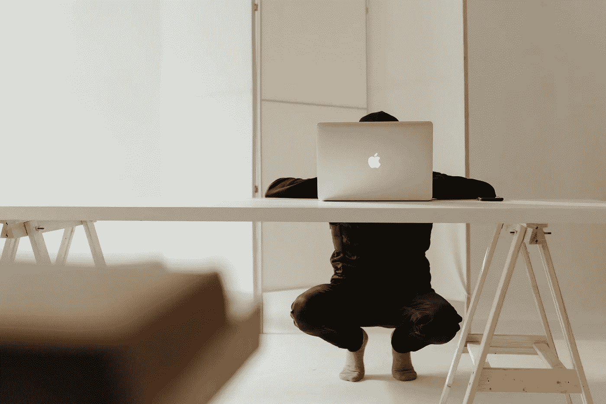

# 为什么我讨厌在家工作

> 原文：<https://betterprogramming.pub/i-hate-working-from-home-3b9a91ee3717>

## 大多数人对在家工作赞不绝口。不用通勤，工作时间灵活，等等。但是作为一名新毕业生，我很失望

来自 [Pexels](https://www.pexels.com/photo/silver-macbook-on-white-table-4268520/?utm_content=attributionCopyText&utm_medium=referral&utm_source=pexels) 的 [cottonbro](https://www.pexels.com/@cottonbro?utm_content=attributionCopyText&utm_medium=referral&utm_source=pexels) 摄影

在过去的一年半时间里，人们对在家工作赞不绝口。没有通勤、灵活的时间表和无耻的午睡只是人们爱上远程工作的许多原因中的一部分。另一方面，我自己非常渴望卸载 Zoom。

作为一名应届毕业生，我从大学毕业，准备好面对这个世界——真实的世界，而不是每次会议都以“你们能看到我的屏幕吗”开始的虚拟世界？

所以，很自然地，当我开始我的第一份工作时，我非常失望，我的入职经历没有得到公司的奖励和团队社交，而是减少到一封半生不熟的欢迎电子邮件和十几个无用的人力资源培训模块。但是除了一个孤独和令人沮丧的职场入门，这里还有六个我讨厌在家工作的原因。

# 缺乏隐私

作为一名 23 岁的大学毕业生，我真的没有经济能力独自生活，不幸的是，这意味着我不得不在童年的卧室里工作，那里充满了未解决的创伤和旧的神奇宝贝卡片。

如果这还不够尴尬的话，我的移民父母还禁止我在房间里安装锁，这已经造成了许多令人尴尬的会议中断。虽然我意识到你在办公室里也不会有隐私，但和你妈妈在楼下对你大喊大叫让你洗碗相比，和同事们谈论工作是完全不同的体验。

# **模糊的工作生活界限**

如果你像我一样，没有在家办公的奢侈，那么你可能会在卧室工作，虽然我不介意在早上 8:55 起床参加上午 9 点的会议，但这也意味着你永远不会真正离开工作场所。

在远程工作成为新的规范之前，我们大多数人会认为把工作带回家有点忌讳，但是现在，你的工作已经是你家的一部分了。以前，一旦你离开办公室，你就把工作丢下了。你没有检查你的电子邮件，或者不得不考虑错过你老板的一封重要邮件。今天，我们被那些加班加点的同事发来的烦人的 MS Teams 通知所诅咒，他们除了在非正常时间发送跟进邮件之外无事可做。

# **孤独**

尽管我不愿意承认，但在家工作让我感到极度孤独。我喜欢在办公室工作的一点是与其他人互动。无论是和你的团队成员开玩笑，还是在电梯里看到的对常客点头致意；熟悉的面孔和无用的闲聊让人感到安慰。

作为一名应届毕业生，我很高兴能结交新朋友，并成为团队合作练习和偶尔饮水机谈话的物理环境的一部分。取而代之的是，我一个人坐在办公桌前，每天 8 个小时一边给别人发邮件，一边吃东西。我确实担心我的社交能力。

# **缺乏动力**

我不知道你怎么想，但我发现自己每天至少有三次在考虑是否应该清理那些过时的文件或者小睡一会儿。我认为我的大脑仍然拒绝接受在家工作是新的常态，并继续把家作为休息和放松的地方，而不是创新和疲惫的地方。

在我意识到我的工作可能会在未来 10 年被机器人取代之前，我只能鼓起这么多的内在动力。在一个指定的创新空间里，被才华横溢的同事包围，你从中获得的外在动力不仅是我所怀念的，也是我认为我们都需要的。

# **错过的社交机会**

在办公室工作的一大好处是周围都是志同道合的人，他们通常有相似的职业道路和兴趣。这包括主管、导师、承包商、顾问，更不用说参加与行业领袖、招聘人员、投资者等的各种会议。

我并不想喋喋不休地说自己是一名新毕业生，但对于像我这样刚刚进入职场并寻求扩大人脉的人来说，这又是一个巨大的劣势。诚然，今天有很多方法可以解决这个问题，比如 LinkedIn，但没有什么能真正比得上面对面的有机互动。

# **变焦疲劳**

起初，像 Zoom 和 MS Teams 这样的视频会议平台是面对面会议的一个令人惊叹的替代选择，但在一年半多的冻结面孔和“你在静音”之后，视频会议的新鲜感正在逐渐消失。我厌倦了在屏幕上呆半天，担心是否有人能注意到我做了眉毛。

至少在面对面的会议上，你可以坐在房间的后面，不用担心每个人都在看你。除了每次出现在屏幕上都要保持自我意识之外，视频会议也比你可能意识到的更加耗费体力。你的大脑实际上不得不更加努力地阅读和解码人们的面部表情和语调，这导致你身体的紧张和压力增加。

# 最后的想法

在家工作有利也有弊，但是作为一名刚毕业的学生，对于处在人生相似阶段的人来说，我肯定觉得弊大于利。

我的许多有孩子和宠物的同事绝对喜欢远程工作，甚至不愿意考虑回到办公室，这完全有道理。如果我不再需要每天花两个小时通勤，并且有机会花更多的时间和我的孩子在一起，我可能也会这样。

但是在我人生的这个阶段，我的承诺很少，这是我离开家去看看这个世界会给我带来什么的理想时刻。我想花时间通勤和发现新的地方。我想去和城市里的人交流。我想和我的队友在办公室呆到很晚，建立友谊。

我真的相信远程工作已经彻底改变了我们的工作方式(变得更好)，但是，我只是觉得对于像我这样的年轻人来说，远程工作与其说是一个机会，不如说是一个障碍。也许我错了，我只是一个交际花，但有一点可以肯定的是，我想念办公室的咖啡。