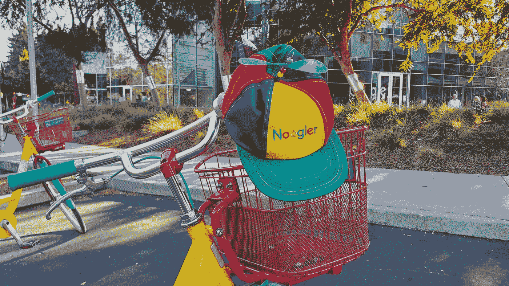

# 我接待了一名谷歌实习生，学到了关于管理的惨痛教训

> 原文：<https://betterprogramming.pub/i-hosted-a-google-intern-and-learned-a-hard-lesson-about-management-5678ba551dca>

## 成为一名优秀的领导者比看起来更难



作者照片

我在工作中关注的一个领域是提高我的领导能力和人员管理技能。为了达到下一个水平，我领导项目和委派任务的能力必须与我对团队的原始技术贡献相匹配，如果不是超过的话。我认为实践这些能力的一个很好的方法是主持一个暑期实习生。

众所周知，谷歌拥有世界上最受欢迎的实习项目之一。见鬼，他们甚至为此拍了一部电影。我很高兴有机会向学生展示谷歌在帮助他们完成一个具有挑战性的项目时提供的所有奇妙的福利。任何获得谷歌实习机会的人显然都是熟练的，所以我期待着在我的形象中塑造这种原始的才能。

我为一个困难但规模良好的项目起草了需求和设计。我的实习生将不得不克服一些令人生畏的障碍，但这个项目仍然有可能在夏天完成。我计划了里程碑，收集了技术资源，并建立了一个清晰的我想要如何计划一切的脑海画面。

我以前指导过同事，所以我对自己指导他人的能力很有信心。我本以为会收到更多直接的技术问题，因为实习生显然没有新毕业生有经验。

我的导师风格与我所用的非常相似。我更喜欢不干涉的方法。我会让自己随时回答问题或提供尽可能多的帮助，但我不会微观管理，并要求每小时更新状态。我想相信实习生自己会过得很好，不需要太多主动干预。

但那是我的第一个错误。不是每个人都可以用同样的方式管理。当然，这种方法对我有效，但是没有理由认为这种风格对其他人也有效。

当试图远程管理某人时尤其如此。在办公室环境中，我可以走过去检查事情进展如何，或者安排临时会议。远程工作增加了沟通障碍，这种障碍有时似乎无法克服，尤其是在存在时区差异的情况下。我在加州时，我的实习生在东海岸工作。

没多久项目就开始偏离我计划的进度。

我认为我的时间表过于激进，所以我缩减了时间，重新组织了里程碑。我没有停下来想，也许我必须重新思考我的管理方法。这是我的第二个错误。我没有及时采取正确的行动。当然，我的意图可能是好的，但这并不一定意味着我的方法是正确的。我说服自己突破就在眼前。

我直到最后都保持乐观。不幸的是，一切都没有像我希望的那样顺利。我崩溃了。去实习的时候，我确信这对我和我的实习生来说都将是一次奇妙的经历。最终，我辜负了他。我不禁想:*我能做些什么不同的事情呢？*

在实习的最后一天，我和我的实习生进行了长时间的一对一谈话，给出并接受了一些总结性的反馈。我很惊讶地得知，他们关注的大部分是入职过程，而不一定是项目的其余部分。他们承认我尽了最大努力完成项目，并让实习成为一次积极的经历，但他们希望最初的要求更简洁，希望我在入职阶段更具互动性。

最初，我听到这些后很困惑。在前几周，我分享了大量的资源和团队文档，并编写了一份全面的 PRD，概述了项目的所有关键 cuj 和需求。我明确表示，我一天 24 小时都可以回答问题，并提供所需的帮助。这还不够吗？

我恍然大悟:当然，这还不够。

分发一堆文档并期待奇迹发生可能适合我这个级别的人，甚至可能适合一个新员工，但这种情况是不同的。指望一个实习生能够阅读一堆破旧的减价商品，并期待奇迹发生，这是愚蠢的。多年前我实习的时候，连一个 PRD 是干什么用的都不知道，更别说怎么用了。

这是我的第三个错误，也可能是最微妙的错误。我像对待一个常数一样对待管理。事实上，在科技行业，没有什么是一成不变的。不管我打算如何管理，我应该一开始就让自己更多地参与进来，不管实习生是否希望我这样。

在不稳固的基础上起步的后果导致了整个夏天后来一系列的错误。似乎不管我做了多少航向修正，我都无法及时找到扭转局面的方法。我认为，因为在我们的 1:1 中没有危险信号，情况仍然可以改善。危险信号的问题在于它们并不总是显而易见的。如果我看不到警告信号，我怎么能指望一个实习生看到它们呢？

那么我从这次经历中学到了什么呢？首先，我发现管理比我想象的更像软件工程。这是一个不断发展的过程，同样的方法不会在所有情况下都有效。当事情没有按计划进行时，你需要能够主动适应和改变你的策略。作为经理，采取行动并找到实现成功的方法取决于你；忽视这一点意味着你必须为失败负责。

我也明白了我不能让每个人都和我一样看待事物。我不能让我喜欢的管理风格为可能喜欢不同方法的人工作。对于那些可能不知道什么系统最适合自己的人来说尤其如此。我应该调整我的领导，而不是坚持我的计划，而不是试图调整项目。至少，我可以体验和尝试新事物。我没有向目标靠近，而是努力让目标向自己靠近。这不是你打造好产品的方式，也不是你有效领导的方式。

我会再做一次吗？是的，绝对的。遭受一次失败并不是永远放弃的借口。我很高兴从这次经历中学到了什么，并确保下次不会犯同样的错误。不可否认，下次我可能没那么雄心勃勃了。我的下一个项目可能不那么华丽或技术复杂，但保守会让我更容易专注于我的管理技能。我不想尝试和处理可能危及项目的技术或后勤障碍。我也可以从简单、固定的里程碑开始，逐渐过渡到更具挑战性的工作。关键是从小处着手，专注于钉钉作为实习主持人的核心方面。

# 外卖食品

通过思考，我已经为下一次做什么制定了一个计划？我的主要目标是改变我在整个实习期间分配时间的方式。将我的努力平均分配到整个夏天显然是错误的做法。相反，我应该在前几周投入大部分时间，以确保我的下一个实习生打下坚实的基础。从长远来看，在最初的几个星期里提供实质性的支持从理论上来说可以节省时间和精力，因为实习生在项目接近尾声的时候会更加独立。

我还需要更加积极主动地解决问题和纠正错误。如果事情开始出错，我必须立即采取行动让事情回到正轨。作为主持人和经理，我有责任让他们发挥自己的潜力。

最后，我需要愿意根据我管理的人的类型来适应和改变我的领导风格。我不能强迫每个人都装进同一个盒子里；这是一个灾难的配方。我将不得不尝试不同的方法，并根据具体情况决定哪种方法最有效。

我期待着我的下一次实习主持经历。虽然我的第一次尝试并不像预期的那样顺利，但我已经能够反思并学习下次如何避免犯同样的错误。

```
**Want to connect?**If you aren’t already, follow me on [Twitter](https://twitter.com/allegretti813).
```