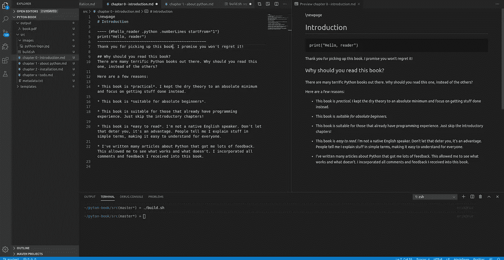

# 我刚刚开始写一本 Python 的书

> 原文：<https://betterprogramming.pub/i-just-started-writing-a-book-on-python-78fb67e4d8>

## 这就是我将要做的


照片由 [Unsplash](https://unsplash.com?utm_source=medium&utm_medium=referral) 上的[星号](https://unsplash.com/@asteriskyg?utm_source=medium&utm_medium=referral)

在过去的几个月里，我写了几篇关于 Python 编程语言的文章。

明年我会写更多，因为 Python 是一个热门话题。它被用于许多行业，是世界上第二大使用的计算机语言[。](https://www.zdnet.com/article/python-now-as-popular-as-java-as-typescript-climbs/)

我花了一段时间才找到一个主题:

*   我喜欢写。
*   我知道的够多了。
*   是人们想阅读的“热门”话题。

Python 检查所有的框！

我也一直想写一本书，所以几周前我突然想到写一本关于 Python 的书。

经过长时间的考虑，我认为不会有太多损失，会有很多收获。所以我采取了心理步骤和决定:我要写一本书！

以下是为什么这是一个好主意的一些原因:

*   我可以先写文章，然后在书中重复使用。优势？我可以看到人们对它们的反应，调整内容，并在这个过程中创作出更好的书。
*   如果我最终得到一本未完成的书，至少我已经写了一大堆有用的文章并分享了它们。
*   我可以满足我写一本书的愿望，做一些真正让我兴奋的事情。
*   我会强迫自己彻底学习 Python。
*   我会强迫自己成为一个更好的技术作家。
*   从这篇文章开始，我可以写下我的旅程，也许还能娱乐和启发其他作家！

# 技术堆栈

我是一个开发人员，一个技术人员，一个极客，一个书呆子，无论你怎么称呼它。

还有，这是一本科技书，不只是普通书。所以，我的第一个问题是:“我可以使用哪种技术来制作一本技术书籍？”

## 要求

我有几个要求:

*   最好不用我费太大力气就能看起来很好。
*   我不想一开始就承诺一种格式。我希望能够灵活地生成 PDF、EPUB 甚至 HTML。这样，如果需要的话，我可以改变路线，例如创建一个网站而不是一本书。
*   我更喜欢某种纯文本格式，因为我发现它更容易使用。
*   该技术必须支持大量的代码示例。
*   我想使用 Git 版本控制，毕竟我是一个有礼貌的开发人员。

我不介意事情变得有点技术性。如果我需要写一个脚本来预处理和编译我的书，没问题。我有技能，所以我最好用它们！

十二年前，我在[乳胶](https://www.latex-project.org/)写了我的[硕士论文](http://www.wikibench.eu/wp-content/uploads/2010/10/van-baaren-thesis.pdf)。我喜欢它默认生成的流畅输出，但我记得我讨厌编写 LaTeX。

我喜欢的是降价。它简单明了，我非常了解它，因为我经常使用它。以下是使用降价的优势:

*   看起来很舒服。
*   很好写。
*   我已经很了解它了。
*   它与版本控制系统配合得很好，因为它都是纯文本。
*   很容易将所有类型的源代码粘贴到 Markdown 文件中。在 GitHub 和 Bitbucket 这样的网站上使用 Markdown 是有原因的。

## Pandoc

带着这些需求，我开始谷歌搜索并找到了关于 Pandoc 的信息。如果你不知道的话:这是一个可以从基本上任何格式转换成任何其他格式的工具。

这是标记语言的瑞士军刀。Pandoc 允许我在 Markdown 中写作，并转换成 PDF、HTML、EPUB 和一大堆其他格式。

它使用 LaTeX 作为中间步骤，所以我在 Markdown 中编写 LaTeX 文档时得到了很好的格式。完美！

我安装了最新版本的 Pandoc(使用[自制软件](https://brew.sh/)和 [TeX Live](https://www.tug.org/texlive/) ，并创建了一个初始项目，其结构如下:

```
├── output
│   └── book.pdf
├── src
│   ├── build.sh
│   ├── chapter 0 - introduction.md
│   ├── chapter 1 - about python.md
│   ├── chapter 2 - installation.md
│   ├── chapter x - todo.md
│   ├── images
│   │   └── python-logo.jpg
│   └── metadata.txt
├── templates
│   ├── ....
```

对于感兴趣的人来说，构建脚本如下所示:

```
pandoc -N \
--toc --toc-depth=2 \
-o ../output/book.pdf \
--template=../templates/eisvogel.latex \
--highlight-style=tango \
metadata.txt *.md
```

*   如你所见，我使用了在网上找到的模板。这肯定不会是最终的模板。我还在试验中。
*   选项`--toc`和`--toc-depth=2`在文档的开头创建一个目录。
*   `--highlist-style=tango`选项将默认的`tango`样式应用于代码清单。为了在单色设备上获得更好的可读性，我可能需要调整这一点。

到目前为止，似乎这个设置提供了足够的旋钮和工具，使它能够完成一本书！这将需要更多的调整，以得到我喜欢的方式，但这将是以后的事情。

到目前为止，我已经从其他人那里找到了几篇关于他们如何使用 Pandoc 编写和格式化他们的书的技巧和诀窍的文章，这是令人鼓舞的。

## 编辑

我使用 Visual Studio 代码来编辑项目文件。它是免费的，而且有很多插件。它支持降价，也有预览功能。因此，当我打字时，它会呈现我正在处理的章节的预览，包括图像和源代码清单。

它不像 Pandoc 的输出那样漂亮，但它足以发现愚蠢的错误，并获得一个大致的想法，而不必每次都编译到 book。



我的 VS 代码设置。自己的形象。

# 书名

我单子上的下一件事是书名。在我开始写这本书之前，我想有一个标题。

这迫使我思考我将用来教别人 Python 编程的方法。会不会干巴巴的很正式？还是比较口语化的？

我很快就想到了一个标题。我甚至为它注册了域名。我会暂时保密。我这边可能有点傻，但我不想让任何人抢走我的头衔。

我能告诉你的是:书名暗示这是一本实用的书。外面有足够多的正式的、超级详尽的 Python 书籍，我永远无法与之匹敌。

我*能*做的就是让学习 Python 变得简单实用。如果你读了我的书，你会得到一些可以在工作中使用的例子。您可以复制并粘贴到自己的项目中的内容。

我想教现实世界中，人们每天都在努力解决的实际问题。我能做到这一点是因为我也在日常工作中使用 Python。

# 发布平台

我不知道我将在哪里提供这本书。我知道这将是一本电子书。我看不到纸质书的未来。

Pandoc 给了我创建多种格式的灵活性，所以我可能会以多种方式发布这本书。


rupixen.com 在 [Unsplash](https://unsplash.com?utm_source=medium&utm_medium=referral) 上[的照片](https://unsplash.com/@rupixen?utm_source=medium&utm_medium=referral)

因为我有创建网站和网络商店的技能，我可以把它作为电子书出售。我甚至可以为 Pandoc 的每笔销售生成一个定制的图书，包括买家的名字，也许这样可以减少盗版的可能性。

我也可以在亚马逊 Kindle 上发布。明显的优势就是平台大。我猜，在亚马逊 Kindle 上购买比在作者的网站上购买门槛会更低。人们也更容易找到。

幸运的是，我还有很多时间来研究这个课题。这本书无论如何都要花点时间来写。

# 合作努力？

我会写下我的旅程，让你开心和了解情况。但我希望我也能从中受益。写下来有助于我明确方向，做出坚定的决定。毕竟全世界都在看！

说到写书，我完全是个新手，所以我很想听听你的意见。随意分享，例如:

*   对这本书内容的想法。你理想中的 Python 书是什么样子的？
*   关于写作和出版一本书的经验或提示。
*   写这本书用什么技术？我走的路对吗？
*   在哪里发布，如何发布？

如果你想更近距离的关注我，可以在我的[子栈页面](https://techexp.substack.com/)免费报名。