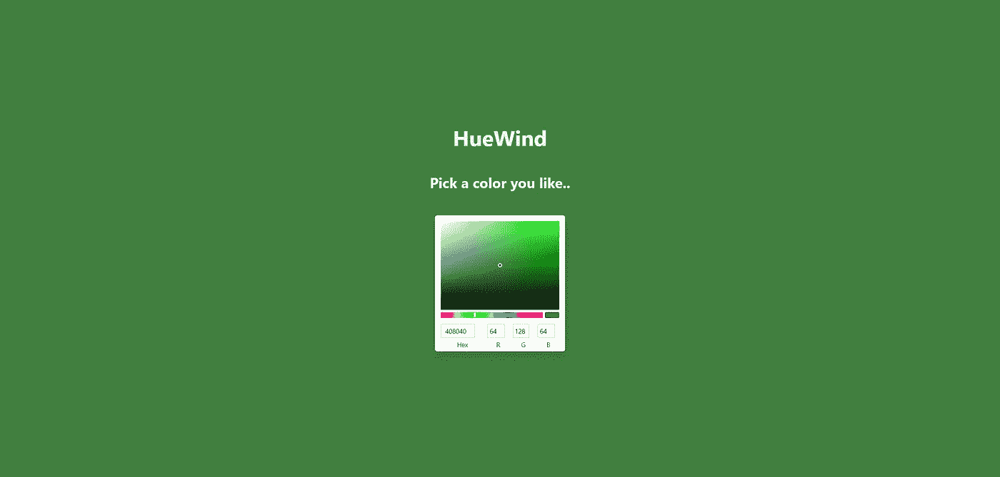
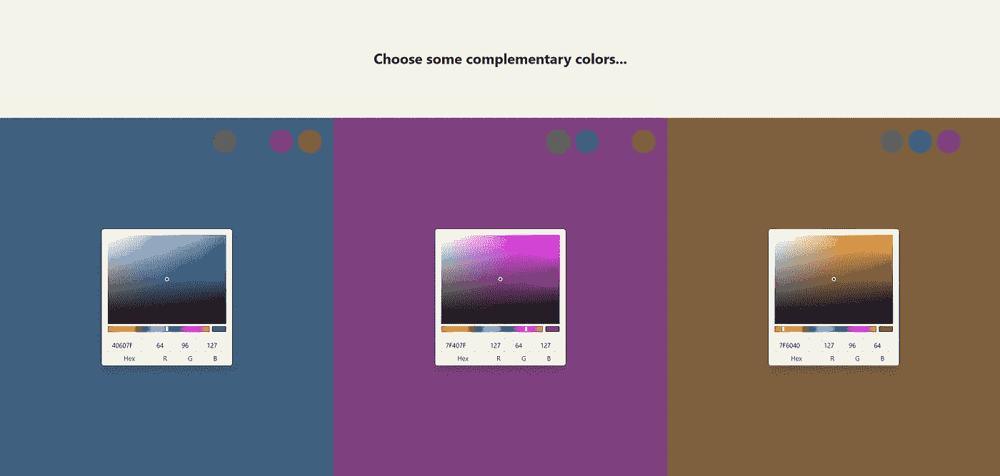
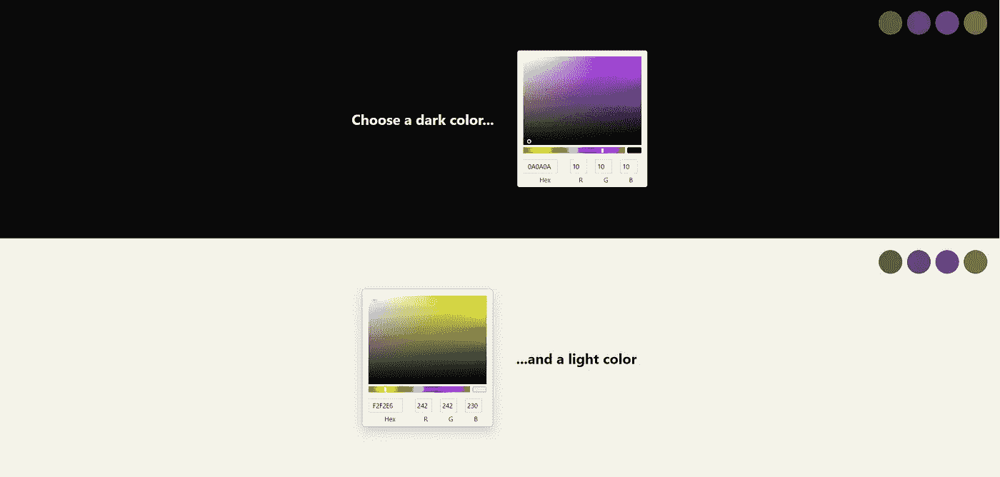
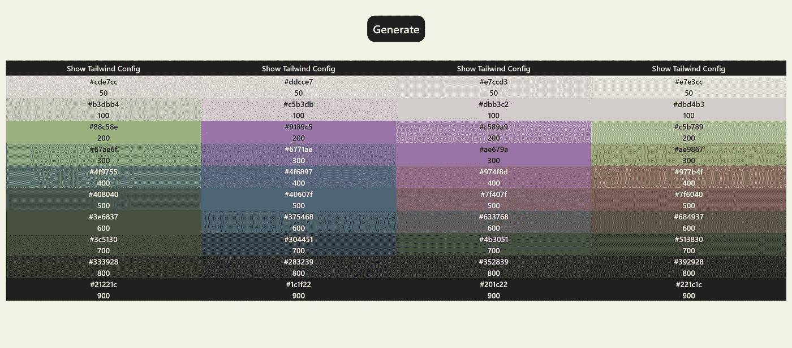
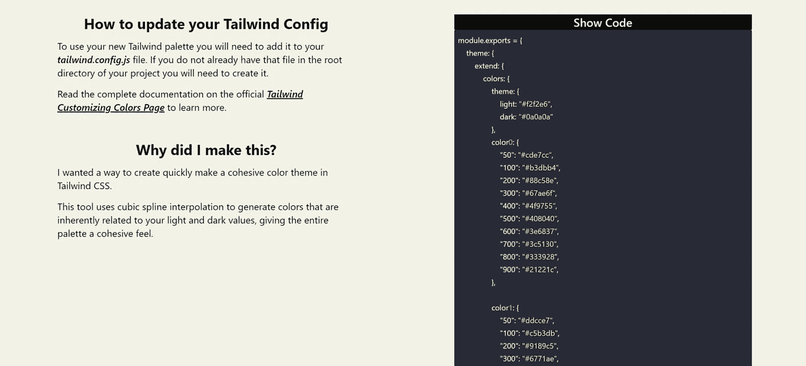

# 我为顺风 CSS 做了一个自动颜色主题生成器

> 原文：<https://betterprogramming.pub/i-made-an-automatic-color-theme-generator-for-tailwind-css-398da47846cc>

## 生成调色板不到一分钟的时间

[huewind.jordantwells.com](http://huewind.jordantwells.com)的登陆页面

最近迷上了 [T3 栈](https://create.t3.gg) ( [Next.js](https://nextjs.org) ， [TypeScript](https://www.typescriptlang.org) ， [Tailwind CSS](https://tailwindcss.com) ， [Prisma](https://www.prisma.io) ，以及 [tRPC](https://trpc.io) )。作为其中的一部分，我一直在使用 Tailwind CSS 来快速布局过去一个月我一直在做的每个项目的*格式。它使样式成为一种符号，就像将类写入你的 [JSX](https://reactjs.org/docs/introducing-jsx.html) 或 HTML 一样。*

但是我想要更多的选择。顺风团队提供的默认颜色是 [*精彩*](https://tailwindcss.com/docs/customizing-colors) ，但是我已经用' *bg-slate-700* '启动了太多项目。我决定是时候改变一些事情了。还有什么比制作自己的工具更好的方法呢？

HueWind 是一个致力于让有凝聚力的顺风 CSS 主题尽可能简单的网站。从像素艺术调色板创作者那里汲取灵感，我着重强调了主题的最亮值、原色和最暗值之间的干净混合。

在这里试一试，[huewind.jordantwells.com](http://huewind.jordantwells.com)，和往常一样，源代码可以在我的 GitHub 上的[github.com/jordantwells42/huewind](http://GitHub.com/jordantwells42/huewind)找到。

在[huewind.jordantwells.com](http://huewind.jordantwells.com)选择互补色

## 为什么要使用它而不是其他调色板生成器呢？

这个项目背后的关键是它对你网站上所有颜色的意识。典型的颜色样本是在*真空中生成的，*在真空中，基色不知道它们与其他基色的关系，整个样本不知道它与网站上最亮和最暗色调的关系。

作为四色配色方案的一部分，HueWind 会自动为您生成互补的主题颜色。这确保了你的主主题颜色和支持它的颜色之间有一个清晰的关系。

更重要的是，色板是根据您站点上最亮和最暗的色调生成的。

在 huewind.jordantwells.com[为你的网站选择最亮和最暗的色调](http://huewind.jordantwells.com)

典型的自动生成色板会将目标颜色过渡到纯白(#FFFFFF)以生成较浅的色调，过渡到纯黑(#000000)以生成较深的色调。虽然这种设计看起来很现代，但它也缺乏手工挑选的艺术调色板所具有的灵魂。

相反，HueWind 会查看您选择的最亮和最暗的阴影来创建其样本。从纯黑色到深紫色或者从炫目的白色到浅黄色的简单变化可以给网站的美感和感觉带来奇妙的变化。

HueWind 的调色板生成

## 它是如何工作的？

HueWind 使用[样条插值](https://en.wikipedia.org/wiki/Spline_interpolation)在你的亮、暗和底纹的色调、饱和度和值之间无缝过渡。

这将使用亮、底和暗阴影的 3 个点来唯一确定一条通过所有这些点的曲线，将阴影的 X 值分别设置为 0、500 和 1000。然后在顺风 CSS 的经典[50–900 值下评估该曲线，给出最终输出值。](https://tailwindcss.com/docs/customizing-colors)

重要的是，对于可访问性，我使用 [tinycolor](https://github.com/bgrins/TinyColor) 自动选择整个站点的可访问文本颜色。这包括在用户决定他们最喜欢的浅色阴影是白色而他们最喜欢的深色阴影是白色的情况下，使用纯黑色和纯白色的备用方案。

HueWind 生成的可立即使用的顺风 CSS 配置

## **试试看！**

生成调色板只需不到一分钟的时间！在 huewind.jordantwells.com 这里使用它！我相信你会看到我在 jordantwells.com 的未来项目中使用它。

约旦