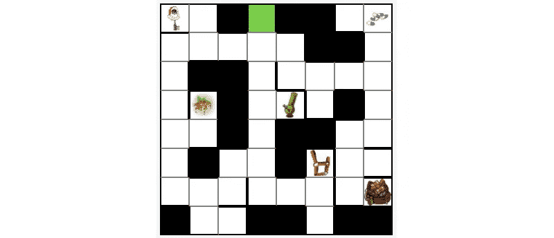
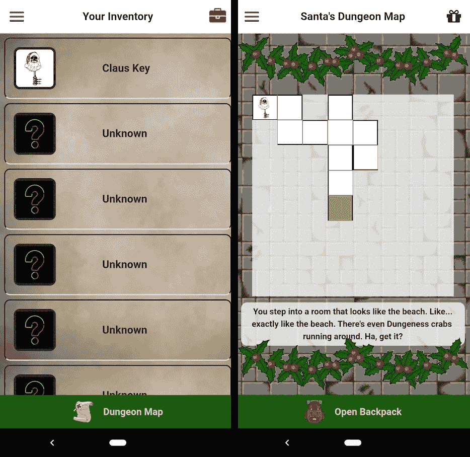
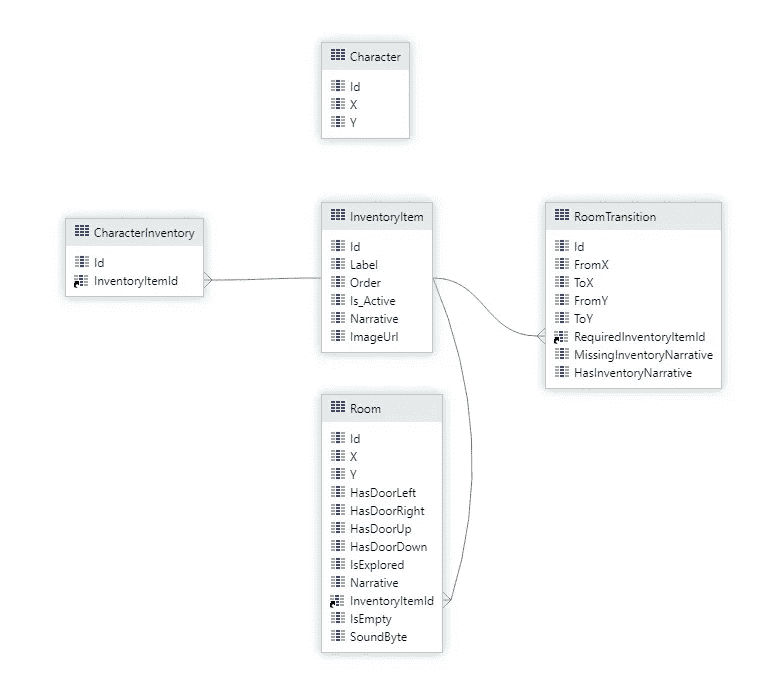
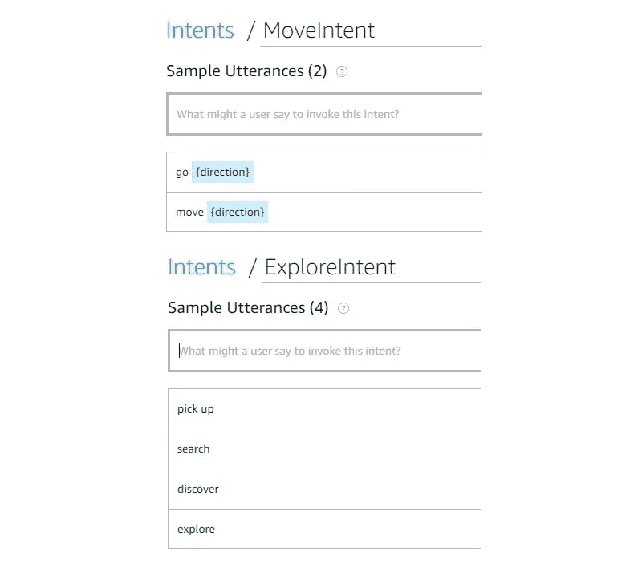
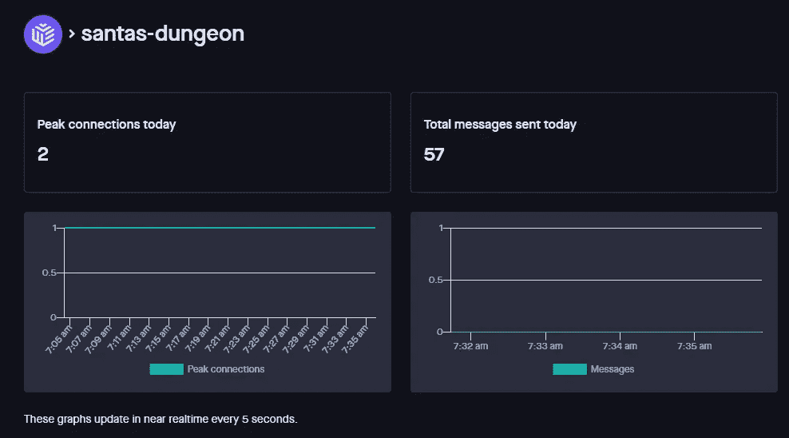

# 我又一次用 Alexa、WebSockets 和移动应用程序做出了有史以来最好的圣诞礼物

> 原文：<https://betterprogramming.pub/i-made-the-best-christmas-present-ever-again-with-alexa-websockets-and-mobile-apps-34012fcb7cc6>

## 每年，我都以一种非传统的方式给我哥哥送圣诞礼物。今年的礼物是迄今为止最好的

图片来自 [Pixabay](https://pixabay.com/?utm_source=link-attribution&amp;utm_medium=referral&amp;utm_campaign=image&amp;utm_content=21467) 。

每年，我都以一种非传统的方式给我哥哥送圣诞礼物。它开始只是圣诞节的一种搞笑方式，但最终升级到我把它变成了一场折磨。

去年，我让他[给他的礼物](https://medium.com/better-programming/how-i-built-the-best-christmas-gift-ever-with-twilio-aws-and-outsystems-6c6bc79c1c9d)打电话发短信，看看他们是否准备好被打开。在那之前的一年，他不得不做一些关于 AKC 狗品种的研究，并以此来决定打开礼物的顺序。

然而，今年……今年有所不同。

我的职业是软件开发人员，我的日常工作是使用很酷的新技术，所以我接触了很多不同的技术。我决定用我的经历为我弟弟提供一个身临其境的、独特的圣诞节早晨。

我给他做了个游戏。一个他可以在手机上“玩”的游戏，想出如何打开他的礼物。

踢球者？

他能控制游戏的唯一方法是通过他的 Echo 给 Alexa 下命令。

# 游戏

我做了一个基础的地牢爬虫游戏。我从一个 8x8 的网格开始，画出了一个地牢地板，有墙，锁着的门，还有藏在地图周围的物品。目标是找到所有的物品并通过地牢。

当他找到一件物品时，他可以在圣诞节当天打开面前相应的礼物。

当他玩游戏时，他可以选择*移动*或*探索*。如果他探索，他会在房间里寻找糖果和打开礼物的选项。如果他移动，他导航到下一个房间。

当他在房间间导航时，地图开始填充。随着每一个动作，他可以看到更多地牢的布局。对于每个房间，Alexa 都会告诉他一个故事的一部分。他越深入地牢，故事就越复杂。

很有趣，对吧？

*已完成地图的视图*

# 移动应用程序

每年在平安夜，我都会给我弟弟一份层压的“礼物接收指南”,以帮助他对第二天的冒险感到兴奋。今年的指南包括一个指向手机应用下载链接的二维码。他将安装应用程序并准备就绪。

这个应用程序本身非常简单。事实上，它是一个只读应用程序。由于所有的命令都要通过 Alexa，所以他除了看看它并计划下一步行动之外没有什么可做的。

该应用程序有两个屏幕:库存页面和地图页面。目录页显示了他找到的礼物及其相应的图片。地图页面显示了他探索过的房间和他找到某些物品的地方。

*手机 app 中的两个页面*

每当我需要快速构建某个东西时，我就会去找[外部系统](https://www.outsystems.com)。这是一个直观的低代码平台，让您可以快速构建反应式网页、web 服务和移动应用程序。最精彩的部分？它可以免费用于概念验证！

只有几个活动部件可以让这成为一次神奇的体验:

*   应用程序接口
*   移动应用程序
*   Alexa 技能
*   WebSocket

## API

应用程序必须有一个大脑来执行逻辑和存储状态。有史以来最好的圣诞礼物背后的大脑是一个内置于外部系统的简单 API。它在地图上加载你的位置，检查你是否可以按照你想要的方式移动，移动你，然后告诉你一个小故事。

整个应用程序实际上只有两个 API 端点:一个用于移动，另一个用于获取当前状态。获取当前状态只有在他离开应用程序并回来的时候才会出现(因为我知道我哥哥在某个时候需要休息一下)。

在幕后，我们有下面的数据模型来构建地图、故事、圣诞礼物清单和房间过渡。

*游戏实体关系图*

使用 OutSystems，我创建了数据模型、移动角色的逻辑和控制一切的 REST API。现在是构建前端的时候了！

## 移动应用程序

再一次，外部系统来帮忙了。它们提供了一个易于使用的用户界面，让你在屏幕上拖放组件，然后为你编译成一个移动应用程序。

于是我开始工作，创建了这两个页面来跟踪哪些礼物已经被发现，以及地图上的哪些区域已经被探索。我使用 API 来加载地图数据并将其呈现在屏幕上。

正如我之前提到的，这是一个非常简单的移动应用程序。这是一个只读应用程序。我只是玩了一些 CSS，添加了一些圣诞主题的图片，然后就结束了。

## Alexa 技能

我在日常工作中与 AWS 合作，所以我非常熟悉他们的许多服务。但是我从来没有建立过 Alexa 技能。我去了 Alexa 控制台，开始看一些视频。

事实证明，AWS 的 Alexa 团队真的知道他们在做什么。这是我见过的用简单的方法解决复杂问题的最好的例子之一。Alexa 技能实际上有两个组成部分:

*   互动模式
*   后端代码

交互模型只是映射出哪些单词或短语触发了特定的动作。你输入一串短语，将它们映射到 *intents* ，然后点击 build 按钮。控制台会为您完成剩下的部分。

对于这个基本游戏，我只有两件事可以做:移动和探索。

*Alexa 技能的两个意图*

后端代码也很容易编写。你可以直接在 [VS 代码](https://code.visualstudio.com/)中编码你的技能，然后用 [Alexa 扩展](https://developer.amazon.com/en-US/docs/alexa/ask-toolkit/get-started-with-the-ask-toolkit-for-visual-studio-code.html)把它推送到云端。

很简单。

对于代码，您必须定义每个意图在被调用时将做什么。对于这个游戏，我所做的就是调用我在 OutSystems 中构建的 API。所以我用 axios 对每个意图的相应 API 端点做了一个快速调用，并让 Alexa parrot 返回响应消息。

完成了完成了。

## WebSocket

在测试应用程序的过程中，我很快意识到我忘记了一些东西。当 Alexa 移动角色时，我如何更新移动应用程序？

我需要的东西，将推动数据到应用程序每当一个事件被触发。我需要一个*网络插座*。

WebSocket 本质上在浏览器(或移动应用程序)和服务器之间打开了一个双向通信通道。它允许您在消息发生时获取消息*而不是不断地轮询服务器更新。*

WebSocket 背后有很多东西。对我来说幸运的是，有一些公司专注于让它们对消费者来说更容易。

我在 [Pusher](https://www.pusher.com) 上创建了一个免费账户，点击几下就配置好了我的应用，我准备把它集成到我的 API 和移动应用中。

您几乎可以将 WebSocket 视为一种发布/订阅方法。当系统中发生一些事情时，您触发一个事件，订阅者获取它并执行一个操作。

我更新了我的 API，每当角色移动或探索时，我就发布我的 Pusher 事件。我还在消息中包含了 API 返回的故事的任何片段。

在移动应用程序中，我添加了一个订阅事件的简单 JavaScript 片段。订阅将刷新屏幕上的数据并显示故事的新片段。

我通过自己的回声做了一个快速测试，让我一说出这些话，这个角色就自动在地图上移动。多酷啊。

*显示 websocket 消息图的 Pusher 仪表盘*

# 揭秘

我在圣诞节前写这篇文章。我哥哥还没有体验过游戏的乐趣。

去年，我从打电话/发短信礼物的想法中得到的反馈是，这太难了，太依赖运气了。所以我把它放在心上，给他提供了一个有趣的游戏，这个游戏会提示他下一步该去哪里。

信不信由你，我不想让这成为他沮丧的经历。我希望这对他来说是一个独特而有趣的机会，也是我作为开发人员增长技能的学习机会。

我觉得今年是一个很好的妥协。它仍然相当复杂，但有一个真实的故事。另外，我还得用很多新奇的现代技术。

而且是免费的！我用来做这个礼物的所有东西都属于免费等级，这意味着唯一的花费就是我的时间。我花了大约 30 个小时来构思这个故事，绘制地图，并建立一切。这肯定是一项投资。

我们将在圣诞节时发现这一切是否值得。我一定会公布最新的结果。

圣诞快乐！