# 通过解决这 15 个项目欧拉问题，我掌握了 Golang 基础知识

> 原文：<https://betterprogramming.pub/i-mastered-golang-basics-by-solving-these-15-project-euler-problems-1254a3897cf8>

## 特殊的毕达哥拉斯，最大的回文，等等


来源:谷歌

你好。在这篇文章中，我想向你展示我在 Golang 中解决前 15 个欧拉问题时所学到的东西。这些问题的解决方案都可以在以下网址找到:

[](https://github.com/leogtzr/15_projecteuler_solutions_Golang) [## leogtzr/15 _ project Euler _ solutions _ Golang

### 在 GitHub 上创建一个帐户，为 leogtzr/15 _ project Euler _ solutions _ Golang 开发做出贡献。

github.com](https://github.com/leogtzr/15_projecteuler_solutions_Golang) 

# 欧拉项目

首先，什么是欧拉项目？简单来说就是一个有数学和计算机科学问题的网站。基本上，它为您提供了一个问题描述，您需要输入正确的答案，如下图所示:

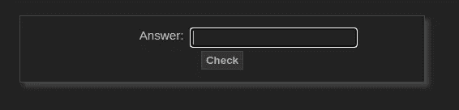

# 我为什么喜欢欧拉项目

当我在学习一门编程语言，并且我想在学习的时候获得一些乐趣时，我做的第一件事是:去 Project Euler 网站，尝试解决一些问题。这些问题将会给你一个完美的基础来实践如下的概念:

*   *循环结构* (for-loops，switch，continue，break)
*   *基本数据结构*(数组/链表)。
*   *算术运算符。*
*   *原始类型及其范围。*
*   *文件处理*(读/写)。
*   *类型转换。*
*   *从标准输入中读取。*
*   *通过* *值/参考值。*
*   *任意精度算术。*
*   等等。

所有这些概念对大多数编程语言来说都是通用的；不管你学的是哪一个，通过尝试解决它们，你会学到很多。

我们中的一些人甚至走得更远，在实践测试驱动开发( [TDD](https://en.wikipedia.org/wiki/Test-driven_development) )时试图解决它们。还有，不需要数学背景！您可以随时随地学习。

# 解决前 15 个问题

让我们试着解决前 15 个问题。我需要警告你:我仍在学习，我的解决方案可能远非完美。在某些情况下，我对优化不够重视，因为我的目的是找点乐子。

您可以在下面的 GitHub 资源库中找到完整的解决方案。请随时发送拉取请求🙂。

## 问题 1—3 和 5 的倍数

> “如果我们列出所有在 **10** 以下的是 **3** 或 **5** 的倍数的自然数，我们得到 **3** 、 **5、6** 和 **9** 。这些倍数之和就是 **23** 。
> 
> 求 **3** 或 **5** 低于 **1000** 的所有倍数之和。"

好吧，这似乎是某种[嘶嘶作响的问题。](https://en.wikipedia.org/wiki/Fizz_buzz)作为第一个问题，应该没那么难吧？解决方案如下:

```
package mainimport "fmt"func main() {
    sum := 0
    for i := 1; i < 1_000; i++ {
        if i%3 == 0 || i%5 == 0 {
            sum += i
        }
    }
    fmt.Printf("Sum: %d\n", sum)
}
```

输出:

```
Sum: 233168
```

没那么难。有趣的是，[数字前缀](https://golang.org/ref/spec#Integer_literals) `_`的用法有助于提高可读性。这里有一些重构的机会，我们将在本文后面重新讨论。让我们转到下一个问题🙂。

## **问题 2 —** 偶数斐波纳契数

> “斐波纳契数列中的每一个新项都是通过将前两项相加而生成的。从 1 和 2 开始，前 10 项将是:
> 
> 1, 2, 3, 5, 8, 13, 21, 34, 55, 89, …
> 
> 考虑斐波纳契数列中值不超过四百万的项，找出偶数项的总和。"

这个越来越有趣了。如何在围棋中生成斐波那契数列？这边走:

```
func main() {
    a := 0
    b := 1 for i := 0; i < 10; i++ {
        fmt.Println(a)
        copy := a + b
        a = b
        b = copy
    }
}
```

实际上，我们可以这样避免赋值语句交换这两个变量:

```
func main() {
    a := 0
    b := 1 for i := 0; i < 10; i++ {
        ret := a
        a, b = b, a+ret
        fmt.Println(ret)
    }
}
```

很酷，不是吗？🙂这给了我们序列，但并没有真正解决问题。我们需要对偶数 *< 4000000* 求和。这是我的解决方案:

```
package mainimport "fmt"func main() {
    a := 0
    b := 1
    sum := 0
    const max = 4_000_000 for b < max {
        buff := a + b
        if b%2 == 0 {
            sum += b
        }
        a = b
        b = buff
    } fmt.Printf("The sum is: [%d]\n", sum)
}
```

这次我用 ***const*** 来明确变量和常量的区别。我认为使用以下内容可能是一样的:

```
for ***b*** < **4_000_000** {
```

如我所说，目的是找点乐子，把一些概念付诸实践。我们还可以看到，这次数字文字前缀`_`有助于提高可读性。

输出:

```
The sum is: [**4613732**]
```

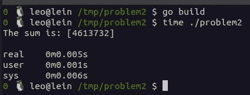

问题 2 —解决方案

它跑得很快。让我们转到下一个问题。

## **问题 3 —** 最大质因数

> **13195** 的质因数是 **5** 、 **7** 、 **13** 和 **29** 。
> 
> 600851475143 这个数的最大质因数是多少？"

酷！这个涉及到**质因数分解。寻找质因数分解的编程解决方案不会有任何问题。最常见的解决方案之一是[试除法算法。首先，让我们看看如何分解质数中的数字，然后我们将负责检查什么是最大的。](https://en.wikipedia.org/wiki/Trial_division)**

```
package mainimport (
    "fmt"
    "math"
)func **printPrimes**(n int) {
    for i := 2; i <= int(math.Sqrt(float64(n))); i++ {
        if n%i == 0 {
            fmt.Println(i)
            n /= i
            i--
        }
    }
    if n > 0 {
        fmt.Println(n)
    }
}func main() {
    n := **600851475143**
    **printPrimes**(n)
}
```

输出:

```
71
839
1471
6857
```

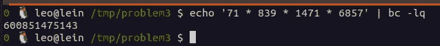

它可以工作，但是我很确定我们可以优化它。我们还可以看到最大的数字是**6857**，所以我们解决完这个问题了！让我们看看如何使用前面的代码计算最大值。首先，我们需要修改我们的`printPrimes()`函数来返回一部分质因数。代码已更改为以下内容:

```
func **primeFactors**(n int) []int {
    factors := make([]int, 0)
    for i := 2; i <= int(math.Sqrt(float64(n))); i++ {
        if n%i == 0 {
            factors = append(factors, i)
            n /= i
            i--
        }
    }
    if n > 0 {
        factors = append(factors, n)
    } return factors
}
```

很好，现在让我们创建一个函数来计算最大值，如下所示:

```
func largest(factors []int) int {
    max := factors[0] for _, factor := range factors {
        if factor > max {
            max = factor
        }
    } return max
}
```

完整的程序如下:

```
package mainimport (
    "fmt"
    "math"
)func largest(factors []int) int {
    max := factors[0] for _, factor := range factors {
        if factor > max {
            max = factor
        }
    } return max
}func primeFactors(n int) []int {
    factors := make([]int, 0)
    for i := 2; i <= int(math.Sqrt(float64(n))); i++ {
        if n%i == 0 {
            factors = append(factors, i)
            n /= i
            i--
        }
    }
    if n > 0 {
        factors = append(factors, n)
    } return factors
}func main() {
    n := 600851475143
    largestPrimeFactor := largest(primeFactors(n))
    fmt.Println(largestPrimeFactor)
}
```

输出:

```
6857
```

实际上，在撰写本文的这一部分时，我们也可以使用如下所示的 [factor linux 命令](https://man7.org/linux/man-pages/man1/factor.1.html):

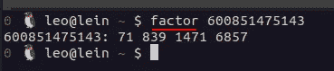

因子命令

## **问题 4 —** 最大回文乘积

> “一个回文数的两种读法是一样的。由两个 **2 位数的乘积构成的最大回文是 9009 = 91 × 99** 。
> 
> 找出由两个三位数的乘积构成的最大回文。"

好，我们怎么知道一个数是不是回文？第一种方法是将数字转换为`string`，反转`string` ，然后检查反转的`string` 是否与数字相同。但这听起来很复杂。所以，我们来试一个函数。以下函数在不使用`string`相关操作的情况下反转一个数字:

```
func isPalindrome(n int) bool {
    reverse := 0
    original := n
    for n != 0 {
        reverse = (reverse * 10) + (n % 10)
        n /= 10
    }
    return original == reverse
}
```

我们需要找到由两个三位数的乘积构成的最大回文。我们可能需要从 100 开始检查…该解决方案如下:

```
package mainimport "fmt"func isPalindrome(n int) bool {
    reverse := 0
    original := n
    for n != 0 {
        reverse = (reverse * 10) + (n % 10)
        n /= 10
    }
    return original == reverse
}func main() {
    max := 999
    for i := 100; i <= 999; i++ {
        for j := 100; j <= 999; j++ {
            product := i * j
            if isPalindrome(product) && product > max {
                max = product
            }
        }
    } fmt.Println(max)
}
```

输出:

```
906609
```

我很确定我们可以优化它，但是即使没有优化(如下所示)，它也运行得非常快:

```
$ time ./problem4 
906609real    0m0.045s
user    0m0.042s
sys 0m0.005s
```

< 0.05 seconds!

## **问题 5 —** 最小倍数

> " **2520** 是能被从 **1** 到 **10** 的每一个数整除且没有余数的最小数。
> 
> 能被从 **1** 到 **20** 的所有数字整除的最小正数是多少？"

似乎对于这个问题，我们需要记录可以在 1-10-1-20 范围内被分割的数字。我写了下面的代码来解决它:

```
package mainimport "fmt"func main() {
    max := **2520**
    for i := **max**; ; i++ {
        can := true
        for j := 1; j <= 20; j++ {
            if i % j != 0 {
                can = false
                break
            }
        }
        if can {
            max = i
            break
        }
    } fmt.Println(max)
}
```

不幸的是，这个程序没有其他程序运行得快。结果如下所示:

```
$ time ./problem5 
**232792560**real    0m7.032s
user    0m7.029s
sys 0m0.012s
```

## 问题 6 —平方差和

> “前十个自然数的平方和是，

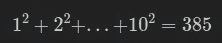

> 前十个自然数之和的平方是，

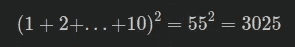

> 因此，前十个自然数的平方和与和的平方之差为。
> 
> 求前一百个自然数的平方和与和的平方之差。"

这可能是最简单的😃。以下是我的回答:

```
package mainimport "fmt"func main() {
    sumSquares := 0
    squaresOfTheSum := 0
    for i := 1; i <= 100; i++ {
        sumSquares += i * i
        squaresOfTheSum += i
    }
    **diffSums** := (**squaresOfTheSum** * **squaresOfTheSum**) - **sumSquares**
    fmt.Println(**diffSums**)
}
```

输出:

```
$ time ./problem6 
25164150real    0m0.004s
user    0m0.000s
sys 0m0.005s
```

## 问题 7–10001 质数

> “通过列出前六个素数: **2、3、5、7、11** 和 **13** ，我们可以看到**第六个素数**就是 **13** 。
> 
> 什么是**10 001**质数？"

在前面的问题中，我们已经看到了如何知道一个数是否是质数。对于这个问题，我们需要得到`nth` 数。

**解决方案:**

```
package mainimport (
    "fmt"
    "math"
)func nThPrimeNumber(n int) int {
    if n == 0 {
        return 0
    }
    count := 0
    i := 2
    for ; ; i++ {
        if isPrime(i) {
            count++
        }
        if count == n {
            break
        }
    } return i
}func isPrime(n int) bool {
    if n < 2 {
        return false
    } is := true max := math.Sqrt(float64(n))
    for i := 2; i <= int(max); i++ {
        if n % i == 0 {
            is = false
            break
        }
    } return is
}func main() {
    fmt.Println(nThPrimeNumber(10_001))
}
```

我们可以优化它，但是，正如您在下面看到的，它运行得非常快:

```
$ time ./problem7 
104743real    0m0.093s
user    0m0.094s
sys 0m0.001s
```

在我的电脑上大约需要 1.2 秒😮

## **问题 8 —** 系列中最大的产品

> “在 **1000 位数字**中具有最大乘积的四个相邻数字是**9**×**9**×**8**×**9**=**5832**。
> 
> 73167176531330624919225119674426574742355349194934
> 96983520312774506326239578318016984801869478851843
> 5615607911294949。
> 
> 在 **1000 位数字**中找出具有最大乘积的 13 个相邻数字。这个产品的价值是什么？"

这张真的很有意思！我们需要做的第一件事是*将这个 1000 位数的数字*展平在一个`string`中以便于操作，然后从位置`0`转到`***string.length - 13***`并计算最大的乘积。我的答案如下图:

```
package mainimport (
    "fmt"
    "strings"
)const (
    grid = `73167176531330624919225119674426574742355349194934
96983520312774506326239578318016984801869478851843
85861560789112949495459501737958331952853208805511
12540698747158523863050715693290963295227443043557
66896648950445244523161731856403098711121722383113
62229893423380308135336276614282806444486645238749
30358907296290491560440772390713810515859307960866
70172427121883998797908792274921901699720888093776
65727333001053367881220235421809751254540594752243
52584907711670556013604839586446706324415722155397
53697817977846174064955149290862569321978468622482
83972241375657056057490261407972968652414535100474
82166370484403199890008895243450658541227588666881
16427171479924442928230863465674813919123162824586
17866458359124566529476545682848912883142607690042
24219022671055626321111109370544217506941658960408
07198403850962455444362981230987879927244284909188
84580156166097919133875499200524063689912560717606
05886116467109405077541002256983155200055935729725
71636269561882670428252483600823257530420752963450`
    numberOfAdjacent = 13
)func main() {
    number := strings.ReplaceAll(grid, "\n", "")
    max := 0
    for i := 0; i < len(number) - numberOfAdjacent; i++ {
        product := 1
        for j := i; j < (i + numberOfAdjacent); j++ {
            product *= int(number[j] - '0')
        }
        if product > max {
            max = product
        }
    } fmt.Println(max)
}
```

将一个`digit-char`转换成一个`int`的代码非常常见。你用`char` 减去`*0*`。这将把`char` 转换成`int`。

```
$ time ./problem8 
23514624000real    0m0.006s
user    0m0.005s
sys 0m0.003s
```

## **问题 9 —** 特殊的毕达哥拉斯三联体

> “毕达哥拉斯三联体是三个自然数的集合， **a < b < c** ，其中，

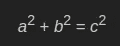

> 比如 32 + 42 = 9 + 16 = 25 = 52。
> 
> 恰好存在一个毕达哥拉斯三元组 **a + b + c = 1000** 。"

这似乎是一个蛮力解决方案的很好的候选。我的答案如下图:

```
package mainimport "fmt"func main() {
    out:
    for a := 1; a < 1_000; a++ {
        for b := 1; b < 1_000; b++ {
            for c := 1; c < 1_000; c++ {
                if ((a * a) + (b * b) == (c * c)) && (a + b + c == 1_000) && ((a < b) && (b < c)) {
                    product := a * b * c
                    fmt.Printf("%d + %d + %d = 1000, product = %d\n", a, b, c, product)
                    break out
                }
            }
        }
    }
}
```

输出:

```
$ time ./problem9 
200 + 375 + 425 = 1000, product = 31875000real    0m0.320s
user    0m0.317s
sys 0m0.005s
```

## **问题 10 —** 素数求和

> “10 以下的素数之和是 2 + 3 + 5 + 7 = 17。
> 
> 求所有低于**两百万**的质数之和。"

对于这一个，我们将需要重用我们的`*isPrime()*`函数。基本上，我们需要从 **2** 到 **2000000** 并检查每个数字。如果是质数，那就把它加到一个变量上。

这是我的解决方案:

```
package mainimport (
    "fmt"
    "math"
)func isPrime(n int) bool {
    if n < 2 {
        return false
    } is := true max := int(math.Sqrt(float64(n)))
    for i := 2; i <= max; i++ {
        if n % i == 0 {
            is = false
            break
        }
    } return is
}func main() {
    sum := 0
    for i := 2; i <= 2_000_000; i++ {
        if **isPrime**(i) {
            **sum** += i
        }
    }
    fmt.Println(**sum**)
}
```

`*isPrime()*`函数并没有完全优化，但是起作用，整个解决方案运行速度足够快(***<1.5 秒*** )。结果如下所示:

```
$ time ./problem10 
142913828922real    0m1.266s
user    0m1.263s
sys 0m0.005s
```

## **问题 11 —** 网格中最大的产品

> “在下面的 20×20 网格中，沿着对角线的四个数字已经用红色标出。

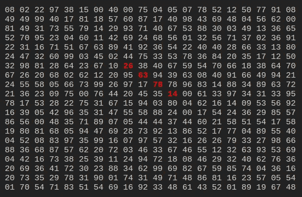

> 这些数的乘积是 26 × 63 × 78 × 14 = 1788696。
> 
> ***20×20 网格*** 中同方向(上、下、左、右、对角)四个相邻数字的最大乘积是多少？

这可能是最费力的工作之一。问题很简单，在一个特定的位置(行，列)，但我们如何才能在一个特定的方向移动，并获得四个相邻数字的乘积？任何方向和位置的条件都不一样。我最喜欢这个问题的一点是，我们可以练习几个主题，例如:

*   常数有[](https://golang.org/ref/spec#Iota)
*   *多态性*
*   *字符串转换(我们需要转换 20x20 网格中的数字)*
*   *转换条款*
*   *指针和更多*

*我针对这个问题做的第一件事就是把网格放在一个`string`里，写一个函数把网格文本转换成切片的切片。我的答案如下图:*

```
*const (
    **grid** = `08 02 22 97 38 15 00 40 00 75 04 05 07 78 52 12 50 77 91 08
49 49 99 40 17 81 18 57 60 87 17 40 98 43 69 48 04 56 62 00
81 49 31 73 55 79 14 29 93 71 40 67 53 88 30 03 49 13 36 65
52 70 95 23 04 60 11 42 69 24 68 56 01 32 56 71 37 02 36 91
22 31 16 71 51 67 63 89 41 92 36 54 22 40 40 28 66 33 13 80
24 47 32 60 99 03 45 02 44 75 33 53 78 36 84 20 35 17 12 50
32 98 81 28 64 23 67 10 26 38 40 67 59 54 70 66 18 38 64 70
67 26 20 68 02 62 12 20 95 63 94 39 63 08 40 91 66 49 94 21
24 55 58 05 66 73 99 26 97 17 78 78 96 83 14 88 34 89 63 72
21 36 23 09 75 00 76 44 20 45 35 14 00 61 33 97 34 31 33 95
78 17 53 28 22 75 31 67 15 94 03 80 04 62 16 14 09 53 56 92
16 39 05 42 96 35 31 47 55 58 88 24 00 17 54 24 36 29 85 57
86 56 00 48 35 71 89 07 05 44 44 37 44 60 21 58 51 54 17 58
19 80 81 68 05 94 47 69 28 73 92 13 86 52 17 77 04 89 55 40
04 52 08 83 97 35 99 16 07 97 57 32 16 26 26 79 33 27 98 66
88 36 68 87 57 62 20 72 03 46 33 67 46 55 12 32 63 93 53 69
04 42 16 73 38 25 39 11 24 94 72 18 08 46 29 32 40 62 76 36
20 69 36 41 72 30 23 88 34 62 99 69 82 67 59 85 74 04 36 16
20 73 35 29 78 31 90 01 74 31 49 71 48 86 81 16 23 57 05 54
01 70 54 71 83 51 54 69 16 92 33 48 61 43 52 01 89 19 67 48` **gridRowLen** = 20
    **adjacent** = 4
)func gridTextToMatrix2(grid string, matrixSize int) [][]int {
    matrix := make([][]int, matrixSize) for i := 0; i < matrixSize; i++ {
        matrix[i] = make([]int, matrixSize)
    } textRows := strings.Split(grid, "\n")
    for i := 0; i < len(textRows); i++ {
        row := textRows[i]
        cols := strings.Split(row, " ")
        for c := 0; c < len(cols); c++ {
            x, _ := strconv.ParseInt(cols[c], 10, 64)
            matrix[i][c] = int(x)
        }
    } return matrix
}*
```

*这应该行得通。现在，我们如何处理不同类型的运动？上、下、左、右或对角线。我已经用一个`iota`类型处理过了，如下所示:*

```
*type Direction intconst (
    Down Direction = iota
    Up
    Left
    Right
    DiagonalUpLeft
    DiagonalUpRight
    DiagonalDownLeft
    DiagonalDownRight
)*
```

*有了这个类型，现在我们可以在我的函数中使用多态性的`Direction`类型。我的答案如下图:*

```
*func canMove(row, col, adjacent int, direction Direction, grid *[][]int) bool {
    switch direction {
    case Right:
        if ((col + adjacent) > len(*grid)) || (row >= len(*grid)) {
            return false
        }
        return true
    case Left:
        if (((col + 1) - adjacent) < 0) || (row >= len(*grid)) {
            return false
        }
        return true
    case Up:
        if ((col < 0) || (col >= len(*grid))) || (((row + 1) - adjacent) < 0) {
            return false
        }
        if (row + 1) > len(*grid) {
            return false
        }
        return true
    case Down:
        if ((col < 0) || (col >= len(*grid))) || ((row + adjacent) > len(*grid)) {
            return false
        }
        return true
    case DiagonalUpLeft:
        if ((col + 1) - adjacent) < 0 {
            return false
        }
        if ((row + 1) - adjacent) < 0 {
            return false
        }
        if (row + 1) > len(*grid) {
            return false
        }
        return true
    case DiagonalUpRight:
        if ((row + 1) - adjacent) < 0 {
            return false
        }
        if (col + adjacent) > len(*grid) {
            return false
        }
        if row >= len(*grid) {
            return false
        }
        return true
    case DiagonalDownLeft:
        if (col < 0) || (col >= len(*grid)) {
            return false
        }
        if (row + adjacent) > len(*grid) {
            return false
        }
        if ((col + 1) - adjacent) < 0 {
            return false
        }
        return true;
    case DiagonalDownRight:
        if (col + adjacent) > len(*grid) {
            return false
        }
        if row >= len(*grid) {
            return false
        }
        if (col < 0) || (col >= len(*grid)) {
            return false
        }
        if (row + adjacent) > len(*grid) {
            return false
        }
        return true
    default:
        return false
    }
}func availableMoves(row, col int, grid *[][]int) []Direction {
    directions := []Direction{
        Down,
        Up,
        Left,
        Right,
        DiagonalUpLeft,
        DiagonalUpRight,
        DiagonalDownLeft,
        DiagonalDownRight,
    } available := make([]Direction, 0) for _, direction := range directions {
        if canMove(row, col, adjacent, direction, grid) {
            available = append(available, direction)
        }
    } return available
}*
```

*遗憾的是，没有办法摆脱这些冗长的函数。我们必须考虑所有的情况。以下函数将计算特定[行，列]上的`direction`的相邻的乘积:*

```
*func calculate(direction Direction, row, col, adjacent int, grid *[][]int) int {
    switch direction {
    case Right:
        p := 1
        for c := col; c < (col + adjacent); c++ {
            p *= (*grid)[row][c]
        }
        return p
    case Left:
        p := 1
        for c := col; c > (col - adjacent); c-- {
            p *= (*grid)[row][c]
        }
        return p
    case Up:
        p := 1
        for r := row; r > (row - adjacent); r-- {
            p *= (*grid)[r][col]
        }
        return p;
    case Down:
        p := 1
        for r := row; r < (row + adjacent); r++ {
            p *= (*grid)[r][col]
        }
        return p
    case DiagonalUpLeft:
        p := 1
        c := col
        for r := row; (r > (row - adjacent)) && (c > (c - adjacent));  {
            p *= (*grid)[r][c]
            r--
            c--
        }
        return p
    case DiagonalUpRight:
        p := 1
        r := row
        c := col
        for ; (r > (row - adjacent)) && (c < (col + adjacent)); {
            p *= (*grid)[r][c]
            r--
            c++
        }
        return p
    case DiagonalDownLeft:
        p := 1
        r := row
        c := col
        for ; r < (row + adjacent) && (c > (col - adjacent));  {
        p *= (*grid)[r][c]
            r++
            c--
        }
        return p
    case DiagonalDownRight:
        p := 1
        r := row
        c := col
        for ; (r < (row + adjacent)) && (c < (col + adjacent));  {
        p *= (*grid)[r][c]
            r++
            c++
        }
        return p
    default:
        return 0
    }
}*
```

*[解决方案](https://github.com/leogtzr/15_projecteuler_solutions_Golang/blob/main/problem11/main.go)运行时间不到 1.5 秒，您可以从下面的结果中看到:*

```
*$ time **./problem11** 
Max product is: 70600674real    0m0.006s
user    0m0.006s
sys 0m0.001s*
```

## *问题 12——高度可分的三角形数*

> *“三角形数列是通过自然数相加生成的。所以第七个三角形的数字是 1 + 2 + 3 + 4 + 5 + 6 + 7 = 28。前十项是:*
> 
> *1, 3, 6, 10, 15, 21, 28, 36, 45, 55, …*
> 
> *让我们列出前七个三角形数字的因数:*
> 
> ***1**:1
> 3:1，3
> 6:1，2，3，6
> 10:1，2，5，10
> 15:1，3，5，15
> 21:1，3，7，21
> 28:1，2*
> 
> *我们可以看到 28 是第一个有五个以上除数的三角形数。*
> 
> *超过五百个约数的第一个三角形的值是多少？"*

*先看看怎么蛮力吧。第一种简单的方法如下:*

```
*package mainimport "fmt"func main() {
    n := 1
    triangle := 0
    for ;; {
        triangle += n
        numberOfDivisors := 0
        for i := 1; i <= triangle; i++ {
            if triangle % i == 0 {
                numberOfDivisors++
            }
        }
        if numberOfDivisors >= 300 {
            fmt.Printf("triangle: %d has %d divisors\n", triangle, numberOfDivisors)
            break
        }
        n++
    }
}*
```

*该解决方案能够在大约 13 秒内找到第一个超过 300 个除数的数字，如以下结果所示:*

```
*$ time ./problem12 
triangle: **2162160** has 320 divisorsreal    0m12.920s
user    0m12.917s
sys 0m0.016s*
```

*当试图找到第一个超过 ***500 个约数*** 的数时，上面的算法真的真的很慢。*

***高度合成的三角数***

*经过一番研究和挫折，我发现这些数被称为“高复合三角数”。该列表可以在[在线整数序列百科全书](https://oeis.org/A076711)中找到。我们有我们的解决方案，我们要找的号码是 ***76576500*** 。*

*概述问题解决方案为我们提供了以下帮助:*

> *当除数超过三角形数的平方根时，可以通过停止除法来改进。对于每一个精确到平方根的除数，平方根以上都有相应的除数。”*

*在这个帮助下改变了我的算法后，我得出了以下结论:*

```
*package mainimport (
    "fmt"
    "math"
)func main() {
    n := 1
    triangle := 0
    for {
        triangle += n
        numberOfDivisors := 0
        to := int(math.Sqrt(float64(triangle)))
        for i := 1; i <= to; i++ {
            if triangle%i == 0 {
                numberOfDivisors += 2
            }
        }
        if numberOfDivisors >= 500 {
            fmt.Printf("triangle: %d has %d divisors\n", triangle, numberOfDivisors)
            break
        }
        n++
    }
}*
```

*如下图，不到一秒就找到解了！*

```
*time ./problem12-improved2 
triangle: 76576500 has 576 divisorsreal    0m0.407s
user    0m0.409s
sys 0m0.000s*
```

## ***问题 13 —** 大额*

> *“算出下面 100 个 50 位数之和的前十位数字:*

```
*37107287533902102798797998220837590246510135740250
46376937677490009712648124896970078050417018260538
74324986199524741059474233309513058123726617309629
91942213363574161572522430563301811072406154908250
23067588207539346171171980310421047513778063246676
89261670696623633820136378418383684178734361726757
28112879812849979408065481931592621691275889832738
44274228917432520321923589422876796487670272189318
47451445736001306439091167216856844588711603153276
70386486105843025439939619828917593665686757934951
62176457141856560629502157223196586755079324193331
64906352462741904929101432445813822663347944758178
92575867718337217661963751590579239728245598838407
58203565325359399008402633568948830189458628227828
80181199384826282014278194139940567587151170094390
35398664372827112653829987240784473053190104293586
86515506006295864861532075273371959191420517255829
71693888707715466499115593487603532921714970056938
54370070576826684624621495650076471787294438377604
53282654108756828443191190634694037855217779295145
36123272525000296071075082563815656710885258350721
45876576172410976447339110607218265236877223636045
17423706905851860660448207621209813287860733969412
81142660418086830619328460811191061556940512689692
51934325451728388641918047049293215058642563049483
62467221648435076201727918039944693004732956340691
15732444386908125794514089057706229429197107928209
55037687525678773091862540744969844508330393682126
18336384825330154686196124348767681297534375946515
80386287592878490201521685554828717201219257766954
78182833757993103614740356856449095527097864797581
16726320100436897842553539920931837441497806860984
48403098129077791799088218795327364475675590848030
87086987551392711854517078544161852424320693150332
59959406895756536782107074926966537676326235447210
69793950679652694742597709739166693763042633987085
41052684708299085211399427365734116182760315001271
65378607361501080857009149939512557028198746004375
35829035317434717326932123578154982629742552737307
94953759765105305946966067683156574377167401875275
88902802571733229619176668713819931811048770190271
25267680276078003013678680992525463401061632866526
36270218540497705585629946580636237993140746255962
24074486908231174977792365466257246923322810917141
91430288197103288597806669760892938638285025333403
34413065578016127815921815005561868836468420090470
23053081172816430487623791969842487255036638784583
11487696932154902810424020138335124462181441773470
63783299490636259666498587618221225225512486764533
67720186971698544312419572409913959008952310058822
95548255300263520781532296796249481641953868218774
76085327132285723110424803456124867697064507995236
37774242535411291684276865538926205024910326572967
23701913275725675285653248258265463092207058596522
29798860272258331913126375147341994889534765745501
18495701454879288984856827726077713721403798879715
38298203783031473527721580348144513491373226651381
34829543829199918180278916522431027392251122869539
40957953066405232632538044100059654939159879593635
29746152185502371307642255121183693803580388584903
41698116222072977186158236678424689157993532961922
62467957194401269043877107275048102390895523597457
23189706772547915061505504953922979530901129967519
86188088225875314529584099251203829009407770775672
11306739708304724483816533873502340845647058077308
82959174767140363198008187129011875491310547126581
97623331044818386269515456334926366572897563400500
42846280183517070527831839425882145521227251250327
55121603546981200581762165212827652751691296897789
32238195734329339946437501907836945765883352399886
75506164965184775180738168837861091527357929701337
62177842752192623401942399639168044983993173312731
32924185707147349566916674687634660915035914677504
99518671430235219628894890102423325116913619626622
73267460800591547471830798392868535206946944540724
76841822524674417161514036427982273348055556214818
97142617910342598647204516893989422179826088076852
87783646182799346313767754307809363333018982642090
10848802521674670883215120185883543223812876952786
71329612474782464538636993009049310363619763878039
62184073572399794223406235393808339651327408011116
66627891981488087797941876876144230030984490851411
60661826293682836764744779239180335110989069790714
85786944089552990653640447425576083659976645795096
66024396409905389607120198219976047599490197230297
64913982680032973156037120041377903785566085089252
16730939319872750275468906903707539413042652315011
94809377245048795150954100921645863754710598436791
78639167021187492431995700641917969777599028300699
15368713711936614952811305876380278410754449733078
40789923115535562561142322423255033685442488917353
44889911501440648020369068063960672322193204149535
41503128880339536053299340368006977710650566631954
81234880673210146739058568557934581403627822703280
82616570773948327592232845941706525094512325230608
22918802058777319719839450180888072429661980811197
77158542502016545090413245809786882778948721859617
72107838435069186155435662884062257473692284509516
20849603980134001723930671666823555245252804609722
53503534226472524250874054075591789781264330331690*
```

*这个也很有趣。很明显，一个原始数字无法容纳所有这些数字的总和，所以我们将需要使用 [*大数字*](https://golang.org/pkg/math/big/) *。*解决方案非常简单，如下所示:*

```
*package mainimport (
    "fmt"
    "math/big"
    "strings"
)const numText = `37107287533902102798797998220837590246510135740250
... more numbers
...
`func main() { sum := big.NewInt(0) for _, line := range strings.Split(numText, "\n") {
        n := new(big.Int)
        bn, _ := n.SetString(line, 10)
        sum.Add(sum, bn)
    } sumStr := sum.String()
    fmt.Println(sumStr[:10])}*
```

*输出:*

```
*$ time ./problem13 
5537376230real    0m0.006s
user    0m0.003s
sys 0m0.004s*
```

## ***问题 14 —** 最长排序序列*

> *为正整数集合定义了以下迭代序列:*
> 
> *`n → n/2 (n is even)
> n → 3n + 1 (n is odd)`*
> 
> *使用上述规则，从 13 开始，我们生成以下序列:*
> 
> **13→40→20→10→5→16→8→4→2→1**
> 
> *可以看出，这个序列(从 13 开始，到 1 结束)包含 10 个术语。虽然还没有证明(Collatz 问题)，但是认为所有的起始数都以 1 结尾。*
> 
> *哪一个小于一百万的起始数字产生了最长的链？*
> 
> *注意:一旦连锁开始，条款允许超过一百万。"*

*我的解决方案是:*

```
*package mainimport "fmt"func main() {
    numberThatGeneratesTheLongestChain := 1
    chainLen := 1 for i := 2; i <= 1_000_000; i++ {
        count := 1
        start := i
        for start != 1 {
            if start % 2 == 0 {
                start /= 2
            } else {
                start = start * 3 + 1
            }
            count++
        }
        if count > chainLen {
            chainLen = count
            numberThatGeneratesTheLongestChain = i
        }
    }
    fmt.Printf("%d generates %d\n", numberThatGeneratesTheLongestChain, chainLen)

}*
```

*下面显示的解决方案也是蛮力的，但它有效( *< 0.2 秒*):*

```
*$ time ./problem14 
837799 generates 525real    0m0.243s
user    0m0.240s
sys 0m0.004s*
```

## ***问题 15 —** 点阵路径*

> *“从一个 **2×2 网格**的左上角开始，只能向右下移动，到右下角正好有 6 条路线。*

*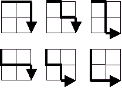*

> *通过一个 **20×20 的网格**有多少条这样的路线？"*

*这个问题叫做[【格子路径】](https://www.robertdickau.com/lattices.html)。这些路径可以使用[中心二项式系数](https://www.robertdickau.com/manhattan.html)来计算，例如:*

*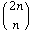**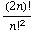*

*n = 20*

*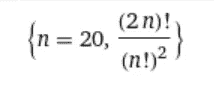*

*该解决方案可通过 Wolfram Alpha 进行检查，链接如下:*

*[](https://www.wolframalpha.com/input/?i=n+%3D+20%3B+%282+*+n%29%21+%2F+%28n%21%29%5E2) [## n = 20(2 * n)！/ (n！)^2 -沃尔夫拉姆|阿尔法

### 啊哦！Wolfram|Alpha 没有 JavaScript 就无法运行。请启用 JavaScript。如果你不知道怎么做，你可以找…

www.wolframalpha.com](https://www.wolframalpha.com/input/?i=n+%3D+20%3B+%282+*+n%29%21+%2F+%28n%21%29%5E2) 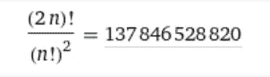

如您所见，该解决方案涉及到使用阶乘函数。问题是，我们需要计算 40 这个数字的阶乘，这会溢出类型。我们将需要再次使用大数字。让我们用大数写一个阶乘函数，帮助我们计算`(2 * n)! / (n!)²`:

```
package mainimport (
    "fmt"
    "math/big"
)func factorial(n int) *big.Int {
    f := big.NewInt(1) for i := 1; i <= n; i++ {
        f.Mul(f, big.NewInt(int64(i)))
    } return f
}func main() {
    // n = 20; (2 * n)! / (n!)^2 n := 20
    a := factorial(2  * n)
    b := factorial(n)
    b.Mul(b, b) result := new(big.Int) result.Div(a, b) fmt.Println(result)
}
```

输出:

```
$ time ./problem15 
137846528820real    0m0.005s
user    0m0.001s
sys 0m0.005s
``` 

# *我学习编程语言基础的策略*

*假设我想学习 Ruby、Nim、Clojure 或 Haskell，我会在 Project Euler 上创建一个帐户并尝试解决前 15 个问题。*

*一旦我完成了，我就回到第一个问题，并尝试基于我从其他编程语言中了解到的重构技术来更改代码。*

*例如，对于第一个问题，我使用了以下条件:*

```
*if i % 3 == 0 || i % 5 == 0 {
    sum += i
}*
```

*我可以把它改成如下:*

```
*package mainimport "fmt"func isDivisibleBy3Or5(n int) bool {
    return n % 3 == 0 || n % 5 == 0
}func main() {
    sum := 0
    for i := 1; i < 1_000; i++ {
        if isDivisibleBy3Or5(i) {
            sum += i
        }
    }
    fmt.Printf("Sum: %d\n", sum)
}*
```

*然后问自己，“这是惯用的吗？”。然后，挖掘它，继续前进。*

# *结论*

*我鼓励您尝试用自己选择的编程语言来解决其中的一些问题。目标是在学习的同时找点乐子！*

*请在评论中让我知道你的想法。谢谢大家！*

*[https://github.com/leogtzr/15_projecteuler_solutions_Golang](https://github.com/leogtzr/15_projecteuler_solutions_Golang)*