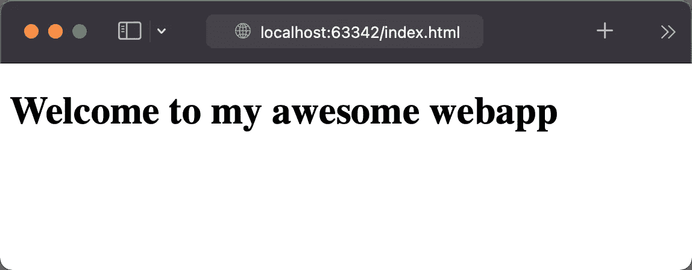
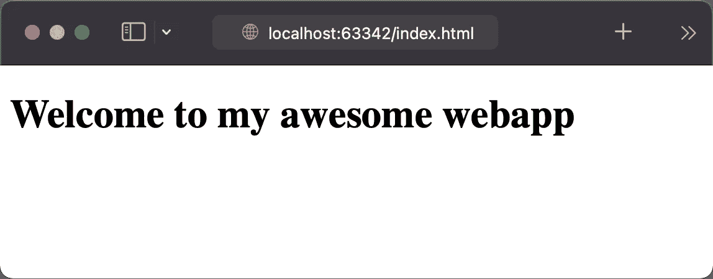
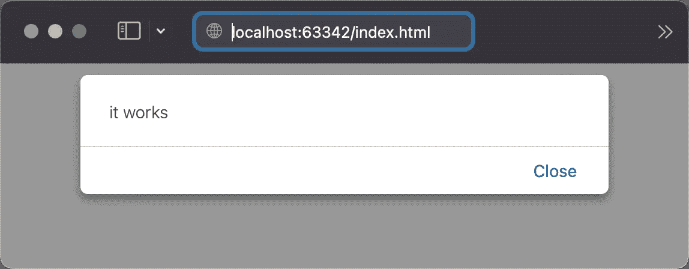

# 我离开了 web pack——当我直接在浏览器中加载 Vue 时，我遇到了一些问题。

> 原文：<https://betterprogramming.pub/i-moved-away-from-webpack-and-when-i-loaded-vue-directly-in-the-browser-i-faced-some-problems-4ab875c5b8c9>

## 我为什么需要捆扎机？跟我一起踏上如何在浏览器中直接加载 Vue 单个文件组件的旅程。

几个月后，我对 Webpack 越来越失望，每次更新后都必须修复一些东西，这让我开始疲惫不堪，所以我问自己:为什么我需要一个 bundler？app 可以直接在浏览器中运行吗？浏览器 API 都长大了，就试试吧！

所以我的第一个目标是创建我能想到的最简单的 Vue 应用。只需从 Vue 导入`createApp`函数，在屏幕上显示一个简单的模板。如何在浏览器中加载 Vue？ [Vue 文档](https://vuejs.org/guide/quick-start.html#without-build-tools)知道答案:Vue 源代码可以通过内容交付网络加载:

当我在浏览器中打开应用程序时，我意识到:我的方向是正确的！我可以不用捆绑器在浏览器中运行 Vue。

但是把整个 app 写在`main.ts`文件单里还是挺不方便的。当我使用 bundler 时，我可以使用 Vue 的[单个文件组件](https://vuejs.org/guide/scaling-up/sfc.html#introduction)将应用程序拆分成组件。

如果捆绑器能做到这一点，为什么浏览器就不能做到这一点呢？跟我一起踏上在浏览器中直接加载单个文件组件的旅程。

# 直接在浏览器中加载单个文件组件

上面的应用程序非常简单，它只是一个没有逻辑的模板。如果我在一个页面组件中做同样的事情，它看起来像

嗯，我如何在浏览器中直接加载这样的文件？

1.  使用 fetch API，我可以从服务器加载组件文件。
2.  然后可以使用`innerHTML`属性将文件转换成组件的 DOM 表示。
3.  `querySelector`允许提取模板元素。

这都是魔术！通过这个函数，我可以导入非常简单的 ChildComponent.vue

如果我打开浏览器，我知道，应该显示什么:

是啊！我成功地从一个 Vue 单文件组件中加载了一个模板！太棒了。但是没有逻辑的 Vue 组件的用途非常有限。逻辑呢？

# 向组件添加逻辑

`ChildComponent`正在成为一个具有模板和逻辑的完全真实的组件。

但是这并不像看起来那么简单，首先我们不能只使用`innerHTML`来评估脚本。为什么？innerHTML 上的 [HTML5 规范告诉我为什么:](https://www.w3.org/TR/2008/WD-html5-20080610/dom.html#innerhtml0)

> 注意:使用`innerHTML`插入的`script`元素在插入时不执行。

这意味着浏览器不会有所帮助。所以我只能靠自己了。

我首先想到的是创建一个`<script>`标签或者使用丑陋的`eval`函数，但是`<script>`标签或者`eval`函数是前模块时代的恐龙。但是 Vue 单组件文件在其逻辑部分有一个默认导出的模块。这意味着以上两个选项都是无效选项。

还有第三种不太为人所知的评估模块的方法:如果我将逻辑表示为一个[数据 URI](https://en.wikipedia.org/wiki/Data_URI_scheme) ，那么`import()`操作符让我动态加载 JavaScript 模块:

上面的代码将显示警告窗口

这是我一直在寻找的诀窍。使用这个技巧，单个组件文件导入功能就变成了。

现在我的单组件文件加载器已经支持模板和逻辑。现在，我可以不用捆绑器在浏览器中使用 Vue。但是过了一段时间后，样式表变得相当混乱。如何在单组件文件中使用样式？

# 设计组件的样式

这比预期的要容易。我唯一要做的事情就是将样式元素从单个文件组件移动到实际的 DOM 中。这可以通过一行代码来完成:

就是这样！我们可以使用带有模板、逻辑和样式的单个组件文件。

但是当我介绍我的第一个子模块时，什么都不能用了。我们所有进口的单组分文件都坏了。

# 修复动态导入

首先:它们为什么会坏掉？公平地说，浏览器应该如何解析相对路径？我使用导入技巧来评估逻辑，通过这样做，浏览器失去了上下文。浏览器没有机会知道模块的相对路径。

这是最后一个问题。如果我设法解决了这个问题，我就可以使用单个组件文件在浏览器中运行一个完整的 Vue 应用程序。

为了修复导入，我需要用绝对路径替换所有相对导入路径。这段代码有点复杂，但本质上，我需要完成以下三个步骤:

1.  我需要确定导入的单个组件文件的基本 url。这可以通过使用`<base>`将模块的相对路径转换成绝对路径来完成。
2.  使用正则表达式查找所有导入语句
3.  并用绝对路径替换每个相对导入路径。

最终的单个组件导入器变得有点复杂，但是只需 50 行代码，我就可以导入 Vue 单个组件文件！这真是难以置信！我们可以只运行 Vue 单文件组件，不需要捆绑器。但是现在来了:这是一个很好的技术演示，但是不要在生产中使用。

所以我回到了 Webpack，在浪费了很多时间搜索后，我解决了我的 Webpack 冲突，并从此使用 Webpack。

# 结论

这个例子展示了网络在过去十年中是如何发展的。原生浏览器 API 已经达到这一点，我们可以运行一个完整的 Vue 应用程序，而不需要捆绑器。浏览器 API 每年都变得更加强大，如果以这样的速度发展下去，今天使用的许多工具可能在几年内就会过时。

这太不可思议了！只需 50 行代码就可以导入 Vue 单个文件组件。但这不能和 [@vue/compiler-sfc](https://github.com/vuejs/core/tree/main/packages/compiler-sfc) 相比。上面的解决方案缺少许多功能，如作用域样式、脚本标记中的其他语言(如 TypeScript)或热模块替换。在浏览器能够为捆绑者提供类似的开发者体验之前，还有很长的路要走。