# 我用 SvelteKit 重建了我的博客

> 原文：<https://betterprogramming.pub/i-rebuilt-my-blog-with-sveltekit-4f10438c8102>

## 我用 Jekyll 和 Svelte 建立的网站的比较


Antonio Guillem 的原始照片

几个月前我的一个同事推荐了`Svelte`。

起初，我以为

> “哦，太棒了，一个新的 JavaScript 框架，正是我们所需要的，而不是有数百个这样的框架”

我通常说我是一名后端开发人员，但是我确实知道一些前端框架，尽管我在那个领域还不成熟。我一直在努力熟悉 React(专业地使用它)和 Jekyll(在我当前的博客中使用它)。我花了很长时间才有效地使用它们。

如果你喜欢视频的话，这篇文章的视频记录

起初，我对学习 Svelte 毫无兴趣，但我听到的越来越多，然后我看到它获得了[最受喜爱的 web 框架](https://insights.stackoverflow.com/survey/2021#section-most-loved-dreaded-and-wanted-web-frameworks)。

我开始阅读更多关于它的资料，因为它听起来很有希望。下面是引起我注意的信息和特性的简短回顾。

*   Web 应用程序是在构建时编译的，由于[优化](https://vitejs.dev/guide/features.html#build-optimizations)，它们可以运行得非常快。
*   苗条是非常容易使用的低复杂性
*   没有自定义语法，简单的 HTML，JavaScript 和 CSS。所以入门水平低。

# 什么是 Svelte 和 SvelteKit？

Svelte 是一个 JavaScript 框架，Svelte 不使用[虚拟 DOM](https://svelte.dev/blog/virtual-dom-is-pure-overhead) 如 React 或 Vue 来处理应用程序的状态。

不使用虚拟 DOM 的事实让 Svelte 成为`truly reactive`。这意味着，当我们更新值时，我们不必做任何修改或样板代码来重新呈现变量。我认为每个编写过 React 应用程序的人有时都会遇到这个问题。

在苗条，当我们更新一个点击计数器等，它自动更新，没有`useEffects`，`useState`，或其他挂钩。

这是一个简单的按钮组件，它递增一个计数器，并打印该计数器。

```
<script>
   let count = 0;
   function update(){
    count++;
   }
</script>

<p>
 Current Count: {count}
</p>
<button on:click={update}>
 Increase
</button>

<style>
 p{
  color: red;
 }
</style>
```

你可以在 [REPL](https://svelte.dev/repl/6b46e10dae684dbab87b411c19d3878a?version=3.53.1) 试试上面的代码。Svelte 最酷的一点是，同一个组件中的所有内容都是有范围的。所以将`p`的颜色改为红色只会影响声明 CSS 的组件。

让我喜欢上 [Go](https://go.dev/) 的一点是它简单的语法和低模板。Svelte 承诺同样的事情，但对于网络应用。

关于 Svelte 的另一个很酷的事情是，不是让浏览器做大部分的处理，而是由服务器来处理。Web 应用程序在交付生产之前进行编译，允许服务器执行一系列构建优化。这使得创建高速网站成为一项简单的任务。

一旦你开始学习苗条，用不了多久你就会面临[苗条套装](https://kit.svelte.dev/)这个术语。Svelte 是 JavaScript 框架，而 SvelteKit 是应用程序框架。

SvelteKit 用于构建使用 Svelte 的应用程序，它增加了许多功能。在我看来，最重要的两个因素如下。

# 预渲染

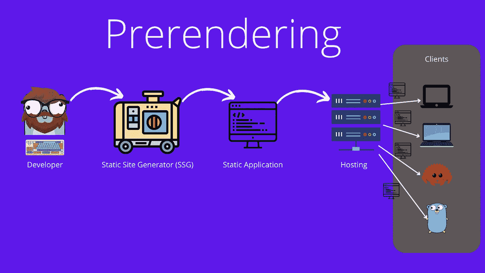

预呈现是指静态站点生成器创建一个静态站点，并在存储时提供服务

应用程序是在构建时计算的，静态应用程序[是在访问网站时存储和提供的，这意味着加载时间大大减少，因为许多繁重的工作已经为客户端完成。](https://en.wikipedia.org/wiki/Static_web_page)

这与服务器渲染不同，因为它发生在构建时，我们只能通过重新构建应用程序来更改内容。但是在服务器上要容易得多，因为它不需要重新渲染所有内容。

当你有一个静态网站时，比如一个所有内容都可以预先确定的博客，预渲染是一个神奇的工具。

注意，有了 SvelteKit，结合 SSR、预渲染和 CSR 真的很容易。因此，我们可以预渲染可以预渲染的内容和任何静态组件，并利用其他令人惊叹的功能，如针对其他内容的 SSR。

# 按指定路线发送

苗条本身没有路由的方法。这就是 SvelteKit 的用武之地，它增加了轻松路由用户的可能性。

SvelteKit 支持基于文件的[路由系统](https://kit.svelte.dev/docs/routing)。它使得使用文件名前缀`+server.js`控制应该在服务器上运行的任何代码变得非常容易，或者使用`+page.js`控制应该在客户机上运行的任何代码。这和我们在《化身博士》中的做法很相似，所以我从一开始就很熟悉。

# 摆脱哲基尔？


我会用一个苗条的博客取代我的 Jekyll 博客吗？

我以前的博客是我在网上找到的一个模板，我觉得它看起来不错，而且很有效。网站是用 Jekyll 搭建的，我从一开始就不喜欢。

我不喜欢哲基尔的地方是:

*   它用的是 Ruby，我没兴趣学。你不必用 Ruby 编码，但是它利用了 Ruby 的工具。
*   我在 Jekyll 中使用 [Gems](https://jekyllrb.com/docs/ruby-101/#gems) 时遇到了很多麻烦，它们中的许多都很旧，并且存在许多依赖问题、版本冲突等等。
*   我体验到在本地工作和执行更改时速度非常慢。
*   我很难理解如何使用 Jekyll，这是许多新的术语，它没有给我留下明显的印象。

我选择了基于 Jekyll 模板，因为它易于部署到 GitHub 页面上，而且使用起来也很快。

但是因为 SvelteKit 也支持使用静态站点生成器( [SSG](https://kit.svelte.dev/docs/glossary#ssg) )生成一个完全静态的网站，所以将其部署到 GitHub 页面没有问题。

鉴于我不喜欢 Jekyll 的工作方式和周围的工具，我更习惯于 SvelteKit 使用的工具，如 NPM，纱线和维特。我决定尝试用苗条来重写我现在的博客。

# 比较网站


斯维特和哲基尔之间的生死之战

让我们开始比较网站和他们的表现。我会比较使用[灯塔](https://www.elegantthemes.com/blog/wordpress/what-is-google-lighthouse-and-how-to-use-it)的网站。Lighthouse 存在于任何基于 Chrome 浏览器的开发者标签中(F12 打开)，或者通过一个扩展。你也可以使用 [PageSpeedInsights](https://pagespeed.web.dev/) 运行它的在线版本。我已经将这两个应用程序部署到 GitHub 页面，并将在部署的版本上运行测试。

Lighthouse 是一个测量你的网站的 [SEO](https://web.dev/lighthouse-seo/) 、[性能](https://web.dev/performance-scoring/)、[可访问性](https://web.dev/learn/design/accessibility/)和[最佳实践](https://web.dev/lighthouse-best-practices/)的工具。

SEO 是通过检查搜索引擎是否能够理解内容，页面是否能够被抓取和索引，以及它是否是移动友好的来衡量的。

性能是与网站速度相关的多个指标之间的加权值，我们将很快看到更多这些指标。

检查可访问性以确保您的网站响应迅速，并适用于多种屏幕尺寸。

最佳实践检查我们是否遵循了 Web 重要的最佳实践，页面是否使用了过时的技术，是否快速和安全。

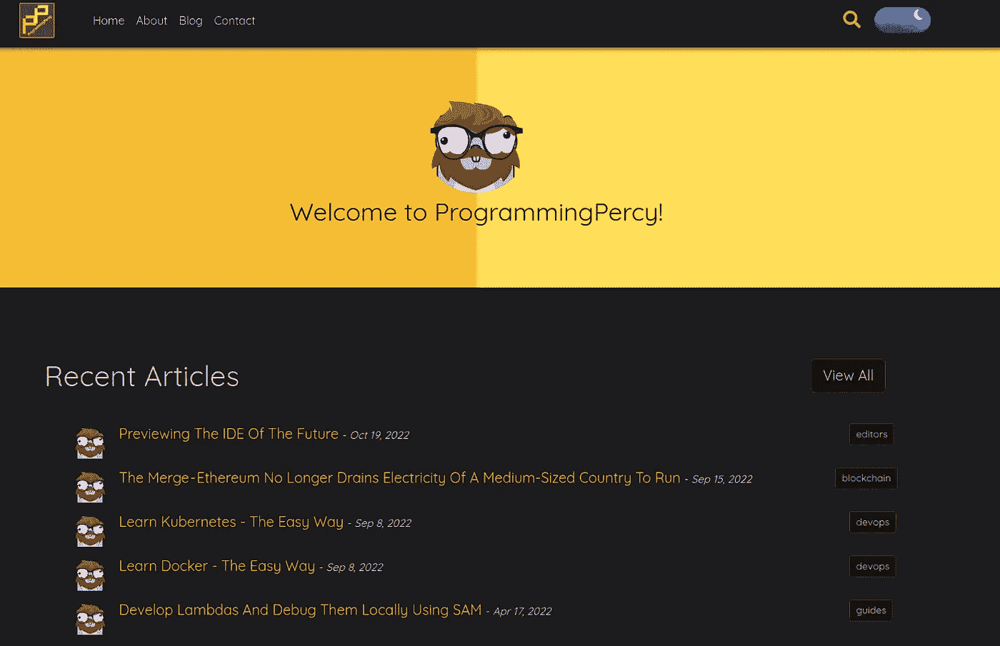

旧网站主页——这是旧网站的样子，非常简单。

访问我的博客时，旧的启动屏幕非常简单，它显示了 5 个最新的帖子和一点点文字。它的图像很少，看起来很简单。

让我们在这个网站上运行 lighthouse 并查看结果。我将在移动设备上运行 lighthouse，因为移动设备通常速度较慢，应用也更广泛。

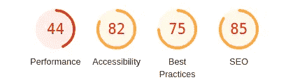

旧网站主页—旧主页的分数

Lighthouse 首先给我们总结了四个指标。

表演是 44，很糟糕。Lighthouse 也给了我们为什么低的信息。

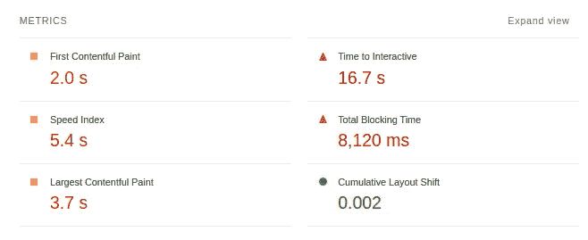

旧网站主页——灯塔报告的基础指标。

我们可以看到最重要的指标是[互动时间](https://web.dev/interactive/)。交互时间是指页面“完全交互”之前的时间，这意味着页面应该在 50 毫秒内做出响应。我现在的网站花费了惊人的**16.7 秒**！请注意，这是在移动设备上，移动设备通常被认为比台式机慢。

如果这是你第一次使用 LightHouse，你可能会觉得 16.7 秒很高，事实也的确如此。但很可能没有你想象的那么高。在 Facebook.com 跑灯塔给了我 4.7 秒。

鉴于我在旧网站上的信息如此之少，我的结果是可怕的。

第二个不好的指标是[总阻塞时间](https://web.dev/tbt/)。JavaScript 是单线程的，这意味着任何正在执行的工作都会阻止网站。阻塞是指当工作时间超过 50 毫秒时，任何低于 50 毫秒的时间都不会被人察觉。

这是新博客的样子。

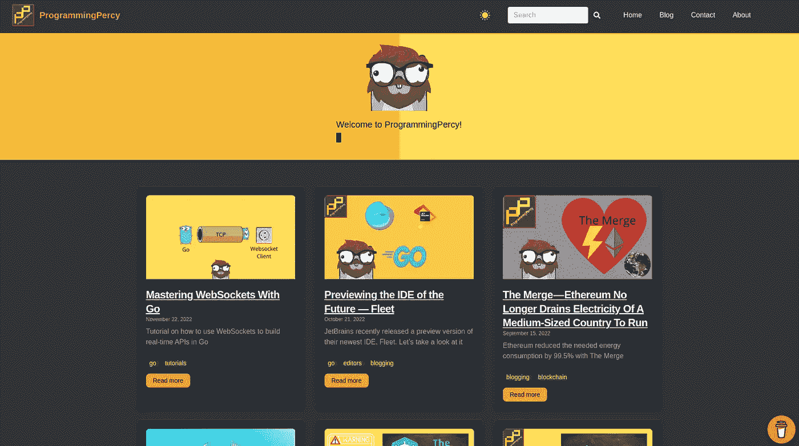

新网站主页——新网站，仍然很简单，但是更高级了一点。

如你所见，我已经更新了样式。新网站不再仅仅展示文章的标题和描述，还会显示文章的缩略图。第一个闪屏将加载 9 张图片和关于 9 篇最新博客文章的信息。

让我们在新网站上运行 lighthouse 并查看结果

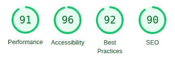

新网站主页——所有 4 个分数都增加了

现在，这个看起来比以前的网站好多了。四个分数都提高了。性能要高得多，尽管我们现在显示了更多的数据。

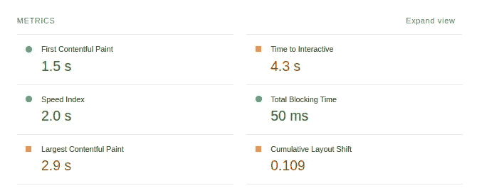

新网站主页——给出的指标

我们可以看到，新网站在 4.3 秒后完全互动。这比旧博客减少了(16.7–4.3)=**12.4 秒**。

如果你想知道是什么让它仍然需要 4.3 秒，我仍然需要运行和导入一些 JavaScript，比如 Google Analytics 和 Adsense。这些确实会大大降低网站的运行速度。

尽管如此，对我的读者来说，这将是一个巨大的进步！

公平地说，我的读者不应该呆在我的主页上，他们应该呆在博客里面。

让我们在每个网站上测量相同的博客文章，这很有趣，因为这里没有区别，都服务于[降价](https://www.markdownguide.org/)文件。

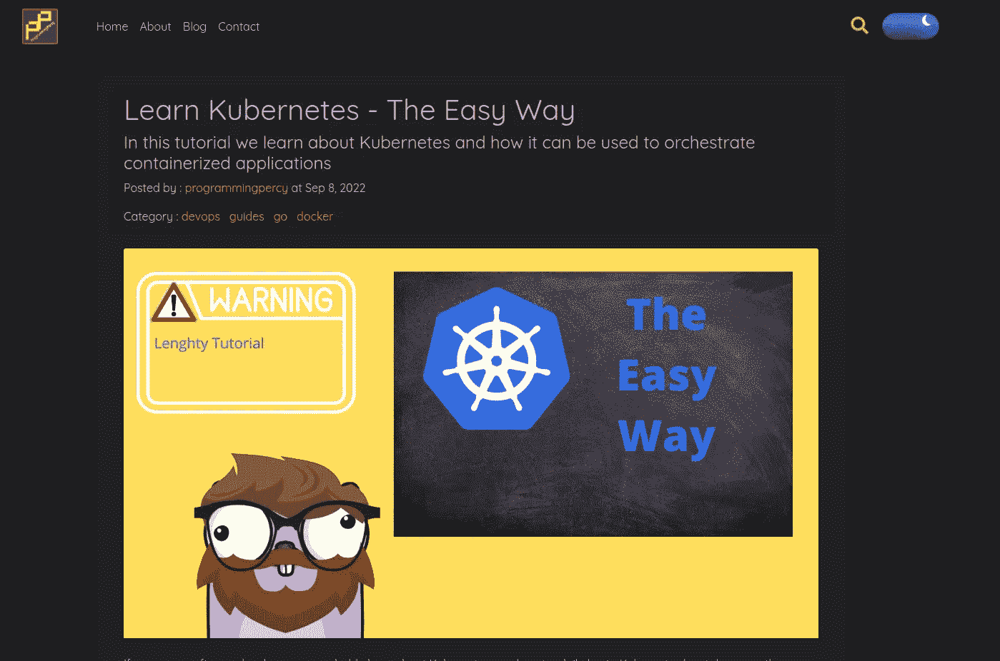

旧网站上的 Kubernetes 帖子。

我们可以再次运行 lighthouse，但不是在这个页面上。

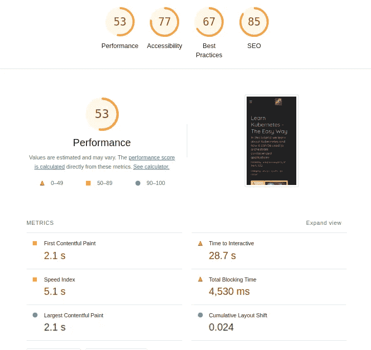

Kubernetes 页面结果

所以，旧网站标为黄色，可以接受。我想记下交互的极限时间 28.7 秒。想象一下，访问我的博客，不得不避开 28 秒，然后一切都按计划进行。

新网站拥有相同的降价文件，显示几乎相同的信息。

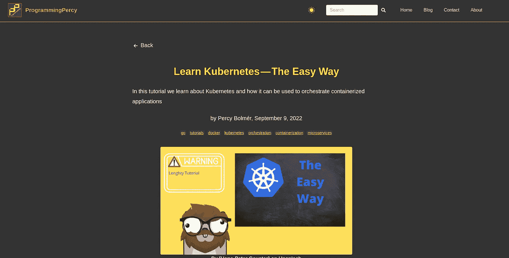

Kubernetes 在新网站上发布

让灯塔吞噬它吧。

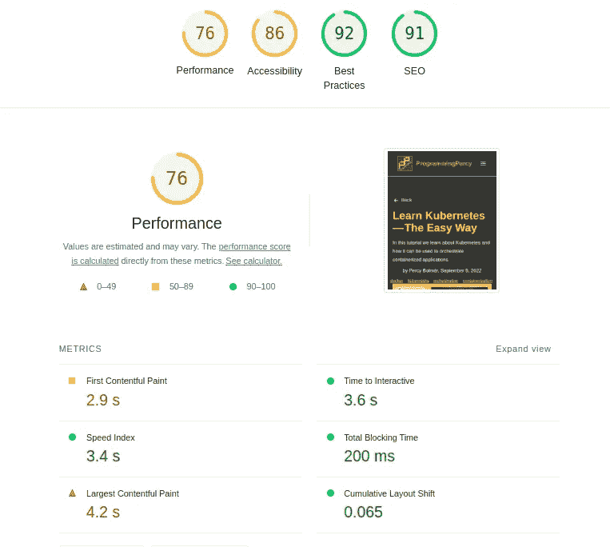

新网站上的 Kubernetes 页面

所以一切看起来都好一点了。成绩提高了 22 分，考虑到 100 分是最高分，这已经算多了。如果我去除分析和其他东西，我可以达到 90，但我希望那是可用的，所以我不能这样做。

到交互的时间是 3.6 秒，快了(28.7–3.6)= 25.1 秒！

# 结论


用 SvelteKit 重建时的巨大改进

不仅我的博客现在超级快得多。维护和更新要容易得多。在 Jekyll 中，我必须搜索和测试大量不同的插件来进行优化，而且通常很难使用和运行。

我不得不说，我在新网站上几乎没有做任何优化，这几乎只是使用了开箱即用的功能。这种速度的提高纯粹是来自于简单地使用 SvelteKit。

我不得不说这感觉太棒了，我一直在为我的 Jekyll 网站与这么多插件和不同的工具作斗争，但毫无结果。

我唯一额外添加的是一个 Vite 插件，用于在构建过程中为用户自动生成 webp 图像。我已经在 Jekyll 应用程序中做了一些事情。然而，在 SvelteKit 中实现要容易 100 倍。在不久的将来，我会写一篇关于这个的博客。

在旧网站上，我非常谨慎，害怕我改变的一切，因为它通常会破坏许多其他东西。因为 SvelteKit 的应用程序有一个非常容易理解和简单的结构，也因为 SvelteKit 的组件非常容易理解，这个博客现在对我来说更容易使用了。

当我决定重建时，我非常怀疑，许多框架已经提供了“下一代”，但在尝试了 SvelteKit 之后，它确实感觉像是下一代框架。

也就是说，我必须明确指出，SvelteKit 尚未正式发布 1.0 版本。目前的版本仍然只是一个`release candidate`。

但这也可能意味着我们将在`v1.0`之前从 SvelteKit 上看到更多令人惊叹的东西。

我对此非常激动，我迫不及待地想听听你对新网站的看法。

你喜欢吗？在[https://programmingpercy.tech/](https://programmingpercy.tech/)尝试一下