# 我烘烤了我的第一个 iOS 应用程序的源代码，并对其进行了重构

> 原文：<https://betterprogramming.pub/i-roasted-my-first-ios-apps-source-code-and-refactored-it-79aa7ae519f2>

## 给 iOS 开发者的提示


由[凯利·西克玛](https://unsplash.com/@kellysikkema?utm_source=medium&utm_medium=referral)在 [Unsplash](https://unsplash.com?utm_source=medium&utm_medium=referral) 上拍摄的照片

刚找到一个硬盘，里面有我所有的旧编码项目。我想看一看，并分享我犯下的暴行，所以在开发出更好的替代方案后，我烘烤了我的代码。

2018 年快高中毕业的时候开始了我的 iOS 开发之旅。有整整一年的时间致力于跟随教程，学习语言的语义，以及半生不熟的项目。我决定跳过这些，直接进入我的第一个完全独立的应用程序。

# 动物媒体

这是我第一个真正的 iOS 应用。我的创作没有遵循教程。

我记得我刚刚学会使用 Python 进行 web 抓取。我很兴奋能把它应用到某个地方。我决定做一个动物百科全书，简称 Animalpedia，作为一个 iOS 应用。

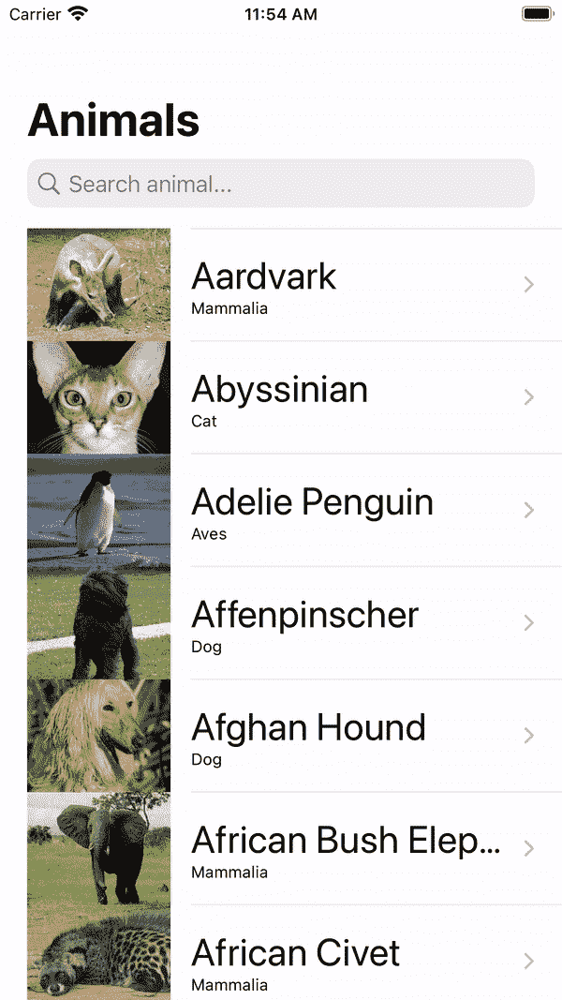

动物媒体演示

# 巨大的 JSON

打开项目时，我注意到的第一件事是没有外部 API 调用。当然不是。在这段时间里，我不知道如何打网络电话。

> 对于新手来说，API 是一种与服务进行通信方式。想象一下有一个电影 API。你告诉 API，“给我所有的恐怖电影”，API 就会检索并给你所有的恐怖电影数据。

我学会了如何使用 Python 进行网络抓取，所以我编写了一个脚本，用所有动物的数据生成一个 JSON 文件。之后我手动导入到项目中。

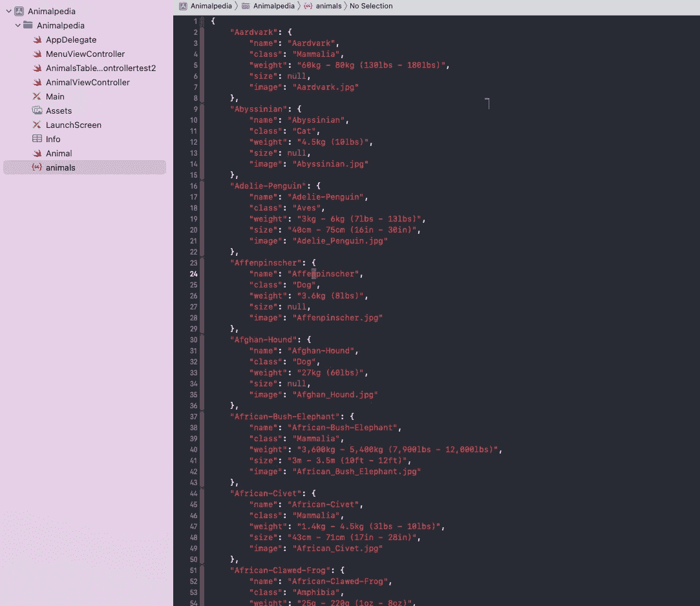

巨大的 JSON 和所有已知的现存动物

图像也是如此。我不知道您可以从 URL 中检索图像，所以我将它们作为资产包括在内。

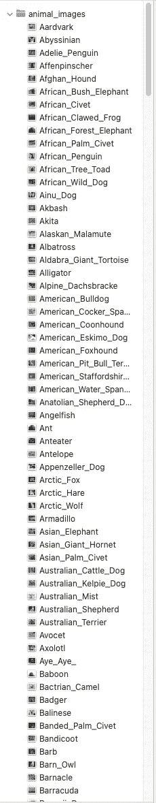

所有已知现存动物的图像

我可以说我不依赖外部供应商是为了安全起见，但我是在撒谎。事实是，我不知道 API 是什么，也不知道如何在 iOS 应用程序中通过互联网检索图像。

# 应用程序图标

这也是我第一次创建应用程序图标。我想我被你需要包含的大量不同尺寸的图片弄得有点不知所措，所以我只添加了出现在主屏幕上的图标。

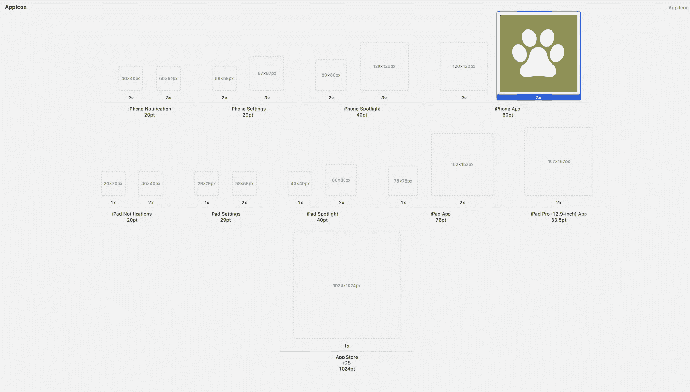

在最近的 WWDC 上，苹果宣布在 Xcode 14 中，你不再需要包括所有不同的图标大小，只需要一个。然而，这只是最近的消息。

> 如果你需要一个免费的第三方解决方案来生成所有不同的图标尺寸，我推荐你去 [appicon.io](https://appicon.co/) 。只需上传你的`1024x1024`应用图标，它将生成所有不同大小的图标，这样你就可以将它们拖放到你的项目中。

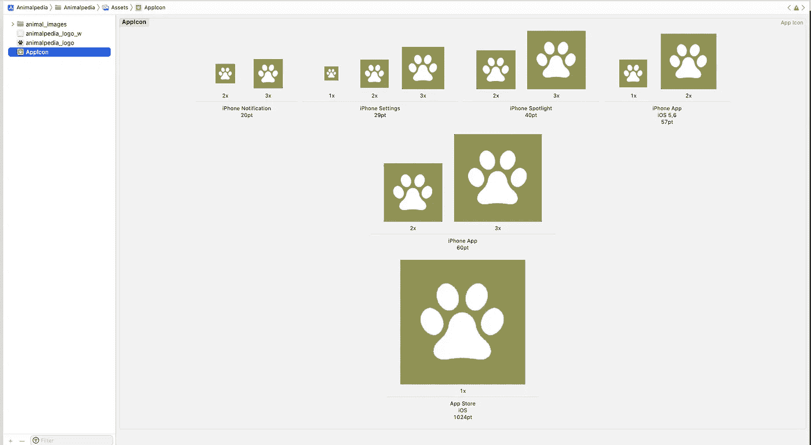

太棒了。我还第一次展示了自定义的启动画面！

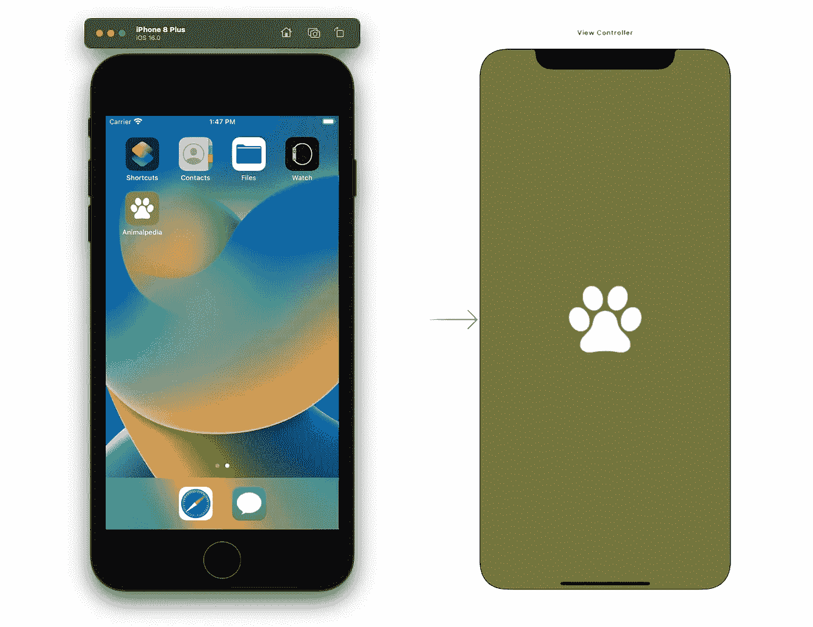

展示应用程序图标和启动屏幕

# 项目结构

好了，让我们来看看实际的项目结构。还有一个`AppDelegate.swift`，一个里面什么都没有的`MenuViewController.swift`，一个名字奇怪的`AnimalsTableViewControllertest2.swift`(我不知道如何在创建文件后重构/重命名它们)，以及其他文件。

> 快速提示:要重命名一个类，右击类名，重构>重命名

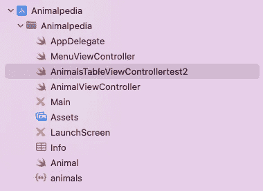

不太好的项目结构

如果您是新手，请注意项目结构不应该是这样的。他们应该按职责分组，如下所示:

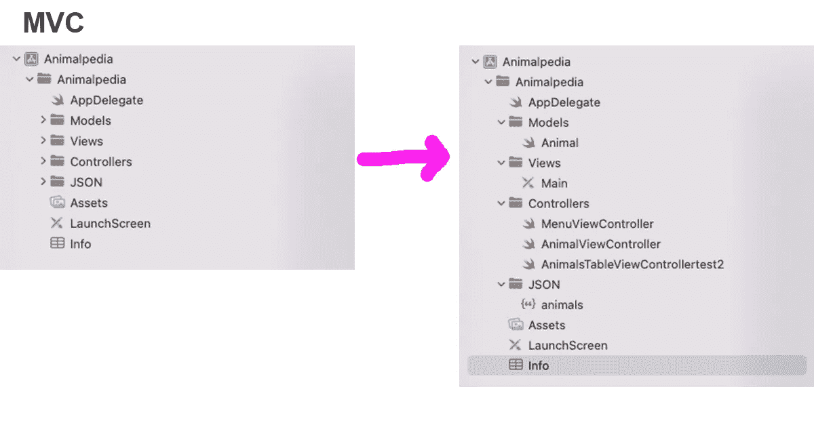

良好的项目结构

为了正确地组织你的项目，你首先需要了解架构模式。起初它们可能看起来令人生畏，但是它们会引导你解决常见的问题。有许多不同的模式，但保持简单:

*   如果你用的是`UIKit`(故事板),那就用 [MVC](https://developer.mozilla.org/en-US/docs/Glossary/MVC)
*   如果你用`SwiftUI`去找 [MVVM](https://en.wikipedia.org/wiki/Model%E2%80%93view%E2%80%93viewmodel)

# UITableViewController

看了一眼`AnimalsTableViewControllertest2.swift`，我意识到它是你在演示中可以看到的主要`UITableViewController`。

我创建了两个类型为`Animal`的数组；一个用于所有的`animals`，一个用于`filteredAnimals`(过滤意味着用户在顶部的搜索栏上输入)。

我注意到我喜欢在我的旧项目中两次输入大量代码，就像这个例子。我从来没有想过复制代码可能会有一些粗略的东西。对我来说，这是一个很好的标志，表明我正走在正确的道路上！不对！

> 快速提示:如果你输入代码两次，总会有更好的方法。

我也不知道三元运算符是什么。我非常依赖`if-else`语句，即使它们只有一行。

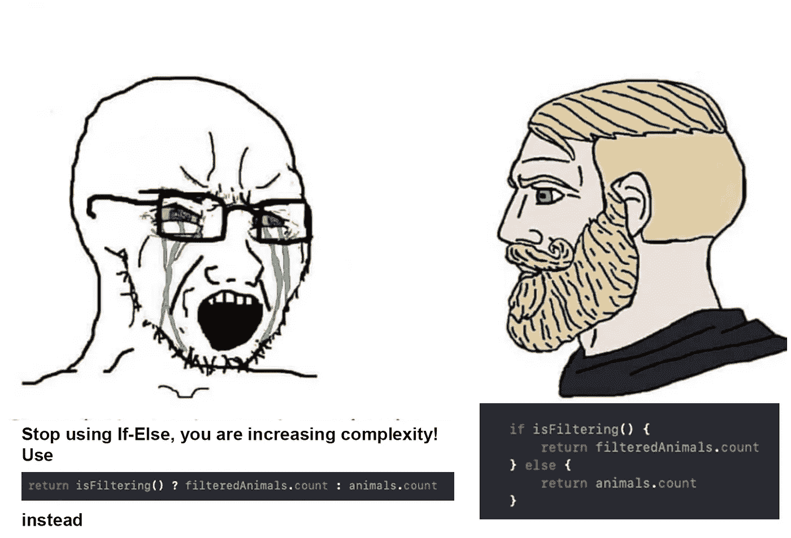

我不知道计算属性的存在。我去寻找返回我需要的属性的函数。

旧代码示例

让我们解决这个问题。我将这些函数重构为计算属性。

良好的代码示例

> 快速提示:只要不需要传递参数，就尽量使用计算属性。

另外，我删除了评论。

```
// Returns true if the text is empty or nil
```

我以前经常这么做。评论最琐碎的事情。好的代码不言自明。属性`searchBarIsEmpty`是不言自明的。我不需要知道更多关于它或它是如何计算的。

不必要的是，我还在代码的随机位置留下了太多的空格。

这使得代码变得混乱和难以阅读，所以尽量保守地使用新行。

# 轻松转换

一个单位转换器应用程序。我把这个应用程序献给我亲爱的母亲，因为她正在寻找一个易于使用的单位转换器应用程序(现有的大多数太复杂了)。我花了两天时间开发，想出了这个:

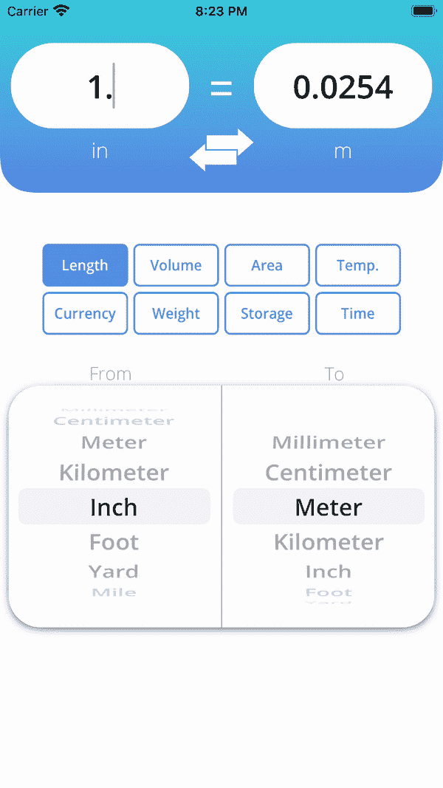

轻松转换的演示

这是一款让我有足够信心提交给应用商店的应用。从那时起，它经历了一些迭代。我在`SwiftUI`重新做了一遍(敬请期待，我很快会做一个教程)。

有兴趣看看现在的 app 怎么样，可以在这里找到。

即使它功能齐全，代码本身也很糟糕，至少可以这么说；我不敢相信它跑了。

在此期间，我采用了一种完成项目的哲学。不求完美，但求足够好。这是一个伟大的哲学，我相信每个人都应该采纳。你总是可以迭代和改进的。

这个项目远非完美，但完成了它的工作——它很容易转换单位。

好吧，让我们看看代码。

# 字符串数组

我刚打开`ViewController.swift`文件，已经开始畏缩了。我为每个单元类别创建了字符串数组。

我想我知道这是怎么回事…我将使用这些文字字符串，就像它们是枚举一样。

> 快速提示:不要在不同的情况下使用字符串！创建一个包含所有可能情况的自定义枚举。如果需要 enum 的字符串，请使用`CustomStringCovertible`协议。

## 单元类

刚发现一个`Unit`级。

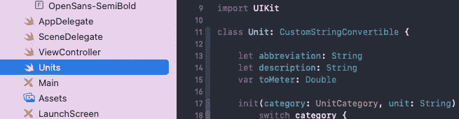

我首先担心的是，苹果的`Foundation`库中已经有了一个功能完备的`[Unit](https://developer.apple.com/documentation/foundation/unit)`类。我无知地决定用自己的来代替它。

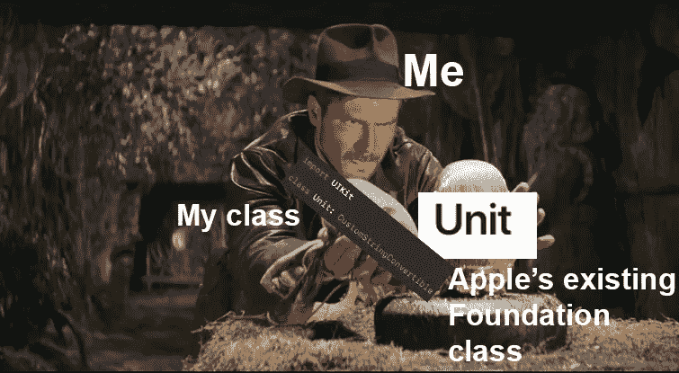

我可能不知道它的存在。然而，我觉得有趣的是，我没有费心去寻找一个现有的解决方案(就像我们所有懒惰的开发人员所做的那样),而是直接实现了我自己的解决方案。

> 快速提示:你的问题可能有一个解决方案。你只需要足够努力地搜索。

我为创建一个单元定制了一个初始化器。

要创建我的自定义`Unit`的实例，您需要传递一个`UnitCategory`类型的`category`(一个包含`.length`、`.volume`等的枚举)。)和……就是这样，一个`String`类型的`unit`。

非常糟糕的代码

我不得不删除大部分初始化代码，但是还有另外 200 行 switch 语句用于其他单元。

有趣且奇怪的是，我的`Unit`类包含一个名为`toMeter`的属性，尽管该类应该适用于任何维度，而不仅仅是长度。

我假设我先做了长度单位，需要一个基础系数，这个维度上的所有单位都可以进行转换，只是后来懒得重命名`toMeter`。

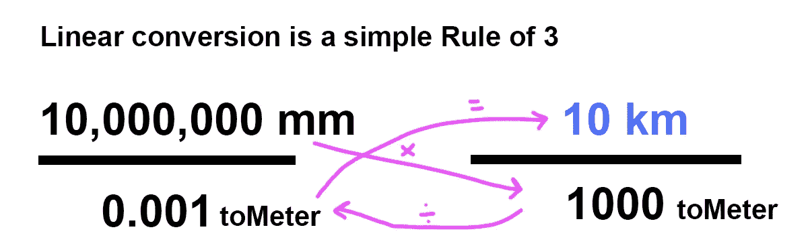

如何进行线性转换

我用这个实现把一切都复杂化了。事实上，苹果已经有了`Unit`、`Measurement`和`Dimension`类来为我们做这些工作。看看有多简单。

我创建了一个`convert`函数。您传递三个参数:一个值、一个输入单位和一个输出单位。

就是这样，两行代码转换单位。

Swift 中有一篇关于转换单位的文章。这里可以找到[。](/unit-and-measurement-in-swift-7c6be4a25586)

# 更好的方法

我已经创建了一个更好的方法来获取每个维度类型的单位数组。不需要创建额外的类。枚举就足够了。

良好的代码示例

# 包裹

我想分享更多我的旧代码库，但我认为这篇文章已经扩展得足够了。我希望你在开发 iOS 应用程序时学到了一些不太好的做法。


感谢阅读，祝你一切顺利！

# 参考

*   对于应用程序图标生成:[https://appicon.co/](https://appicon.co/)
*   你可以在这里下载转换应用
*   苹果的单元类[文档](https://developer.apple.com/documentation/foundation/unit)
*   《Swift 中的单位和计量》[篇](/unit-and-measurement-in-swift-7c6be4a25586)