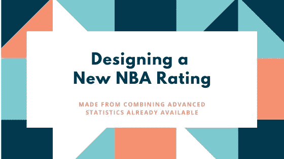
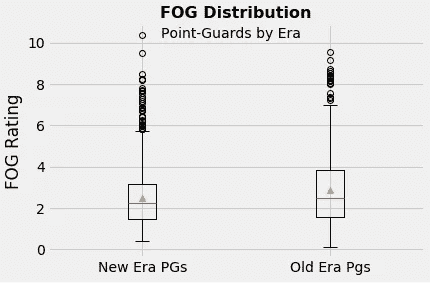
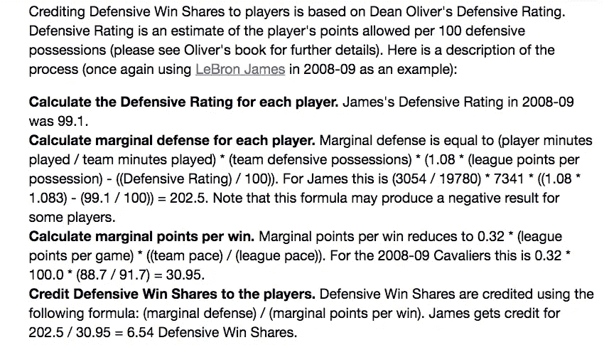
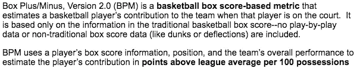
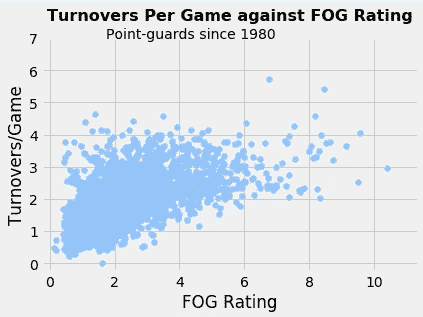

# 设计新的 NBA 评分系统

> 原文：<https://betterprogramming.pub/i-set-out-to-make-a-new-nba-player-rating-comprised-of-advanced-statistics-that-are-already-a0d8f4db1610>

## 从我们已有的统计数据中创造新的东西

作者照片。

我开始制定一个新的 NBA 球员评级，它由先进的统计数据组成，这些数据对于今天的篮球分析师来说已经很常见了。是用来衡量控球后卫的表现的，数值范围大致从 1 到 10。它的目的是衡量控球后卫的统计数据，并考虑以下因素:

*   简易化
*   给他们的团队机会
*   高效的“游戏流程”

这解释了评级的名称:“雾。”

这一评级可以作为球员比较的镜头，也可以作为当今许多现代控卫所观察到的得分第一心态的替代。也许你有你的超级巨星，但仍然想要一个高效的，胜利者，不一定会踩到你的得分者脚趾的好地板将军？雾可能是给你的。想比较两个最低合同的后卫吗？雾可能不适合你。

*时代划分:旧时代(1980-1999 年)，新时代(2000-2017 年)*

# **方法论**

福格严重依赖一些当今使用的最佳统计数据。除了最近由 FiveThirtyEight 制作的 RAPTOR(最佳)，最受关注的综合球员评级似乎是 VORP(价值超过替代)、WS/48(每 48 分钟赢得股份)和 TS%(真实投篮命中率)。我故意不想包括 PER(球员效率等级)，因为我觉得其他指标更好。

注意:我从 1980 年开始，因为高级统计是在 1977-78 年创建的。

## 雾计算

首先，一个免责声明:不是每个球员都可以被 FOG 衡量。一个人必须“合格”。要被考虑，玩家必须:

*   拥有积极的 WS/48(确保他们或多或少是“赢家”)。
*   有一个积极的 VORP(以帮助雾数字不是消极的)。
*   占他们球队失误的不到 25%。

对于实际的计算，我从每场比赛的几个基本得分统计的基线乘数开始:失误，助攻，篮板，盖帽和抢断(注意点不包括在内)。例如，失误的权重为负 2(因破坏有效的比赛流程和失去机会、不良的促进而受到惩罚)，抢断的权重为+1.5(因给自己的球队另一次机会、改善球队的比赛流程而受到激励)，进攻篮板的权重比防守篮板更重，因为它们立即给了球队一个新的进攻机会。

每场比赛的统计数据在加权后加在一起。这将被添加到玩家各自 VORP 的 3/4。最后，该总和乘以玩家的 TS%。

注:雾是按季节计算的。

## **统计解释**

以防你不熟悉所有使用的术语。让我们深入了解一下这些综合统计数据是由什么组成的。

WS/48 是玩家每 48 分钟贡献的获胜次数的估计值。为简洁起见，我将说明这是进攻和防守获胜份额的总和。

图片来自[篮球参考](https://www.basketball-reference.com/about/ws.html) —点击下面的链接，查看迪安奥利弗的 O/DRTG 计算。

 [## 计算个人进攻和防守评分| Basketball-Reference.com

### 个人进攻和防守评分是由迪安·奥利弗在他 2004 年的书《篮球…

www.basketball-reference.com](https://www.basketball-reference.com/about/ratings.html) 

图片来自[篮球参考](https://www.basketball-reference.com/about/ws.html) —点击下面的链接获取完整的胜利分享信息。

 [## NBA 胜利股份| Basketball-Reference.com

### 赢股是一个玩家统计，试图将团队成功的功劳分配给团队中的个人…

www.basketball-reference.com](https://www.basketball-reference.com/about/ws.html) 

VORP 将 BPM(框加/减)率转换成每个球员对团队的总体贡献的评估，与理论上的“替代球员”所能提供的相比。“替补球员”被定义为拿最低工资的球员或者不是球队轮换中的正常成员。

BPM 是什么？这基本上是 VORP 没有一些因素，如上场时间。

图片来自[篮球参考](https://www.basketball-reference.com/about/bpm2.html) —点击下面的链接查看完整的 BPM 2.0。

 [## 关于方框加/减(BPM)| Basketball-Reference.com

### 所有标志是其所有者的商标和财产，而不是 Sports Reference LLC 的。我们在这里展示它们纯粹是为了…

www.basketball-reference.com](https://www.basketball-reference.com/about/bpm2.html) 

TS%公式为 [PTS](https://www.basketball-reference.com/about/glossary.html#pts) /(2 * [TSA](https://www.basketball-reference.com/about/glossary.html#tsa) )。真实投篮命中率是衡量投篮效率的指标，它考虑了投篮命中率、三分球命中率和罚球命中率。TSA(真实投篮次数)公式是 [FGA](https://www.basketball-reference.com/about/glossary.html#fga) + 0.44 * [FTA](https://www.basketball-reference.com/about/glossary.html#fta) 。

制造雾时的其他注意事项:

*   播放器使用率(在 VORP 为 w/ USG%)。
*   罚球命中率(TS%)。
*   对失误的严厉处罚(资格和基线乘数)。
*   避免太重的助攻来对抗助攻猎人(例如隆多)。
*   评分效率——不是对数量评分者的评级。
*   强调赢球，这是每支球队的最终目标(季后赛资格)。

# **调查结果**

当在控卫身上测量时，雾似乎相当有效地服务于它的目的。6 级以上被认为是精英级别的雾。这大约是正态分布的终点，其余的被视为异常值。FOG 的结果只能告诉我们这么多，因为它非常依赖统计数据。

判断 FOG 是否真正展示了顶级球员的一个快速方法是查看有过 8+(非常精英)FOG 的球员的赛季。需要说明的是，自 1980 年以来，这种情况只发生过 17 次，只有 6 名球员出现过:

*   克里斯·保罗(对 17 起事故中的 3 起负责):在 2008-09 赛季记录了 10+的大雾等级。
*   魔术师约翰逊* *(17 投 5 中负责):1988-89 赛季录得 9.5+的大雾评分。
*   约翰·斯托克顿(对 17 场比赛中的 6 场负责):从 1987 年到 1990 年有两个赛季得分超过 8.5+。
*   拉塞尔·维斯特布鲁克**(对 17 起事故中的一起负责):2016-17 年的大雾等级接近 8.5。
*   胖杆(负责 17 个之一:1986-87 年录得雾评 8.25+。
*   斯蒂芬库里**(对 17 起之一负责):2015-16 赛季录得 8+的雾评。

* * =球员获得了当年的联盟 MVP。

注:在我看来，魔术师约翰逊是职业生涯的雾“王”。

看起来，要有一个精英级别的雾，一个人必须平均每场比赛至少两次失误(很容易归因于最好的球员处理球更多，因此固有地犯更多的失误。)还有就是有球员在场均失误 4+的情况下获得了 8+的迷雾评级。考虑到我对容易失误的比赛处罚有多重，这很有意思。

# **结论**

着手进行新的评级是很难做到的。就我而言，在篮球的这一点上，一个人需要新的可测量的数据来形成关于潜在关系的新的有意义的假设。给定可用的工具，雾就是它的样子，并且服务于它的目的。

最后，如果您想查看特定的基线乘数值、数据清理(主要是数据框调节)、更多图表、era/所有头寸分割等等，这里有所使用的数据集和 Google Colab 笔记本的链接！只需下载数据并将其加载到提供的笔记本中:

 [## 1950 年以来 NBA 球员统计

### 超过 60 个赛季的 3000 多个玩家，每个玩家 50 多个功能

www.kaggle.com](https://www.kaggle.com/drgilermo/nba-players-stats)  [## 谷歌联合实验室

### 编辑描述

colab.research.google.com](https://colab.research.google.com/drive/1fWSEVk8DKfFd5S4ILuPYiJVgGjA7BG8Y) 

对于那些发现有史以来最高的雾没有伴随着 MVP 赛季的人来说，最后一个链接是不寻常的:

 [## 为什么科比应该把 MVP 给克里斯·保罗

### 嘿科比-你想成为一个男人吗？那就承认不属于你的东西，把 MVP 奖杯递给克里斯·保罗。你听到我说的了，科比…

bleacherreport.com](https://bleacherreport.com/articles/21807-Why-Kobe-Bryant-Should-Give-the-MVP-to-Chris-Paul-) 

感谢阅读！