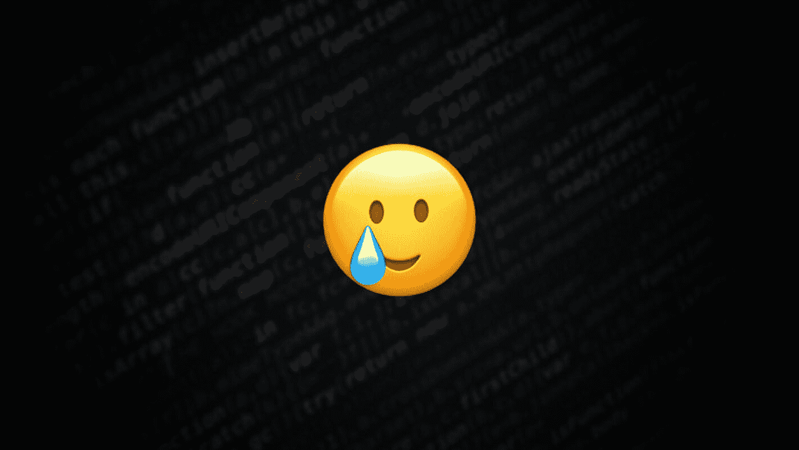
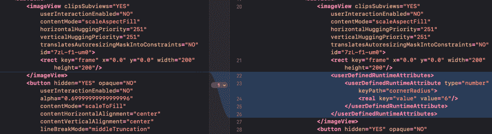
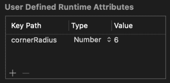

# 我花了一个小时去除 UIImageView 圆角——原因如下

> 原文：<https://betterprogramming.pub/i-spend-1-hour-to-remove-an-uiimageview-rounded-corners-and-heres-why-aaa7d2868787>

## 关键路径可能会造成大破坏！

这是一个关于我花了整整一个小时从一个`UIImageView`上去掉圆角的故事。我确信我的开发伙伴在某个时候会有类似的经历——花费不合理的时间来完成一个简单的任务。这是其中的一个故事。

这个故事不涉及任何非凡的编程知识，但我确实喜欢用它来引出我对开发人员在解决问题时应该持有的态度的一些看法。希望在故事结束的时候，其他开发者，尤其是刚刚入门的开发者，能从中得到一些启发。

# 这能有多难？

几周前，我接到了更新一个遗留 UI 的任务。其中一部分包括从图像视图中移除圆角。对于上下文，图像视图位于集合视图单元内，该单元是使用界面构建器创建的。

我相信任何有经验的 iOS 开发者都会有和我一样的第一想法:“这能有多难？”只需在单元实现中查找`imageView.layer.cornerRadius`,删除它——任务完成！

但是等等——在单元实现中没有找到这样的代码！🤨

可能是在视图控制器中设置了圆角半径？让我们检查一下`collectionView(_:cellForItemAt:)`的实施情况。不幸的是，仍然没有设置圆角半径的迹象。

另一种可能是图像视图是自定义图像视图，但是当我在界面构建器中检查 class 字段时，我看到的只是`UIImageView`。

现在我卡住了！还能是什么呢？

# 跳出框框思考

作为一名开发人员，我学到的一件事是，当遇到问题时，总是尝试跳出框框思考。我问自己，“有没有可能我看到的圆角与图像视图无关？会不会是源图像本身有圆角？”让我们找出答案。

考虑到这一点，我将图像视图背景颜色从`.clear`改为`.red`，并再次运行该应用程序。如果源图像本身有圆角，我应该能够看到图像视图红色的角落。我再次感到失望(但并不惊讶),图像视图没有显示任何红色角落。

现在我回到了我开始的地方。我还能做什么？我找不到设置圆角半径的地方，但也许我可以尝试覆盖图像视图圆角半径，将其设置回 0。让我们在单元格的`awakeFromNib()`方法中这样做，看看会发生什么。

这是我看到一线希望的地方——图像视图圆角终于消失了！

# 我应该在这儿停下吗？

我现在感觉自己已经解决了问题，但实际上，我仍然不知道问题的根源是什么。

一些开发人员可能会说问题已经解决了，是时候开始另一项任务了。但对我来说，这只是一种变通方法，并不是真正的解决方案。

在我看来，只有当我们找不到解决方案，或者由于合理的原因(如时间限制或技术深度)无法实现解决方案时，才应该使用变通方法。即使有正当的理由，一个变通办法充其量是一个临时的解决办法。归根结底，变通方法只会增加你的应用程序出现更多错误的风险。

考虑到这一点，我决定继续我的调查。

# 调查仍在继续

根据我之前的调查，如果我能够在单元格的`awakeFromNib()`方法中覆盖图像视图的圆角半径，那么圆角很可能是由界面构建器中的一些未知配置引起的。

由于我不知道从哪里开始，最好的起点将是图像视图。让我们试着用一个新的图像视图替换界面构建器中的图像视图，看看会发生什么。

令人惊讶的是，图像视图替换后圆角不再存在！

这是一个好迹象，因为现在我可以利用 Xcode 代码审查特性来查看更改前后的差异。没有第二个想法，我击中了⌥⇧⌘↩键，这是我看到的:

比较 NIB 文件

找到了。这是设定拐角半径的位置！

为了进一步验证我的发现，我恢复了我在 nib 文件上所做的更改，并检查了界面构建器中图像视图的用户定义的运行时属性字段。

界面构建器中的用户定义的运行时属性字段

在那里！我找到了我问题的根源！

兴奋之余，我把`cornerRadius`键路径去掉了。但就在那一刻，我意识到我有一个小时的时间来消除图像视图中的圆角！

# 我的想法

## 总是努力寻求解决方案

正如我提到的，变通办法不是解决方案。变通办法很难推理，很容易被打破。作为开发人员，在解决问题时，我们应该始终努力寻求解决方案。你不希望你的队友再花一个小时从图像视图中删除圆角，对吗？

我在软件开发行业注意到的一件事是，一些开发人员(大多数是初级开发人员)发现很难区分变通办法和解决方案。这背后的原因主要是经验不足。

找到变通办法总是比找到解决方案容易得多。这是因为一个解决方案通常需要你深入挖掘项目，找出根本原因。因此，每当我找到解决问题的方法时，我都会问自己:我知道问题的根源吗？如果答案是否定的，那么我找到的修复方法可能只是一种变通方法。

用变通方法解决问题并不能让你成为一名优秀的开发人员。愿意努力找出问题的根本原因并实现最佳解决方案是成为一名优秀开发人员的关键。正如罗马哲学家塞内卡曾经说过的:

> 这是一条通向伟大顶峰的崎岖之路。
> 
> *——*塞内加

## 卡住的时候，休息一下

在开发人员的日常工作中，陷入一个问题是非常常见的。面对这种情况，不同的开发者会采取不同的方法。就我个人而言，我喜欢远离我的电脑，也许喝杯咖啡休息一下，或者去公园呼吸一下新鲜空气。

当长时间致力于同一个问题时，我们的思维受到线性思维的限制，会越陷越深。这种单一途径的思维阻碍了我们发现其他可能性和替代方案。

短暂的休息可以帮助我们解放自己的头脑，创造性地解决问题，并从一个完全不同的角度来看待它。我已经记不清有多少次我在休息时想到的主意最终引导我找到了解决方案。

## 故事板还是不故事板

在我找到解决方案后，我[在推特](https://twitter.com/Lee_Kah_Seng/status/1382901203558756352)上发了这件事。许多开发人员回应说，他们不喜欢故事板，已经停止使用它。

我完全同意以编程方式创建 ui 肯定是比使用界面构建器干净得多的方法。然而，我也不反对使用接口构建器。事实上，我在过去的项目中使用了这两种方法，每种方法都有自己的优点和缺点。但那是以后的事了。

回到圆角的故事，我会说这与其说是一个故事板的问题，不如说是一个遵循惯例的问题。

对我来说，使用什么工具(故事板或代码)并不重要。重要的是，团队中的每个人都必须对应该做什么和不应该做什么有一个共同的理解。如果每个人都遵循常见的做法，本文中的事件肯定可以避免。

# 包扎

希望这篇短文能启发你在工作中，尤其是处理问题时，要有积极的态度。拥有正确的工作态度不仅能让你对所做的事情保持热情和动力，还能积极影响你的其他同事，有助于创造健康的团队文化。

如果你发现很难让自己保持动力，记住这一点:

> 编写代码的时候，要把最终维护你的代码的人想象成一个知道你住在哪里的暴力精神病患者。
> 
> 约翰·F·伍兹

至少，对我来说是这样！😅

如果你喜欢阅读这篇文章，请随意查看我的其他 iOS [开发](https://swiftsenpai.com/category/development/)和 [Swift](https://swiftsenpai.com/category/development/) 相关文章。你也可以在[推特](https://twitter.com/Lee_Kah_Seng)上联系我。

感谢阅读！