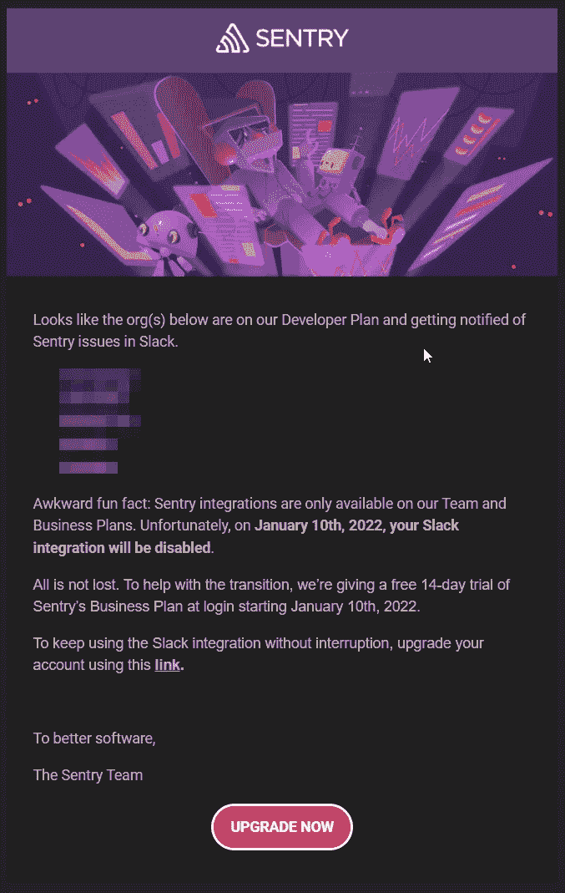
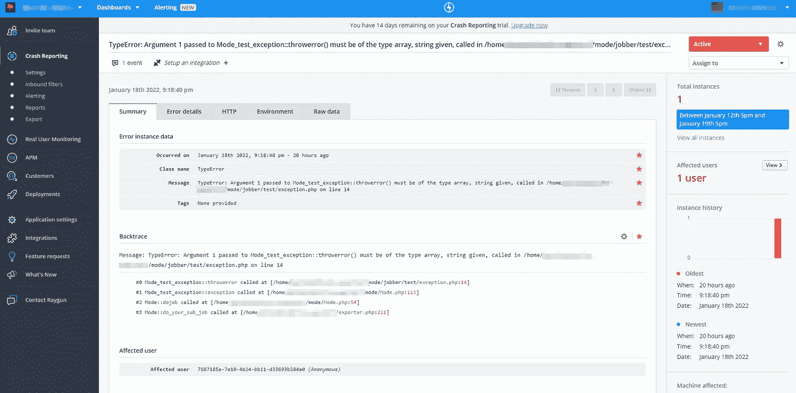
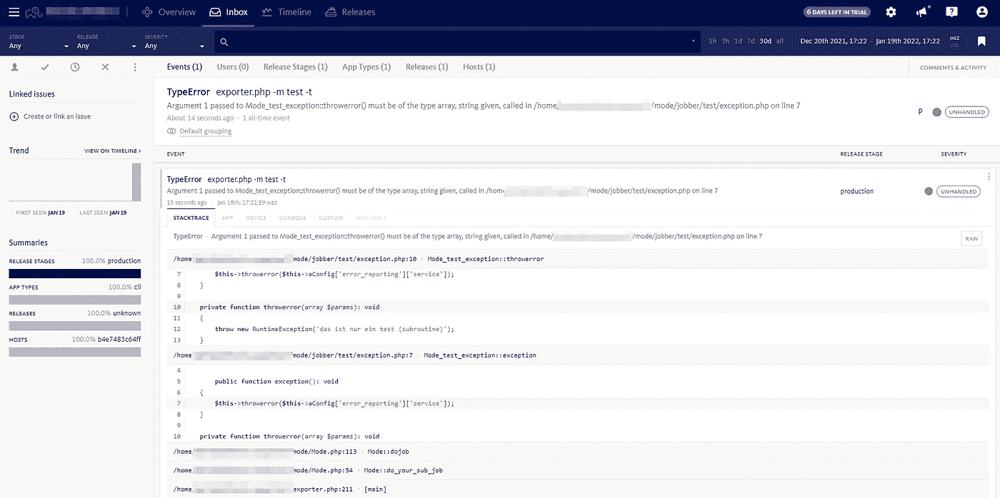
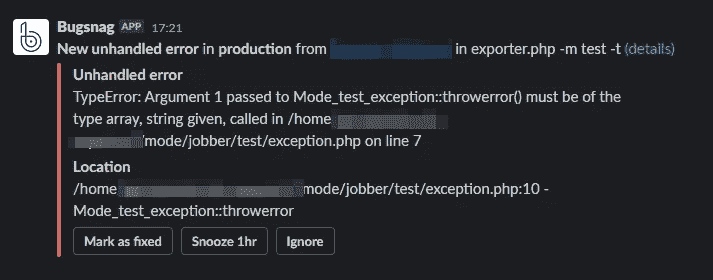
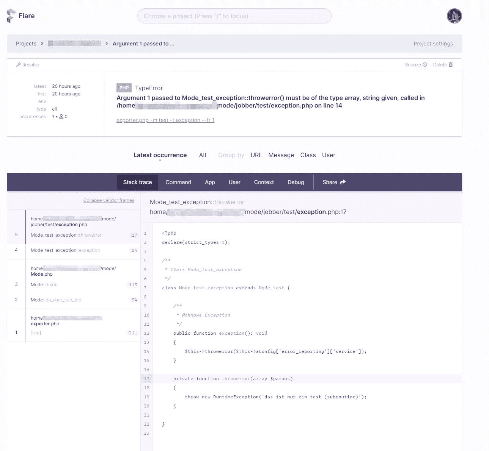
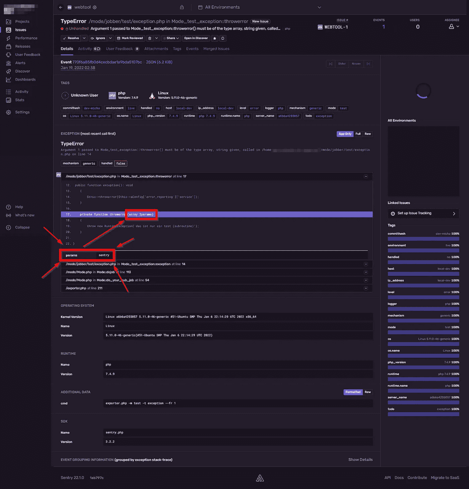
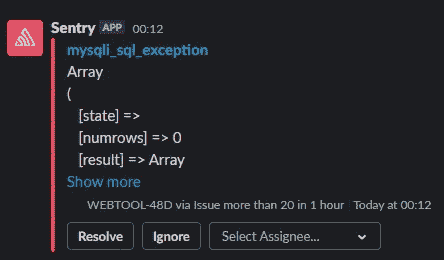
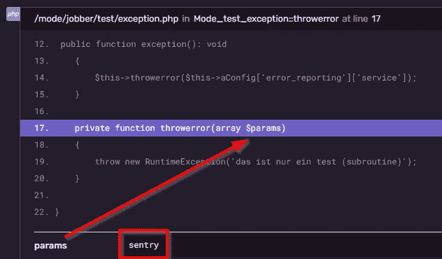

# 我测试了 4 种不同的 PHP 错误报告服务

> 原文：<https://betterprogramming.pub/i-tested-4-different-error-reporting-services-with-for-php-1a5228018c67>

## 以及为什么我转而使用自托管版本的 Sentry


照片由[葡萄牙重力](https://unsplash.com/@portuguesegravity?utm_source=medium&utm_medium=referral)在 [Unsplash](https://unsplash.com?utm_source=medium&utm_medium=referral) 拍摄

如果您不知道什么是“错误报告服务”，让我简短地解释一下:

假设您想要一个通知，以防您的应用程序抛出任何类型的错误，更重要的是，当我们谈到 PHP: [**异常**](https://www.php.net/manual/en/language.exceptions.php) 。

PHP 提供了[方法](https://www.php.net/manual/en/function.set-exception-handler.php)来处理这些异常。如果你不想建立自己的通知和监控系统，互联网提供了许多不同的服务来为你做这项工作。

这些服务中的许多处理不止一种编程语言，其他的专注于特定的语言，这真的取决于你的需求。

这些服务通常为您提供一个包(作曲家需要…)注册一个异常处理程序，通过 HTTP 将错误推送给该服务。

在该服务的仪表板中，错误/异常被分组并显示
，就像在票证系统中一样(即 Zendesk)。这样，您可以很好地了解系统内部的问题。在团队中工作时，您可以将这些错误分配给队友，添加注释等等。但是最重要的是:如果出现问题，你会收到通知！

我讨厌点击诱饵，所以让我们先从重要的发现开始:

获胜者(对我来说)是[哨兵](https://sentry.io)！

## **为什么？**

1.  因为 sentry 是唯一显示错误所涉及的`$variables`
    内容的服务！(如果我说错了，请纠正我)
    我将解释这一点…
2.  Sentry 提供灵活的定价，让您物有所值
3.  因为 Sentry 是[开源的](https://github.com/getsentry/self-hosted)，你可以在你自己的服务器上运行它的所有特性(如果我在这里说错了，请纠正我)
4.  Sentry 拥有大量的[特性](https://docs.sentry.io)(我从未使用过并支持许多不同的语言，并为大多数语言提供了软件包)

**免责声明:**这里的帖子是非常主观的，因为一方面我已经使用 Sentry 很多年了，另一方面我只是非常肤浅地看了一下其他服务。(因为时间不够)
所以不能排除我错过了其他服务的一些很棒的功能——也就是说:如果你也在寻找(新)服务，请自己测试一切！

那么我调查了哪些服务呢？

*   [sentry.io](https://sentry.io) (提供免费计划，但没有第三方集成)
*   [bugsnag.com](https://www.bugsnag.com)(提供一个带有完全提醒的免费计划)
*   raygun.com(无免费计划)
*   [flare pre . io](https://flareapp.io)(无自由计划)

是什么让我在这么多年后检查别人的服务而不是哨兵？

哨兵最近发布了一个公告:



这真是令人失望！；-(

让我解释一下。《哨兵》的结构是这样的:

*   你有一个账户(像往常一样)
*   在您的帐户中，您有“组织”
*   在每个“组织”中，你都有项目

当然，为了保持整洁，为不同客户/公司工作的人在 Sentry 内部为每个客户创建一个“组织”,在这里是该客户的所有项目——有意义吗？

很长一段时间以来，Sentry 通过他们的“遗留集成”提供松弛通知——甚至在免费计划中——棒极了！

正如你在公告中看到的，这种“遗留的 Slack 集成”不再可用，如果你想继续使用 Slack 通知，你现在被迫升级到付费计划。要明确的是:这是 100%公平的，没问题——但是他们的概念有一个大问题:

你不用在你的“账户”里付钱——你要在你的账户里“为每个组织”付钱。

假设我们有 5 个客户:

为了保持松弛通知有效，您将不得不支付 312 美元/年* 5，
这样每年就有 1560 美元的松弛通知！！！

….是的，还有一些额外的升级物品，但这不是重点。

那不是很疯狂吗？！？ 1560 美元/年，仅仅是因为您通过“组织”而不是您的全球账户付费？

我试着这样向哨兵解释:

如果你住在一栋房子或公寓里:你的房子/公寓里的每一个水龙头都有“供水合同”吗？或者你的整个房子/公寓都有合同吗？如果你当地的供水公司告诉你，你家里的每个水龙头都需要一份合同，你会开始认为他们在跟你开玩笑。

这就是我看了那个公告后的感受。这就是为什么我检查了其他服务，因为有懈怠通知是没有什么特别的这些天，我一定是愚蠢的支付所有的钱只是因为这一点。

哨兵支援告诉我:

> 此外，如果您愿意，您可以考虑将您的项目转移到一个组织，并取消当时未使用的订阅。这样，您的所有项目都将在一个组织下，您只需支付一次费用。请记住，您需要邀请每个组织的所有成员加入主组织，并组建新的团队。

对我来说:不能接受！

再次:这就是为什么我很快查了一些其他服务。我向所有服务发送了相同的“异常”,并检查了仪表板的外观和感觉，以及它们提供了多少信息。

首先:下面是产生错误的代码:

这很简单，但重要的是:

你的应用程序调用错误类型的函数，这种情况时有发生。所以我们假设`$this->aConfig[‘error_reporting’][‘service’]`是一个“字符串”。

在这种情况下，我们会得到错误:

```
Fatal error: Uncaught TypeError: Argument 1 passed to Mode_test_exception::throwerror() must be of the type array, string given
```

现在，让我们比较一下这在不同的错误报告服务中的表现:

## **雷根**



全尺寸图片:[https://i.imgur.com/Qtbnx3R.png](https://i.imgur.com/Qtbnx3R.png)

这对你有帮助吗？堆栈跟踪甚至不可点击，它几乎和你在 bash 上看到的信息一样。你看不到这里涉及的代码。说实话，这看起来太他妈的“老套”了，这里缺了那么多东西，但我在这里就不赘述了。

## **障碍**



全尺寸图片:[https://i.imgur.com/yYxsyK2.png](https://i.imgur.com/yYxsyK2.png)

可恶！这看起来非常清晰，您可以获得完整的堆栈跟踪，并看到发生错误的代码。好多了。它与哨兵有许多共同之处。Bugsnag 没有“组织”，只有项目、团队和团队成员。

为了跟踪哪个项目属于你的哪个客户，在你的项目名称中使用前缀是有意义的，即`CustomerA-webinterface`、`CustomerA-backend`、`CustomerB-webinterface`，你明白了。

以下是时差通知的样子:



顺便说一下:哨兵通知没有“打盹”按钮，但嘿，你不能拥有一切；-)

## **弗拉拉普**



全尺寸图片:[https://i.imgur.com/ELaWHwh.png](https://i.imgur.com/ELaWHwh.png)

我不知道该说什么。Flare 试图解决 Laravel 开发人员的问题，如果有人为此支付 319 美元/年，我非常抱歉，我无法用更友好的语言来表达。对我来说，收取与 Sentry 相同的费用，但只提供 10%的功能，这是绝对的厚颜无耻。是的，Flare 提供了“深入的 Laravel 应用洞察”，我从来没有见过，但我可以向你保证，如果你将 Sentry 与 Laravel 一起使用，你不会错过任何东西。

## **哨兵**



全尺寸图片:[https://i.imgur.com/7xCAlLK.png](https://i.imgur.com/7xCAlLK.png)

这不仅仅是因为美丽的黑暗模式而看起来很酷，还有如此多的功能，选项，动作，信息——这真的令人无法抗拒。功能和可能性的数量是无穷无尽的！我可以写一整个关于哨兵的故事，也许我会！

这是一个时差通知的示例:



# 那么为什么哨兵在所有其他人的前面？

我非常接近切换到 Bugsnag，但是在测试我的第一个异常时，我注意到错误报告中最有价值的信息丢失了:

**【变量$的内容】**

让我们记住代码:

```
private function throwerror(array $params): void
```

所以当`$parms`不是一个数组时，我们会得到下面的错误:

```
Argument 1 passed to Mode_test_exception::throwerror() must be of the type array
```

好吧，得到错误通知很好，知道涉及到哪个代码也很好…但是你知道什么更好吗？

> "知道错误发生时$params 的值"

如果我不知道是什么数据引起了错误，我该如何调试这个错误呢？要我猜吗？我是否应该添加日志记录，以便找出当时的$params 可能是什么？

**我告诉你:**在我看来，如果你看不到错误中涉及的数据，错误报告服务是没有用的。

假设你得到一个错误，一个`DB-INSERT`失败了，如果你看不到你试图插入的数据，这个信息有什么价值呢？没什么！

这些错误报告服务都不会显示这些超级信息，只有 Sentry 会！(如果我在这里说错了，请再次纠正我)

明确地说:向异常添加数据很容易，比如:

```
throw new RuntimeException(print_r($somedata,true));
```

但是看到我的堆栈跟踪
中使用的`$paramters`的内容从开始到错误发生的那一刻，这太棒了！

同样，让我们看看我们的例子:



请不要混淆:`TypeError`的发生是因为变量(`$params`)在那一刻已经是一个值为“哨兵”的“字符串”。

正是了解了这一点，使得调试和修复变得如此之快！

> 我不知道为什么有人应该在没有这些信息的情况下使用任何错误报告服务/工具。(对我来说)那没有意义。


由 [Mufid Majnun](https://unsplash.com/@mufidpwt?utm_source=medium&utm_medium=referral) 在 [Unsplash](https://unsplash.com?utm_source=medium&utm_medium=referral) 拍摄的照片

好了，在这一点上你很有希望理解为什么 Sentry 在这里是赢家，
但是你可能会问我是如何解决“钱的问题”而不用为我的每个“组织”付费的。

**就这么简单:**我换到了[自带](https://github.com/getsentry/self-hosted)版本的哨兵。

在你自己的服务器上运行 Sentry 可以让你完全控制一切。
有了 Docker 的帮助，事情变得异常简单。

> 因此，我现在将支付 0 美元，而不是每年支付 1500 美元以上！

反正我运行的是不同的服务器，所以服务器成本对我来说没什么影响。

有了这个简单的解决方案，我可以和我的组织呆在一起，继续我喜爱的 Slack 通知。

*在您开始考虑自托管解决方案之前，请考虑一下:*

目前，您“仅”获得每月 26 美元的付费计划—考虑到 8GB RAM 服务器的成本，这是一笔非常划算的交易！

感谢阅读。