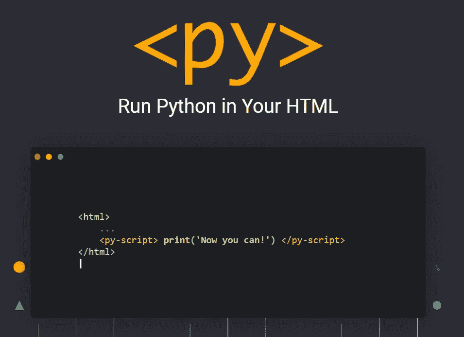
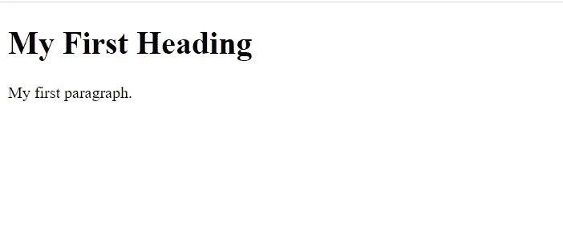
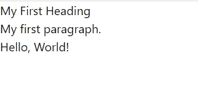
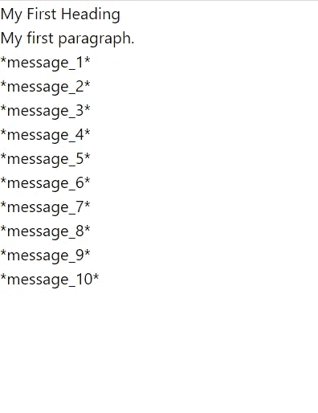
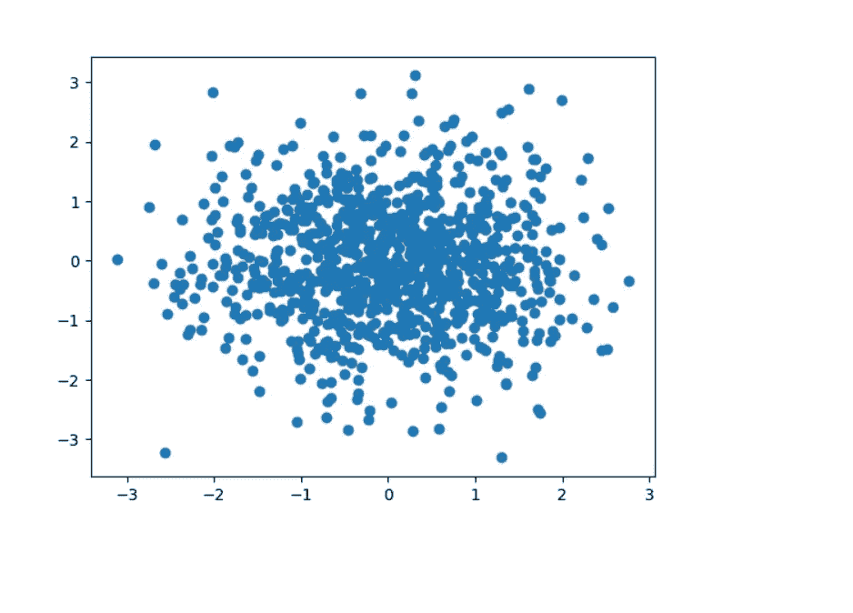

# 我测试了 PyScript——你可以在浏览器中编写 Python 脚本

> 原文：<https://betterprogramming.pub/i-tested-pyscript-and-you-can-literally-write-python-scripts-in-your-browser-2e4c8ca125bf>

## 再见 JavaScript？没有。还没有。

Anaconda**T5 的牛人宣布了一种在浏览器中运行 Python 代码的新方法。这可能是前端开发堆栈中的游戏规则改变者吗？在本文中，我将通过一个实际例子来了解这个新特性。**

# PyScript 简介

PyScript 是一个新出现的框架(我敢说是生态系统),用于在浏览器中执行 Python 代码。

它支持 HTML 格式的嵌入式内容，而不依赖于服务器端。

它使用 [Web-Assembly](https://webassembly.org/) 和 [Pyodide](https://pyodide.org/en/stable/) 来弥合 JavaScript 和 Python 之间的鸿沟。这允许语言之间的双向交流。

它还允许开发人员和数据科学家在 web 应用程序中释放整个 Python 生态系统的力量，而无需托管任何服务器应用程序！

# 1.简单 HTML

让我们看一个非常简单的 HTML 文件，并在它的基础上构建我们的 Python 代码:

生成的网页如下所示:

# 2.安装 PyScript

良好的..没什么好装的！真是一种解脱，不是吗？

我们需要做的就是在 HTML 头中添加两个资源，一个 JavaScript 文件和一个 CSS。

就是这样！

有了头部，我们可以随心所欲地嵌入 Python 脚本:)

# 3.编写您的 Python 脚本

现在让我们将 Python 代码添加到我们的 HTML 文件中:

通过添加`py-script`标签，我们可以在其中嵌入 Python 代码。

生成的网页如下所示:

嗯……它打印了所有的输出，但是 H1 标签看起来像一个普通的段落。不是吗？

这是因为包含的 CSS 文件覆盖了标题。但是尽管如此，我们可以在浏览器中运行我们的 Python 代码，而不需要任何外部依赖！真贴心！

# 4.更复杂的代码

所以在这个例子中，我们引入了一个 for each 循环和一个函数。生成的网页将是:

# 5.添加 Python 包

使用`py-env`标签可以很容易地添加 Python 包。

这样，我们已经将`numpy`和`matplotlib`添加到我们的项目中。现在让我们使用这些包:)

# 6.绘制随机数

生成的网页是:

# 最后一点

PyScript 为 Python 和 JavaScript 生态系统带来了一种令人耳目一新的方法。它实际上融合了这两个世界！

希望分享其研究成果的数据科学家现在可以更容易地做到这一点。也许我们可以看到前端开发的一些新领域即将出现。

我个人也很好奇它会把我们引向何方:)