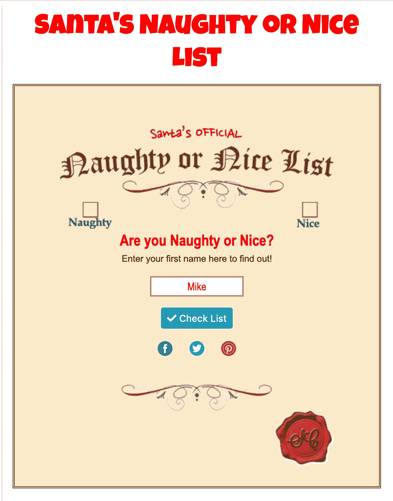
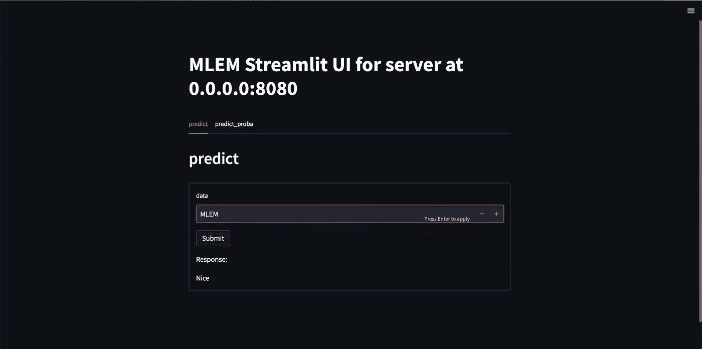

# 我训练了一个模型来判断你今年是否淘气

> 原文：<https://betterprogramming.pub/i-trained-a-model-to-tell-if-you-were-naughty-this-year-11a36ca6d472>

## 真正的圣诞老人会用我们的模型挑选礼物吗？


2022 年，我们在 [iterative.ai](http://iterative.ai) 做了很多伟大的事情。其中之一是发布了`[MLEM](http://mlem.ai)`——一个用于模型部署的开源工具，以防你错过。我们的下载计数器报告说，你很可能错过了它。这里有一个[到应用](https://mlem-nice-or-naughty.fly.dev/)的链接。

好的，所以今年的庆祝活动将以圣诞树的建立来结束。当然，我所说的“建立圣诞树”是指在云上部署一个机器学习模型。这个模型成为一个将名字分为“好”和“坏”两类的`DecisionTreeClassifier`似乎是合理的。

# 获取数据

为了训练我们的树，我们需要一些训练数据，最好是实际圣诞老人名单的样本。

一次快速的谷歌搜索显示没有公开的样品，然而，一个官方的圣诞老人网站提供了一个页面来核对你的名字。

所以让我们把它刮出来:



我希望圣诞老人的精灵不要手动处理这个

一些网络检查和一些 DOM 解析之后，我们得到了这个函数:

```
import bs4 as bs4
import requests

def is_nice(name: str):
    resp = requests.post("https://www.northpoletimes.com/NaughtyOrNice/", data={"KidName": name, "KidName_submit": "yes"})
    resp.raise_for_status()
    soup = bs4.BeautifulSoup(resp.text, "html.parser")
    div = soup.find("div", attrs={"class": "SantaListKidName"})
    if div is None:
        return None
    img = div.find("img", attrs={"alt": "[Naughty or Nice List]"})
    if img is None:
        return None
    img_src = img.attrs["src"]
    return img_src.endswith("NiceCheck.png")
```

现在我们只需要一份名单来核对。让我们不要走太远，使用谷歌搜索“最受欢迎的名字 CSV”的第一个链接

我们来取前 1000 个名字，看看谁好看。

```
import json
import os.path
from collections import Counter

import pandas as pd
from tqdm import tqdm

def scrape_niceness(names, path):
    if os.path.exists(path):
        with open(path, "r") as f:
            data = json.load(f)
    else:
        data = {}
    for name in tqdm(names):
        if name in data:
            continue
        nice = is_nice(name)
        data[name] = nice
        with open(path, "w") as f:
            json.dump(data, f)

def get_names(count=1000):
    data = pd.read_csv("baby-names.csv")
    counter = Counter(data.name)
    return list(dict(counter.most_common(count)).keys())

names = get_names()
scrape_niceness(names, "nice.json")
```

# 训练

在等待数据的同时，让我们准备好我们的训练代码。应该很简单:

```
from sklearn.tree import DecisionTreeClassifier

with open("nice.json", "r") as f:
    data = json.load(f)
christmas_tree = DecisionTreeClassifier()
christmas_tree.fit(list(data.keys()), list(data.values()))
```

我们马上遇到了一个问题:显然名字不是有效的浮点数！

```
ValueError: could not convert string to float: 'Jesse'
```

好吧，让我们向我们的机器解释一下，它们实际上是具有嵌入能力的浮点数。

让我们在圣诞管道中添加一个简单的预处理步骤，将名字转换成从。

```
from transformers import AlbertTokenizer, AlbertModel

tokenizer = AlbertTokenizer.from_pretrained('albert-base-v2')
model = AlbertModel.from_pretrained("albert-base-v2")

def pre_process(value: str):
    encoded_input = tokenizer(value, return_tensors='pt')
    output = model(**encoded_input)
    return output.last_hidden_state.squeeze(0)[-1].detach().numpy().reshape(1, 768)
```

当我们这么做的时候，我们被圣诞老人的网站屏蔽了。看来圣诞老人知道什么是拒绝服务攻击。但这实际上并不重要，因为我们检查过的所有名字都是好的(尽管淘气名字的图像实际上在服务器上存在)。

好的，每个人都很好，所以我们会抛出一些随机的字符串作为我们模型的反面例子。

现在，让我们训练我们的树并用`MLEM`保存它

```
import string
import random
import numpy as np

import mlem

christmas_tree = DecisionTreeClassifier()

with open("nice.json", "r") as f:
    data = json.load(f)

data.update(
    {
        "".join(
            random.choice(string.ascii_lowercase)
            for _ in range(random.randint(4, 7))
        ).capitalize(): False
        for _ in range(len(data))
    }
)

preprocessed = [pre_process(name) for name in tqdm(data)]

christmas_tree.fit(np.stack(preprocessed, axis=1)[0], list(data.values()))
print(christmas_tree.predict(pre_process("Mike")))  # True of course
mdl = mlem.api.save(
    christmas_tree,
    "christmas_tree",
    preprocess=pre_process,
    postprocess=post_process,
    sample_data="Mike",
)
```

我们还抛出了一个小的后处理步骤，从没有灵魂的概率数中得到答案。

```
def post_process(prediction):
    if len(prediction.shape) > 1:
        return "Nice" if prediction[0][0] < prediction[0][1] else "Naughty"
    return "Nice" if prediction[0] else "Naughty"
```

# 奔跑

最后，我们可以在本地试用该模型。`MLEM`将使用我们保存模型时通过的`sample_data`自动为我们构建一个非常精简的界面:

```
$ mlem serve streamlit -m christmas_tree
Starting streamlit server...
You can now view your Streamlit app in your browser.
URL: <http://0.0.0.0:80>
```



不错！

为了把它送回给圣诞老人，我们需要把它放在某个地方。MLEM 可以在一个命令内将模型部署到多个平台上，比如 Heroku、Sagemaker 和 Kubernetes。

由于我们想要一些特别的圣诞礼物，我们[用 MLEM 导出了一个`docker build`就绪文件夹中的模型](https://mlem.ai/doc/user-guide/building/docker)，并用`flyctl launch`——[检查部署](https://mlem-nice-or-naughty.fly.dev/)将模型部署到 [fly.io](http://fly.io) ！

就是这个！圣诞树已经搭好了，所以现在我们可以去庆祝了！

圣诞快乐，节日快乐！