# 我使用 GitHub Copilot 构建了一个情感分析 API

> 原文：<https://betterprogramming.pub/i-used-rider-with-copilot-in-rider-to-build-an-api-42cfd98ce590>

## 用一个 ML.NET 的例子分析句子中的情感


奥斯卡·萨顿在 [Unsplash](https://unsplash.com?utm_source=medium&utm_medium=referral) 上的照片

这个想法是建立一个 Web API，它运行一个 ML.NET 实例来分析一个句子的情感，并返回它是积极还是消极。我希望 Github 的 Copilot 能帮我做到这一点，并希望评估它的能力。

我想以如下方式构建项目:

```
Sentiment Analyzer (SLN)
--> API
--> Services
--> Shared
--> ML.NET
--> Unit Tests
```

API 项目是我们的表示层。我们的服务项目包含我们所有的业务逻辑和与 ML.NET 项目对话的能力，以分析发送句子的情感。在单元测试项目中，将会有我们所有的单元测试，希望 Copilot 能够很好地编写和理解；)

提前提供简短的信息，这篇文章不应该是一个教程—它更多的是关于在使用 C# —项目时，好的 Copilot 可以如何支持我。完整的源代码可以在我的 Github 页面上找到。

让我们从 API 项目中的控制器开始。首先，我想创建一个端点，它接受 post 请求和要分析的句子。

副驾驶明白我想用阿迪的构造器在我的控制器中注入一个服务。我考虑了一个 Get-Route，这很好，但是我需要一个 Post-Route。构造函数对我来说没问题。

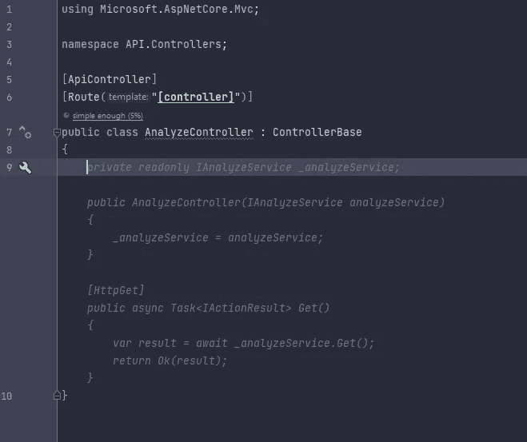

我试图通过评论我寻找的东西来帮助副驾驶:

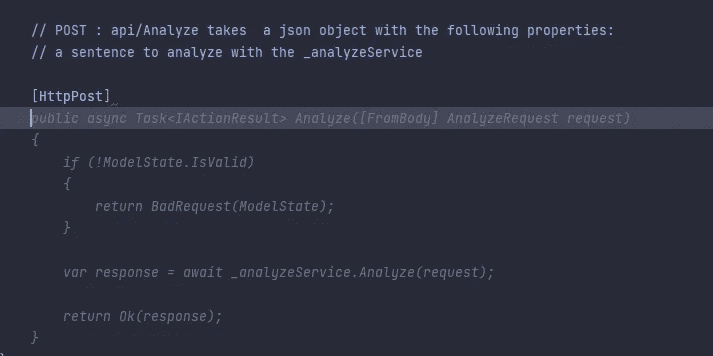

它不是 100%在轨道上，因为我不想检查`ModelState`。相反，我想验证请求对象。所以我又帮了一把，加了一条评论。

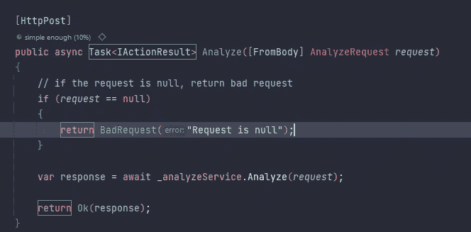

但这又没关系了，因为它帮助我更快地完成工作。下一步是在共享项目中创建模型 AnalyzeRequest。

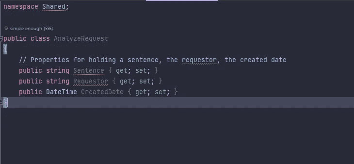

从我的评论来看，Copilot 已经知道我需要什么属性，这很好，因为我节省了很多打字时间。

现在我有了请求对象，但是我还需要一个包含状态、请求对象和句子评估的响应对象。

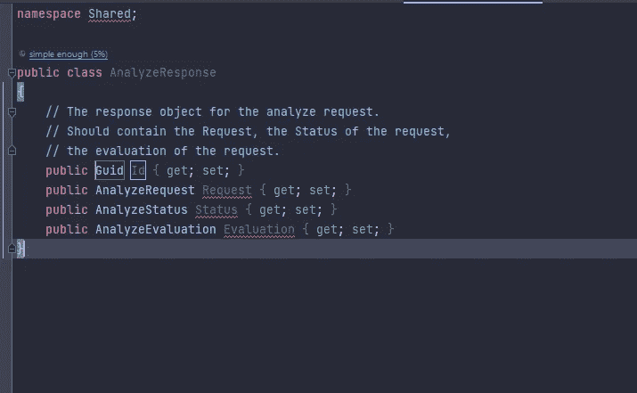

我们需要我们的 Post-Route 用我们的`Response`对象和处理逻辑的服务来响应。

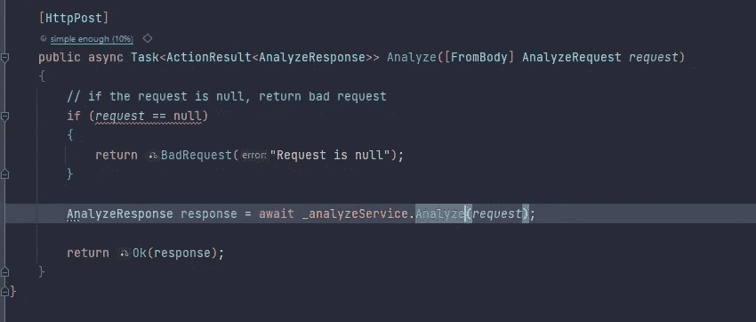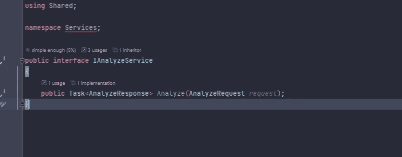

到目前为止，Copilot 帮助我更快地工作，但它会犯一些错误。

我想在构建我们的 ML.NET 项目之前，首先实现控制器和服务的单元测试。

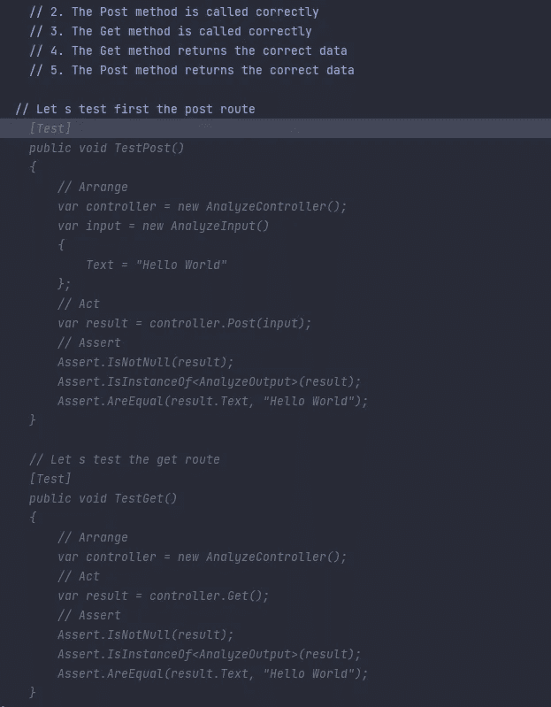

几乎正确，还没有得到路线，但由于 Copilot 还没有跨文件工作，这仍然是一个好建议。让我们帮一点忙。

副驾驶创建编号列表解说。我想编辑一下，看能不能让他正当地工作。

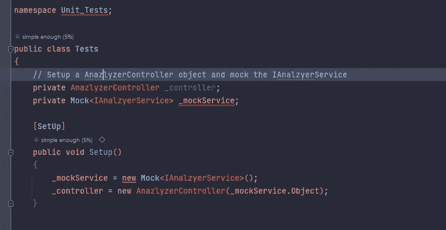

这很有效，有趣的是我拼错了`AnalyzeController`，副驾驶用它来设置控制器。我纠正了拼写错误，并试图嘲笑我的`Analyze`函数。

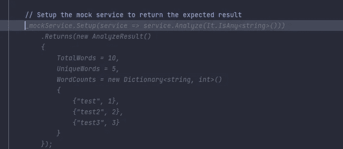

这个建议不错，但不是我所需要的。再详细说明一下评论。

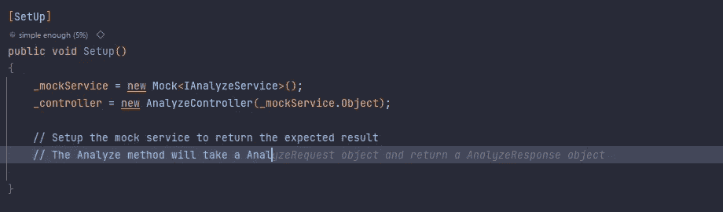

真是疯狂，副驾驶居然能想到我的评论，还试图自动补全。

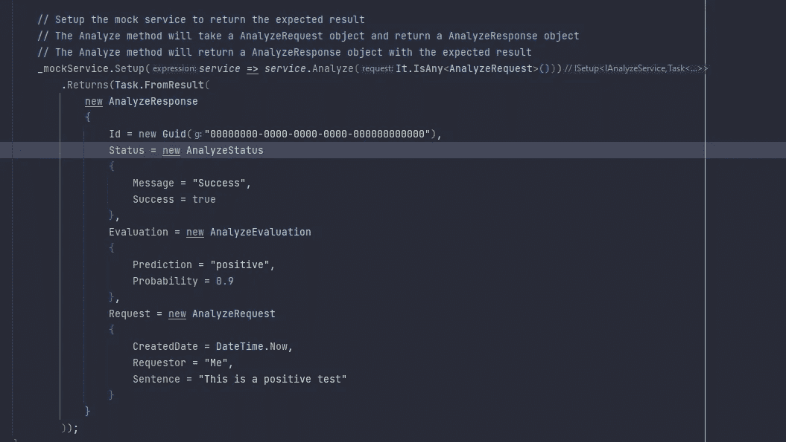

创建`Response`对象需要我给副驾驶很大的帮助，但是它还不能跨文件工作。

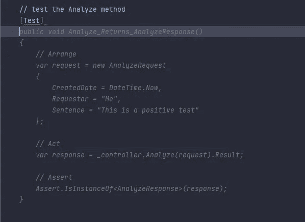

Copilot 很酷的一点是，它现在可以从文件中学习，并且知道创建测试的对象。

让我们给副驾驶更多关于我的目标的信息。我想测试我的`Request`句子是否不为空，那么我的响应对象应该包含请求对象中的句子。

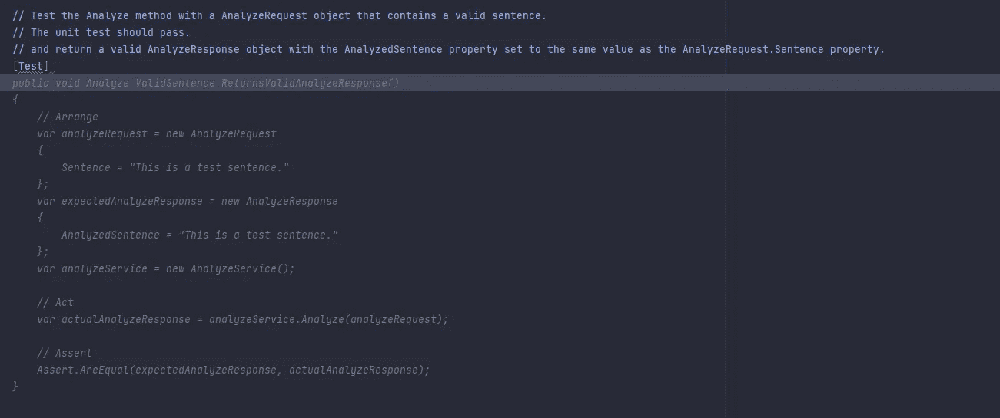

我只写了一些解说词，剩下的句子是副驾驶做的。我稍微调整了一下这两个测试，并开始构建 ML 模型。

在我们的解决方案中创建了一个新的 ML.NET 项目之后，我构建了 Jarred Capellmann 的项目架构，他是《与 ML.NET 一起实践机器学习》一书的作者(我已经写了一些关于它的帖子)。

我开始创建我的模型输入类，并使用了 Copilot，这是一种讽刺，用一个 AI 来构建一个 AI。

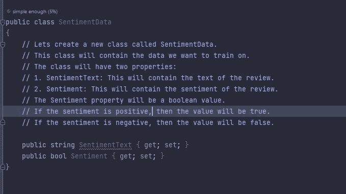

下一步是创建输出模型。副驾驶做了解说——我只是把概率和分数的数据类型从 double 改成了 float。

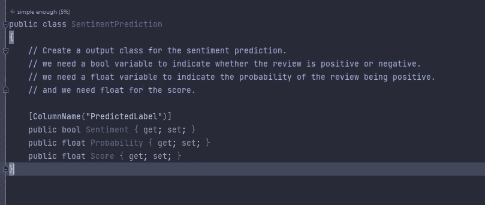

我将`Yelp_labelled`数据集添加到我们的项目数据文件夹中，并通过构建教练类来测试 Copilot。

因此，副驾驶遇到了一些问题。我不得不多次重写评论，没有得到任何有价值的建议。可能是因为我的句子不清楚，或者因为副驾驶还没有接受过 ML.NET 的训练。

我用更具体、更细致的方法再次尝试，如你所见，它理解了我的想法，但不是静静地理解我在寻找什么。

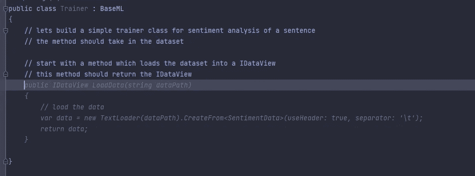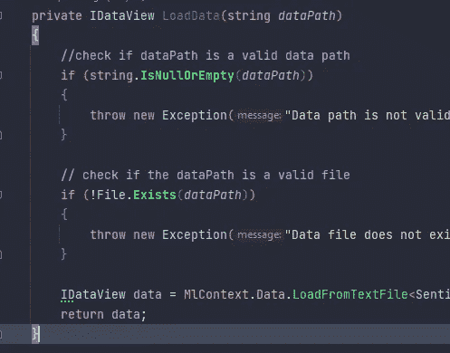

我写了一个注释，我想检查数据路径是否有效，文件是否存在，Copilot 为此写了一个可靠的检查。

另一方面，为训练数据集和测试数据集编写一个拆分方法几乎已经可以正常工作了。如您所见，返回类型是错误的。

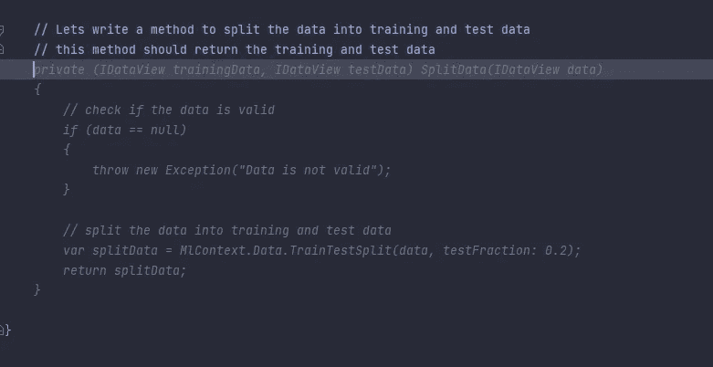

拆分数据后，我们希望创建管道:

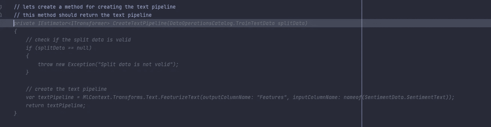

只需要更改空检查，这里最酷的事情是它从空检查中学习，并在下面的方法中实现。

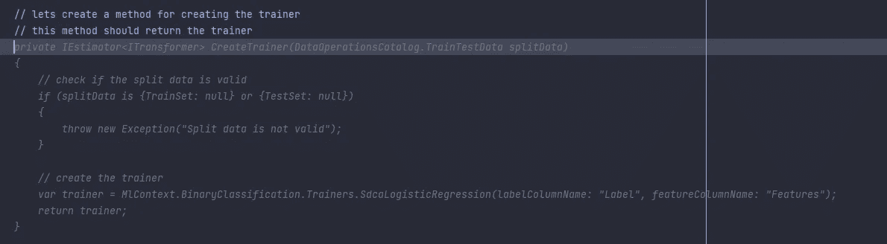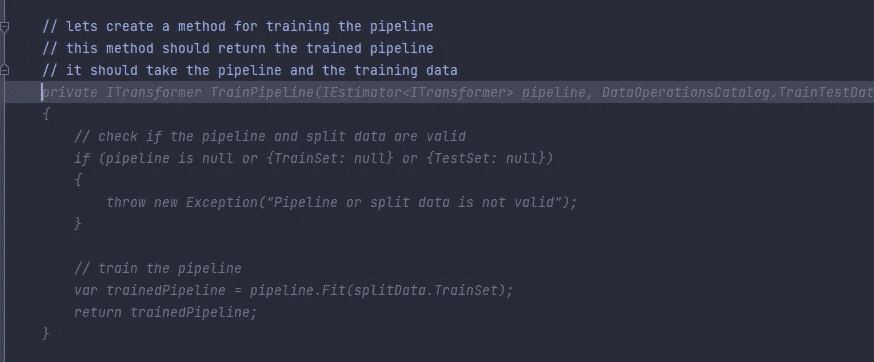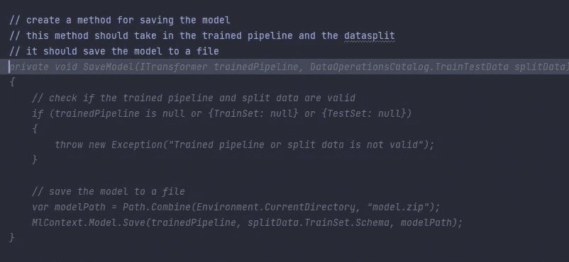

又一次几乎说到点子上了。不过这里说实话，副驾驶并不知道`BaseML`级，里面包含了`ModelPath`。

我现在不告诉你其他的方法，只告诉你训练的方法。

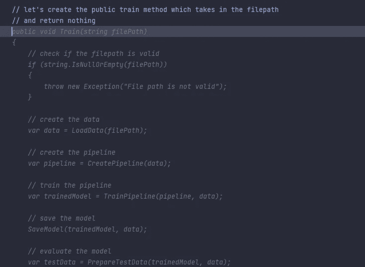

这又需要我做一些工作，但老实说，它工作得很好。副驾驶应该是你的搭档程序员，而不是代替你。

我完成了代码来缩短这个帖子，你可以看看回购。此外，您应该注意到代码并不完美，也不适合生产。这只是 Github Copilot 所能做到的一个例子。

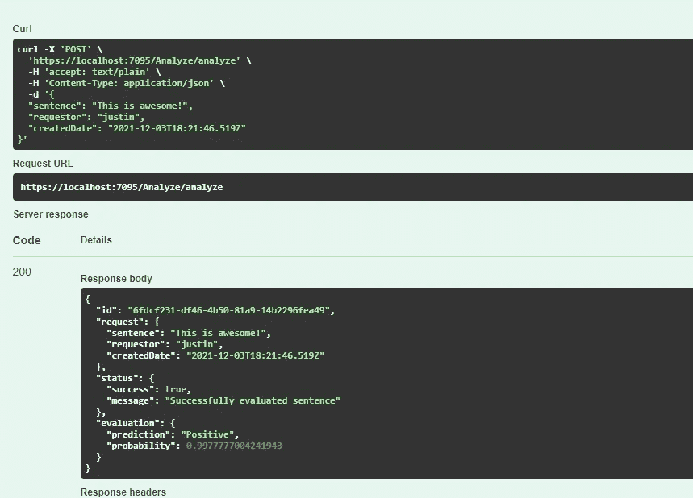

# **总结**

总的来说，你可以说 Github Copilot 工作非常流畅。有时，会有错误的预测，但是给副驾驶多一点上下文，会很快理解你试图做什么，并帮助你更快地完成任务。

如果您构建了您的实体并描述了您所需要的东西，它会工作得非常好，但是它也可以从类名中猜出需要什么属性。

Github 副驾驶:【https://copilot.github.com/】T2

项目:【https://github.com/muench-develops/SentimentAnalyzer 