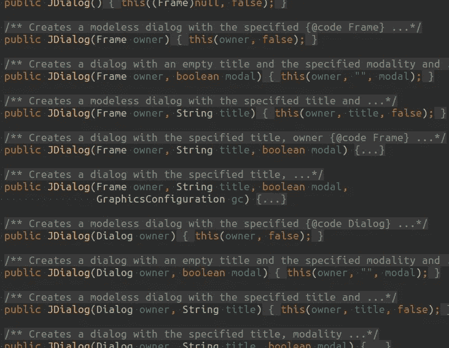
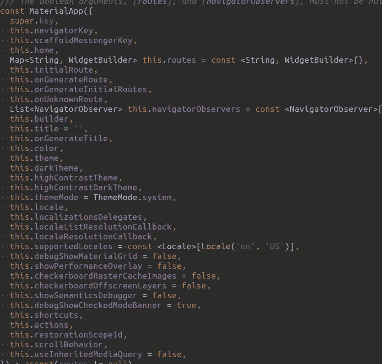
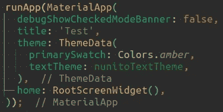

# 祝你们 JMas 快乐，新 JEP 快乐！

> 原文：<https://betterprogramming.pub/i-wish-you-a-merry-jmas-and-a-happy-new-jep-5694a3d02e64>

## 现代 Java 最需要什么？这是我的愿望清单

JSanta(取自[https://twitter.com/cjug](https://twitter.com/cjug)

圣诞节快到了，所以许愿的时间也快到了。我热爱 Java 语言，我使用它已经超过 16 年了，我当然希望它能有所改进。

[Java 好](/why-java-is-perfectly-alive-e3f25a576f95)，但任何生物总有进步的空间，Java 也不排斥。随着 project Loom preview 在 [JDK19](https://openjdk.org/projects/jdk/19/) 中的发布，很明显，即使在完善的生态系统中，仍然有许多疯狂的事情可以做，这些事情可以填补空白，解决有时被认为无法解决的问题。如果你不知道为什么 Loom 被非正式地称为“异步的杀手”，只要看看这里的[，这是一个伟大的事情](https://www.infoq.com/articles/java-virtual-threads/)！

在这篇文章中，除了已经走上正轨的 jep 之外，我还将分享我对 Java 语言的看法。

# “十亿美元的错误”

照片由[瓦伦丁·拉科斯特](https://unsplash.com/photos/jNSJE8dMro0)拍摄

我的第一个愿望与臭名昭著的可空性问题有关。

这是 Java 和许多其他语言的老痛，即“[十亿美元错误](https://www.infoq.com/presentations/Null-References-The-Billion-Dollar-Mistake-Tony-Hoare/)”。如您所知，在 Java 中，除了原语之外，所有变量和字段的值都可以是 null 或非 null。

对于现代来说，它有点过时了。今天，程序员希望对什么可以为空，什么不可以为空有更多的控制权。许多现代语言提供句法结构，例如 Dart 语言:

在这个例子中，`someNullableString`可以是 null，也可以不是，这在 Java 世界中是很常见的。

但是`someNonNullString`永远不会为空，编译器会保证这一点。不需要等待来自`someNonNullString`的技巧，如果你能在你的代码中的某个地方访问它——它将永远不会是空的。非常方便。

然而，在 Java 中，您不能确定任何对象变量，并且必须进行明确而广泛的非空检查。这个问题有许多解决方案，有些是基于注释的，我现在不讨论它们，因为它们需要外部工具来工作(老实说，我不喜欢它们)。另一种方法是基于首次出现在 JDK 8 中的`Optional`类的使用。

乍一看，Optional 做得很好——如果您将对象包装在 Optional 中，或者通过某种方法返回 Optional，那么您就有了一个很好的处理潜在的可空情况的链接 API。Optional 有三个问题:

1.  **所有的 Java 对象变量都是可选的，**不是`Optional`。因此，每次想要使用`Optional`的 API 时，都必须显式创建它的实例，这很麻烦，在某些情况下还会增加新对象分配和 GC 的压力。
2.  **所有的 Java 对象变量都是可选的**，所以如果你在处理非`Optional`对象——你仍然不能确定它是否为空。
3.  **所有的 Java 对象变量都是可选的**，而`Optional`——只是另一个 Java 对象。所以即使你得到一个可选的，你也不能 100%确定它本身不是空的！

可选类在某些情况下为我们节省了时间，但是它没有完全解决可空性问题，因为它没有给你强有力的保证。

那么解决办法是什么呢？

如果我们看看其他现代语言，首先想到的是通过添加“？”来改进类型系统符号来标记可空类型，没有该符号的类型决不应该为空。显然，这对于 Java 世界来说是不可接受的，因为它会破坏向后兼容性。如果你这样做，所有的旧代码都会停止工作，需要重写，这是不可接受的。通常，人们会放弃这一步，说“好吧，我们将永远带着空指针问题生活”。

然而，还有另一种选择，与其在类型上添加可空标记，为什么不标记非空的类型呢？考虑这个例子，如果我们假设非空的标记是“！”：

我相信你已经明白了。`mainData`是`nonNull`，`additionalData`可能为空。返回值将是`nonNull`，因为它是由非空值生成的。另外，作为一点语法上的好处，为经典的可空性提供良好的链接可能性，使其类似于可选的 API(但不一定在这个过程中创建可选的对象)，这将会很酷。

添加非空标记是完全向后兼容的。没有遗留库和 API 处于危险之中。但是在新的代码中，你会有更方便的语法和更强的保证，我认为这很有意义。

所以我的第一个愿望是看到一个至少为新代码解决可空性问题的 JEP。

# 参数化地狱

照片由[ybraym esen ov](https://unsplash.com/photos/eiwVOa9zb10)拍摄

Java 使用相当保守的方式为方法声明参数。您可以逐个枚举所有参数，也可以添加`varargs`以便将任意数量的参数收集到一个数组中。乍一看就够了，我们来看例子:

我们有一个带有一个方法的接口，它接受三个参数。很好。但是，如果我们希望一个参数是可选的，并且在它不存在的情况下，我们希望使用默认值，该怎么办呢？假设`b`应该是可选的，如果没有设置，则使用默认值:

看起来很简单对吗？

现在让我们假设这三个参数都是可选的，如果没有设置，应该有一些默认值。那么我们需要多少种方法来处理所有的组合呢？2 = 8.随着可选参数的增加，你将需要更多的方法组合来建模。哦，欢迎来到参数化地狱…

在某些领域，参数化对你的打击最大。例如，当你使用 UI 时，通常有许多参数你可以改变视觉和行为:不同的填充/边距/间距、颜色、布局属性、字体、边框等。其中一些你可能想在特定的情况下改变，但大多数情况下，你可能会使用默认值。

让我们来看一个很好的老例子 Swing(你可能认为 Swing 有点过时了，这绝对是真的，但是最好的 Java IDEs 之一仍然在使用它[。有一个班级`JDialog`负责……很好的对话。当您试图创建该类的对象时，您必须选择一个构造函数:](https://stackoverflow.com/a/12311981/3231055)

javax.swing.JDialog 类的一部分

准确地说，你必须从 16 个构造者中选择一个。这个数字反映了一件简单的事情:在 JDialog 创建的上下文中，一些参数(如标题或模态)是可选的，试图遵守它会导致大量可用构造函数的组合爆炸。

现在让我们考虑一下[颤振](https://flutter.dev/)框架。Flutter 是基于 Dart 语言的 UI 框架。它与 Swing 或任何其他 UI 框架有相同的问题:大量带有预定义默认值的可选参数。让我们看看 Flutter `MaterialApp`类的构造函数:

Flutter MaterialApp 类构造函数

构造函数有 35 个参数，每个参数都是可选的。在 Dart 中，`{}`中的参数被认为是可选的，但是您也可以添加经典的强制参数，只需将它们放在`{}`之外。

现在不要关注`this`关键字，这是一种自动为类的字段赋值的语法，这当然很酷，但是我们现在坚持可选参数主题。一些参数使用默认值，那些没有赋值的参数使用空值作为默认值。以下是如何使用此构造函数的示例:

创建 MaterialApp 对象

答对了。您只设置了几个需要的参数，而让其他参数使用默认值。为了获得这样的便利，你必须使用一种很好的组合方法在一个`MaterialApp`类中创建 2 个⁵方法！请不要尝试，否则你很可能会错过圣诞晚餐。

在 Java 中，我们如何避免这样的参数化地狱？使用最广泛的解决方案是 [Builder 设计模式](https://blogs.oracle.com/javamagazine/post/exploring-joshua-blochs-builder-design-pattern-in-java#:~:text=The%20Builder%20pattern%2C%20which%20is,using%20the%20same%20construction%20code.)，这意味着我们应该使用另一个对象，它的字段引用我们想要调用的方法的可选参数，通过链接 builder setter 方法来设置它的值，最后调用“build”方法来最终完成我们需要的工作。听起来有点繁琐。当对象的创建并不简单时，构建器在复杂的构建场景中会很方便，例如，如果创建过程被分成许多步骤，每个步骤中有不同的可用选项。然而，对于简单的情况，如果您有方便的可选参数语法，那么不再需要构建器模式。

有一些好消息。如果立即将 Dart 样式的可选参数定义添加到 Java 语言中，那么即使是 Dart 样式的可选参数定义及其冒号用法也很可能不会破坏向后兼容性。当然，可能会有粗糙的角落，但原则上没有问题。除了 Dart 语法之外，可能还有许多替代方法可以做得更好。

所以我的第二个愿望是在未来的 jep 中看到可选的方法参数。

乔纳斯·雅各布森的照片

感谢阅读！你有什么关于 Java 的愿望要写进给圣诞老人的信里吗？让我知道。感谢阅读。

在我的[电报频道](https://t.me/java_lang_info)订阅，我每周在那里放一两句关于 Java 生态系统的状态。