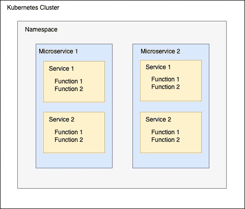

# 我用 TypeScript 编写了一个 Node.js 框架来为 Kubernetes 创建云原生微服务

> 原文：<https://betterprogramming.pub/i-wrote-a-node-js-framework-to-create-cloud-native-microservices-for-kubernetes-in-typescript-a2b31b16f152>

## 采用 Node.js 和 TypeScript 的安全第一云原生微服务


[亚历克斯·王](https://unsplash.com/@killerfvith)在 [Unsplash](http://unsplash.com) 上拍照

**📕看看我的新书** [**干净代码原则和模式:软件从业者手册**](https://www.amazon.com/Clean-Code-Principles-Patterns-Practitioners-ebook/dp/B0BSDJKYQJ/ref=sr_1_1?crid=8M0CMV4CP6UQ&keywords=clean+code+principles&qid=1674980636&sprefix=clean+code+principle%2Caps%2C175&sr=8-1) ！

# 介绍

我将向您介绍一种使用 Node.js 和 TypeScript 构建微服务和 API 的全新方式。

我们都知道像 REST、GraphQL 和 gRPC 这样的技术，但现在游戏中有了一个新玩家，一个叫做 [*Backk*](https://github.com/backk-node/backk) *的框架。*

名称 *Backk* 来源于 Kubernetes 的*后端。这个新框架不需要您学习任何额外的技术，但是您可以简单地利用您现有的 JavaScript(和 TypeScript)知识。*

在 Backk 框架中，您使用标准的 JavaScript 类和函数来定义您的微服务 API 端点。但是您需要使用 TypeScript 来为您的 API 端点参数和响应提供类型。如果您还没有太多的 TypeScript 经验，也不要担心。了解 TypeScript 的基础知识足以帮助你走得更远。

# 概念和架构

Backk 微服务是运行在 [Kubernetes](https://kubernetes.io/) 集群中的云原生微服务。微服务可以在一个或多个名称空间中运行。

一个微服务由一个或多个服务(JavaScript 类)组成，服务本身由一个或多个服务函数(类方法)组成。

这些服务及其功能构成了您的微服务的 API。



巴克建筑

例如，如果你的微服务有一个服务`emailNotificationService`和一个函数`sendEmail`，那么这个服务函数可以通过 HTTP URL 路径`emailNotificationService.sendEmail`访问。

如果您的微服务被命名为`notification-service`并安装在默认的 Kubernetes 名称空间中，您可以通过 HTTP 访问 Kubernetes 集群外部的服务功能，如下所示:`https://<kube-cluster-edge-fqdn>/notification-service.default/emailNotificationService.sendEmail`

服务函数可以有零个或一个 JavaScript 类类型的参数。服务函数返回值，可以是`null`，一个可以转换成 JSON 或者 error 的 JavaScript 值。

同步的，微服务可以通过 HTTP 访问。默认情况下，微服务中的每个服务功能都可以通过 HTTP POST 方法访问。但是可以配置使用 HTTP GET 方法访问的服务函数。

异步地，可以通过 Kafka 和/或 Redis 访问微服务。在 Kafka 的情况下，微服务从以微服务命名的主题中读取消息，消息键告诉服务函数执行，消息值是服务函数的参数。

在 Redis 的情况下，微服务使用以微服务命名的列表(作为队列),并从列表中弹出服务函数调用。

# 创建微服务

让我们用一个简短的例子来展示如何创建一个 Backk 微服务并通过 HTTP 访问它。

示例微服务由一个服务`SalesItemService`组成，该服务用于创建销售项目并获取所创建的销售项目。它使用 MySQL 数据库实现持久性。

下面是服务`SalesItemService`的界面，由两个服务功能:`createSalesItem`和`getSalesItems`组成:

SalesItemService 接口

下面是`SalesItem`实体类，包含两个*读写*字段`name`和`price.`实体类必须用`Entity()`标注，类的名称将是存储实体的数据库表的名称。

SalesItem 实体类

下面是`SalesItemService`接口的实现类`SalesItemServiceImpl`。`createSalesItem`服务功能将在数据存储(在本例中为 MySQL 数据库)中保存销售项目实体。`getSalesItems`服务功能从数据存储中提取所有销售项目。

SalesItemService 接口的实现类

最后是实际的微服务实现类`MicroserviceImpl`。在微服务实现类中，您实例化您的服务(在我们的例子中只有一个服务`salesItemService)`

微服务实现类

现在，我们可以创建一个带有 HTTP POST 请求的销售项目:

```
*POST /salesItemService.createSalesItem
Content-Type: application/json

{
  "name": "Sales item 1",
  "price": 49.95
}*
```

我们得到一个响应，其中包含分配了`_id`的已创建销售项目:

```
*HTTP/1.1 200 OK
Content-Type: application/json

{
  "metadata": {}
  "data": {
    "_id": "1",
    "name": "Sales item 1",
    "price": 49.95
  }
}*
```

让我们创建另一个销售项目:

```
*POST /salesItemService.createSalesItem
Content-Type: application/json

{
  "name": "Sales item 2",
  "price": 89.95
}*
```

然后我们可以通过 HTTP POST 请求获得创建的实体:

```
*POST /salesItemService.getSalesItems*
```

答案会是:

```
*HTTP/1.1 200 OK
Content-Type: application/json

{
  metadata: {}
  data: [
    {
      "_id": "1",
      "name": "Sales item 1",
      "price": 49.95
    },
    {
      "_id": "2",
      "name": "Sales item 2",
      "price": 89.95
    }
  ]
}*
```

# Backk 功能

*   基于 HTTP/1.1 或 HTTP2 的同步微服务
*   带[阿帕奇卡夫卡](https://kafka.apache.org/)和/或 [Redis](https://redis.io/) 的异步微服务
*   使用您现有的 Javascript 知识，不需要学习任何额外的技术，如 REST、GraphQL 或 gRPC
*   可用于资源和 RPC 风格的微服务
*   不在乎你的微服务是微服务还是更像是小型服务、大型服务或整体服务
*   在 HTTP/1.1 和 HTTP/2 中使用服务器发送事件(SSE)的订阅端点
*   支持不同的数据库: [PostgreSQL](https://www.postgresql.org/) ， [MySQL](https://www.mysql.com/) ， [MongoDB](https://www.mongodb.com/) ， [MariaDB](https://mariadb.org/) ， [Vitess](https://vitess.io/) (兼容 MySQL)， [YugabyteDB](https://www.yugabyte.com/) (兼容 PostgreSQL)和[cockrochdb](https://www.cockroachlabs.com/)(兼容 PostgreSQL)
*   ORM(对象关系映射器),具有一套全面的数据存储操作和实体字段验证
*   用于提高安全性的强制实体字段验证
*   极大地简化了数据传输对象(dto)的定义，或者完全消除了对 dto 的需求
*   自动数据库模式生成
*   使用 Redis 的可配置响应缓存
*   自动微服务文档生成( [TypeDoc](https://typedoc.org/) 格式)
*   自动微服务 [OpenAPI 3](https://swagger.io/specification/) 元数据/规范生成
*   可以调用元数据的自动 API 端点来为动态客户端检索微服务元数据
*   为[邮递员](https://www.postman.com/)和[纽曼](https://www.npmjs.com/package/newman)自动生成微服务集成测试
*   为 Kubernetes 集群内部和 web 前端客户端自动生成客户端代码
*   使用 [OpenTelemetry](https://opentelemetry.io/) API 的分布式跟踪(Jaeger)
*   日志文件格式符合 OpenTelemetry 规范
*   使用 OpenTelemetry API (Prometheus)收集指标
*   微服务启动时执行一次的启动功能
*   预定功能:Cronjobs 和按客户机请求预定
*   内置 Kubernetes 活跃度、就绪性和启动探针支持
*   现成的 Docker 文件(构建无发行版和非根 Docker 映像)
*   现成的 Docker 编写 yaml 文件，用于在 CI 管道中设置集成测试环境
*   用于 Kubernetes 部署的现成头盔模板
*   默认情况下提供一个 Kubernetes pod 容器安全上下文，该上下文将放弃所有 Linux 功能，使用只读文件系统，以非 root 用户身份运行，并禁用权限提升
*   现成的持续集成和持续安全 CI/CS 管道(目前只有 Github 工作流)具有强大的安全功能:OWASP ZAP API 扫描、sonar cloud/sonar cube 的静态代码分析、FOSSA 的法律和合规性分析、Anchore 的 Docker 图像漏洞扫描、Docker 图像标签包含阿沙摘要的 Helm 图表
*   OAuth 2.0 授权支持
*   验证码验证支持
*   使用 [Argon2](https://argon2.online/) 算法的自动密码散列
*   使用 AES-256-CBC 自动加密/解密个人身份信息(PII)
*   创建统一微服务的推荐源代码目录结构
*   从构建和测试到 Docker/Minikube/Helm 管理的一整套 NPM 脚本
*   轻松访问其他远程 Backk 微服务
*   在一个请求中顺序或并行执行多个服务功能，并且可选地在一个事务中执行
*   Git 的提交挂钩
*   最终用户身份验证和授权由单独的第三方服务完成。Backk 微服务从不自行处理最终用户凭据，这最大限度地降低了泄露凭据的风险。
*   强制服务和服务功能访问控制。每个服务函数必须用至少一个授权装饰器进行注释，比如`@AllowForEveryUser`
*   强制实体属性访问控制:每个实体属性必须有一个访问控制装饰器，比如`@Private`或`@ReadWrite`
*   强制设置请求内容最大长度
*   强制数值范围限制
*   流式 JSON 解析以防止可能的 Node.js 事件循环阻塞
*   强制字符串最大长度限制
*   强制分页
*   可能只允许当前，下一页或上一页抓取
*   使用 [Google RE2](https://github.com/uhop/node-re2/) 进行验证时更安全的正则表达式处理
*   支持外部服务中的审计日志记录
*   在生产环境中自动检查数据库密码和加密密钥的长度和强度
*   安全日志将自动从日志条目中过滤出潜在的秘密和 PII
*   防止系统内部信息泄漏(生产环境 API 响应中没有堆栈跟踪)
*   通过广泛的 ORM 功能实现强大的 SQL 注入预防

# 资源

*   [back Github 页面](https://github.com/backk-node)
*   [back 示例微服务](https://github.com/backk-node/backk-example-microservice)
*   [Backk starter 项目](https://github.com/backk-node/backk-starter)(用于创建自己的 Backk 微服务)
*   [back 使用文档](https://github.com/backk-node/backk/blob/main/docs/USAGE_DOCUMENTATION.MD)
*   [Backk API 文档](https://github.com/backk-node/backk/blob/main/docs/API_DOCUMENTATION.MD)