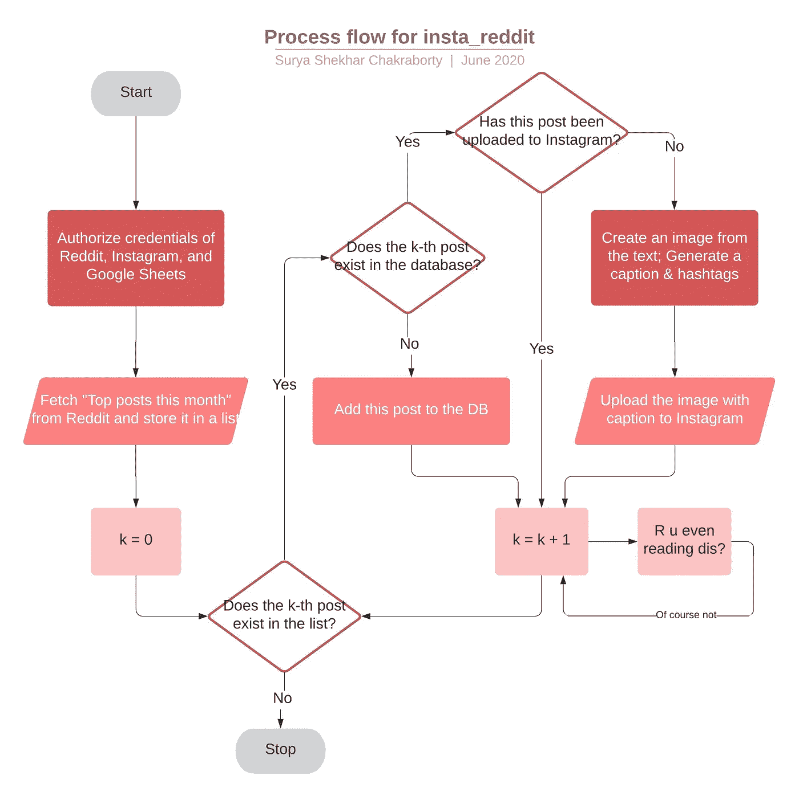

# 我写了一个管道把 Reddit 的精华发布到 Instagram

> 原文：<https://betterprogramming.pub/i-wrote-a-pipeline-to-fetch-posts-from-reddit-and-post-them-to-instagram-d073e55fd258>

## 以下是我学到的

帕特里克·托马索在 [Unsplash](https://unsplash.com?utm_source=medium&utm_medium=referral) 上的照片。

如果你在 Instagram 上呆的时间足够长，你会看到发布有趣的 Reddit 帖子截图的个人资料。如果你仔细想想，这是有道理的:Reddit 受到了严格的监管。这可以确保只有高质量的帖子才会出现在你的订阅源上。

再加上 Instagram，一个每月拥有超过 10 亿活跃账户的社交媒体，你就有了成功的秘诀。

现在，如果你看到 Instagram 页面中的一个样本帖子，你会意识到创建这些帖子需要相当大的努力:

大量的努力

首先，页面所有者必须搜索 Reddit 来找到值得发布的帖子。

1.  他们会根据相关性来判断 Reddit 上的帖子，并挑选出值得发布的帖子。
2.  然后，他们必须将帖子截图并粘贴在黑色背景上，以赋予其 Instagram 友好的维度。
3.  他们必须想出一个与帖子相关的标题，以提高参与度。
4.  他们必须想出标签来提高帖子的可见性。
5.  而且，很简单，他们必须记住他们发布的所有帖子——两次发布相同的内容是没有意义的。

我开始想，“有没有一种方法可以让他们的生活变得更容易……*自动化*？”

# 第一课:头朝下潜水前做好计划

我的第一个错误是在脑子里把所有东西分类，然后“编码”

我开始探索 Reddit 和 Instagram 提供的 API。一天之内，我意识到这不会是一个周末的项目。这些 API 不足以满足我的想法。例如，Reddit 会提供帖子的文本。我不得不自己把文字粘贴到图片上。

我创建了一个文档来跟踪重要的里程碑:

1.  在 Reddit 上搜索热门帖子。
2.  从文本中创建一个图像。
3.  上传到 Instagram。
4.  自动化整个事情。

作者照片。

# 第二课:不要过度设计它。最简单的解决办法可能是盯着你的脸

这个计划也让我省去了创建帖子数据库的很多麻烦。

我需要保存帖子，这样我就知道哪些帖子已经上传了。想想看:如果我连续两天向 Reddit 请求“本月十大帖子”，几乎不可能没有任何重叠。因此，我需要将帖子保存到数据库中，并避免在已经获取帖子的情况下追加帖子。

最初，我通过本地 CSV 开始这样做。但是随着项目的进展，我开始想，“嘿，如果我把咖啡洒在我的笔记本电脑上，我的 DB 就不见了。噗！”

为了确保数据备份，我不得不使用一个位于互联网上的数据库。我开始探索各种选择。我曾见过我工作单位的人使用 Firebase。那会是最好的解决方案吗？或者我应该探索一下我在大学时见过的 [Heroku](https://www.heroku.com/) 的特点？

我坐下来，和我经验丰富得多的同事普内特一起集思广益，想出一个更强大的东西。经过一个小时的权衡，普内特问道:“提醒我一下，Surya，为什么我们又需要一个*数据库*数据库？”

我们意识到，我们只需要对数据表进行基本操作:每次有新文章上传时添加一行，上传后更新一行，并查询行以查看哪些尚未上传。我们没有执行复杂的连接。如果互联网备份是我们唯一关心的问题，为什么不简单地使用Google Sheets 呢？

# 第三课:重构是值得的。我只需要将某些函数调用从 CSV 改为 GSheets

本着自动化的精神，我们必须使用 GSheets API，而不是任何手工劳动。设置凭证花费了一些努力，但很快它就启动并运行了。然而，API 只提供了一些一揽子选项。我在 API 上写了一个包装器，这样它就可以将 GSheets 作为一个数据库使用。

当用基于在线 GSheets 的方法取代基于本地 CSV 的方法时，我感谢过去的自己痴迷地模块化和重构我的代码。我不必为所有可能使用 CSV 操作的位置而烦恼。

# 第四课(你的 Scrum 经理不会承认):时间表是不可靠的

令人惊讶的是，设置整个管道最耗时的部分是从文本中创建图像。

由于没有现成的解决方案可用，我不得不修改现有的图像处理库( [Pillow](https://pypi.org/project/Pillow/) )，以适应分割图像和保持每个部分的文本在边界之间居中对齐等功能，以便它在 Instagram feed 上看起来很好。那花了两个周末的大部分时间。

# 第五课:选择你的战斗。你不能拘泥于细节

Avishek 帮我处理生成的图像的美学部分，他对自己的字体很挑剔。他让我使用一种标准字体调色板上没有的字体。因为我想让这个项目易于复制，所以我必须将这个字体添加到包中。在找到“签入”字体的方法时，我深入研究了图像处理代码，却发现字体是直接从系统字体中选取的(而不是从某个字体文件位置)。

当然，我可以花些时间看看是否有办法从一个位置选择一种字体。但在那时，我决定在自述文件中添加一条注释，从网站下载字体要简单得多。

# 结论

现在我们到了:管道已经准备好，代码已经签入。唯一剩下的部分是找出一种方法来自动触发每日上传。Cron 是这项工作的合适工具吗？同事 Bhavya 建议用 AWS Lambda。还是一个简单得多的解决方案摆在我们面前？

如果你想看看代码或者复制它，这里有记录良好的 [GitHub 链接](https://github.com/suryashekharc/insta_reddit)。尽情享受吧！