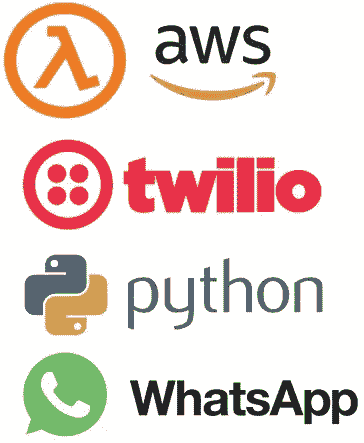
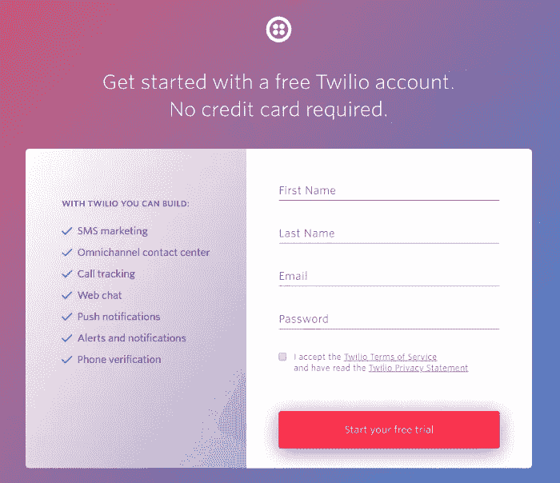
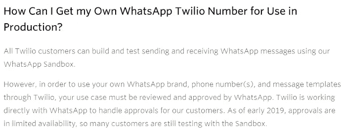
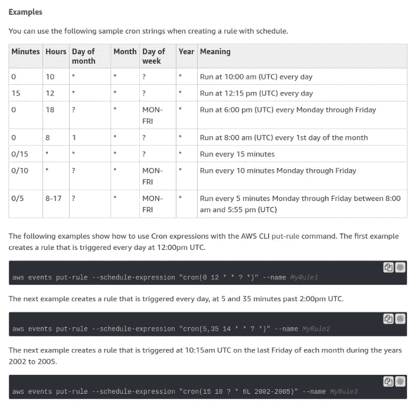
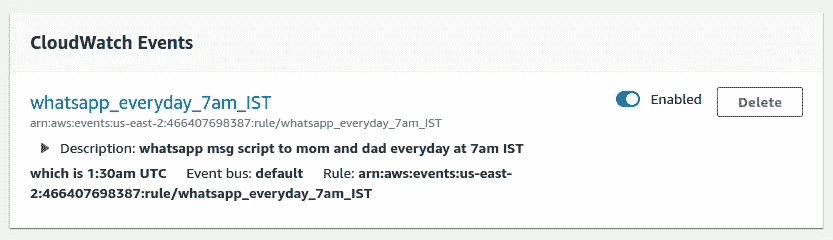
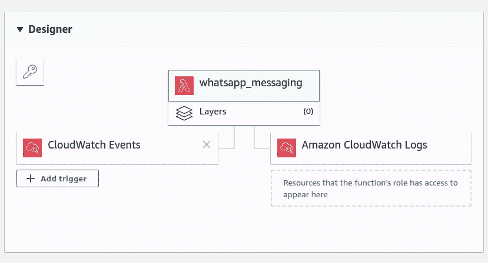

# 我每天早上用 20 行 Python 代码给我父母写了一个脚本

> 原文：<https://betterprogramming.pub/i-wrote-a-script-to-whatsapp-my-parents-every-morning-in-just-20-lines-of-python-code-5d203c3b36c1>

## 包含演练代码的分步指南

布列塔尼·斯穆安科在 [Unsplash](https://unsplash.com?utm_source=medium&utm_medium=referral) 上拍摄的照片

在我们繁忙的工作生活中，我们经常忘记给我们所爱的人打电话。看着我的父母每天早上第一件事就是给我发励志名言和健康建议，是时候回报了。

在本教程中，我们将编写一个简单的 Python 脚本来发送 WhatsApp 消息。Twilio 是我们将使用的 Python 包。为了在每天的特定时间运行它，我们将把代码放在 AWS (Amazon Web Services)云上。

所以让我们开始吧！

一种解决方案是使用 Python 的 Selenium 包并访问 WhatsApp web，而不是使用 Twilio，后者在免费层结束后是基于订阅的。但由于 WhatsApp 不时需要通过手机扫描二维码，自动化是不可能的。

我们将分三步走:

*   [Twilio 初始设置](#673d)
*   [理解代码并修改代码](#12e5)
*   [将我们的包放在带有触发器的 AWS lambda 上](#1025)

# 步骤 1: Twilio 初始设置

 [## Twilio -用于短信、语音、视频和认证的通信 API

### 使用语音服务客人，不费吹灰之力。Twilio 客户和开发人员会议探索…

www.twilio.com](https://www.twilio.com/) 

创建一个免费的 Twilio 帐户，并确认您的电子邮件和手机号码。

此外，免费层 Twilio 帐户需要使用 WhatsApp 的 Twilio 沙盒，这意味着你不能使用你的号码，必须经过一次性许可才能接收 WhatsApp 消息。

两者都可以在你拿到自己的号码时解决，这是在 WhatsApp 批准 Twilio 使用你的号码后完成的。有一张要填写的表格和一段等待时间。

所有这些都令人沮丧，但我们的免费层解决方案很好地完成了任务。此外，就目前而言，这是唯一可用的方法。

现在你必须将接收者的手机连接到 WhatsApp 沙盒，才能开始接收消息。

在控制台的 [aws_cron_docs](https://www.twilio.com/console/sms/whatsapp/learn#CronExpressions) 上的`cron`指南深入学习。

完成后，确保勾选**启用触发器**复选框。最后，单击添加按钮。

在 Lambda 函数仪表板上，您现在可以看到附加到 Lambda 函数的 CloudWatch 事件。向下滚动时，您可以看到启用了 CloudWatch 事件来触发您的函数。

就是这样！您可以将 Twilio 沙盒名称更改为您的名称，甚至可以从 Twilio 仪表板回复。

