# 我写了一个脚本，最终摆脱了我的重复 Last.fm Scrobbles

> 原文：<https://betterprogramming.pub/i-wrote-a-web-script-that-finally-got-rid-of-my-duplicate-last-fm-scrobbles-b505d858fcd4>

## 清除我青少年时期的一些不良数据

马库斯·斯皮斯克在 [Unsplash](https://unsplash.com/search/photos/pop-music?utm_source=unsplash&utm_medium=referral&utm_content=creditCopyText) 上的照片

从 2008 年 6 月开始，我就是 Last.fm 的忠实用户，大约有 11 年了。Last.fm 是一个跟踪或“搜索”你听的任何歌曲的网站，并制作你的活动的可视化图表。你可以看到你有史以来最常听的歌曲是什么，一天中什么时候你最常听音乐，以及许多其他关于你听音乐习惯的信息。

大约从 2013 年开始，到 2014 年结束，我注意到每当我把 iPod 插入电脑时，Last.fm 应用程序都会多次搜索同一首带有相同时间戳的歌曲。我指的不仅仅是一两个副本——有时会多达五十个副本。

因为我经常 scrobbble，它似乎不值得回去手动删除每一个重复的，所以我只是离开它，偷偷地享受我每天得到的数百个额外的 scrobbble。

直到今天，我已经不再是 17 岁了，不知何故，拉娜·德尔·雷仍然是我一直以来最喜欢的艺术家。

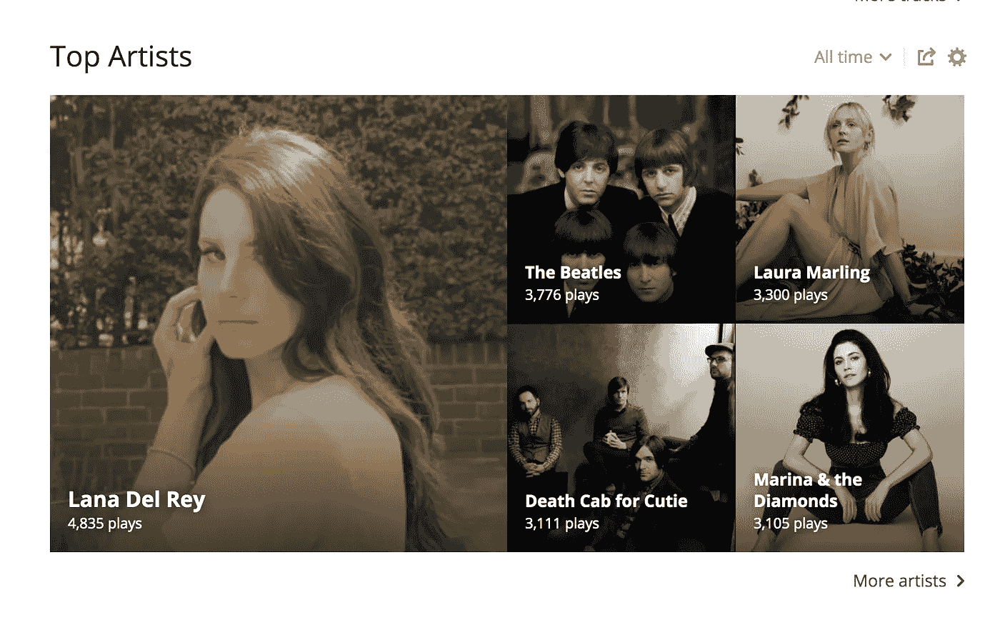

我已经花了几年时间不听拉娜·德尔·雷的音乐，不知何故，她对其他任何艺术家的优势都是如此之大，以至于再过几年她就会被挤下，而我真正喜欢的艺术家都会进入前五名。

在看了我每首歌的剧本后，我发现有很多我最初认为的复制品，每首歌可能有数百个。我开始手动删除所有的重复项，直到我的同学问我为什么不写一些代码来自动删除重复项。

所以，在过去的三天里，我一直在努力做到这一点！

我已经花了很多时间手动删除一些重复的 scrobbles 并测试我的代码，但一周前我为拉娜·德尔·雷写的剧本数量约为 5500 部。以下是一些重复的例子:

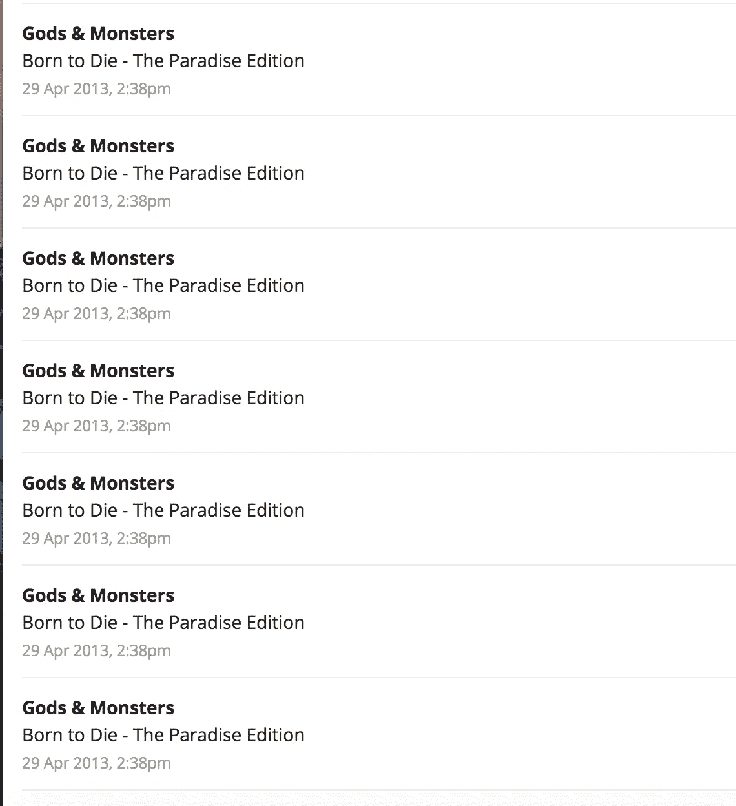

不知道 Last.fm 怎么没有自动过滤掉这些！

因为网站上有如此多的元素，我花了很长时间才弄清楚我必须选择哪些元素来检索我想要的信息。

它的大部分被嵌套和隐藏在大量的 HTML 中，但是一旦我弄清楚我需要点击什么，这只是一个如何比较时间戳的问题，然后当时间戳不再重复时，重置我正在比较的时间戳。这导致了许多令人费解的代码和一个不幸的事件，我不小心删除了*页面上所有的*滚动条，无论是否重复:

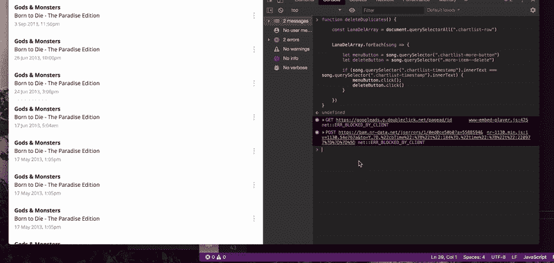

问题源于我使用了`forEach`而不是`for`循环。`for`循环将允许我使用一个我已经访问过的变量来比较索引，而不是试图想出一些复杂的方法来保存当前的变量并进行搜索。

一旦我找到了一次比较两个 scrobble 的最简单方法，我就通过打印 true 或 false 来查看我的比较是否有效，如果 scrobble 是重复的:

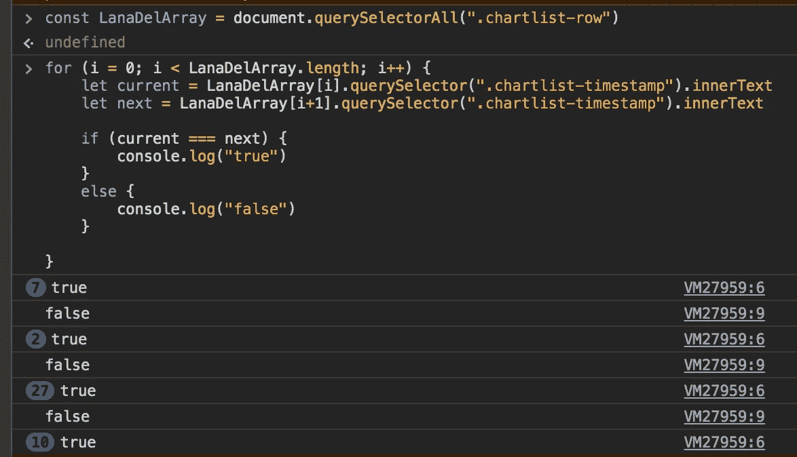

那只是一页！

要删除一个 scrobble，你实际上必须点击两次——一次是打开歌曲名称旁边的下拉菜单，另一次是实际删除。这意味着我必须让我的脚本模拟两次点击，并将 dropdown 元素和 delete button 元素保存到两个变量中。

下面是我的最终代码:

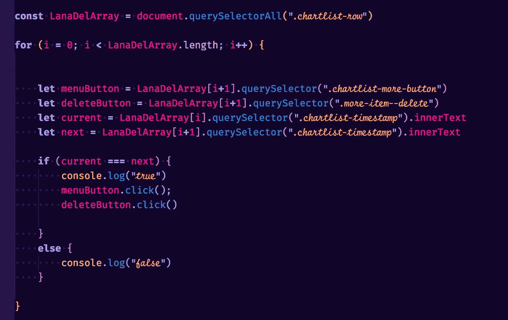

下面是它的实际应用:

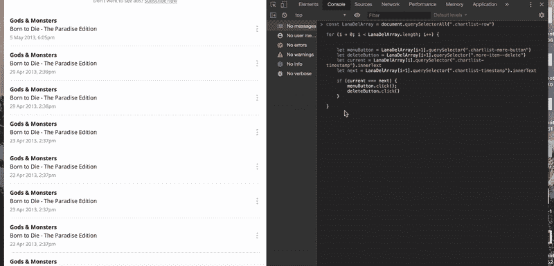

已删除的将变灰。

因为我在模拟 delete button 元素上的单击事件，所以如果您刷新页面，您将看到重复项实际上已被删除:

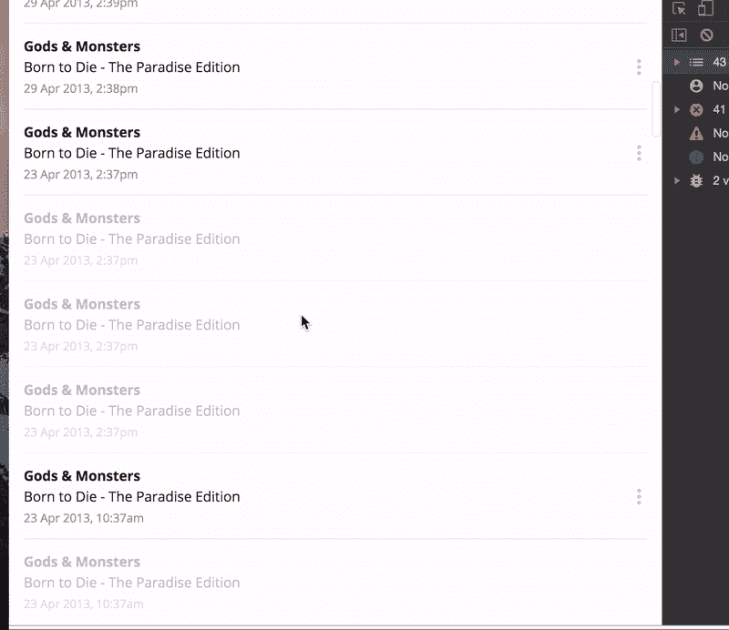

不错！

我又这样做了大约三次，这个数字下降到 67 个金币。

我对所有我知道有重复滚动条的歌曲都这样做了，虽然我每次都必须刷新页面，手动点击导航到一首新歌，但这为我节省了大量的时间。

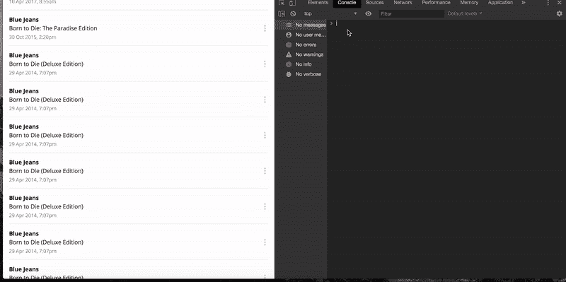

我发现保留 console.log 很有用，因为我喜欢看到一个页面上有多少副本。

辨别哪些歌曲有重复的最简单方法之一是查看 Last.fm 根据您的歌曲历史生成的图表。每首歌都有自己的图表，详细记录你听这首歌的频率。这是我删除重复项之前的一个图表的样子:

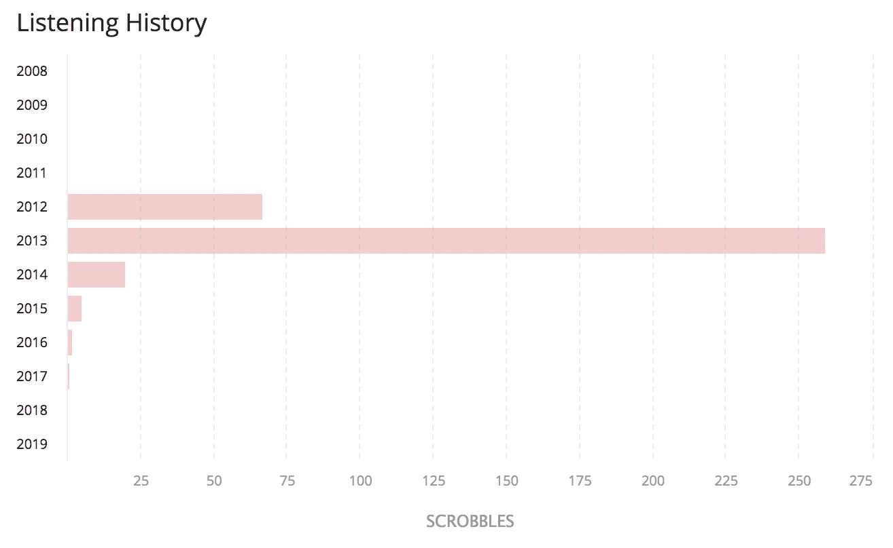

非常极端。

如你所见，这首歌的播放量在 2013 年增加了两倍，然后在 2014 年大幅下降。下面是我删除重复项后的图表:

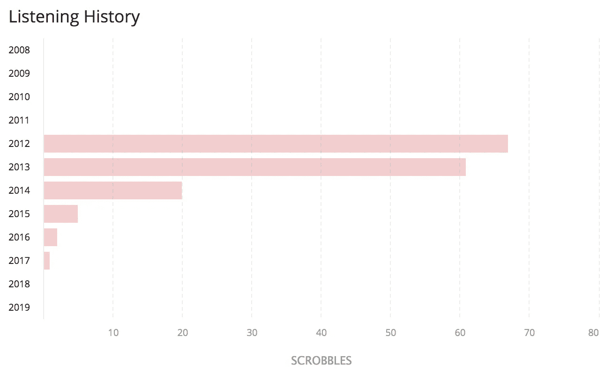

更有道理！

对于一首歌来说，这似乎是一个更合乎逻辑的发展——当它对你来说是新的时候，你听得最多，然后它会随着时间的推移而逐渐减少。

我也很惊讶这能如此迅速地改变我主页上的统计数据。在检查了大多数拉娜·德尔·雷歌曲的重复版本后，她排名第七。

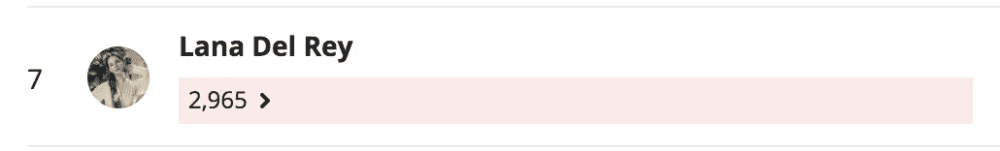

不幸的是，我不得不删除我在 2013 年和 2014 年听过的几乎所有艺术家的重复作品，这意味着我的许多艺术家将被淘汰。截至目前，我的前五名是这样的:

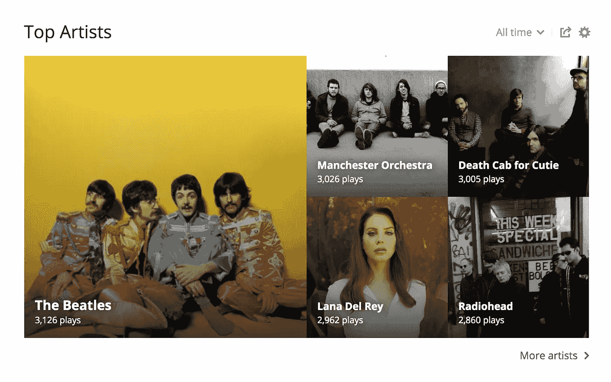

拉娜·德尔·雷再次出现在我的前五名中，这是公平的，因为我实际上*的确*听了她很多。劳拉·马林、玛丽娜和钻石乐队的唱片销量下降了很多，这很合理，因为我已经很多年没听过他们的歌了。仍然有一堆艺术家我需要修复，但我很高兴我不再需要全部手工完成！

如果有人想在他们的浏览器控制台中试用我的代码，这里是我的代码:

**const**LanaDelArray**=**document . query select all(*)。图表列表-行"*)

**为**(I**=**0；I**<**lanadelarray . length；i **++** ) {

**let**menu button**=**LanaDelArray[I**+**1】。querySelector( *)。图表列表-更多-按钮"*)

**let**delete button**=**LanaDelArray[I**+**1]。querySelector( *)。更多项目—删除“*)

**让**当前 **=** LanaDelArray[i]。querySelector( *)。图表列表-时间戳"*)。内部文本

**让**下一个**=**LanaDelArray[I**+**1]。querySelector( *)。图表列表-时间戳"*)。内部文本

**如果**(当前 **===** 下一个){

console.log( *“真”*)

menu button . click()；

deleteButton.click()

}

**其他** {

console.log( *"false"* )

}

}

确保每次运行代码时都刷新页面(导航到下一页不算)！

实际上，我发现这一点很有趣，所以我很高兴在我开始学习编码之前没有删除所有重复的内容！我期待着在未来使用更多的 web 脚本，以解决可能出现的任何其他无关紧要的问题。