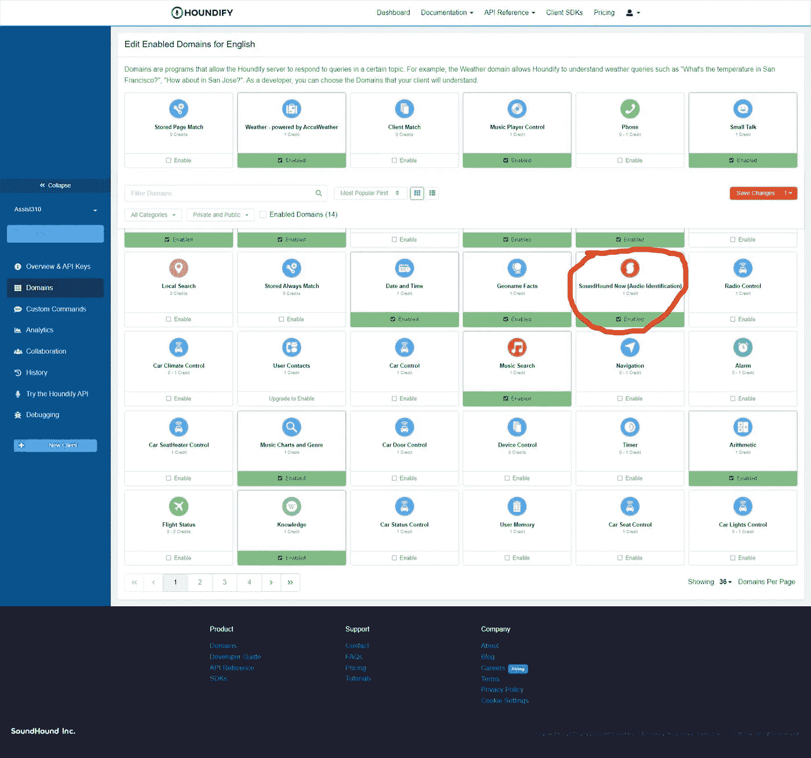
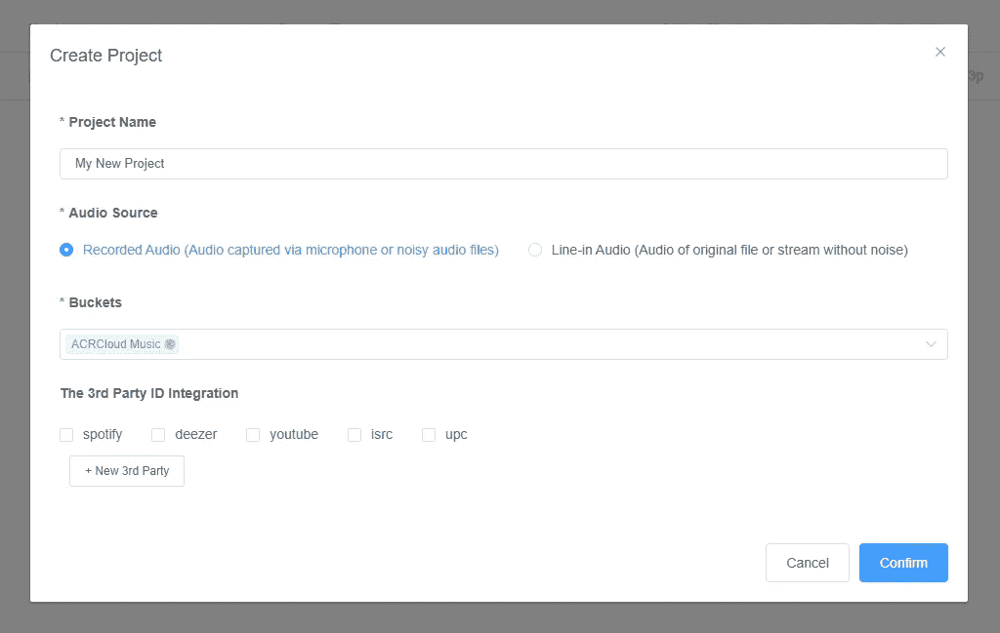

# 用你的人工智能助手识别音乐

> 原文：<https://betterprogramming.pub/identify-music-with-your-ai-powered-assistant-4202763ca553>

## 当你问“那首歌是什么？”时，得到一个答案


作者图片

你好，欢迎光临！

在上一篇文章中，我们使用 Howler.js 来控制音频播放。今天，我们将使用 ACRCloud API 像 SoundHound 一样识别音乐。

因此，我们将能够发出诸如“这是什么歌？”这样的命令并得到回复。

下面的视频展示了这一点:

演示视频

# 安装

如果您错过了上一篇文章，请阅读它以了解我们如何添加新的命令处理程序。

[用人工智能助手控制音频播放|作者:Joseph Nma | 2022 年 9 月|更好的编程](/control-audio-playback-with-your-ai-powered-assistant-967dce72a582)

但是如果你想向前看，我建议至少读一下这个系列的第一部分。

[在网络上构建你自己的人工智能虚拟助手|作者 Joseph Nma | 2022 年 8 月|更好的编程](/build-your-own-ai-powered-virtual-assistant-on-the-web-175fc9e61973)

您可以在这里找到本文[的起始代码。](https://github.com/WoolDoughnut310/houndify-voice-assistant/tree/part3)

首先，启用`SoundHoundNow`域。



在 Houndify.com 上启用新域

启用并单击右上角的保存更改。该域将启用音乐识别命令。

# 处理音乐识别命令

创建一个新的处理程序文件，见上一篇文章。命名为`SoundHoundNowCommand.ts`。

将以下代码添加到文件的顶部:

`STARTING_RESULT`定义了一个包含“正在听……”的结果作为回应。一旦我们录制了音频，我们就输出对文本到语音转换响应。

我们将定义一个名为`handleACRCommand`的函数。我们称之为开始监听并返回一个结果。

我们来分析一下。

首先，我们“说出”结果，等待演讲结束。注意，我们首先必须将`App.tsx`中的`say`函数提取到一个新文件中。

然后，我们在录制音频时显示一段祝酒词来提醒用户。

然后，我们将音频数据以“文件”的名称发送到服务器

服务器识别音频并返回数据。然后，我们使用这些数据来格式化响应。

我们用新的口头回答返回结果。

不要忘记将我们的新文件添加到`index.ts`中的 handlers 数组中。

```
const COMMANDS = ["MusicCommand", "MusicPlayerCommand", "SoundHoundNowCommand"];
```

# 使用 ACRCloud API

首先，我们需要获得我们的 API 证书。在[acrcloud.com](https://www.acrcloud.com/)报名并创建一个音频和视频识别项目。



在 ACRCloud 创建项目

现在从 NPM 安装`arcloud`来访问 API。我们还需要`formidable`来解析上传的音频文件。

```
npm i acrcloud formidable @types/formidable
```

现在将您的凭证添加到`.env`文件的末尾，如下所示:

```
...
ACRCLOUD_HOST=identify-eu-west-1.acrcloud.com
ACRCLOUD_ACCESS_KEY=*****
ACRCLOUD_SECRET=*****
```

# 初始化 ACRCloud 实例

打开`server.js`，导入必要的包。

```
const acrcloud = require("acrcloud");
const formidable = require("formidable");
```

用你的凭证初始化一个`ACRCloud`实例。

# 添加音乐识别 API 路由

定义一个 API 路由来识别音频文件。首先，解析上传的文件并读取上传文件的路径。然后，将文件发送到 ACRCloud 并返回曲目的标题和艺术家。

以下是路线的代码:

# 识别音频文件

定义一个函数从路径中读取文件并返回歌曲的元数据。如果 ACRCloud 返回一个错误，我们抛出一个错误。

# 结论

目前就这些。你可以在这里找到这篇文章的所有代码。

下次我们将使用 Houndify API 来创建定制命令。这样，我们可以使用 Pokémon API 实现我们自己的 Pokedex。敬请期待！

# 资源

[https://github.com/node-formidable/formidable](https://github.com/node-formidable/formidable#with-expressjs)

[https://medium . com/@ bryanjenningz/how-to-record-and-play-audio-in-JavaScript-FAA 1 b 2 b 3 e 49 b](https://medium.com/@bryanjenningz/how-to-record-and-play-audio-in-javascript-faa1b2b3e49b)

[https://fkhadra.github.io/react-toastify/introduction](https://fkhadra.github.io/react-toastify/introduction)

[https://www.npmjs.com/package/acrcloud](https://www.npmjs.com/package/acrcloud)