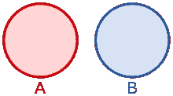

# 识别 Python 中句子之间的相似之处

> 原文：<https://betterprogramming.pub/identify-similarities-between-sentences-in-python-e9f71d454d1d>

## 基于 Jaccard 相似性和最小散列值实现您自己的相似性匹配函数


照片由[拉奎尔·马丁内斯](https://unsplash.com/@fiteka?utm_source=unsplash&utm_medium=referral&utm_content=creditCopyText)在 [Unsplash](https://unsplash.com/s/photos/compare?utm_source=unsplash&utm_medium=referral&utm_content=creditCopyText) 拍摄

通过阅读这篇文章，您将学会编写一个简单的相似性匹配函数来计算两个输入字符串之间的相似性。

`MinHash`是数据挖掘和计算机科学中经常使用的一种技术，用于快速估计两个集合之间的相似性。它经常被用于数据聚类和最近邻搜索。大多数情况下，Jaccard 相似系数用于此技术。Jaccard 指数可以被定义为它们的交集的元素的数量与它们的并集的元素的数量的比率。


图片来源:[维基百科](https://en.wikipedia.org/wiki/MinHash)

当两个集合是不相交的集合时，该值将为 0-表示它们之间没有相似之处。如果两个集合之间没有交集，则称它们为不相交的集合。换句话说，两个集合的交集是一个空集。



图片来源:[维基百科](https://en.wikipedia.org/wiki/Disjoint_sets)

在上面给出的例子中，集合 A 和集合 B 是不相交的集合。同样，如果两个集合完全相等，则值将为 1。最终值将始终介于 0 和 1 之间。我们将使用这种技术来实现两个输入句子之间的相似性匹配功能。一个主要优点是它适用于所有语言，因为比较是基于标记化的字符串。

# 履行

## Minhash 函数

在 Python 文件中创建一个名为`minhash`的新函数。这个函数接受两个输入字符串参数。我就把它们命名为`input_question`和`compare_question`。你可以随意给它们起任何你喜欢的名字。

```
def minhash(input_question, compare_question):
```

初始化一个分数变量，并将其设置为 0。

```
score = 0.0
```

## 将文本拆分成元素

然后，我们编写下面的匿名函数，将输入文本转换成三个字符的元素。

```
shingles = lambda s: set(s[i:i+3] for i in range(len(s)-2))
```

请注意，这个匿名函数是基于 jProcessing 模块下的原始实现的。当涉及到像汉语和日语这样的语言时，这是一个大问题，因为一个单词可能只由一个字符组成。

如果长度小于 3，您可以通过实现自己的方法来解决这个问题，将文本拆分成元素，或者在输入文本中填充额外的空格。

您可以通过运行以下代码来测试结果:

```
shingles = lambda s: set(s[i:i+3] for i in range(len(s)-2))print(shingles('Hello, there ! How are you ?'), shingles('早 上 好 ， 在 干 嘛 呢 ？'))
```

您应该会得到以下结果。顺序可能不同，但是如果使用相同的输入，元素应该是相同的。

```
{'lo,', 'you', 'u ?', 'o, ', ' th', 'are', 'the', 'ere', 're ', 'w a', 'ou ', 'How', ' Ho', ', t', 'ow ', 'e !', 'llo', '! H', ' ar', 'e y', ' yo', 'Hel', 'ell', ' ! ', 'her'} {' 呢 ', '早 上', '， 在', '干 嘛', '上 好', ' 干 ', ' 好 ', '呢 ？', '在 干', ' 在 ', '好 ，', '嘛 呢', ' 上 ', ' 嘛 ', ' ， '}
```

## 计算雅克卡距离

下一步是根据上面给出的公式计算 Jaccard 距离。创建一个接受两个输入的匿名函数。

```
jaccard_distance = lambda seta, setb: len(seta & setb)/float(len(seta | setb))
```

一旦你完成了，我们将开始实现主要代码。建议将其包装在一个`try except`调用中。

```
try:
    score = jaccard_distance(shingles(input_question), shingles(compare_question))
except ZeroDivisionError:
    print('ZeroDivisionError')
```

最后一步是返回分数。

```
return score
```

您的最终功能应该如下所示:

## 结果

让我们测试一下这个函数，看看两个输入句子之间的相似性。

```
print(minhash('welcome to medium', 'medium is a publishing platform'))print(minhash('i have a cat', 'i have a dog'))
```

我得到了以下结果:

```
0.1
0.5384615384615384
```

## 区分大小写

我们刚刚实现的函数是区分大小写的。这意味着大小写会影响相似性匹配的结果。最好的方法是在调用`minhash`函数之前将大小写降低为小写。

```
input = 'Welcome to Medium'
compare = 'Medium is a publishing platform'print(minhash(input.lower(), compare.lower()))
```

## 支持其他语言

理论上，我们的函数支持所有类型的语言，因为它是基于字符串比较的。但是，如果您处理的是不能用空格标记的语言，您需要自己标记它。最简单的方法是实现一个简单的字符标记化。

```
def tokenize(text):
    result = [elem for elem in text]
    return ' '.join(result)
```

在以下中文输入上调用`tokenize`功能…

```
print(tokenize('新年快乐！祝福您和家人身体健康'))
```

…将产生以下结果:

```
新 年 快 乐 ！ 祝 福 您 和 家 人 身 体 健 康
```

让我们来测试一下:

```
print(minhash(tokenize('新年快乐！祝福您和家人身体健康'), tokenize('新年快乐！红包拿来！')))
```

控制台的输出应该如下所示:

```
0.2222222222222222
```

# 结论

让我们回顾一下今天所学的内容。

我们从简单解释`minhash`和 Jaccard 距离开始。我们学习了它背后的基本概念和计算 Jaccard 相似系数的公式。

之后，我们开始实现自己的自定义功能。我们通过匿名函数将输入文本分成三个字符的元素。随后，我们创建了另一个匿名函数来计算 Jaccard 距离。

此外，我们详细探讨了区分大小写的问题，以及通过在调用`minhash`函数之前将文本转换为小写来解决这个问题的方法。为了支持不能被空格标记的语言，我们实现了一个简单的字符标记。

感谢阅读，我希望你喜欢它。下一篇再见！

# 参考

1.  [jProcessing 的 GitHub 页面](https://github.com/kevincobain2000/jProcessing/blob/master/src/jNlp/jProcessing.py)
2.  [米纳什的维基百科页面](https://en.wikipedia.org/wiki/MinHash)