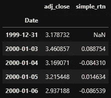
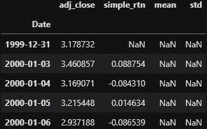
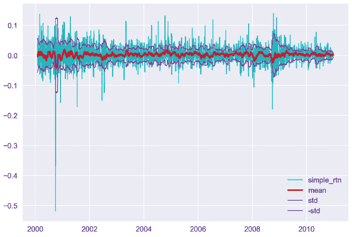
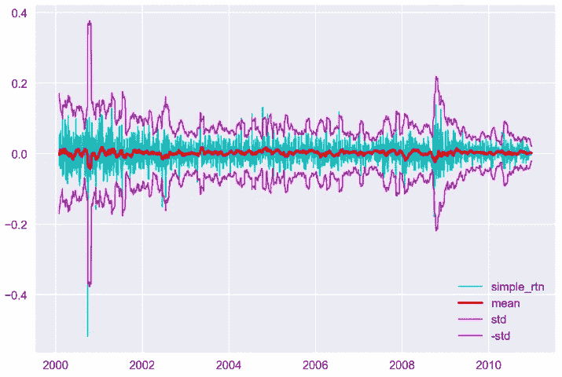
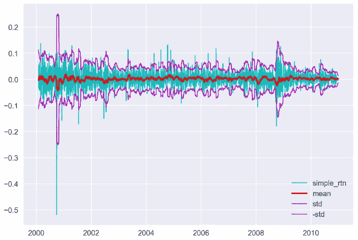
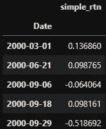
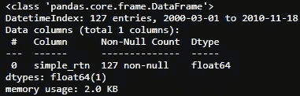
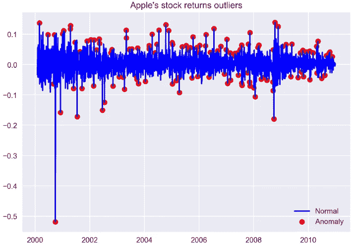
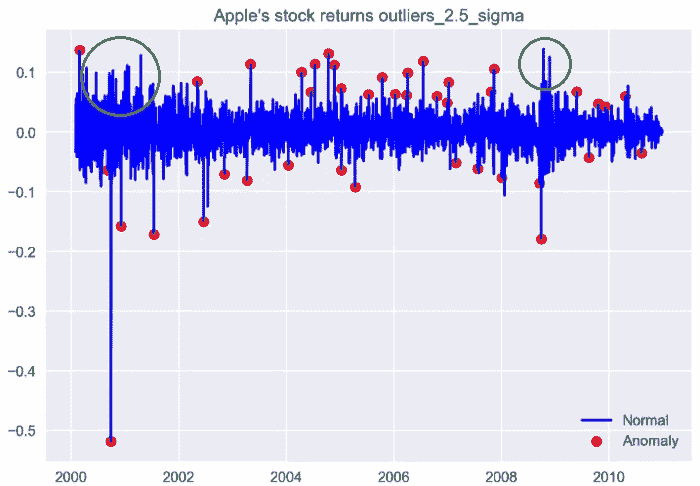

# 识别异常值

> 原文：<https://betterprogramming.pub/identifying-outliers-part-two-4c00b2523362>

## 如何在熊猫数据集中查找并可视化异常值


戴夫·甘迪的照片

**警告** : *这里没有神奇的配方或圣杯，尽管一个新的世界可能会为你打开大门。*

## 📈Python For Finance 系列

1.  [识别异常值](https://medium.com/python-in-plain-english/identifying-outliers-part-one-c0a31d9faefa)
2.  [识别异常值—第二部分](https://medium.com/better-programming/identifying-outliers-part-two-4c00b2523362)
3.  [识别异常值—第三部分](https://medium.com/swlh/identifying-outliers-part-three-257b09f5940b)
4.  [程式化的事实](https://towardsdatascience.com/data-whispering-eebb77a422da)
5.  [特征工程&特征选择](https://medium.com/@kegui/feature-engineering-feature-selection-8c1d57af18d2)
6.  [数据转换](https://towardsdatascience.com/data-transformation-e7b3b4268151)
7.  [微小差异特征](https://medium.com/swlh/fractionally-differentiated-features-9c1947ed2b55)
8.  [数据标签](https://towardsdatascience.com/the-triple-barrier-method-251268419dcd)
9.  [元标签和堆叠](https://towardsdatascience.com/meta-labeling-and-stacking-f17a7f9804ec) [g](https://towardsdatascience.com/the-triple-barrier-method-251268419dcd)

在之前的中，我展示了如何使用均值和标准差来过滤掉数据集中的异常值。在本文中，我们将使用移动平均线作为边界再做一次。

# 1.数据准备

这里，我们重用了第一部分中的数据集。以下代码片段将帮助您入门:



# 2.使用移动平均均值和标准偏差作为边界

与第一种方法一样，我们需要首先获得边界，然后将边界应用于数据集。这一次，将采用移动平均值和标准偏差(std)。为了计算平均值和标准差，选择 21 天的窗口，因为它代表一个月中的平均交易日。你可以选择任何一天，但敏感度会有所不同。

要得到平均值和标准差，很容易用 [Pandas](https://pandas.pydata.org/) 中的一行代码:

```
d1[['mean', 'std']] = d1['simple_rtn'].rolling(window=21) \
                               .agg(['mean', 'std'])
```



`NaNs`太多了。下一步是删除它们:

```
d1.dropna(inplace=True)
```

让我们画一张图，找出界限在哪里:



如果我用三倍的 std 代替会怎么样？



嗯…有点过头了。我们把它改成两倍的 std:



这是正确的！现在是时候去寻找那些离群值了:



# 小费！

```
# The above code snippet can be refracted as follow:cond = (d1['simple_rtn'] > d1['mean'] + d1['std'] * 2) | (d1['simple_rtn'] < d1['mean'] - d1['std'] 
d1['outliers'] = np.where(cond, 1, 0)
```

看一下离群信息。我们知道在 2，745 个数据点中有 127 个异常值(约 4.6%):

```
outliers.info()
```



如果我们将两倍的标准差作为边界，我们会得到 4.6%的数据点超出范围。我们可以挑出那些异常值，将它们放入另一个数据框架，并在图表中显示出来:



感觉有点过头了。我们把它微调到标准值的 2.5 倍。这次，我们得到了 41 个异常值(~1.5%):



需要注意的一点是，当附近有相当多的大回报时，算法会将第一个识别为异常值，将第二个识别为常规观察值(如圆圈中所示)。这可能是由于第一个异常值进入滚动窗口并影响移动平均值/标准偏差。

窗口大小和标准差都会影响最终结果。我们可以对它们进行微调，以更好地满足我们的需求。与之前的方法相比，移动平均法更加敏感。您可以查看之前的文章以获得更好的理解:

[](https://medium.com/@kegui/identifying-outliers-part-one-c0a31d9faefa) [## 识别异常值—第一部分

### — python for finance 系列之一

medium.com](https://medium.com/@kegui/identifying-outliers-part-one-c0a31d9faefa) [](https://medium.com/@kegui/identifying-outliers-part-three-257b09f5940b) [## 识别异常值——第三部分

### 如何通过熊猫来查找和可视化数据集中的异常值

medium.com](https://medium.com/@kegui/identifying-outliers-part-three-257b09f5940b)