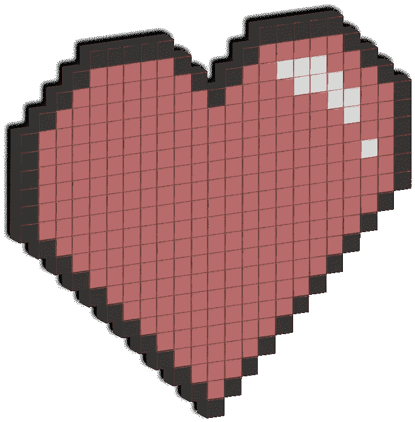

# 如果编程语言是流行的浪漫比喻

> 原文：<https://betterprogramming.pub/if-programming-languages-starred-in-popular-romance-tropes-2ec81bd9713>

## TLDR；事情会变得非常有趣



由 [Pixabay](https://pixabay.com/) 上的[克里斯多佛克](https://pixabay.com/users/kristopherk-1837081/)拍摄的照片

言情小说和电影同时展现了一些最有趣、最可疑、最老套的角色，他们是整个故事的中心。

如果这些至关重要的男女主角是编程语言，会发生什么？每种流行的编程语言最适合哪种流行的浪漫比喻？让我们看一看。

# Python:一见钟情

如果巨蟒出演一部爱情电影，剧情看起来会很像《T4》中的灰姑娘。这种语言简单但永恒，所以毫不奇怪每个程序员都会在眨眼之间坠入爱河。

```
print('Those other langauges have nothing on me.')
```

# Fortran:强制接近

不像 Python，说到 Fortran，我怀疑有哪个心智健全的人类会一见钟情。我的意思是，只要看看它的打印声明。

```
program weird greeting
print *, 'Hello World'
end program weirdgreeting
```

我们大多数人开始使用 Fortran 的原因并不是因为它特别有趣或者在工业中非常有用。通常是因为我们正在上的一些烦人的课程需要它。话虽这么说，我们*讨厌*它也没那么坏；虽然它看起来超级怪异，但也看起来有点酷。在一天结束的时候，我们知道我们很容易坠入爱河。

# 恋人的敌人

与 Fortran 不同，这种语言确实看起来很糟糕，我们第一眼就讨厌它。这是一种许多程序员很早就开始学习的语言，它会因为遗漏了一个分号这样的小事而引发大量的错误，这让几乎每个人都受到了伤害。也就是说，在对 C 语言越来越熟悉的艰难过程结束时，很难不坠入爱河。

```
int main()
{
  printf("Your worst nightmare but sweetest daydream");
  return 0;
{
```

# C++ / C#:你变了

万一我们在早期接触 C 时没有完全爱上它，这种语言会以 C++和 C#的名字重新出现并得到改进，并让我们质疑我们认为自己了解的一切。

开头是这样的…

```
printf("Your worst nightmare");
```

变成了这个…

```
std::cout << "A not so bad nightmare you somehow love" 
```

变成了这个…

```
Console.WriteLine("Still a nightmare, but still loved");
```

C++和 C#将是“你变了”这一浪漫比喻中的终极明星。

# HTML/CSS:假约会

我的意思是，他们甚至不是编程语言，所以“假约会”的事情？它工作了。不要质疑。

```
<p> Does this count as a print statement? </p>
```

# JavaScript:恋人的朋友

起初没有人讨厌这种语言，但也没有人喜欢她。老实说，她有点无聊。在一部经典的慢热的朋友到爱人的爱情电影中，JavaScript 是最适合她的元素。

```
"You'll love me eventually..."
```

# 划痕:禁忌之爱

如果你告诉任何一个程序员 Scratch 是你最喜欢的编程语言…不要告诉他。坏主意。Scratch 可能真的很可爱，但你最好假装他真的不可爱，否则你会成为《罗密欧与朱丽叶》2.0 版的灵感来源。呀。

# 爪哇:童年恋人

Java 是一个不可否认的流行经典，它是我们许多人的第一语言。它是结构化的、可靠的，并且从一开始就一直伴随着我们。Java 成为完美的“青梅竹马”英雄是有道理的。提示泰勒斯威夫特的“你属于我”。

```
System.out.println("Been here all along so why can't you seeeeee, you belong with meeee");
```

仅此而已！感谢阅读:)