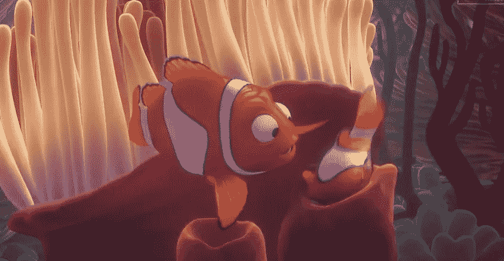
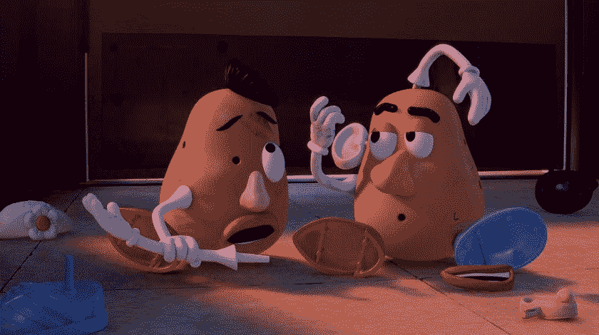
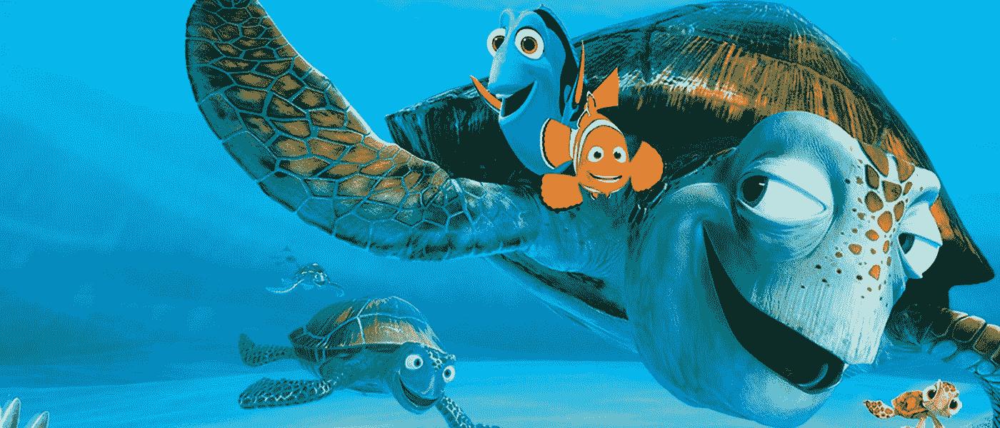
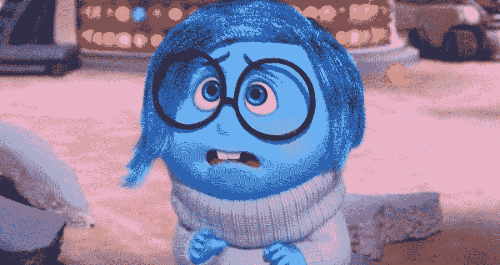

# 如果编程语言是皮克斯的角色

> 原文：<https://betterprogramming.pub/if-programming-languages-were-pixar-characters-a56622ae4196>

## 让我们把编程语言比作皮克斯的角色，这很有趣

马克斯·科特斯在 [Unsplash](https://unsplash.com?utm_source=medium&utm_medium=referral) 上的照片

皮克斯无疑是我童年的一大亮点，我敢打赌它也是你童年的一大亮点。皮克斯电影中的角色都是精心打造的，每个角色通常都有一个有趣的背景故事和古怪的特征，让他们栩栩如生。

然而，最近，我不再沉迷于各种皮克斯角色的世界，而是沉迷于各种编程语言的世界。像每一个皮克斯角色一样，每一种编程语言也是精心创造的，其中大多数语言在创造和使用的背后都有着有趣的历史，以及将它们带入生活的古怪特征。

这让我想知道，如果编程语言是皮克斯的角色，会发生什么？哪种流行的编程语言可以扮演皮克斯最受欢迎的角色？让我们找出答案。

# 扮成梅里达

图片来自《勇敢》(2012)

***Go*** ing ***勇者*** ly 继 Python 成为编程语言之王之后，Go 轰轰烈烈地进入了软件开发的世界。

就像 Go 尽管是最新的编程语言之一却无所畏惧一样，Brave 中的 Merida 尽管是剧院里最新的动画公主之一却是无所畏惧和标志性的。

不可否认，如果 Go 必须扮演皮克斯的任何一个角色，那一定是这位苏格兰公主。

# 作为尼莫的 Python

图片来自《海底总动员》(2003)

Python 是编程语言之王，从它迅速上升的人气和它因看起来有点像伪代码而受到的赞美来看，只有 *Finding Nemo，*这部被广泛认为是皮克斯制作的最好的电影，即使在近 20 年后。

Python 和《海底总动员》的持续流行表明，如果 Python 是皮克斯的一个角色，它一定是我们都喜欢的标志性角色，尼莫。

# HTML/CSS 作为土豆头先生和夫人

图片来自《玩具总动员 4》(2019)

土豆头先生和夫人都是奇怪的角色，他们有不可思议的能力将自己组织和重新排列成多少有些美感的假土豆。

难怪假的编程语言夫妇 HTML/CSS 负责排列和重新排列用户看到的一切最适合土豆夫妇的角色。

# Java 作为 Crush

图片来自《海底总动员》(2003)

在选择 Java 最擅长扮演的角色时，我们的焦点又回到了《海底总动员》上。为什么？因为古老、睿智、受人喜爱的 Crush 显然是与地球一样古老的编程语言的最佳匹配，它也出现在几乎所有算法教科书中，而且从许多方面来看，它也是最受欢迎的语言。

# 作为仙女教母

图片来自《怪物史莱克 2》(2004)

仙女教母第一次被介绍给我们可能是作为一个天使从天堂派来帮助一个处于困境中的少女。然而，在《怪物史莱克 2》中，我们看到仙女教母被描绘成一个道德救世主。

就像仙女教母一样，C 已经被多次改造成 C#，C++，谁知道接下来会是什么。更重要的是，就像仙女教母一样，C 也希望每件事情都按照她想要的方式完成，如果开发人员犯了一个错误，她会噗地冒出 100 个错误，并在终端*上打印出来，就像她有一根神奇的魔杖*。

难怪如果经典编程语言 C 成为皮克斯的角色，她除了扮演经典角色仙女教母之外不会扮演其他角色。

# 客观-C 为悲伤

图片来自《从里到外》(2015)

可能很多人讨厌 c，但也有很多人喜欢它。对于 Objective-C 就不一样了。

由于是面向对象的，不像她的前辈 C，这种编程对她的未来有着最好的期望。然而，不幸的是，她作为苹果得力助手的名声并没有像她希望的那样长久:2014 年，她被臭名昭著的斯威夫特取代。

这是一次创伤性的经历，从那以后她一直郁郁寡欢。她很可爱，我们不禁同情她，所以她在皮克斯电影中扮演的角色还能比《由内而外的悲伤》更好吗？

# 锈为快乐

图片来自《从里到外》(2015)

就像 Objective-C 完全有理由感到不安( [68.7%的开发者表示不喜欢她](https://www.google.com/search?q=least+liked+programming+languages&oq=least+liked+pro&aqs=chrome.0.0i20i263i512j0i512j69i57j0i22i30l3j0i390l4.5273j0j9&sourceid=chrome&ie=UTF-8))，Rust 完全有理由感到高兴。Rust 是最受欢迎的编程语言之一(和她一起工作过的 3.5%的开发人员可以证明这一点)。

她是一颗冉冉升起的明星，许多人想知道她是否会取代标志性的 C(根据记录，她非常乐观地假设，她的乐观只是将她与 Joy 配对的另一个原因)。

感谢您的阅读！

现在你可能已经听说了，迪士尼实际上拥有皮克斯，所以也许值得看看每种编程语言最适合扮演哪些迪士尼角色。

 [## 如果编程语言是迪斯尼人物

### 让我们开心地将编程语言比作迪士尼的恶棍

better 编程. pub](/programming-languages-as-disney-villains-feb5b17c01ea)