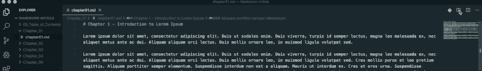
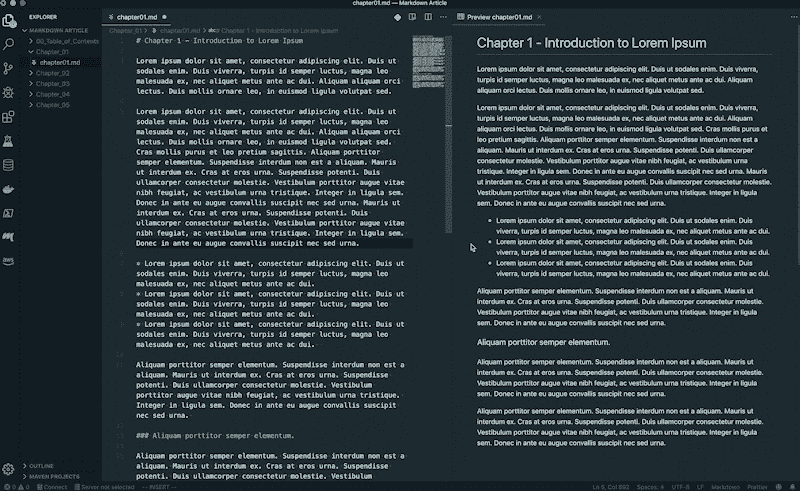
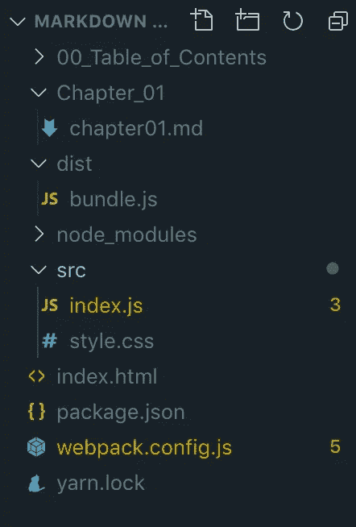
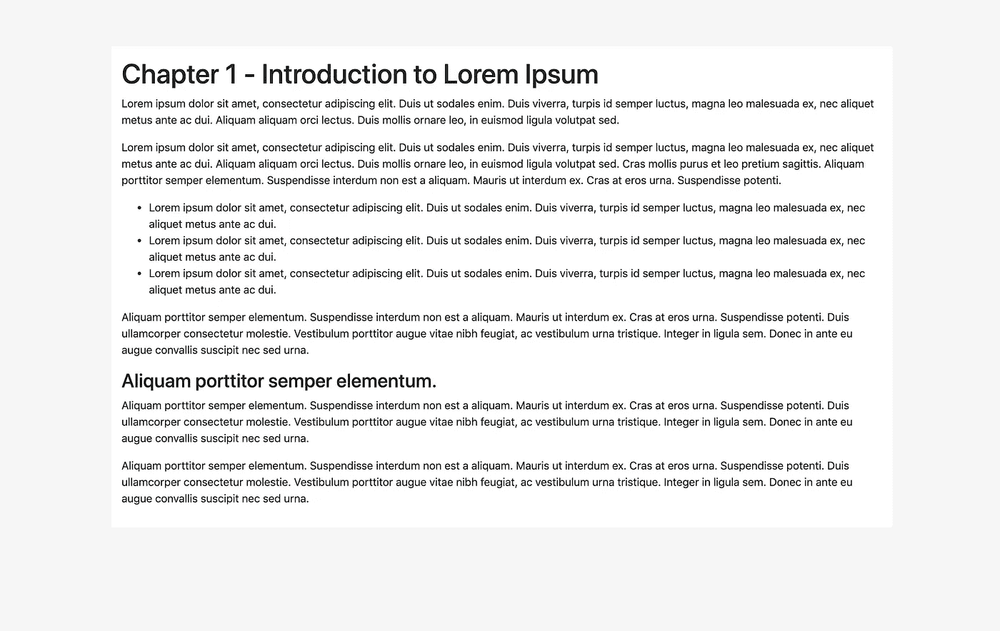

# 如果有一个“顶级降价编辑器”列表，添加 Visual Studio 代码到其中

> 原文：<https://betterprogramming.pub/if-theres-a-top-markdown-editors-list-add-visual-studio-code-to-it-ae68f8a4adb4>

## 使用 VS Code 为作家、编辑和博客作者保守的最佳秘密，增强您的写作工作流程


由[科琳·库兹](https://unsplash.com/@corinnekutz?utm_source=medium&utm_medium=referral)在 [Unsplash](https://unsplash.com?utm_source=medium&utm_medium=referral) 上拍摄的照片

我每天都努力在我的工作和生活中贯彻极简主义者的理念。

作为一名开发人员，我尽量减少用于完成工作的工具，从编码到文字处理到图形编辑。现在我正在使用很多我不想现在列出的东西，但是我会努力减少这个数量。

我不仅试图减少工具，还试图减少我在每个工具中使用的功能。当使用像 VS Code 这样的工具时，这是一个非常困难的挑战，因为像扩展这样的特性是为了帮助加速你的工作流程而创建的。

在 VS 代码的情况下，每一个版本发布或者新的扩展都可以提高生产力和改进工作流程。这会让生活变得更轻松，对吗？

# 每个人都应该使用降价

好吧，不要过多谈论我对 Markdown 的偏见，我要说的是，它用一种简单、易读、不受干扰的方法使写作变得有趣。Markdown 正迅速成为编写 web 或其他文档的首选方式。

无论平台如何，该语法都有助于实现一致的格式。一些流行的 web 框架，比如 WordPress 和 Drupal，已经在它们的 WYSIWG 中采用了 Markdown。

在大多数情况下，可以在版本控制平台上看到 Markdown，通常在`README.md`文件和其他文档中。

说到版本控制，流行的存储库服务(比如 Bitbucket 和 GitHub)可以用来持久化降价文件。这些平台还将这些文件编译成 HTML，并呈现给客户端

# Markdown 在这一切中扮演什么角色？

VS 代码是我比较喜欢的 IDE，最近做笔记的时候有了一个发现。你知道 VS Code 有一个降价预览版吗——不是普通的预览版，而是实时预览版。

当然，我不知道，并被吹走了这个发现。它一直盯着我的脸。

# 降价预览

为了找到 Markdown 预览，有一个小图标将工作区分为编辑器和预览面板。根据您拥有的工作区主题，预览可能以不同的样式呈现(通常是不同的颜色)，但是格式保持不变。



启用降价预览



实时降价预览

# 自定义 CSS

可以从`settings.json`文件加载样式表来设计降价预览。

为此，必须将样式表的路径添加到`markdown.styles`选项中。使用当前目录的相对路径或外部源示例:`[https://cdn.example/style.css](https://cdn.example/style.css)` [。](https://cdn.example/style.css)

设置. json

# 扩展ˌ扩张

VS 代码扩展市场有几个扩展来改进你的降价工作流程。

[Markdown PDF](https://marketplace.visualstudio.com/items?itemName=yzane.markdown-pdf) —将 Markdown 文件转换为 PDF
[Markdownlint](https://marketplace.visualstudio.com/items?itemName=DavidAnson.vscode-markdownlint)—有助于遵守标准和语义
[Markdown All in One](https://marketplace.visualstudio.com/items?itemName=yzhang.markdown-all-in-one) —这个扩展做了很多工作，可能有些过头了，但我建议试一试

# 编译成 HTML

想在 VS 代码之外降低价格吗？嗯，用构建工具把它编译成 HTML。你可以使用 Gulp 或 package 这样的工具，但我更喜欢 webpack。

设置非常简单。见下文:

package.json

网络包.配置. js

index.html

索引. js



```
**// Run dev server** yarn run server
```



编译降价

即使像 Word 和 Google Docs 这样的应用程序在大众中仍然很受欢迎，我还是推荐你试试 VS Code 的 Markdown preview for you next document，blog，newsletter，book 等。

感谢阅读！

如果你想得到更多这样的帖子，请注册我的时事通讯以获得最新消息。[订阅时事通讯](https://share.hsforms.com/1tVh1vq1ZSHy0JlsTnFBwwg4c0tk)